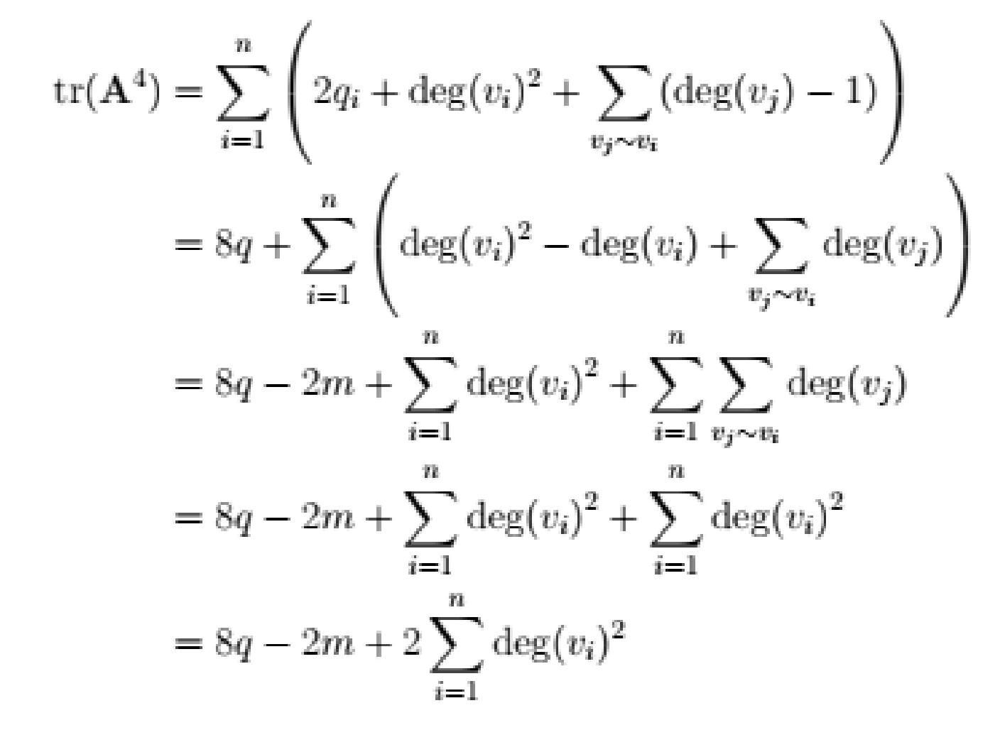

<style>
  body {
    font-size: 14pt;
  }
</style>

<title>Козлов Кирилл ( https://github.com/KozlovKV/NSU-repo/blob/master/materials/1/d_math/exam/own_answers.md )</title>

### 1. Понятие степени вершины в ориентированном и неориентированном графе. Теоремы о степенях вершин в неориентированном и ориентированном графе
Степень вершины графа в неориентированном графе — количество ребер графа, инцидентных вершине. При подсчете степени ребро-петля учитывается дважды. Степень обозначается deg(v). Вершина степени 0 – изолированная. Отсюда следует, что изолированная вершина не смежна с какой-либо вершиной. Вершина степени 1 –  висячая. Следовательно, висячая вершина смежна ровно с одной другой вершиной.

**Теорема о рукопожатиях**. Пусть G = (V, E) - неориентированный граф с m ребрами.
Тогда $2m=\sum \deg(v), v∈V$

**Теорема о вершинах с нечётной степенью в неориентированном графе**:
Неориентированный граф имеет четное число вершин нечетной степени.
Доказательство:
Пусть V1 - множество вершин четной степени, а V2 - множество вершин нечетной
степени в неориентированном графе G = (V, E) с m ребрами. 
$$
2m = \sum_{v \in V} \deg(v) = \sum_{v \in V1} \deg(v) + \sum_{v \in V2} \deg(v)
$$
Тогда:
Поскольку deg(v) четно для v ∈ V1, первое слагаемое в правой части последнего
равенства четное.
Кроме того, сумма двух слагаемых в правой части последнего равенства четна, потому
что эта сумма равна 2m.
Следовательно, второе слагаемое в сумме также является четным.
Поскольку все слагаемые в этой сумме нечетны, таких слагаемых должно быть четное
число.
Таким образом, существует четное количество вершин нечетной степени.

В ориентированном графе полустепень захода v, обозначаемая $\deg_-(v)$, представляет собой число ребер с v в качестве их конечной вершины. Полустепень исхода v, обозначаемая $\deg_+(v)$, представляет собой число ребер с v в качестве начальной вершины. (Обратите внимание, что ребро-петля в вершине вносит 1 как в полустепень захода, так и в полустепень исхода этой вершины).

**Теорема о степенях входа и выхода**. В ориентированном графе с m рёбрами:
$$
m = \sum_{v \in V} \deg_-(v) = \sum_{v \in V} \deg_+(v)
$$
Доказывается из определения степеней вершин для орграфа. В частности, того факта, что каждое ребро будет для одной вершины давать +1 к $\deg_-$, а для другой - +1 к $\deg_+$

Основание - неориентированный граф, полученный при игнорировании направления рёбер в орграфе. Имеет такое же количество рёбер и используется потому, что для многих свойств графа направление рёбер не играет роли.

### 2. Понятие изоморфизма. Способы установления наличия или отсутствия изоморфизма
2 простых графа `G1 = (V1, E1)` и `G2 = (V2, E2)` - изоморфны, если существует биекция `f`, сохраняющая отношение смежности для вершин и рёбер графов: для любых $\forall a, b \in V1 : (a,b) \in E1 \hArr (f(a),f(b)) \in E2$. Отношение изоморфизма для простых графов будет отношением эквивалентности

Из определения мы получаем следующие обязательные условия для изоморфизма (их также называют инвариантами графов):
1. Одинаковое кол-во вершин
2. Одинаковое кол-во рёбер
3. Количество вершин с определёнными степенями одинаково

Выше приведены **необходимые, но недостаточные** условия изоморфизма.

Если для двух графов можно построить идентичные (после перестановок столбцов и/или строк) матрицы смежности, значит между ними существует изоморфизм. Другие алгоритмы для точного установления изоморфизма являются NP-полными.

### 3. Понятие пути, цикла, простого пути и простого цикла. Теорема о существовании простого пути между парой различных вершин связного неориентированного графа
**О.** Путь - последовательность рёбер, первое из которых содержит начальную вершину, а последнее - конечную вершину. Для орграфа, что очевидно, мы должны указывать рёбра строго в порядке следования от начала пути к концу.

Также можно расширить путь до маршрута - перед и после ребра указывать в последовательности вершины. Если граф простой, путь можно указывать просто как последовательность вершин.

**О.** Цикл (circuit) - путь ненулевой длины, начинающийся и заканчивающийся в одной и той же вершине

**О.** Простой путь/цикл не содержит одних и тех же рёбер более одного раза.

**О.** Граф называется связным (connected), если существует путь между двумя любыми его вершинами.

**Т. о существовании простого пути между парой различных вершин связного неориентированного графа**. Для связного неориентированного графа между двумя любыми вершинами существует простой путь. *Доказательство:* Из связности графа следует существование пути. Возьмём путь из `u` в `v` минимальной длины. Такой путь будет простым. Предположим обратное: тогда среди вершин `{x_1, ..., x_n}` найдутся такие `x_i`, `x_j`, что `x_i = x_j` (`0 <= i < j`), а это значит, что путь `u-v` останется путём из `u` в `v`, если из него убрать вершины `{x_i, ..., x_j-1}`, но уже меньшей длины, однако по условию минимальности длины это невозможно, из чего и следует простота исходно взятого пути. 

Максимальный связный подграф - *пояснения излишни*, Связные подграфы называются компонентами связности.

Если в одном графе есть путь длины `n`, а в другом точно нет пути такой же длины => графы точно не изоморфны.

### 4. Матрица смежности и свойства графа
Матрица смежности (adjacency matrix) - таблица `n*n`, где (`n` - кол-во вершин в графе). `matrix[i][j] = 1 <=> (i, j) in edges`. Для мультиграфов вместо единички записывается количество рёбер.

Матрицы смежности могут использовать для подсчёта количества путей в графе.

Условные обозначения:
- `I` - единичная матрица (главная диагональ из единиц, остальное - нули)
- `J` - матрица целиком состоящая из единиц
- `A` - матрица смежности (ячейка $a_{ij}$ будет обозначаться как `A(i,j)`)

Для неорграфа `A^T = A`.

Связь степеней вершин и значений `A`:
- в неорграфе: $deg(v_i) = \sum_{j=1}^n a_{ij} = \sum_{j=1}^n a_{ji}$
- в орграфе: $deg_+(v_i) = \sum_{j=1}^n a_{ij}$ и $deg_-(v_i) = \sum_{j=1}^n a_{ji}$

**Т. о количестве путей произвольной длины через матрицу смежности**. Для любого графа G ячейка `(i, j)` матрицы смежности в степени `k` - кол-во путей из `v_i` в `v_j` длины `k`. *Доказательство:* для матрицы `A^1` утверждение очевидно - `A(i,j) = 1 =>` вершины смежны. Это база индукции. Далее будем считать, что утверждение теоремы верно для `A^k` и докажем его справедливость для `A^(k+1)`. Любой путь длины `k+1` из `v_i` в `v_j` будет содержать путь длины `k` из `v_i` в соседей `v_j` (`N(v_j)`). Будем обозначать принадлежащие этому множеству вершины как `v_p`, тогда по условию кол-во путей из `v_i` в `v_p` длины `k` будет `A^k(v,p)`. Значит для вычисления путей из `i` в `j` длины `k+1` нам надо сложить все `A^k(v,p)`, то есть получаем формулу:
$$
\sum_{v_p \in N(v_j)} A^k(i,p) = \sum_{l=1}^n A^k(i,l)A(l,j) = A^{k+1}(i,j)
$$

След матрицы (`trace`) - сумма главной диагонали матрицы смежности в степени `k`. Некоторые особенности следа:
- `tr(A) = 0` - для простого графа без петель
- Для неориентированного графа: `tr(A^2) = 2|E|`. Доказывается через банальный факт того, что мы из каждой вершины идём во всех её соседей, а затем обратно, то есть `A^2(i,i) = deg(v_i)`
- Связь с количеством треугольников `t` в графе: `6t = tr(A^3)`. Для каждой вершины мы можем пройти циклический путь двумя способами (условно выражаясь, по часовой стрелке и против), также учитывая, что в треугольнике 3 вершины, каждая из которых может быть стартовой, получаем, что ячейка `A(i, i)` показывает нам кол-во треугольников, в которые входит `v_i`, умноженное на 6 
- `q` - циклы длины 4. Тогда $tr(a^4) = 8q - 2|E| + 2 \sum_{i=1}^{|V|} \deg^2(v_i)$. Получается данная формула простыми арифметическими преобразованиями при суммировании 3 случаев циклов длины 4 для каждой вершины:
  1. Обычный квадрат. Их будет `8q` по тем же резонам, что `6t` в пункте выше (в итоговом выражении для следа, для отдельной вершины - `2q`)
  2. `v_i - x - v_i - y`, где `x, y in N(v_i)` - таких циклов будет $\deg^2(v_i)$
  3. `v_i - x - y - x`, где `x in N(v_i)` и `y != v_i & y in N(x)` - таких циклов будет $\sum_{x \in N(v_i)} (\deg(x) - 1)$
  - 

Графы с `n = |V| >= 2` связные `<=>` все ячейки вне главной диагонали е матрицы `B = A + A^2 + ... + A^(n-1)` > 0. Фактически, минимальная степень, в которой `A(i,j) > 0` - это минимальная длина пути `i-j`. *Доказательство:*
- Если граф связный, то между любыми вершинами `i`, `j` можно будет построить путь длины `k <= n-1` => `A^k(i,j) > 0` => `B(i,j) > 0`
- *В обратную сторону:* если для любой `B(i,j) > 0` (`i != j`) => найдётся такое минимальное `k <= n-1`, что `A^k(i,j) > 0`, значит есть простой путь из `i` в `j`. Отсюда следует, что все вершины связаны со всеми, а значит граф связный

Матрица смежности дополнения графа (`A(G')`, далее будет `A'`) - матрица, где все ячейки изначально равные нулям (не считая диагональных), равны единицам - и наоборот. Матрица смежности и матрица смежности дополнения связаны равенством `A + A' + I = J`, которое напрямую следует из определения дополнения графа как графа, при объединении с которым исходный граф даст полный граф.

Если матрица симметрична, то все собственные значения будут вещественными, а собственные вектора будут взаимноортоганальны. Напомним, что с.з. будут находиться через уравнение $\det(\lambda I - M) = 0$

**О.** Характеристический полином матрицы смежности - `p(t) = det(tI - A)`. Или, выражая полученные с.з., получаем $p(t) = (t - \lambda_1)(t - \lambda_2)...(t - \lambda_n)$

**О.** Спектр графа - набор скаляров собственных значений графа, расположенный по неубыванию. ($spec(G) = {\lambda_1, \lambda_2, ..., \lambda_n} : \lambda_1 \le \lambda_2 \le ... \le \lambda_n$)

Любое собственное значение графа не превосходит его максимальную степень. Более того, будет справедливо неравенство $\frac{2|E|}{|V|} \le \lambda_n \le \Delta(G)$

Регулярный граф - граф, в котором все степени вершин одинаковы. Граф `k`-регулярный `<=>` единичный вектор - его собственный вектор с собственными значениями `= k`. *Доказывается* в обе стороны через тот факт, что для `k`-регулярного графа `Ae = ke = {deg(v_1), deg(v_2), ..., deg(v_n)} = {k, k, ..., k}`

Спектры изоморфных графов идентичны. **Обратное не верно**

### 5. Понятие дерева. Теорема о единственности пути в дереве
**О.** Деревья - это связные ненаправленные ациклические простые графы

**О.** Лес - несколько несвязных деревьев

**Т.** Неорграф - дерево `<=>` между любыми двумя его вершинами существует единственный путь. *Доказательство:* предположим обратное, то есть что в дереве есть 2 пути из `x` в `y`, тогда объединение этих путей даст нам цикл, что противоречит определению дерева. *В обратную сторону:* если между любыми вершинами существует единственный простой путь, значит во-первых, граф связный, во-вторых, в нём нет циклов, отсюда следует, что граф - дерево.

### 6. Понятие корневого дерева. Свойства корневого дерева
**О.** Корень - произвольная выбранная в дереве вершина, от которой мы направляем рёбра ко всем другим вершинам (то есть получаем из дерева ориентированный граф) и получаем **корневое дерево**. Корень в дереве может быть только один (поэтому стрелки у рёбер часто не указываются). Любая из вершин дерева может быть выбрана как корень, относительно которого мы сориентируем всё дерево.

Если в дереве для вершины `v`, не являющейся корнем, существует ребро `u-v`, то `u` - **отец** вершины `v`. **Отец уникален**. `v` будет **сыном** `u`. **Сыновей может быть много**

Несколько сыновей одного и того же отца будут называться **братьями (siblings)**.

Все вершины на пути от корня до `v` (не включая `v`) - **предки `v`**. Все вершины, для которых `v` является предком - **потомки `v`**

**Лист** - вершина, не имеющая детей. В ином случае вершина называется **внутренней**

**Поддерево `v`** - часть исходного дерева, включая вершину `v` и её потомков

**О.** Корневое дерево называется `m`-арным дерево, если каждый из его внутренних элементов имеет `<= m` потомков

**О.** Если у каждой внутренней вершины ровно `m` потомков, то это дерево называется полным (`full`) `m`-арным деревом

**О.** Уровень вершины в дереве - это длина пути от вершины до корня. (*Соответственно, уровень корня ` = 0`*)

**О.** Высота дерева - максимальный уровень вершин в дереве

**О.** `m`-арное корневое дерево будет **сбалансированным**, если всего его листья находятся на высоте `h` или `h - 1`

**О.** Заполненное (`complete`) `m`-арное дерево - подмножество полных деревьев, где до максимальной глубины существуют все вершины.

**Т.** В каждом дереве с `n` вершинами ровно `n-1` рёбер. *Доказательство:* по индукции - для дерева с `n = 1` утверждение верно. Для дерева из `k+1` и `k` вершин мы откидываем один лист, при этом теряется и одно ребро, то есть для `k` вершин мы получаем `k-1` рёбер.

### 7. Соотношения между количеством вершин, листьев и внутренних вершин в m-арном дереве
**Т.** `Full` `m`-арное дерево с `i` количеством внутренних вершин. Для него можно вычислить кол-во вершин как `n = mi + 1`. *Доказательство:* по определению, у любой внутренней вершины в `full` `m`-арном дереве будет `m` детей. Кроме того, у дерева будет корень, который надо прибавить отдельно. 

**Т.** Если нам известен один из параметров `full` `m`-арного дерева, мы можем вычислить остальные (`i` - кол-во внутренних вершин, `n` - кол-во вершин в целом, `l` - кол-во листьев):
1. Известно количество вершин `n`:
   1. Внутренние вершины $i = \frac{n - 1}{m}$
   2. Листья $l = \frac{(m - 1)n + 1}{m}$
2. Известны внутренние вершины `i`:
   1. `n = mi + 1`
   2. `l = (m - 1)i + 1`
3. Листья `l`:
   1. $n = \frac{ml - 1}{m - 1}$
   2. $i = \frac{l - 1}{m - 1}$

*Все утверждения доказываются через выведенное в прошлое теореме равенство `n = mi + 1` и очевидное `n = l + i`*

### 8. Соотношения между количеством листьев и высотой m-арного дерева
**О.** Уровень вершины в дереве - это длина пути от вершины до корня. (*Соответственно, уровень корня ` = 0`*)

**О.** Высота дерева - максимальный уровень вершин в дереве

**О.** `m`-арное корневое дерево будет **сбалансированным**, если всего его листья находятся на высоте `h` или `h - 1`

**Т.** В `m`-арное дереве высоты `h` количество листьев `l <= m^h`. *Доказательство:* индукция - в `m`-арном дереве с высотой 1 по определению будет `l = m = m^1` листьев. Будем считать, что утверждение верно для `m`-арного дерева высоты `h`. Удаляем корень дерева и получаем `<= m` поддеревьев, каждое из которых будет содержать `l <= m^(h-1)` листьев, операцию можно повторять, пока не получим `h-1 = 1`. В сумме для исходного дерева будет `l <= m * m^(h-1) = m^h`

**С.** Для `m`-арного дерева с количеством листьев `l`: $h \ge ceil(\log_m l)$. Для полного сбалансированного дерева: $h = ceil(\log_m l)$. *Доказывается напрямую из прошлой теоремы +* для сбалансированного дерева простой факт, что `m^(h-1) < l <= m^h`

### 9. Понятие остовного дерева. Теорема о существовании остовного дерева у связного графа
**О.** Остовное дерево - граф, содержащий все вершины исходного графа и являющийся при этом деревом. **Остовное дерево может быть только у связного графа.** Остовных деревьев у заданного графа может быть много.

**Т.** Простой граф будет связным тогда и только тогда, когда у него есть остовное дерево. *Доказательство:* если у графа есть остовное дерево, значит в дереве можно построить путь между любыми вершинами исходного графа, значит исходный граф связный. *В обратную сторону:* если граф связный, значит существует путь между любыми вершинами, а значит можно построить остовное дерево путём удаления рёбер из циклических путей

*Надо отметить, что алгоритм удаления рёбер хоть и позволяет найти остовное дерево для связного графа, но является неэффективным*

Эффективным алгоритмами будут breadth-first search (поиск в ширину) и depth-first search (поиск в глубину), а также алгоритм Прима и алгоритм Краскала для взвешенных неориентированных графов

### 10. Построение остовного дерева поиском в ширину. Леммы о свойствах поиска в ширину
Поиск в ширину заключается в том, что мы выбираем вершину входа (будущий корень остовного дерева), затем подсоединяем к ней все доступные вершины, маркируем их и добавляем в очередь FIFO. Пока очередь не пуста, извлекаем из неё вершину, подсоединяем к дереву её детей и добавляем их в очередь, если они ещё не были промаркированы. Повторяем алгоритм, пока не обойдём все вершины.

**Расширенная версия алгоритма:** добавляем всем вершинам такие параметры, как цвет, расстояние до корня и адрес родителя. Изначально все элементы окрашены в белый, не имеют родителя и расстояние до корня равно бесконечности. Также используем очередь по принципу `FIFO`
- Окрашиваем корневую вершину в серый и присваиваем ей дистанцию `0`. Предка нет.
- Добавляем корень в очередь
- `while queue.notEmpty`:
  - Берём из очереди вершину
  - Обходим все доступные из данной вершины
  - Если вершина белая, помечаем её серым, сохраняя родителем текущую вершину и расстояние до него ` + 1`
  - Добавляем окрашенные серым вершины в очередь
  - Когда с текущей вершиной мы полностью закончили, окрашиваем её в чёрный и берём новую вершину из очереди

Скорость алгоритма - `O(V + E)`

**О.** Кратчайшая длина пути из $s$ в $v$ обозначается как $\delta(s, v)$

**Л.** Если в графе существует путь `(u,v)`, то $\delta(s,v) \le \delta(s,u) + 1$ (*Если `u` достижима из `s`, то мы либо дойдём из `s` до `v` через `u`, либо дойдём до `v` раньше, чем до `u`*)

**Л.** [BFS](#breadth-first-search) позволяет найти все кратчайшие расстояния (**для графов без веса рёбер**) *Доказывается не столь строгое утверждение, что `v.d >= delta(s,v)`. Доказывается индукцией благодаря очереди типа `FIFO` в алгоритме и прошлой лемме.* В частности, для BFS от вершины `s` для найденной вершины `v` при обходе белых соседей вершины `u` имеем `v.d = u.d + 1 >= delta(s, u) + 1 >= delta(s, v)`, причём после фиксации `v.d` на этом шаге оно уже никогда не будет изменено

**Т.** Для заданного графа `BFS2` от данной вершины обойдёт все доступные вершины и при том вычислит для них кратчайшее расстояние. *Следует из доказанных выше лемм*

**Л.** `BFS2` за счёт записи родителей вершин даёт нам **breadth-first tree**. *Доказательство:* `v.p = u <=> u-v in E and delta(s, v) < inf` => значит `v` достижимо из вершины запуска алгоритма `s`, учитывая, что каждой вершине задаётся единственный родитель, мы получаем возможность построить уникальные пути из `s`, ко всем вершинам, то есть индуктивно заключаем, что за счёт записи родителей в `BFS2` мы получаем дерево

### 11. Построение остовного дерева поиском в глубину. Теорема о скобках. Классификация ребер ориентированного и неориентированного графа относительно дерева поиска в глубину
Добавляем корень дерева (*точку входа*) и далее запускаем рекурсивный алгоритм:
1. `while <можем от последней добавленной вершине перейти к ещё не добавленной>`
  1. Добавляем инцидентное последней добавленной вершине ребро с другой вершиной, ещё не добавленной в дерево (*если таковых несколько, берём первую по порядку в нашем представлении графа*)
2. `while <нельзя добавить новых вершин>`
   1. Движемся по добавленным вершинам от конца к началу
3. `if <не дошли до корня>`
   1. Повторяем с пункта `1`
4. `else` - **PROFIT**

Версия на псевдокоде:
```
G - connected graph with vertices v1, ..., vn
T - result tree

visit(v):
  for w that {w adjacent v and w not_in T}:
    add w and edge (v, w) to T
    visit(w)

visit(v1)
```

**Расширенная версия**: предки сохраняются у вершин также, как в BFS2, а окрашивание идёт по следующему принципу: изначально вершины белые, когда мы спускаемся по ним вниз, окрашиваем в серый, когда выходим обратно и покидаем (то есть мы не можем из этой вершины больше перейти ни в какую) - в чёрный. Кроме того, мы храним не только глубину `d`, но и момент обратного выхода `f`, причём хранят оба поля не глубину как таковую, а что-то вроде таймстэмпа. `v.d < v.f`

Псевдокод:
```
for v in G.V:
  v.color = WHITE
  v.pi = NIL

time = 0

for v in G.V:
  if v.color == WHITE:
    visit(G, v)

visit(G, v):
  time++
  v.d = time
  v.color = GRAY
  for u in G.adj[v]:
    if u.color == WHITE
      u.pi = v
      visit(G, u)
  v.color = BLACK
  time++
  v.f = time
```

**За счёт сохранения предков мы также получаем дерево, называемое *depth-first tree***. Вершины, из которых мы не смогли дальше уйти в рекурсию, будут листьями, остальные - внутренними. *На самом деле мы получаем лес, так как DFS пройдётся отдельно по всем компонентам связности*

**Т. о скобках** отрезки `[v.d, v.f]` и `[u.d, u.f]` могут находиться в следующих отношения, которые позволяют нам говорить и связи вершин в DFT:
1. Отрезки не пересекаются => вершины находятся в разных деревьях или поддеревьях (ни одна не будет потомком другой)
2. Отрезок `[u.d, u.f]` полностью включён в `[v.d, v.f]` => `u` - потомок `v`
3. Отрезок `[v.d, v.f]` полностью включён в `[u.d, u.f]` => `v` - потомок `u`

*Доказывается напрямую из описанного выше алгоритма и рассмотрение случаев, когда `v.d < u.f` и `u.f < v.d`*

DFS создаёт 4 типа рёбер:
- Древесные (tree) - простое ребро, по которому мы идём в глубину
- Прямые (forward) - ребро, ведущее из родителя в уже посещённого потомка по другому пути 
- Обратные (back) - ребро, ведущее из потомка в родителя
- Поперечные (cross) - ребро, ведущее из одного (под)дерева в другое уже посещённое

Из определения следует, что в ориентированном графе есть все виды рёбер, а в неориентированном - только tree и back, причём орграф будет ациклическим, если в нём нет back-рёбер.

### 12. Способы подсчета количества остовных деревьев
##### Алгоритм стягивания ребра
Обозначим `T(G)` как кол-во деревьев графа `G`.

`G*e` граф со стянутым ребром `e`, то есть для `e = (u,v)` мы получаем новую вершину, инцидентную со всеми рёбрами, с которыми были инцедентны `u` и `v`. `V(G*e) = V(G)-1`, `E(G*e) = E(G) - 1`. **Стянутое дерево продолжает быть деревом**

**Т.** Для ребра `e = u-v`, где `u != v`: `T(G) = T(G*e) + T(G-e)`. *Доказательство:* `T(G-e)` будет содержать все деревья, в которых нет `e`, `T(G*e)` будет содержать все деревья, в которые включено ребро `e` (добавляя стянутую вершину в дерево, мы тут же добавляем в дерево стянутое ребро и обе его вершины). Отсюда мы получаем 2 непересекающихся множества деревьев, объединение которых целиком покрывает исходное `T(G)`

Из этой теоремы легко вытекает алгоритм для поиска кол-ва остовных деревьев:
- Делим граф на граф со стянутым ребром и вырезанным. 
- Количество остовных деревьев исходного графа - сумма кол-ва остовных деревьев со стянутыми вершинами и деревьев, где стянутого ребра нет.
- Рекурсивно продолжаем операцию до тех пор, пока граф не будет разложен на простые компоненты, для которых кол-во остовных деревьев считается "на глаз"

Дополнение к этому методу: если у нас в графе возникает cut-vertex, то мы можем разорвать граф по этой вершине, продублировав её в двух новых графах. Тогда кол-во остовных деревьев в исходном графе будет равно произведению кол-ва остовных в новых двух графах

##### Теорема для полного графа и код Прюфера
**Формула Келли**: Кол-во остовных деревьев для `n`-дерева = `n^(n-2)`. *Доказывается через тот факт, что описно остовное дерево может быть кодом Прюфера длины `n-2`, а таких различных кодов для полного графа может быть `n` штук*

**Использование на практике:** Выбираем лист с наименьшим номером. Записываем в код Прюфера вершину, смежную с данной, затем удаляем этот лист. Повторяем до тех пор, пока не останется одно ребро (т.е. дерево не будет состоять из двух листьев).

Обладая кодом Прюфера, можно восстановить остовное дерево: в код Прюфера не входят листья, при этом выбирали мы листья с наименьшим номером, поэтому идёт прямо по коду, добавляя к вершинам из кода листья с соответствующими номерами (*номера возрастают с пропуском входящих в код вершин (когда мы добавили лист к коду, мы вычёркиваем эту запись из кода, а значит вершина, которой больше нет в коде, также добавляется в очередь на присоединение)*)

##### Метод Лапласиана
Матрица Лапласа:
- `i == j => a_ij = deg v_i`
- `(i, j) in E => a_ij = -1`
- `otherwise => a_ij = 0`

То есть `L = D - A`, где `D` - матрица степеней, `A` - матрица смежности

**Т. Киргоффа о связи матриц и деревьев:** кол-во остовных деревьев в графе можно посчитать как определитель матрицы Лапласа, из которой мы удалили `i`-ю строку и столбец.

### 13. Лемма о том, в каких случаях вершина является точкой сочленения в дереве поиска в глубину
Точка сочленения (articulation point, cut-vertex) - такая вершина `v`, что для некоторых `a`, `b` любой путь `a-b` будет проходить через `v`. При удалении cut-vertex возрастёт количество компонент связности

**Л.** Для неориентированного графа в его depth-first-tree. Вершина `a` из этого дерева - `cut-vertex`, если:
- `a` - корень => у неё есть несколько потомков 
- `a` - не корень и у неё найдётся такое поддерево `S`, что ни одна из его вершин не будет иметь `back`-рёбер, ведущих в предков `a`. 

*Доказательство:* первое утверждение следует из того факт, что в неориентированном графе не бывает cross-рёбер, а значит несколько поддеревьев корня связаны только через сам этот корень. Второе утверждение:
- предположим, что условие выполнено, тогда мы можем заключить, что путь из любого предка `a` в любого потомка будет проходить исключительно через `a`, а значит `a` - cut-vertex по определению
- *В обратную сторону:* `a` - cut-vertex, `x`, `y` - такие точки, что любой путь между ними содержит `a`. Либо `x`, либо `y` будет потомком `a`, иначе условие cut-vertex не будет выполнено, другая вершина может лежать либо выше `a`, либо в отдельном поддереве потомков `a`, связанным с поддеревом, где лежит первая вершина, только через `a`. Для обоих этих случаев получаем, что при добавлении back-рёбер, ведущих в предков `a`, условие для cut-vertex не будет выполнено, что приводит к противоречию 

### 14. st-нумерация. Алгоритм построения st-нумерации
Если граф двусвязный, то можно взять ребро `s-t`. Дать `s` номер 1, а `t` - номер `n = |V|`, а затем дать всем остальным связанным с `s` и `t` промежуточные номера из интервала `(1, n)`. Таким образом мы зададим **st-нумерацию**

ST-ориентация строится при помощи ST-нумерации - такая нумерация, что выполняется условие `i-j in E <=> i < j` (говоря проще, st-ориентация - это нумерация вершин в топологическом порядке)

Таким образом, мы берём неориентированный граф, располагаем вершины в ряд, проводя между ними рёбра, а затем нумеруем и ориентируем рёбра в соответствии с правилом выше.

##### Алгоритм Тарьяна
- Нумеруем вершину `s` как 1, `t` как 2
- Запускаем `DFS(s)`, считая `.d`, `.parent` и `.low` и раздавая номера вершинам
- Задаём список `L = [s, t]`, `sing(s) = '-'`
- Для всех вершин `v not in L`:
```
if sign(low(v)) == '+' then
  Insert v after p(v) in L
  sign(p(v)) = '-';
end if
if sign(low(v)) == '-' then
  Insert v before p(v) in L
  sign(p(v)) = '+';
end if
```
- В итоге вершины в `L` будут расположены в том порядке, в котором должны быть в st-нумерации. Располагаем их на прямой и проводим рёбра из исходного графа

### 15. Алгоритмы поиска минимального остовного дерева. Корректность алгоритма Прима
#### Алгоритм Краскала
Позволяет построить минимально весящее остовное дерево. Получаем список всех рёбер, затем добавляем минимальное по весу ребро, если оно не вызывает появление цикла. Повторяем до тех пор, пока в списке не останутся лишь рёбра, добавление которых приведёт к возникновению цикла. **PROFIT**

#### Алгоритм Прима
Позволяет построить минимально весящее остовное дерево. Из исходного графа берём произвольную вершину, затем смотрим её рёбра и добавляем ребро с наименьшим весом (*и вершину на его конце - ваш кэп*), затем в полученном дереве также проверяем все рёбра, соединяющие вершины дерева с вершинами вне дерева и выбираем минимальное из этих рёбер. Повторяем, пока все вершины не попадут в дерево.

**Т.** Алгоритм Прима создаёт минимальное остовное дерево связного взвешенного графа. *Доказывается через взятие эталонного минимального остовного дерева T с n-1 рёбрам и дерева S с k рёбрами, полученного Примом, а затем обоснование равенства этих деревьев, но до конца метод не ясен - уточнить у Морозова или Апанович*

*Доказательство:* будем идти от противного. Алгоритм всегда завершится потому что рёбер конечное количество. Рассмотрим оптимальное дерево S и полученное Примом дерево T (возможно не оптимальное по нашему предположению). Идём по индукции до момента, когда Прим включил ребро, которого нет в эталоне и через условие включения минимального ребра по алгоритму показываем, что ребро в эталоне можно заменить на выбранное Примом, не потеряв свойства минимальности остова 

### 16. Понятие вершинной связности, реберной связности, связь между вершинной связностью, реберной связностью и минимальной степенью вершины в графе
Граф называется связным `<=>` из любой его вершины можно попасть в любую. Имеет одну компоненту связности.

**Cut-vertices (разделяющие вершины)** - вершины, при удалении которых (по одиночке) граф перестаёт быть связным. Существуют также **cut-edge (мосты)**.

Не у всех графов есть cut-vertices и cut-edge. Графы без них называются **nonseparable (ЕДИНЫМИ И НЕДЕЛИМЫМИ!)**.

Число вершинной связности ($\kappa(G)$) - минимальное число вершин, которое нужно удалить для дробления графа на отдельные компоненты связности. Граф называется `k`-вершинно связным, если `k` - число вершинной связности.

Аналогичным образом вводится понятие рёберной связности ($\lambda(G)$). Зачастую рёберная связность больше вершинной. Множество рёбер, удаление которых приводит к увеличению кол-ва компонент связности, называется **разрезом**

Для любого графа рёберная связность `<= min deg v` $= \delta(G)$. Для неполного графа с минимум тремя вершинами также справедливо $\kappa(G) \le \min \deg(v)$

Отсюда следует: $\kappa(G) \le \lambda(G) \le \delta(G)$. *Первая половина неравенства доказывается рассмотрением нескольких случаев:*
1. Для несвязного или тривиального графа $\kappa(G) = \lambda(G) = 0$
2. В графе есть мост => $\lambda(G) = 1$ => для разделения графа также можно удалить любую из двух вершин, инцидентных мосту => $\kappa(G) = \lambda(G) = 1$
3. $\lambda(G) > 2$ => удаление $\lambda - 1$ рёбер создаст граф с мостом. вместо удаления рёбер удалим $\lambda - 1$ раз инцидентные им вершины. Если граф уже распался на несколько компонент, то $\kappa(G) = \lambda - 1 < \lambda(G)$, иначе удаляем одну из вершин при оставшемся мосте, тогда получаем $\kappa = \lambda$

### 17. Понятие точки сочленения, двусвязной компоненты, двусвязного графа. Лемма о свойствах двусвязных компонент.
Точка сочленения (articulation point, cut-vertex) - такая вершина `v`, что для некоторых `a`, `b` любой путь `a-b` будет проходить через `v`. При удалении cut-vertex возрастёт количество компонент связности

Число вершинной связности ($\kappa(G)$) - минимальное число вершин, которое нужно удалить для дробления графа на отдельные компоненты связности. Граф называется `k`-вершинно связным, если `k` - число вершинной связности.

Двусвязные графы - графы с $\kappa(G) = 2$ , то есть у него нет *cut-vertices*.

**Граф из двух вершин также будет считаться двусвязным, если исходить из определения разделяющих вершин через тройки вершин**

Определим натуральное отношение на множестве рёбер графа, говоря, что `e1` и `e2` связаны, если `e1 = e2` или `e1` и `e2` находятся в одном цикле. Это отношение разбивает граф `G` на классы эквивалентности `G_i = (V_i, E_i)`, где `E_i` - множество рёбер, находящихся в одном цикле, а `V_i` - множество вершин этих рёбер. Каждый граф `G_i` называется **двусвязной компонентной** `G` 

**Л.** Пусть у нас есть компоненты двусвязности `G_i = (V_i, E_i)` некоторого графа `G`, тогда:
1. `forall 1 <= i <= k : G_i` двусвязен (*доказывается через невозможность существования в цикле точки сочленения*)
2. `forall i != j : ` пресечение `V_i` и `V_j` даёт не более одной вершины.
   - *Предположим обратное:* если в пересечение `V_i` и `V_j` даёт нам вершины `{v,w}`, то у нас будут циклы `C1` в `G_i` и `C2` в `G_j`, каждый из которых содержит обе вершины, но из этого следует, что у нас будут эквивалентные рёбра между `v` и `w`, входящие в `C1` и в `C2`, а значит `E_i` и `E_j` - это не классы эквивалентности (*у классов эквивалентности не может быть пересечений*), как предполагалось по условию - **Противоречие**
3. Полученная пересечением из пункта 2 вершина будет cut-vertex
   1. => Предположим, что пересечение `V_i` и `V_j` дают нам вершину `a`, которая будет cut-vertex для исходного графа и его вершин `v`, `w`. Возьмём также инцидентные `a` рёбра `x-a`, `a-y`, через которые будет проходить один из путей из `v` в `w`. Если `x-a` и `a-y` принадлежат одной компоненте (то есть лежат в цикле), то будет путь из `v` в `w`, не проходящий через `a` - **противоречие**. Значит `x-a` и `a-y` в разных циклах => они в разных компонентах двусвязности
   2. <= `a` - единственная точка пересечения для множеств вершин двух компонент двусвязности, значит ребро `x-a in E_i` и ребро `a-y in E_j` не будут в одном цикле, при этом через `a` будут проходить все пути из `x` в `y` => `a` - cut-vertex

### 18. Алгоритм Дейкстры поиска кратчайшего пути в графе. Корректность алгоритма Дейкстры
#### Кратчайшие пути
**Л.** Подпуть кратчайшего пути также будет кратчайшим путём

Вспомогательные функции
```
init(G, s):
for vertex v in G.V:
  v.d = inf
  v.pi = NUL
s.d = 0

### w - функция веса, возвращающая вес ребра между переданными вершинами (гарантируется, что такое ребро существует)

relax(u, v, w):
  if v.d > u.d + w(u, v):
    v.d = u.d + w(u, v)
    v.pi = u
```

Свойства кратчайших путей и релаксации:
- **Неравенство треугольника** - для любого ребра `u-v`: `delta(s, v) <= d.u + w(u, v)`
- **Верхняя граница** - для любой вершины `v`: `v.d >= delta(s, v)`. Когда `v.d` достигает `delta(s, v)`, она больше не может быть изменена
- **Отсутствие пути** - если нет пути из `s` в `v`, то `v.d = delta(s, v) = inf`
- **Сходимость** - если есть кратчайший путь `s - ... - u - v` и `u.d = delta(s, u)`, то после релаксации `(u, v)` мы получим `v.d = delta(s, v)`
- **Релаксация пути** - если в кратчайшем пути `v1 - ... - vk` последовательно релаксировать все рёбра, то в результате мы получим `vk.d = delta(v1, vk)`
- **Подграф предшественников** - если для любой вершины `v` `v.d = delta(s, v)`, то подграф предшественником будет деревом кратчайших путей

#### Алгоритм Дийкстры
Работает гораздо быстрее Беллмана-Форда, но только на графах **без отрицательных** рёбер. Вспомогательным будет множество `S`, содержащее те вершины графа, для которых уже определён кратчайший путь, и очередь приоритетов `Q` (либо бинарная куча по минимуму)

```
init(G, s)

S = []
Q = G.V

while Q.notEmpty:
  u = extractMin(Q)  ### Извлекаем вершину с минимальным .d
  S += [u]
  for vertex v in G.adj[u]
    relax(u, v, w) 
```

Эффективность алгоритма - `O(|V|^2)`, если использовать примитивный поиск минимальной вершины, и `O(|V| log |V|)`, если использовать быстрый поиск минимума

**Т. О корректности алгоритма Дейкстры** Алгоритм Дейкстры, запущенный на графе без отрицательных рёбер, даст нам кратчайшие пути из исходной вершины и построит дерево кратчайших путей. *Доказательство:* пусть `l(v)` - длина кратчайшего пути до `v`, `d(v)` - длина пути, рассчитанного алгоритмом Дейкстры на данный момент. Докажем по индукции, что в момент посещения любой вершины `l(v) = d(v)`. Для начально вершины `s` равенство выполнено: `l(s) = d(s) = 0`. Отметим, что `d(v) >= l(v)` (алгоритм не может найти путь короче кратчайшего). Теперь будем считать, что алгоритм выбрал для посещения вершину `v != s`. `P` - кратчайший путь из `s` в `v`. (значит на данный момент из непосещённых `d(v)` минимально). Будем считать, что первая непосещённая вершина в пути `P` - это `y`, а `x` предшествует `y` (следовательно `x` уже посещена и есть ребро `x-y`). Так как путь `P` кратчайший, его подпуть тоже будет кратчайшим => `l(y) = l(x) + w(x, y)`. По предположению индукции `l(x) = d(x)` => `d(y) = d(x) + w(x, y) = l(x) + w(x, y) = l(y)`, то есть `d(y) = l(y)`. Если `y = v`, то индуктивный переход доказан, если же `y != v` при том, что `v` была выбрана как минимальная по `d()`, мы получаем, что `d(v) <= d(y) = l(y) <= l(v)` - если у нас нет рёбер нулевого веса, то из этого следует противоречие, которое и позволяет заключить, что `y = v`, если `v` было выбрано алгоритмом, из чего следует, что на минимальном пути алгоритм всегда будет выбирать следующую в пути вершину. Шаг индукции доказан, из него заключаем, что после исполнения Дейкстры для всех вершин у всех будет `d = l`

### 19. Алгоритм Беллмана-Форда поиска кратчайшего пути в графе. Корректность Алгоритма Беллмана-Форда
*вводную часть смотри в прошлом вопросе*

Позволяет находить кратчайший путь из одной вершины в другую в графе с отрицательными весами и без отрицательных циклов, в случае отрицательных циклов скажет о невозможности решения задачи.

```
init(G, s)

for i = 1 to |G.V| - 1:
  for edge (u,v) in G.E:
    relax(u, v, w)

### Проверка на достижимые циклы отрицательного веса
for edge (u,v) in G.E:
  if v.d > u.d + w(u,v):
    return FALSE
return TRUE
```

**Т. О корректности алгоритма Беллмана-Форда**
После запуска алгоритма Беллмана-Форда из вершины `s` графа `G` возможны 2 случая:
1. Если в графе нет циклов отрицательного веса, достижимых из `s`, алгоритм установит в качестве `v.d` кратчайший путь из `s` в `v`, а параметр предка позволит построить дерево кратчайших путей. *Доказывается* через **свойства релаксации пути** и **верхней границы** после релаксации до кратчайшего пути. Также отметим, что любой кратчайший путь в графе из `|V|` вершин будет содержать не больше `|V| - 1` рёбер, из чего следует, что релаксируя все рёбра `|V| - 1` раз мы гарантированно посчитаем `delta(s, v_i)` для всех `i <= k`. Если вершина не достижима из `s`, то для неё кратчайший путь останется бесконечностью по **свойству отсутствия пути**.
2. Если в графе есть циклы отрицательного веса, достижимые из `s`, алгоритм вернёт `FALSE`. *Доказательство:* при наличии негативных циклов алгоритм будет бесконечно релаксировать рёбра, так как найдётся путь короче посчитанного ранее. Таким образом, если на `|V|`-й итерации может быть отрелаксировано хотя бы какое-то ребро, мы заключаем, что у нас есть негативный цикл, а значит алгоритм вернёт `FALSE`

### 20. Алгоритмы поиска кратчайшего пути между всеми вершинами графа на основе матричного умножения
`W` - матрица весов (`w_ij` - путь из `i` в `j`)

`L^m` - матрица длины пути из `m` вершин, где `l_ij` - длина кратчайшего пути. Таким образом, ответ будет в матрице `L^(n-1)`

$$
l^{(m)}_{ij} = \min\{l^{(m-1)}_{ik} + w_{kj}\}
$$

Описывая более *человечно*: мы берём матрицу весов и "умножаем" на саму себя, так переопределив операцию умножения: `ij` ячейка будет содержать в себе минимум из сумм ячеек `ik` и `kj` для всех `1 <= k <= n` (то есть мы выбираем минимальный возможный путь из `i` в `j`, проходящий через `k`. *причём `k` может и не существовать на самом деле как отдельная вершина, когда `k = i` или `k = j`*). Умножив матрицу путей на матрицу весов, мы удлиняем возможную длину кратчайшего пути на 1.

Время работы для подсчёта всех кратчайших путей - `O(n^4)`, если пользоваться "быстрым возведением в степень" (`W^4 = W^2^2`, `W^9 = W * W^2^2^2` и т.п.), то можно улучшить время до `O(n^3 log n)` 

### 21. Алгоритм Флойда-Уршолла
Матрица с путями длины `n` - `D^n`.

Рассматриваем матрицу путей `D` (`D^0 = W`), далее будем последовательно рассматривать все промежуточные вершины `k`, которые могут входить в путь из `i` в `j`. Если путь `i - ... - k - ... - j` (`D^(k-1)[i][k] + D^(k-1)[k][j]`) меньше текущего пути `i - ... - j` (`D^(k-1)[i][j]`), то обновляем длину пути в новой матрице: (`D^k[i][j] = D^(k-1)[i][k] + D^(k-1)[k][j]`), считая вершину включённой в путь. Таким образом, за `n` итераций мы рассмотрим все возможные пути, в которые могли быть включены все промежуточные вершины (а могла не включаться ни одна - тоже возможно)

Если действовать руками: для итерации `k` берём `k`-ю строку и `k`-й столбец. Для расчёта `i`-строки берём `k`-ю строку и прибавляем к ней `i`-й элемент `k`-го столбца. В новой матрице путей обновляем в `i`-й строки те ячейки, значения в которых получились меньше, чем на прошлом этапе.

Эффективность `O(|V|^3)`

Если мы заменили `d_ij` на `d_ik + d_kj`, то ячейка матрицы предшествования `p_ij = p_kj`

Для восстановления пути из `i` в `j` мы берём предшественника `v`, равного `p_ij`, добавляем `v` в конце пути и берём `v = p_iv` до тех пор, пока `v != i`

### 22. Алгоритм Джонсона
Самый быстрый - `O(V^2 lg V + VE)`

Если в графе нет отрицательных рёбер, мы просто запускаем алгоритм Дийкстры для всех вершин.

Если есть отрицательные рёбра (*но не отрицательные циклы, ясное дело*), то мы пересчитываем все веса по двум следующим правилам:
- Пути, бывшие кратчайшими, должны таковыми и остаться
- Новые веса должны быть позитивными (*весёёёлыми!!11!!!1!!!!1!!*)

Для начала отметим, что преобразование `w'(u,v) = w(u, v) + h(u) - h(v)`, то есть все кратчайшие пути останутся кратчайшими. (*Суммируем все веса рёбер на пути с дэльтами для начала и конца каждого ребра, в результате у нас останется сумма исходны рёбер плюс `h(s)` начальной вершины минус `h(t)` конца пути*)

Далее добавим к графу вершину `s` с рёбрами нулевого веса и запустим от неё алгоритм Беллмана-Форда.

Определим `h(v) = path[v]`, рассчитанный Беллманом. Теперь мы можем перевзвесить рёбра так, что они все будут `>= 0` (пользуясь формулой `w'(u, v) = w(u, v) + h(u) - h(v)`), далее снова запускаем Дийкстру для всех вершин как истоков и записываем в матрицу результаты.

### 23. Понятие потоковой сети и остаточного графа. Операция увеличения потока, ее свойства
**Потоковая сеть** - ориентированный граф с истоком `s`, стоком `t`, внутренними вершинами и заданной для его рёбер пропускной способностью `c_e` (*на самом деле можно рассматривать и неориентированный граф, но на практике это нужно не так часто*)

Поток `f(e)` из истока `s` в сток `t` - это отображение каждого ребра в вещетсвенное число.

**Условие пропускной способности (capacity condition):** `0 <= f(e) <= c_e`

**Условие сохранения (conservation condition):** Для всех вершин кроме `s` и `t` сумма потоков входа = сумме потоков выхода ($f^{in}(v) = \sum_{e into v}f(e) = f^{out}(v) = \sum_{e out of v}f(e)$)

Значение потока - сумма всех потоков, исходящих из `s`.

Для решения задачи вычисления максимального значения потока используется **остаточный граф (остаточная сеть) `G_f`** (будем обозначать через `c(e)` остаточную пропускную способность ребра, то есть изначально `c(e) = c_e`):
- Множество вершин как в исходном графе
- Для ребра `e = (u,v)`:
  - если `f(e) < c_e`, то `c(e) = c_e - f(e)` - остаточная пропускная способность прямого ребра (*очевидно, если `f(e) = c_e`, то прямого ребра не будет*)
  - если `f(e) > 0`, то добавляется обратное ребро `e' = (v, u)` (**ориентация важна**), для которого `c(e') = f(e)`

*В наших лекциях используется такая нотация:* окло рёбер исходного графа записывается `f(e)/c_e`, то есть проходящий по прямому ребру остаточного графа поток и общая пропускная способность прямого ребра

## Операция увеличения потока
Пусть `P` - некоторый простой путь из `s` в `t` в потоковой сети. Определим 2 функции:
- `bottleneck(P, f)` - возвращает минимальное значение остаточной пропускной способности на пути `P` (то есть на сколько мы можем увеличить поток во всех рёбрах по этому пути)
- `augment(f, P)` - обновляет поток для всех входящих в него рёбер:
  - будем считать, что `b = bottleneck(P, f)`, тогда
  - для всех прямых рёбер в `P` увеличиваем поток на `b`
  - для всех обратных рёбер в `P` уменьшаем поток в прямых рёбрах, соответствующих этим обратным, на `b`

В рузльтате мы получаем новый поток `f' > f`

**Л.** Новый поток `f'` также будет потоком для `G`. *Доказательство:*
1. Сохранение условия пропускной способности: `b = bottleneck(P, f)` не может превышать минимальной пропускной способности на пути `P`. Напомним, что для прямого ребра остаточная пропускная способность `c(e) = c_e - f(e)`, а для обратного - `c(e') = f()`. Из этого следует, что
   - для любого прямого ребра на пути будет `f'(e) = f(e) + b >= 0` и `f'(e) = f(e) + b <= f(e) + (c_e - f(e)) = c_e`
   - для любого обратного ребра, которому соответствует прямое ребро `e` будет `f'(e) = f(e) - b <= f(e) <= c_e` и `f'(e) = f(e) - b >= f(e) - f(e) = 0`
2. Сохранение conservations condition для всех внутренних вершин графа. Сводится к доказательству того, что для каждой вершины вход и выход либо были увеличены на `b`, либо уменьшены. Рассматриваем 4 случая, когда перед и после вершины forward-forward рёбра, forward-back, back-forward и back-back. Доказательство для них достаточно тривиальное.

### 24. Лемма о целочисленности величины потока f(e) и остаточных пропускных способностей на каждой промежуточной стадии алгоритма Форда-Фалкерсона
**Сам алгоритм работает так:** задаём начальный остаточный граф `G_f` с нулевым потоком. Пока в `G_f` можно найти какой-либо путь `P` из `s` в `t`, проводим увеличение потока и обновление остаточного графа `G_f`

**Л. 2** На каждой итерации Форда-Фалкерсона значения потока и остаточной пропускной способности целые. *Доказательство:* до начала алгоритма все остаточные пропускные способности целые - **база рекурсии**. Если на `j`-й итерации все значения также будут целыми, то новое найденное значение `b` также будет целым (минимальное из целых остаточных пропускных способностей), а значит изменяться целые значения потока и, следовательно, пропускные способности будут на целое число => `f` и `c_e` будут целыми на `j + 1` итерации

**Л. 3** На каждом этапе алгоритма Форда-Фолкерсона поток строго увеличивается (а остаточная пропускная способность уменьшается). *Доказательство:* в любой простой `P` точно будет входить прямое ребро из `s`, причём только одно, а значит при нахождении любого `P` поток точно будет увеличен на `bottleneck(P, f)`, то есть пока алгоритм работает, он будет давать приращение потока.

### 25. Леммы о завершении и времени выполнения алгоритма Форда-Фалкерсона
`C = sum c_e` - сумма пропускных способностей всех рёбер, исходящих из истока `s`

**Л. 4** Предполагая, что все пропускные способности и потоки целые, мы можем утверждать, что алгоритм Форда-Фолкерсона будет исполнен за не больше, чем `C` итераций. *Доказательство:* по условию пропускной способности значение всего потока не может превысить `C`, но по прошлым двум леммам (*смотри прошлый вопрос*) его значение должно увеличиваться на каждой итерации и при том увеличиваться на целое число, из чего и следует утверждение этой леммы.

**Л. 5** Для графа с целочисленными пропускными способностями алгоритм Форда-Фалкерсона будет исполнен за `O(Cm)`, где `m` - кол-во рёбер. *Доказательство:* как было доказано выше, в алгоритме будет `<= C` итераций, теперь остаётся выяснить асимптотическое время внутри каждой итерации. Путь `P` можно искать BFS за `O(m + n) = O(m)` (предполагая `m >= n/2`), `bottleneck` можно считать вместе с поиском пути. `augment` будет проходить за `O(n - 1)` итераций, построение новой остаточной сети займёт `O(m)` (*а на самом деле можно предпостроить обратные рёбра, а потом обновлять для них значения в `augment` (если не прогали этот алгоритм и не понимаете о чём речь,лучше это не говорить)*). Получаем для цикла `O(2m + n - 1) = O(m)` => время алгоритма в целом = `O(Cm)`

### 26. Лемма о связи между значением потока и величиной потока, передаваемой через разрез