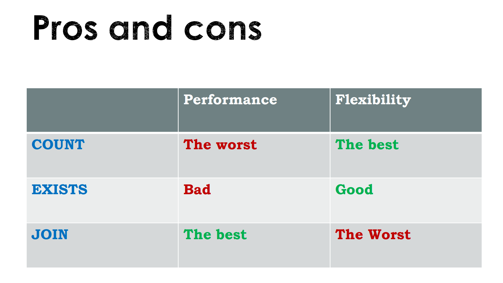
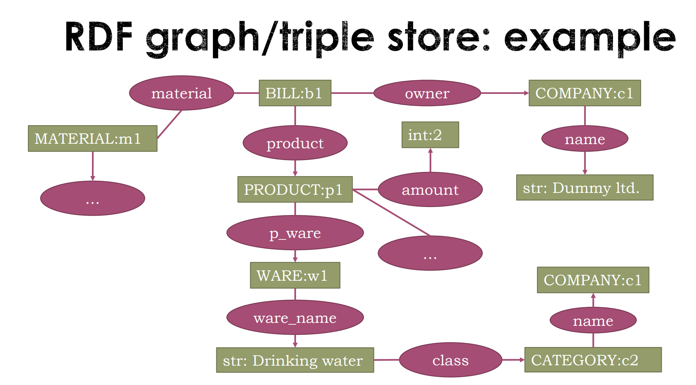

- [Контакты преподов](#контакты-преподов)
- [Книги](#книги)
- [Статьи](#статьи)
- [22.09.02 - Лекция](#220902---лекция)
- [22.09.05 - Семинар](#220905---семинар)
- [22.09.09 - лекция](#220909---лекция)
  - [Типы данныех](#типы-данныех)
  - [Функции](#функции)
    - [Немного о рекурсии и ко-рекурсии](#немного-о-рекурсии-и-ко-рекурсии)
    - [Лямбда-функции](#лямбда-функции)
- [22.09.12 - семинар](#220912---семинар)
  - [Локальные переменные](#локальные-переменные)
  - [Оператор понижения приоритета](#оператор-понижения-приоритета)
  - [Оператор композиции](#оператор-композиции)
  - [Операторы возвездения в степень](#операторы-возвездения-в-степень)
- [22.09.16 - лекция](#220916---лекция)
  - [Слово-оператор](#слово-оператор)
  - [Кортежи](#кортежи)
  - [Списки](#списки)
- [22.09.19 - семинар](#220919---семинар)
  - [Хвостовая рекурсия](#хвостовая-рекурсия)
  - [Мемоизация функций](#мемоизация-функций)
- [22.09.23 - лекция](#220923---лекция)
  - [Генераторы списков](#генераторы-списков)
  - [Хваостовая рекурсия](#хваостовая-рекурсия)
  - [Работа с множествами](#работа-с-множествами)
  - [Свёртки](#свёртки)
    - [Левая свёртка](#левая-свёртка)
    - [Правая свёртка](#правая-свёртка)
    - [Реализзация](#реализзация)
  - [scan](#scan)
- [22.09.30 - лекция](#220930---лекция)
  - [Система типов](#система-типов)
    - [Перечисление (суммирование)](#перечисление-суммирование)
    - [С использованием конструктора (Умножение)](#с-использованием-конструктора-умножение)
    - [Создание именованных полей](#создание-именованных-полей)
    - [Другие методы объявления типов](#другие-методы-объявления-типов)
- [22.10.03 - семинар](#221003---семинар)
  - [Ещё несколько методов генерации списков](#ещё-несколько-методов-генерации-списков)
- [22.10.07 - лекция](#221007---лекция)
  - [Классы](#классы)
- [22.10.14 - лекция](#221014---лекция)
  - [Структуры данных в Haskell](#структуры-данных-в-haskell)
    - [Maybe](#maybe)
- [22.10.17 - семинар](#221017---семинар)
  - [Алгебраические типы данных](#алгебраические-типы-данных)
- [22.10.21 - лекция](#221021---лекция)
  - [Map](#map)
  - [HashMap](#hashmap)
  - [Sequence](#sequence)
  - [Векторы](#векторы)
- [22.10.24 - семинар](#221024---семинар)
  - [Полиморфизм](#полиморфизм)
    - [Параметрический полиморфизм](#параметрический-полиморфизм)
    - [ad-hoc полиморфизм](#ad-hoc-полиморфизм)
- [22.10.28 - лекция](#221028---лекция)
  - [Обработка текстов](#обработка-текстов)
  - [Регулярные выражения](#регулярные-выражения)
    - [Квантификация](#квантификация)
- [22.10.31 - семинар](#221031---семинар)
  - [Ещё немного баззовых типов](#ещё-немного-баззовых-типов)
  - [Полугруппы](#полугруппы)
  - [Моноид](#моноид)
  - [Ещё раз о Maybe](#ещё-раз-о-maybe)
  - [Функтор](#функтор)
  - [Аппликативный функтор](#аппликативный-функтор)
  - [Недетерминированные вычисления](#недетерминированные-вычисления)
- [22.11.07 - семинар](#221107---семинар)
  - [Монады](#монады)
- [22.11.11 - лекция](#221111---лекция)
- [22.11.18 - лекция](#221118---лекция)
- [22.11.21 - семинар](#221121---семинар)
  - [Глубокий смысл монадического связывания](#глубокий-смысл-монадического-связывания)
  - [Чистые функции](#чистые-функции)
  - [Монада Maybe](#монада-maybe)
  - [Монада `[]`](#монада-)
  - [Функция guard](#функция-guard)
- [22.11.25 - лекция](#221125---лекция)
  - [Функторы (теория)](#функторы-теория)
- [22.11.28 - семинар](#221128---семинар)
    - [Монада `Reader`](#монада-reader)
    - [Монада `Writer`](#монада-writer)
- [22.12.02 - Лекция](#221202---лекция)
  - [И снова функторы](#и-снова-функторы)
  - [Аппликативные функторы (ссылка)](#аппликативные-функторы-ссылка)
- [22.12.05 - семинар](#221205---семинар)
  - [Ввод-вывод](#ввод-вывод)
    - [Базовые функции](#базовые-функции)
  - [Случайные числа](#случайные-числа)
  - [Полезные функции для работы с монадами](#полезные-функции-для-работы-с-монадами)
  - [Функция main](#функция-main)
  - [ИЗМЕНЯЕМЫЕ ПЕРЕМЕННЫЕ](#изменяемые-переменные)
- [22.12.09 - лекция](#221209---лекция)
- [22.12.12 - семинар](#221212---семинар)
  - [Исключения](#исключения)
  - [Тестирование](#тестирование)
- [22.12.16 - лекция](#221216---лекция)
- [22.12.19 - семинар](#221219---семинар)
- [23.02.02 - лекция](#230202---лекция)
  - [MonadPlus](#monadplus)
  - [Writer](#writer)
- [23.02.07 - семинар](#230207---семинар)
  - [План семинаров](#план-семинаров)
- [23.02.21 - семинар](#230221---семинар)
  - [Stack](#stack)
  - [Модули](#модули)
- [23.02.28 - семинар](#230228---семинар)
  - [Reader](#reader)
  - [Writer](#writer-1)
- [23.03.07 - семинар](#230307---семинар)
  - [Монада State](#монада-state)
- [23.03.14 - семинар](#230314---семинар)
  - [Монада в монаде](#монада-в-монаде)
- [23.03.22 - семинар](#230322---семинар)
- [23.03.28 - семинар](#230328---семинар)
  - [Формальная грамматика](#формальная-грамматика)
  - [Парсинг](#парсинг)
- [23.04.04 - семинар](#230404---семинар)
- [SQL!!! (Просто лэйбл для разделения)](#sql-просто-лэйбл-для-разделения)
- [23.04.06 - лекция](#230406---лекция)
  - [SQL "Hello, world!"](#sql-hello-world)
  - [SELECT query](#select-query)
  - [Set operations](#set-operations)
  - [Aggregation](#aggregation)
- [23.04.13 - lecture](#230413---lecture)
  - [Cross-selection](#cross-selection)
  - [Inner join](#inner-join)
  - [`left outer join`](#left-outer-join)
  - [`right outer join`](#right-outer-join)
  - [`full outer join`](#full-outer-join)
  - [Alternative syntax](#alternative-syntax)
- [23.04.20 - Lecture](#230420---lecture)
  - [Grouping and aggregation](#grouping-and-aggregation)
    - [`group by`](#group-by)
    - [Execution order](#execution-order)
    - [After-grouping selection](#after-grouping-selection)
  - [Relational DB design](#relational-db-design)
  - [Key types (by projection)](#key-types-by-projection)
  - [Key types (by origin)](#key-types-by-origin)
- [23.04.27 - lecture](#230427---lecture)
  - [Normal forms (Continue about DB design)](#normal-forms-continue-about-db-design)
    - [Multivaluated dependencies (4NF)](#multivaluated-dependencies-4nf)
    - [REAL non-binary (join) dependency (5NF)](#real-non-binary-join-dependency-5nf)
  - [Relational design with entities](#relational-design-with-entities)
    - [DB design procedure](#db-design-procedure)
- [23.05.04 - lecture](#230504---lecture)
  - [Subqueries](#subqueries)
- [23.05.11 - lecture](#230511---lecture)
  - [How optimize queries?](#how-optimize-queries)
  - [Special joins aplgos](#special-joins-aplgos)
    - [Nested loops join](#nested-loops-join)
    - [Hash join DB](#hash-join-db)
    - [Merge-join](#merge-join)
  - [Laziness](#laziness)
- [23.05.18 - lecture](#230518---lecture)
  - [Data modification](#data-modification)
    - [Transactions](#transactions)
  - [DBs types](#dbs-types)
  - [DB usage patterns](#db-usage-patterns)
  - [Type and patterns combining](#type-and-patterns-combining)


# Контакты преподов
Лектор (Haskell) - Власов Владимир Николаевич

Лектор (SQL) - Магинский Денис Сергеевич

Семинарист - Завьялов Антон Алексеевич / https://t.me/arx_dukalis / + 7 (960) 956 61 14

# Книги
[Изучай Хаскель во имя добра](./%D0%9C%D0%B8%D1%80%D0%B0%D0%BD%20%D0%9B%D0%B8%D0%BF%D0%BE%D0%B2%D0%B0%D1%87%D0%B0-%D0%98%D0%B7%D1%83%D1%87%D0%B0%D0%B9%20Haskell%20%D0%B2%D0%BE%20%D0%B8%D0%BC%D1%8F%20%D0%B4%D0%BE%D0%B1%D1%80%D0%B0-2012.pdf)

# Статьи
- [Описание языка Haskell 98](http://www.haskell.ru/)
- [Мягкое введение в Haskell 1](http://rsdn.org/article/haskell/haskell_part1.xml)
- [Мягкое введение в Haskell 2](http://rsdn.org/article/haskell/haskell_part2.xml)
- [Programming with lambda calculus](https://hbr.github.io/Lambda-Calculus/lambda2/lambda.html)
- [Ещё одно руководство по Монадам (ч. 1 основы)](https://habr.com/ru/post/127556/)

---
# 22.09.02 - Лекция
Императивные языки заточены под архитектуру Фон Неймана.

Суть императивной парадигмы - подробно описывать программе, КАК выполнить задачу.

Декларативная парадигма - ЧТО сделать программе.

Функции всегда чистые (не имеют побочных действий) и детерминированные (результат зависит только от подаваемых значений)

---
# 22.09.05 - Семинар
Haskell - ленивый язык. Любое выражение вычисляется только по необходимости

Типизация в Haskell статическая сильная неявная

`GHCup` - утилита для работы с Haskell

Основные команды:
- `ghc <filename>` - скомпилировать файл
- `runghc/runhaskell <haskell code>` - исполняет выражение на Haskell
- `ghci` - запускает интерпретатор прямо в командной строке

[Hackage](https://hackage.haskell.org) - хранилище пакетов

[Hoogle](https://hoogle.haskell.org) - поисковый движок кода

---
# 22.09.09 - лекция
Файлы `.hs` - простые файлы с кодом на Haskell

Файлы `.lhs` - файлы с разметкой простого текста для написания статей и т.п. (стиль разметки - `reStructuredText`) Чтобы обозначить фрагменты кода используется `>` в начале строки либо особые скобки:
```haskell
\begin{code}

\end{code}
```

## Типы данныех
- `Bool` - операции `&&`, `||`, `not` (`/=`)
- `Char` / `String`
- `Int`
- `Integer` - неограниченный целочисленный тип
- `Float` / `Double`

Если вместо переменной указать `_`, то будет принята переменная любого типа.

Бэктик `\`` можно использовать в именах переменных

## Функции
Пример функции факториала
```haskell
{fact :: Integer -> Integer; fact 0 = 1; fact n = n * fact (n-1)}
```

---
### Немного о рекурсии и ко-рекурсии
Рекурсия и ко-рекурсия
Классическая рекурсия обычно движется вверх (`n+1`), тогда как ко-рекурсия движется вниз (`n+1`). В таком случае необходимо тщательно следить за условиями выхода

---

Можно записать условие в несколько строк:
```haskell
fact` x | n <= 1 = 1
        | otherwise = x * fact` (x-1) 
```

Ветвление похоже на тернарный оператор и является частю функции, а не отдельной сущностью
```haskell
abs x = if x >= 0 then x else -1*x
```

---
Аргументы функции передаются **ЧЕРЕЗ ПРОБЕЛ И БЕЗ СКОБОК!**

При этом сигнатура задаётся не как `f :: Int Int -> Int`, а как `f :: Int -> int -> Int`, так что при реализации получим следующее
```haskell
f x y = x + y -- f (x) + y 
-- Отсюда следует, что можно вызвать функцию, не передавая все аргументы
f` = f 2 -- такая функция приняла 2 как x. Таким образом, функция f` пинимает один аргумент - y из f
```
Такой приём называется *заморозкой аргументнов*. При этом "свбодными" остаются только аргументы с конца.

### Лямбда-функции
```haskell
f = \x -> x-2
mult = \x y z -> x*y*z
mult` = \n -> mult 2 n 3 -- Благодаря лямбда-функциям можно морозить произвольные аргументы
```

---
# 22.09.12 - семинар
Массив записывается в `[]` и должен содержать элементы одного типа.

Корттеж записывается в `()` и может содержать элементы разных типов.

Функция `curry <func>` принимает в себя функцию, принимающую кортеж, и возвращает функцию, принимающую просто список аргументов. `ucurry <func>` делает обратное.

## Локальные переменные
```haskell
f x =
  let a = x*x
      b = x*x*x -- Можно написать a*x
  in a / b

-- Альтернативный вариант

f x = a / b
  where a = x*x
        b = a*x
```
На самом деле `a` и `b` - не переменные, а константы или, ещё точнее, лейблы, действия под которыми вставляются на место основной функции.

## Оператор понижения приоритета
`<func> $ <expr>` - оператор `$` позволяет сначала вычислить выражение справа, а затем передать его налево
```haskell
f $ 1 + 2*5

sin -2 -- Выдаст ошибку, т.к. в функцию sin будет передан аргумент -
sin $ -2 -- Сработает нормально
```

## Оператор композиции
```haskell
f1 x = sin (cos x)
f1 = sin . cos
```

## Операторы возвездения в степень
- `^` - возводит в целую положительную
- `^^` - возводит в целую
- `**` - возводит в любую

---
# 22.09.16 - лекция
## Слово-оператор
Оператор - частный вид функции в инфиксной форме, то есть аргументы записываются с обеих сторон. Если заключить имя функции в ` `` `. Также можно использовать инфиксный оператор как префиксный, заключив его в скобки
```haskell
> 1 + 5 -- 6
> (+) 1 5 -- 6
```

## Кортежи
Кортеж - неизменяемый набор значений произвольного типа, записывается в круглых скобках, полезен для возврата из функции нескольких значений. Чаще всего в кортеже 2 элемента, но может быть до 15-ти.

В работе с кортежами может помочь модуль `Data.Tuple`

## Списки
Оператор `:` является конструктором списка. Фактически, все списки создаются из пустого
```haskell
list = [1, 2, 3]
list` = 1:[2,3] = 1:(2:[3]) = 1:(2:(3:[])) -- Оператор : - правоассоциативный, а значит скобки писать не обязательно, это было сделано для наглядности
[1, 2, 3] == 1:2:3:[] -- True
```
Данный механизм позволяет реализовывать удобный петтерн-матчинг в функциях, работающих со списками.
```haskell
head (x:_) = x

length [] = 0
length (_:xTail) = 1 + length xTail
```

- Обращение по индексу производится через оператор `!!` (**ОПЕРАЦИЯ ОЧЕНЬ НЕЭФФЕКТИВНА**)
- `xs ++ [x]` - добавление элемента в конец списка
- `xs ++ ys` - конкатенация двух списков
- `concat [a, b, c, ...]` - конкатенация списка списков
- `drop n xs` - удалить первые `n` элементов и вернуть список
- `take n xs` - вернёт список из первых `n` элементов
- `splitAt n xs` - вернёт пару списков: `[head, n)` и `[n, tail]`
- `zip xs ys -> [(xn, yn)]` - упаковывает в пары соответствующие элементы двух списков

*Больше функций в модулей `Data.List`*

---
# 22.09.19 - семинар
## Хвостовая рекурсия
Суть в том, что вычисления производятся не на выходе из рекурсии, а при погружении внутрь. За счёт этого не приходится хранить значения на каждом слое при стремлении вглубь, а значит стэк будет заполняться гораздо медленнее.

```haskell
f $! a b -- оператор `$!` заставляет все вычисления справа проводить в строгом режиме (локлаьно "отключая" ленивость)

-- Если строгость нужна не для всех аргументов, можно сделать такую запись
a `seq` f a b -- в таком случае строго будет вычислен только аргумент a
```
Третий вариант
```haskell
{-# LANGUAGE BangPatterns #-}

f !a b = ... -- Также будет строгим только аргумент a
```

## Мемоизация функций


---
# 22.09.23 - лекция
## Генераторы списков
В Haskell можно задать ленивый бесконечный список
```haskell
getSquares1 = [x*x | x <- [1..]] -- Квадраты всех натуральны чисел. При запуске в таком виде будет бесконечна
getSquares2 n = [x*x | x <- [1,2..n]] -- Получает список квадратов n натуральных чисел
getSquares3 n = [x*x | x <- [1,2..n], x `mod` 2 == 0] -- Получает список квадратов чётных n натуральных чисел
```

## Хваостовая рекурсия
В классической рекурсии мы опускаемся вглубь и затем, на обратном пути, производим вычисления

Пример с посиком n-го числа Фибоначчи
```haskell
fib 0 = 1
fib 1 = 1
fib n | n < 0 = error "n must be greater than or equal to 0"
fib n = fib (n - 1) + fib (n - 2)
```

При использовании хвостовой рекурсии вычисления осуществляются на пути вглубь, а на обратном идёт быстрое "всплывание" ответа до самого верха дерева, за счёт чего время исполнения невероятно сокращается. Чаще всего для этого требуется добавить дополнительный аргумент - аккумулятор итогового значения.

Эффективная функция вычисления нужного числа Фибоначчи. Рекурсия в данном случае сразу получает в себя 2 предыдущих числа и номер "глубины". Если номер совпадает с искомым, возвращает сумму двух предыдущих чисел.
```haskell
accFib n | n < 2 = 1
         | otherwise = recursion 1 1 2
    where
        recursion prev2 prev1 counter | counter == n = currentValue
                                      | otherwise = recursion prev1 currentValue (counter+1)
            where
                currentValue = prev1 + prev2
```

## Работа с множествами
```haskell
import Data.List

nub::[a]->[a] -- Возвращает из списка множество (только уникальные элементы)

```
- `union xs ys` - объединение двух множеств 
- `intersect xs ys` - пересечение двух множеств
- `xs \\ ys` - вычитание из первого множества второго
- `tails xs` - возвращает список хвостов 

**Все описанные выше функции возвращаеют в итоге списки, т.е. элементы могут повторяться, поэтому результат необходимо прогонять через `nub`**

Для ещё более продвинутой работы с множествами (декартово произведение, xor и т.п.) используется модуль [`Data.Set`](https://hackage.haskell.org/package/containers-0.6.5.1/docs/Data-Set.html)

## Свёртки
Свёртка ([fold](https://wiki.haskell.org/Fold)) - функция, принимающая функцию-обработчик, аккумулятор и список, по которому будет двигаться от начала к концу (левая свёртка) или от конца к началу (правая свёртка).

### Левая свёртка
Левая свёртка берёт первый элемент, обрабатывает его, сохраняет значение в аккумулятор и рекурсивно передаёт в себя хвост списка, из которого опять берёт первый элемент и т.д.
```haskell
-- Функция sum реализуется через левую свёртку
sum = foldl (+) 0
```

### Правая свёртка
Правая свёртка сначала "режет" список на элементы, а потом, возвращаясь из дерева рекурсии, обрабатывает значения и изменяет аккумулятор.
```haskell
-- Функция concat реализуется через правую свёртку
concat = foldr (++) []
```

*Фактически, левая свёртка использует принцип хвостовой рекурсии, а правая - классической.*

### Реализзация
Левая свертка
```haskell
foldl f acc [] = acc
foldl f acc (x:xs) = foldl f (f acc x) xs
```
Правая свёртка
```haskell
foldr f acc [] = acc
foldr f acc (x:xs) = f x (foldr f acc xs)
```

## scan
`scanl` и `scanr` похожи на свёртки, но возвращают не конечное значение-аккумлутор, а все промежуточные результаты его вычисления. То есть первым в списке будет идти начальное значение, а последним - результат, аналогичный свёрткам

# 22.09.30 - лекция
## Система типов
Типизацияё в Haskell сильная, статическая, неявная
- strong (сильная / строгая). Все числа - функции с общим прототипом, благодаря чему осуществляется неявное преобразование типов. Если типы переменных задать явно, то Haskell выдаст ошибку
- статическая
  - Преимущества статической типизацц
    - Все проверки типов проходят во время компиляции, а не выполнения
    - Код работает быстрее
    - Отсеивание ошибок с помощью IDE (работает и с динамической, но хуже)
  - Преимущества динамической типизации
    - Лёгкость в освоении
    - Удобное написание универсальных алгоритмов (сортировка массива символов, целых или вещественных чисел одной и той же функцией) и коллекций с элементами разных типов
- Явная - на самом деле в Haskell реализовано некоторое смещение этих двух методов: если не указывать сигнатуру, типизация будет неявной, а компилятор сам подберёт самую широкую возможную сигнатуру, используя математические методы.
  - Преимущества явной типизации
    - Понимание сути работы функции по одной лишь сигнатуре
    - Нет необходимости запоминать метод работы функций
    - Другим людям проще понимать ваш код
  - Преимущества неявной типизации

Пользовательские типы на самом деле называются алгебраическими

### Перечисление (суммирование)
Наиболее просто способ задать тип - перечисление
```haskell
data Color = Red | Green | Blue | Yellow | Purple | Cyan
  deriving Show

mergeColors Red Green = Yellow
mergeColors Red Blue = Purple
mergeColors Green Blue = Cyan
mergeColors Green Red = Yellow
mergeColors Blue Red = Purple
mergeColors Blue Green = Cyan
```

### С использованием конструктора (Умножение) 
```haskell
data Point = Pt Int Int

getXOfPoint (Pt x _) = x
```
- `Point` - конструктор типа, используется для компиляции в сигнатурах и обеспечивает безопасность
- `Pt` - конструктор данных (значений). Используется в вычислениях.
  - `Pt <num1> <num2>` создаст нам новое значение типа `Point` со значениями `num1` и `num2`

**Names of constructors can be same**

We can define specific types for data-constructor and type-constructor without args (example above).

Or we can define template type in `data`. Then we can define functions with specific signatures
```haskell
data Point a = Pt a a | Pt1 a

sqr :: Point Double -> Double
sqr (Pt x y) = sqrt $ x*x + y*y
sqr (Pt1 x) = sqrt $ x*x + x*x
```

Own data type of list:
```haskell
data List_ a = Nil_ | Init_ a (List_ a)
  deriving Show

-- Construction process
l = Init_ 1 (Init_ 2 (Init_ 3 (Init_ 4 (Init_ 5 Nil_))))
```

### Создание именованных полей
Можно дать полям в конструкторе данных имена, тогда автоматически будет сгенерирован селектор `<fieldName> <dataTypeInstance> = <fieldValue>`
```haskell
data Point = Pt {pX, pY :: Int}

-- Объявить переменную можно двумя видами
p1 = Pt 4 5
p2 = Pt {pY = 9, pX = 8}

sumXY :: Point -> Int
sumXY p = pX p + pY p
-- или
sumXY Pt {pX = x, pY = y} = x + y
-- впрочем, можно использовать и pattern-matching
sumXY (Pt x y) = x + y
```

**Методы сложения и умножения для алгебраических типов данных можно совмещать**

### Другие методы объявления типов
`newType` имеет только один строгий конструктор, имеет только одно поле и используется для конструирования более простых типов данных, но позволяет реализовать дополнительные проверки (валидности email и т.п.).

Также поддерживает объявление полимпорфных типов или конкретных. Можно задать именованное поле

Если брать пример с точкой, то мы можем задать её через `newType` так:
```haskell
newtype Point a = Pt (a, a)

-- Объявить переменную можно двумя видами
p1 = Pt (4, 5)
p2 = Pt (9, 8)

sumXY :: Point Int -> Int
sumXY (Pt (x, y)) = x + y
```

`type <name> = <realType>` - просто создаёт синоним типу `realType` с именем `name`

# 22.10.03 - семинар
## Ещё несколько методов генерации списков
- `iterate f i0` - задаёт бесконечный список, с первым элементом $i_0$ и $i_n = f(i_0)\space n-раз$ 
- `repeat n` - бесконечно повторяет значение `n`
- `cycle arr` - бесконечно повторяет список `arr`

# 22.10.07 - лекция
## Классы
Объявление класса проходит следующим образом
```haskell
module Sosedy (Sosedy, (~~)) where

class Sosedy a where
  (~~) :: a -> a -> Bool
```
Реализация дополнительных методов класса
```haskell
module SimSosedy where

import Sosedy
(~~~) :: (Sosedy a) => a -> a -> Bool
a ~~~ b = (a ~~ b) && (b ~~ a)
```
Реализации класса с конкретными типами
```haskell
module SosedyInst((~~),(~~~)) where
  
```

# 22.10.14 - лекция
Для автоматического добавления отдельных методов работы с новыми классами типами можно использовать `deriving (methods)`
```haskell
data Color = Red | Green | Blue 
  deriving (Eq, Ord, Show) 
```

## Структуры данных в Haskell
### Maybe
Указывает на то, что элемента этого типа может не существовать.
```haskell
data Maybe a = Nothing | Juss a
```

# 22.10.17 - семинар
## Алгебраические типы данных
Типы в Haskell разделяются на примитивные и алгебраические.

- [Определение типа через сумму](#перечисление-суммирование)
- [Определение через конструктор (умножение)](#с-использованием-конструктора-умножение)

# 22.10.21 - лекция
## Map
В `Haskell` ассоциативный список из [`Data.Map`](https://hackage.haskell.org/package/containers-0.4.0.0/docs/Data-Map.html) **ОБЯЗАТЕЛЬНО** должен быть упорядочен по ключам
- `Data.Map.fromList [(k, v)]`- Создание ассоциативного списка самым простым способом
- `insert key value map` - добавление пары `(key, value)` в `map`. **Помни об иммутабельности!**
- `delete key map` - удаление элемента с ключом `key` из `map`
- `member key map` - проверка, есть ли ключ в списке
- `lookup key map` / `map !? key` / `map ! key` - возвращает значение из `map` по ключу `key` либо `Nothing`. Первый вариант конфликтует с `lookup` для списка пар из `Prelude`. Третья версия при вводе несуществующего ключа выдаст исключение (не работает с `Maybe` и `Just`) 
- `union map1 map2` - слияние двух ассоциативных списков
- `keys map` / `elems map` - возвращает список ключей и элементов соответственно

## HashMap
[`Data.HashMap`](https://hackage.haskell.org/package/hashmap-1.3.3/docs/Data-HashMap.html) позволяет работат с ассоциативными списками без упорядочевания списка по ключам. По функциям очень похож на `Data.Map`

## Sequence
Пальчиковы деревья позволяют пользоваться преимуществами списков, деля более эффективными операции, которые в этих списках работают долго (добавление в конец, склеивание списков, индексация). Реализуются в модуле [`Data.Sequence`](https://hackage.haskell.org/package/containers-0.6.0.1/docs/Data-Sequence.html)

Функции похожи на `Data.List`, но иногда реализуются очень странно, так что лучше всего посмотреть документацию

## Векторы
[Векторы](https://hackage.haskell.org/package/vector) - пход на классический массив из `Data.Array`, но работает эффективнее. Включает в себя в том числе [мутабельные векторы](https://hackage.haskell.org/package/vector-0.13.0.0/docs/Data-Vector-Mutable.html)

- [`Data.Vector`](https://hackage.haskell.org/package/vector-0.13.0.0/docs/Data-Vector.html) - классические векторы
- [`Data.Vector.Storable`](https://hackage.haskell.org/package/vector-0.13.0.0/docs/Data-Vector-Storable.html) - создаёт векторы, защищённые от сборщика мусора. Лучше всего использовать для интеграции с C-библиотеками и примтивными типами данных

[`vector-algorithms`](https://hackage.haskell.org/package/vector-algorithms) - пакет с эффективной реализацией алгоритмов над векторами (в основном сортировок)

# 22.10.24 - семинар
## Полиморфизм
### Параметрический полиморфизм
Используется в Хаскеле почти повсеместно - при задании функции указывается абстрактное имя типа, под которыми могут быть переменные разных типов
```haskell
sum :: a -> b -> b
sum x y = x + y
```

### ad-hoc полиморфизм
Реазлизуется в хаскеле через классы типов - наборы функций, которые работают с экзмеплярами этого класса
```haskell
-- "Сигнатура"
class ClassName classVar where
  method1 :: classVar -> classVar -> OtherType -- Возможны любые комбинации типов
  method2 :: Int -> ClassVar -> Int

-- Рельный пример
class Eq a where
  (==) :: a -> a -> Bool
  (/=) = not . (==)
```
Перегрузка классов типа производится следующим образом:
```haskell
instance (Enum a, Enum b) => Enum (a, b) where -- Здесь перед => накладываются ограничения на абстрактные метки класса типа
  toEnum n = (toEnum n, toEnum n)
  fromEnum (a, b) = fromEnum a

-- Теперь мы можем написать следующее
ziped = [(1,1)..(5,5)] -- [(1,1), (2,2), (3,3), (4,4), (5,5)] 
```

Некоторые встроенные классы типов:
- `Show` - можно вывести в консоль или получить строку методом `show`
- `Eq` - можно сравнить
- `Ord` - можно узнать отношение порядка
- `Enum` - значения можно перечислять

[Статья](https://wiki.haskell.org/Typeclassopedia) про классы типов на Вики

# 22.10.28 - лекция
## Обработка текстов
Для обработки строк можно использовать почти все функции из `Data.List`.

Отдельным полезным модулем выступает [`Data.Text`](https://hackage.haskell.org/package/text-1.2.5.0/docs/Data-Text.html), который работает с особыми текстовыми литералами с классом типа `Text`
- `pack :: String -> Text`
- `unpack :: Text -> String`
- `replace :: Text search -> Text onWhat -> Text where -> Text result` - производит замену в строке `where` всех `search` на `onWhat`

## Регулярные выражения
### Квантификация
Кроме `*` (звёздочки Клини, дающей произвольное количество повторений строки, идущей перед ней)
- `+` - один и более раз
- `?` - ноль или один раз
- `{n}` - ровно `n` раз
- `{m,n}` - от `m` до `n` раз
- `{m,n}` - от `m` до `n` раз
- `{m,}` - более `m` раз
- `{,n}` - `n` или меньше раз

`(<expr>)\1` - говорит, что после нахождения вхождения по выражению `<expr>`, необходимо найти ещё одно точно такое же (`\1` - указывает на результат из первых скобок). Если указать `(<expr>)(\1)*`, то будет произвольное повторение от 1 до бесконечности раз в точности найденного ранее вхождения по выражению `<expr>`

`^<expr>` - отрицание выражения, то есть вхождение будет всё, что ему **НЕ** удовлетворяет

В `[]` указываются диапазоны или наборы символов:
- `[0-9]` (`\d`) - цифры
  - `[^ 0-9]` (`\D`) - не цифры
- `[\f\n\r\t\v]` (`\s`) - пробельные символы
  - `[^ \f\n\r\t\v]` (`\S`) - не пробельные символы
- `[A-Za-z0-9_]` (`\w`) - буквы, цифры, подчёркивание
  - (`\W`) ... Ну вы поняли

`^` - начало строки
`$` - конец строки

# 22.10.31 - семинар
## Ещё немного баззовых типов
- `Bounded` - множество со значениями минимума и максимума
- `Maybe` - "защитный тип" - может иметь какое-то значение под `Just`, а может принимать значение `Nothing`

## Полугруппы
Полугруппа - множество с заданной на нём ассоциативной операцией (то есть не зависящей от порядка операций).
```haskell
class Semigroup a where
  (<>) :: a -> a -> a -- Минимальная реализация
  sconcat :: NonEmpty a -> a -- Фактически, свёртка непустого списка
  stimes :: Integral b => b -> a -> a -- повторяет ассоциативную операцию заданное количество раз
```

Например, списки и операция `++`; упорядоченное множество из двух элементов с операциями минимума или максимума

## Моноид
Моноид - полугруппа с нейтральным элементом (единицей)
```haskell
class Semigroup a => Monoid a where
    mempty :: a -- Минимальная реализация, если мы задаём моноид через instance
    mappend :: a -> a -> a
    mappend = (<>) -- Ассоциативная операция
    mconcat :: [a] -> a -- foldr mappend mempty
```
Свойства моноида:
```haskell
x `mappend` mempty == x
mempty `mappend` x == x
```

## Ещё раз о [Maybe](#maybe)

## Функтор
```haskell
class Functor f where
  fmap :: (a -> b) -> f a -> f b

fmap succ (Just 41) -- вернёт Just 42
```
`fmap` выполняет операцию `a -> b` внутри типа `f`, то есть переводит значение типа `f a` в `f b`

Для `fmap` должны выполняться следующие правила
- `fmap id == id` - закон тождественности (identity)
- `fmap (f . g) == fmap f . fmap g` - закон композиции (composition)

`fmap` infix form - `<$>`

```haskell
(+1) <$> Just 5 -- Just 6
(+) <$> Just 4 <$> Just 5 -- error
```

## Аппликативный функтор
```haskell
class (Functor f) => Applicative f where
  pure :: a -> f a
  (<*>) :: f (a -> b) -> f a -> f b
```

Аппликативный функтор позволяет использовать функторы с функциями от двух переменных
```haskell
-- Тогда ошибочное выражение выше будет записано
(+) <$> Just 4 <*> Just 5 -- Just 9
```

## Недетерминированные вычисления
Благодаря списку с аппликативным функтором можно моделировать недетерминированные вычисления

# 22.11.07 - семинар
## Монады
```haskell
class Applicative m => Monad m where
  (>>=) :: m a -> (a -> m b) -> m b -- Оператор монадического связывания (bind). Минимальное необходимаая функция
  (>>) :: m a -> m b -> m b
  return :: a -> m a -- Стрелка Клейсли
```

Оператор `>>=` получает обёрнутый в монаду (контейнер) тип и засовывает значение из контейнера в функцию, возвращающую новое значение под монадой (внутри контейнера)

оператор `>>` 

`return` представляет собой стрелку Клейсли почти в чистом виде, оборачивая значение в монаду

```haskell
((return 10) :: Maybe Int) >>= return . succ -- вернёт Just 11
```

Оператор `>=>` - это композиция стрелок клейсли, причём стрелка `return` тут выступает нейтральным элементом

# 22.11.11 - лекция

# 22.11.18 - лекция
Группа:
- Ассоциативность
- Нейтральный элемент
- Обратный элемент

Моноид ([Реализация в Haskell](#моноид)):
- Ассоцитивность
- Нейтральный элемент

Полугруппа ([Реализация в Haskell](#полугруппы)):
- Ассоциативность

# 22.11.21 - семинар
## Глубокий смысл монадического связывания
Монады позволяют реализовывать такие штуки
```haskell
expr :: Maybe Int
expr =
  return 10 >>= (\a ->
    return 20 >>= (\b ->
      return 30 >>= (\c ->
        return $ (a + b) * c
      )  
    )  
  )
```
Добавим синтаксического сахара
```haskell
expr :: Maybe Int
expr x = do
  a <- return 10
  b <- return $ 20 / x --считаем, что деление безопасно
  let c = 30

  return (a + b) * c
```

## Чистые функции
- Полная определённость (тотальность) - даёт ответ для любого аргумента
- Детерминированность
- Отсутствие побочных эффектов - не ссылаются на внешние данные и не изменяют их

Вычислительный эффект - это любое действие, нарушающее свойства чистых функций.

Примеры вычислительных эффектов:
- Частичность - функция определена не для всех значений аргумента (то есть не завершается: выкидывает исключение и т.п.). Избавиться от частичности помогает [монада `Maybe`](#монада-maybe)
- Недетерменированность
  - Нестабильность - функция не всегда возвращает одинаковые значения для одного значения аргумента. Спаситель - [монада `Reader`](#монада-reader)
  - Множественность - функция возвращает сразу несколько ответов. Избавиться от моножественности помогает [монада `[]`](#монада)
- Побочный эффект - функция кроме возврата значения делает что-то ещё. Спаситель - [монада `Writer`](#монада-writer)

## Монада Maybe
Реализация крайне просто
```haskell
instance Monad Maybe where
  return = Just
```
В таком случае, например, если в функции возникает деление на 0, мы можем избавиться от частичности, вернув `Nothing`

## Монада `[]`
Реализация чуть сложнее, но всё ещё весьма проста
```haskell
instance Monad [] where
  return x = [x]
  xs >>= f = concat (map f xs) 
```
Благодаря этой монаде мы можем избавиться от эффекта множественности. Например, при решении квадратного уровнения.

## Функция guard
Функция `guard` позволяет нам вернуть нейтральный элемент, если условие даёт `false`, иначе - продолжить вычисления
```haskell
import Control.Monad (guard)

fsafe :: Double -> Maybe Double
fsafe x = do
  cos2 <- return $ 2 * cos x
  squarePolinom <- return $ x**2 + 2*x - 10 
  guard (x > 0)
  ln <- return $ (log x)**(exp 1)
  cosLn <- return $ cos ln
  oLitte <- return 0.000000001
  guard (abs cos2 > oLitte && abs squarePolinom > oLitte && abs cosLn > oLitte)
  sum <- return $ (tan ln) + 1 / cos2
  return $ sum / squarePolinom
```

# 22.11.25 - лекция
Так как Haskell часто работает с бесконечными математическими объектами, компилятор может проверить далеко не всё, поэтому часть ответственности за корректность написанных классов и сущностей ложится на пользователя

Эндоморфная функция - функция, возвращающая тот же тип, что был получен на вход.

## Функторы (теория)
Функтор отображает одну категорию в другую.

*Категорию можно представить как графк со значениями и стрелками. При отображении переносятся все элементы и все стрелки*

Функтор обрабатывает значение внутри функции и добавляет результату новый контекст.

Функтор удовлетворяет всем свойствам моноида:
- Ассоциативная операция (`<>`) - композиция
- Нейтральный элемент - `id`

Эндофунктор - оторбажает категорию саму в себя (**ОЧЕНЬ ВАЖНО**). Фактически, в Haskell чаще всего реализуется именно он. (*Технически, можно и реализовать отображение из Maybe в [], но нужда такого отображения вызывает сомнения*)

[Реализация на Haskell](#функтор)

# 22.11.28 - семинар
Вместо [функции guard](#функция-guard) можно использовать pattern-matching. Будет работать аналогично

```haskell
fsafe :: Double -> Maybe Double
fsafe x = do
  cos2 <- return $ 2 * cos x
  squarePolinom <- return $ x**2 + 2*x - 10 
  True <- (x > 0)
  ln <- return $ (log x)**(exp 1)
  cosLn <- return $ cos ln
  oLitte <- return 0.000000001
  True <- (abs cos2 > oLitte && abs squarePolinom > oLitte && abs cosLn > oLitte)
  div <- safeDiv 1 cos2
  sum <- return $ (tan ln) + div
  return $ sum / squarePolinom
```

**Разумеется, кроме `True` можно задавать и более сложные шаблоны. Например, сравнивать значения в строке**

**Здесь используется функция монады `fail`**

Списковые включения можно заменить на монады
```haskell
evens = [x | x <- [1..], x `mod` 2 == 0]

evensWithMonad = do
  x <- [1..]
  True <- return $ x `mod` 2 == 0
  return x
```

### Монада `Reader`
Используется для хранения функции, работающей с окружением, то есть нестабильных функций

*Не особо понял суть, так что при необходимости надо будет почитать, а пока что ограничусь этим описанием*

### Монада `Writer`
Позволяет нам фиксировать побочные эффекты
```haskell
newtype Writer w a = Writer { runWriter :: (a, w) }

instance Monoid w => Monad (Writer w) where
  return v = Writer (v, mempty)
  Writer (x, v) >>= let (Wirter (y, v_)) = f x
                    in Writer (y, v `mappend` v')
```

# 22.12.02 - Лекция
## И снова функторы
Здесь в очередной раз рассматривается [класс `Functior` и его функция `fmap` (`<$>`)](#функтор)

## Аппликативные функторы (ссылка)
Дополнение к записям с семинара будет [там же](#аппликативный-функтор)

# 22.12.05 - семинар
## Ввод-вывод
Ввод-вывод осуществляется при помощи типа `IO`
```haskell
newtype IO a = IO (RealWorld -> (RealWord, a))
```
`RealWorld` - полумагическая штука, которая существует только на уровне системы типов

Но на самом деле это, конечно, монада
```haskell
instance Monad IO where
  return x = IO $ \v -> (v, x)
  m >>= k = IO $ \v ->
    case m v of

```

### Базовые функции
- `getChar :: IO Char`
- `getLine :: IO String`
- `getContents :: IO String` - считывает весь файл
- `putChar :: Char -> IO ()`
- `putStr :: String -> IO ()`
- `putStrLn :: String -> IO ()`
- `print :: Show a => a -> IO ()`
- `hFlush <stream>` - сброс буфера потока

## Случайные числа
Модуль `System.Random`. Устанавливается через `cabal install --lib random`
`randomIO :: Type`
`randomRIO :: Type`

## Полезные функции для работы с монадами
```haskell
mapM :: (Traversable t, Monad m) => (a -> m a) -> t a -> m b
forM :: (Traversable t, Monad m) => t a -> (a -> m a) -> m b
sequence :: (Foldable, Monad m) => t (m a) -> (a -> m a) -> m (t a)
```

## Функция main
Работает по принципу `main` в том же Си (**Почти всегда с `do`-нотацией**):
- Если загружать файл с `main` через `ghci`, то надо вызывать её как и любую другую функцию
- Если компилировать через `ghc`, то в `exe`-файле будет вызываться автоматически

## ИЗМЕНЯЕМЫЕ ПЕРЕМЕННЫЕ
**НЕ ИСПОЛЬЗОВАТЬ! ВООБЩЕ НИКОГДА!**

Моудль `Data.IORef`:
- `newIORef <value>` - создаёт ссылку
- `readIORef`
- `writeIORef`

# 22.12.09 - лекция
*До сих пор не выложил файл, так что даже хз, что там было...*

# 22.12.12 - семинар
## Исключения
Модуль `Control.Exception` позволяет обрабатывать исключения
- `catch :: Exception e => IO a -> (e -> IO a) -> IO a` - ловит исключение
- `catches` - *Ловит сразу несколько разных исключений?*
- `try :: Exception e => IO a -> IO (Either e a)` - обозначает, что тут надо ловить исключение
- `evaluate :: a -> IO a` - *считает выражение?*
- `throwIO :: Exception e => e -> IO a` - выбрасывает исключение

Тип `Either` хранит ошибку и значение
```haskell
data Either a b = Left a | Right b
-- Left - ошибка
-- Right - значение
```

## Тестирование
- Ручное
- Автматизированное
  - Юнит-тесты
  - Проверка свойств

Фреймворки для тестов на Хаскеле:
- `HUnit`
- `QuickCheck`

# 22.12.16 - лекция
*Лектор болел и пока что даже не выложил презентацию*

# 22.12.19 - семинар
$$
Ax + By + Cz + D = 0
\newline
Ax + By + Cz = -D
\newline
y=0,z=0 => x = -D/A
\newline
x=0,z=0 => y = -D/B
\newline
x=0,y=0 => z = -D/C
$$

# 23.02.02 - лекция
Ещё раз про базовые монады ([см. тут](#монады))

## MonadPlus

## Writer

# 23.02.07 - семинар
## План семинаров
1. Система сборки `Stack`
2. Монады `Writer`, `Reader`, `State`
3. Трансформеры монад
4. `ContT` - что-то вроде `goto`
5. Методы ускорения кода
6. **Возможно!** Многопоточность
7. `Applicative`, `MonadPlus`
8. `ParserComvinators` (`Parsec`)
9. Интерпретаторы (идея для проекта - интерпретация строк с вычислениями)

# 23.02.21 - семинар
## Stack
Stack - система сборки проектов. Базируется на Cabal

Для настройки проекта надо использовать файл `package.yaml` (**файл `.cabal` генерируется автоматически**)

Команды после `stack`:
- `new <project-name` - создание проекта
- `build` - сборка проекта
- `exec <cmd>` - исполняет команду
- `ghci` - запускает интерпретатор
- И многое другое...

## Модули
`qualified` импорт позволяет нам импортировать модули так, чтобы обращаться к их объектам экспорта через точку

# 23.02.28 - семинар
## Reader
Монада `Reader` позволяет удобно работать с множеством однотипных функций и изменять одновременно состояние для них всех. Получается своего рода глобальные переменные для некоторого множества функций.

```haskell
data Reader r a = Reader { runReader :: r -> a }
```
- `r` - окружение с данными
- `a` - возвращаемый тип данных

Основные функции для работы:
- `ask` - возвращает `r` внутри моанды
- `local :: (\env -> Reader env) -> Reader PrevEnv -> Reader newEnv` - изменяет значение окружения, извлкая его из монады и упаковывая после преобразования
- `runReader f r` - запускает функцию `f`, передавая `r` как окружение для `Reader`

## Writer
Заточена под удобное хранение логов

```haskell
data Writer w a = Writer { runWriter :: (a, w) }
```
- `w` - накапливаемый лог
- `a` - возвращаемое значение

- `tell` - записывает что-то в лог
- `return` - работает с основными значениями
- `runWriter` - принимает монаду `Writer` и возвращает кортеж `(a, w)`
- `listen` - работает как `runWriter`, но внутри `Writer`, то есть её имеет смысл использовать в `do`-нотации
- `pass` - изменяет значение лога механизмом, похожим на `local`

# 23.03.07 - семинар
## Монада State
```haskell
newtype State s a = State { runState :: s -> (a, s) }
```
- `s` - состояние
- `a` - значение

- `get` - возвращает состояние внутри моанды
- `put newState` - устанавливает новое состояние внутри монады
- `modify (\state -> newState)` - изменяет состояние без do-нотации

*Если станет насущным, разобрать `runState`, `evalState` и `execState`*

Можно заметить, что монады `Writer` и `State` работают достаточно похоже, поэтому 

# 23.03.14 - семинар
## Монада в монаде
Мы можем обернуть одну монаду в другую, создав над ними обёртку:
```haskell
newtype MaybeIO a = MaybeIO { runMaybeIO :: IO (Maybe a) }

instance Monad MaybeIO where
  return x = MaybeIO (return (Just x))
  MaybeIO wrappedIOMaybe >>= f = MaybeIO $ do
    maybeValue <- wrappedIOMaybe
    case maybeValue of
      Nothing -> return Nothing
      Just x -> runMaybeIO (f x)
    -- Несложно заметить, что в do-нотации return работает с монадой IO. С Maybe мы работаем вручную, в конце мы считаем, что f уже возвращает нам монаду (как и должно быть в операторе bind - ваш кэп)
```

Если с приведённой выше двойной монадой мы захотим использовать, скажем, `putStrLn`, то нам нужно будет преобразовать возвращаемую этой функцией монаду из `IO ()` в `MaybeIO ()`. Для этого можно написать функцию-адаптер:
```haskell
liftIO2MaybeIO :: IO a -> MaybeIO a
liftIO2MaybeIO ioValue = MaybeIO $ do
  ioResult <- ioValue
  return $ Just ioResult
```

При небольшой модификации можем сделать из `MaybeIO` универсальную монаду `MaybeT`, которая будет хранить внутри произвольной монады монаду `Maybe`:
```haskell
newtype MaybeT m a = MaybeT { runMaybeT :: m (Maybe a) }

instance Monad m => Monad (MaybeT m) where
  return x = MaybeT (return (Just x))
  MaybeT wrappedMaybe >>= f = MaybeT $ do
    maybeValue <- wrappedMaybe
    case maybeValue of
      Nothing -> return Nothing
      Just x -> runMaybeT (f x)

-- Тогда обобщённый адаптер будет выглядеть так
lift2MaybeT = MaybeT . fmap Just -- Распаковали значение из любой монады, упаковали в Myabe, а потом обратно в произвольную монаду, сказали, что теперь это MaybeT
```

Реализация упаковки обеспечивается классотипом `MonadTrans`:
```haskell
class MonadTrans t where
  lift :: Monad m => m a -> t m a
```
- `lift . return == return`
- `lift (m >>= f) == (lift m) >>= (lift . f)`

В Haskell есть 2 основных модуля для работы с адаптерами: `transformers` и `mtl` - первый отвечает за трансформеры `MaybeT`, `EitherT`, `WriterT` и `StateT`, а второй за - за неявный лифтинг в do-нотациях, благодаря которому нам не нужно постоянно распаковывать и запаковывать значение вновь.

# 23.03.22 - семинар
`Foldable` - класс-тип, обозначающий возможность элементов быть обработанными при помощи свёрточных функций. Реализуется через функторы и есть почти у всех итерируемых типов данных.

`Taversable` - этот класс-тип позволяет нам реализовывать итерирование разных видов с аппликативными операциями, которое будет полностью спотыкаться на нулевых аппликативных значениях. Некоторые функции:
- `traverse :: (a -> f b) -> t a -> f (t b)` - принимает функтор и список, а возвращает обработанный список, обёрнутый в функтор 
- `forM` и `mapM` работают как `traverse`, но не для монад, а для функторов
- `sequence :: t (m a) -> m (t a)` - меняет местами монады
- **Версии функций с `_` на конце работают похоже, но не возвращают результат. Полезно при итерации внутри do-нотации**

`Alternative` - класс-тип аппликативного функтора-моноида. Полезен для проверок и фильтрации. Класс `MonadPlus` реализует похожую логику, но для монад.

Монада `Cont` представляет выражения в стиле передачи продолжений, то есть результат вычисления не возвращает, а передаётся в новую функцию (*не понимаю, зачем это нужно, если есть композиция...*)

# 23.03.28 - семинар
## Формальная грамматика
Почти все языки программирования описываются котекстнозависимой граматикой

## Парсинг
Общий формат типа парсинга выглядит вот так:
```haskell
data Parser t = Parser { runP :: String -> (t, String) }
```

Дальше для него реализуются классы `Functor`, `Monad`, `Alternative` и многие другие, за счёт чего мы получаем достаточно гибкий инструмент.

Однако на практике чаще используются библиотеки `Parsec` и `MegaParsec`

Паресеры очень плохо работают с левой рекурсией, поэтому можно либо поменять грамматику, чтобы рекурсия была правой

# 23.04.04 - семинар
При работе будет использоваться [SQLite Browser](https://sqlitebrowser.org/)

[Хорошая книга по базам данных в целом](https://habr.com/ru/company/piter/blog/309106/)

# SQL!!! (Просто лэйбл для разделения)
# 23.04.06 - лекция
*Fucking English?! Well...*

Query language - focuses to query qestions for searching sth in data sets.

SQL - structured query language

## SQL "Hello, world!"
```SQL
select CAPITAL  -- What we want to find
from CONTENT_HANDBOOK  -- where to find
where COUNTRY='Russia'  -- searching conditions
  AND 2019 >= PERIOD_START;  -- or other conditions with AND, OR, etc.
```

Tuple - immutable sequence of elements.

Record - like structure in C (tuple of typed fields with names)

Table - unordered multiset (value can be simillar) of records with the same type (rows, entries)

Column (field, attribute) - mutliset of values on particular position in row

```SQL
create table COUNTRY_HANDBOOK(
  COUNTRY text
  CAPITAL text
  PERIOD_START integer
  PERIOD_END integer
)
```

## SELECT query
Parameters:
- `select` - what to select (show). Also we can use `*` to select all
  - `distinct` - shows only set (not multiset)
  - `select NAME as LABEL` - show query result with defined label in this column
- `from TABLE_NAME table_label` - where to find
- `where`
- `order by`
- `limit`
- `offset`

Opators:
- `+ - * / %`
- `||` - str concat
- `between`, `not`, `and`, `or`, `is null`, `is not null`
- val `in` set
- `like` - string isnertions (wildcard - `'%'`)
- `glob`, `regexp`

`order by`:
- `desc` - reversed
- `NAME desc`
- `NAME1 asc, NAME2 asc`

Paging - for it we can use limits and offsets. Working of these commands is obviously.

## Set operations
We can make new sets from to sets from SELECT oprations:
- `s1 interset s2` - пересечение
- `s1 union s2` - объединение
  - `s1 union all s2` - `s1` and `s2` are considered as multisets
- `s1 except s2` - `s1` subtract `s2`

Both sets must be same-type.

To order result place `order by` after description of 2 sets

```SQL
SELECT COUNTRY
FROM CONTRY_HANDBOOK
WHERE CAPITAL LIKE 'N%'
UNION
SELECT COUNTRY
FROM CONTRY_HANDBOOK
WHERE CAPITAL LIKE 'M%'
ORDER BY COUNTRY ASC
```

## Aggregation
- `COUNT()` - counts when arg. **IS NOT NULL**
- `MIN()`, `MAX()`
- `SUM()`
- `AVG()`
- `GROUP_CONCAT(str)` / `GROUP_CONCAT(str, separator)`
- `ROUND(val, n)` - round to n numbers after point
- `COALESCE(val, nullVal)` - if `val IS NOT NULL` returns it, otherwise returns `nullVal`

```sql
SELECT COUNT(CAPITAL)
FROM COUNTRY_HANDBOOK
WHERE COUNTRY LIKE 'A1'
```

# 23.04.13 - lecture
## Cross-selection
`select * from table1, table2` - give us all possible combinations of values from both tables (cortesian pairs)

## Inner join
To get only pairs with some value we should make query like this:
```SQL
SELECT 
  DISTINCT MATERIAL.WARE AS MATERIAL,
  PRODUCT.WARE AS PRODUCT
FROM MATERIAL, PRODUCT
WHERE MATERIAL.BILL_ID = PRODUCT.BILL_ID

-- or

SELECT 
  DISTINCT MATERIAL.WARE AS MATERIAL,
  PRODUCT.WARE AS PRODUCT
FROM MATERIAL
INNER JOIN PRODUCT
ON MATERIAL.BILL_ID = PRODUCT.BILL_ID
```

Second query uses special type of join. 
- `INNER` is optional keyword for contrasting with other join types. 
- `ON` equvalent to `WHERE` and can be used only with `INNER JOIN`. Conventionally after `ON` we write condtitions for combinations with joined table.

```SQL
SELECT 
  DISTINCT MATERIAL.WARE AS MATERIAL,
  PRODUCT.WARE AS PRODUCT
FROM MATERIAL
INNER JOIN PRODUCT
ON MATERIAL.BILL_ID = PRODUCT.BILL_ID
WHERE MATERIAL.WARE LIKE "M%" -- will
```

We can join 1 table more than once (i.e. to find unique records that have one quivavalent column and different other column)

Types of join:
- Equijoin - selection by `=`
- theta-join - selection by other conditional operators
- Cross join - both types of join above

**Equijoin is the most effective type**

## `left outer join`
This type of join let us select records that haven't suited records (= `NULL`) in the joined table.

In this type we **must** write selection conditions after `ON`

```SQL
SELECT 
  DISTINCT p.WARE AS product,
  m.WARE AS material
FROM PRODUCT p
LEFT OUTER JOIN MATERIAL m
ON m.BILL_ID = p.BILL_ID

-- will show p-m pairs and products that doesn't need any material
```

## `right outer join`
Joins records that cannot find suited records in the first table (= `NULL`)

## `full outer join`
Combination of right and left

## Alternative syntax
Alternative syntax for left outer join:
```SQL
SELECT 
  DISTINCT p.WARE AS product,
  m.WARE AS material
FROM PRODUCT p, MATERIAL m
WHERE p.BILL_ID = m.BILL_ID(+)
```
**NOT SUPPORTED BY SQLITE**

# 23.04.20 - Lecture
## Grouping and aggregation
### `group by`
`group by NAME` - split record by selected column

`group by` turns on specific aggregation mode when we can use attributes after `group by` for projection and other attributes in aggregation

This query will show us wares' count by classes:
```SQL
SELECT CLASS, COUNT(WARE)
FROM CATEGORY
GROUP BY CLASS
```

All unique ware which are used as materials for different products:
```SQL
SELECT p.WARE AS PRODUCT,
COUNT(m.WARE) AS MATERIALS_NUM
FROM MATERIAL m
JOIN PRODUCT p
ON p.BILL_ID=m.BILL_ID
GROUP BY p.WARE;

-- Fixed version
SELECT p.WARE AS PRODUCT,
COUNT(DISTINCT m.WARE) AS MATERIALS_NUM
FROM PRODUCT p
LEFT JOIN MATERIAL m
ON p.BILL_ID=m.BILL_ID
GROUP BY p.WARE;
```

### Execution order
1. `join` with `on`
2. `where`
3. `group by`
4. `select`
5. set operations
6. `order by`
7. `offset`, `limit`

### After-grouping selection
Because `where` goes before `group by`, we cannot filters grouped records.

For additional filtering we can use `having` after `group by` statement. It's useless to use `having` for selection by columns names comparing. **Mostly used case is aggregations by ungrouped fields** (*but we also can use simple comparing for grouped fields*)

Show string-list of all materials for products which need 2 or more materials
```SQL
SELECT p.WARE AS PRODUCT,
GROUP_CONCAT(DISTINCT m.WARE) AS MATERIALS
FROM PRODUCT p
JOIN MATERIAL m
ON p.BILL_ID=m.BILL_ID
JOIN CATEGORY pc
ON pc.WARE=p.WARE
GROUP BY p.WARE
HAVING COUNT(DISTINCT m.WARE)>1;
```

*В конце был 1 интересный слайд. Возможно имеет смысл его посмотреть*

## Relational DB design
Normalization - process of reducing the data redundency and improving the consistancy and efficency

Superky - additional attribute that must have unique value for all of records in table.

*Also superkey can be interpreted as projection that is bijective with record (thus, we can have many combinations of field for superkeys)*

## Key types (by projection)
- Candidate key - superkey without redundant fields.
  - Prime attribute - part of candidate key.
  - Simple key - candidate key that contains only 1 attribute
  - Compound key - candidate composed from multiple attributes
- Primary key - one of the candidate keys chosen to be used as the main identifier.
- Foreign key - set of attributes that are equal to some candidate key. Used for references.

## Key types (by origin)
- Surrogate key - candidate key (usually simple) that is artifically generated
- Natural key - simple or compund - candidate which comes from domain attributes 

# 23.04.27 - lecture
## Normal forms (Continue about DB design)
**1NF** - every record is unique

**2NF** - 1NF + all non-prime attributes are in fucntional dependency from any whole candidate key

Non-2NF example:
```SQL
CATEGORY:
  WARE TEXT (PK)
  CLASS TEXT (PK)
  RECOMMENDED_PRICE REAL
```
But `RECOMMENDED_PRICE` must depence only from `WARE`. Thus we need this schemes:
```SQL
CATEGORY:
  WARE TEXT (PK,FK)
  CLASS TEXT (PK)
WARE:
  WARE TEXT (PK)
  RECOMMENDED_PRICE REAL
```

**Heath's Theorem** if we have relation `R = {A, B, C}` and `A -> B` then `R = {A, B} + {A, C}` where `{A, B}` and `{A, C}` are projections.

**3NF** - 2NF + forall non-prime attributes there are no transitive functional dependencies from any candidate key

Non-3NF example:
```SQL
ANUFACTURER:
  BILL_ID INTEGER (PK)
  COMPANY TEXT
  ADDRESS TEXT
```
Address depends to `BILL_ID` but also address is unique for `COMPANY`

3NF example:
```SQL
MANUFACTURER:
  BILL_ID INTEGER (PK)
  COMPANY TEXT (FK)
COMPANY:
  COMPANY TEXT (PK)
  ADDRESS TEXT
```

**Boyce-Codd normal form (BCNF or 3.5NF)** - any functional dependency `f: A -> B` must be one of cases below:
- `f` is trivial (`B` is subset of `A`)
- `A` is a superkey

Non-BCNF example:
```SQL
PRODUCT:
  BILL_ID INTEGER (PK, CK)
  WARE TEXT (PK)
  BRAND TEXT (CK)
  …
```
Brand depends only from `BILL_ID` => non-2NF, but `BRAND` and `BILL_ID` compose new candidate key so we cannot use `2NF` rules, but can use `BCNF` rules:
```SQL
PRODUCT:
  BILL_ID INTEGER (PK,FK)
  BRAND TEXT (PK,FK)
  …
BRANDING:
  BRAND TEXT (PK)
  WARE TEXT
```
*Yes. We have 1 additional NF but algorithm is the same*

### Multivaluated dependencies (4NF)
For relation with `cols > 2` (e.g. `R = {A, B, C}`) we define multivalued dependency `A ->> B` iff for each `(A, C)` the set of values `B` will depends only from `A`

Pseudo SQL example:
```SQL
SELECT B FROM R WHERE A=a AND C=c1
SELECT B FROM R WHERE A=a AND C=c2
-- Both queries must return the same result
```

For `R = {A, B, C}` we have multivalued dependency `A ->> B` we also have multivalued dependency `A ->> C` (common write: `A ->> B | C`)

**Fegin's theorem** - if we have multivalued `A ->> B | C` for relation `R = {A, B, C}` than `R = {A, B} + {A, C}`

**4NF** - BCNF + if we have `A ->> B` one of this cases must be true:
- `A ->> B` is `A -> B` (functional dependency) 
- `A ->> B` is trivial (`R = A + B` - BOTH FIELDS ARE PRIMARY AND RELATION HAS NOTHING ELSE)

Non-4NF example:
```SQL
CATEGORY:
  WARE TEXT (PK)
  CLASS TEXT (PK)
  TRADER TEXT (PK)
  PROD_CONDITION TEXT (PK)
```
4NF example:
```SQL
CATEGORY:
  WARE TEXT (PK)
  CLASS TEXT (PK)
TRADER:
  WARE TEXT (PK)
  TRADER TEXT (PK)
PROD_CONDITION:
  WARE TEXT (PK)
  CONDITION TEXT (PK)
```

### REAL non-binary (join) dependency (5NF)
**Join dependency** is a generalized version of multivalued dependency.

**5NF** - there is no join dependencies besides simple multivalued dependencies.

Non-5NF example:
```SQL
RETAIL:
  WARE TEXT (PK)
  TRADER TEXT (PK)
  MANUFACTURER TEXT (PK)
```
5NF example:
```SQL
RETAIL_LICENSE:
  TRADER TEXT (PK)
  WARE TEXT (PK)
MANUFACTURING:
  WARE TEXT (PK)
  MANUFACTURER TEXT (PK)
RETAIL_CONTRACT:
  TRADER TEXT (PK)
  MANUFACTURER TEXT (PK)
```
**More harder to get data, but easier to put**

## Relational design with entities
Example of entities schema with Crow's foot notation:


### DB design procedure
1. Identify entities and their PK (or create surrogate)
2. Identify all the properties
3. Single-valued property comes to entity (simple dependency)
4. Each multivalued property comes to the separate table (4NF)
5. All properties that have their own attributes become separate entities and go to separate table (2NF)
6. Indentify all the relationships between entitites

# 23.05.04 - lecture
## Subqueries
Every `SELECT` produces table-like structure so we can use query in query.

Example:
```SQL
SELECT DISTINCT m.COMPANY
FROM MANUFACTURER m,
  (SELECT p.BILL_ID AS BILL
  FROM PRODUCT p, CATEGORY c
  WHERE p.WARE=c.WARE AND c.CLASS='Food') b
WHERE m.BILL_ID=b.BILL;
```

Subqueries are good for designing but work slower.

Main tips:
1. Write initial queries with subqueries
2. Try to rewrite queries without sub-q
3. Keep sub-q simple, move all complexity to the parent query

Subqueries example in `WHERE-IN` expression:
```SQL
SELECT DISTINCT COMPANY
FROM MANUFACTURER
WHERE BILL_ID IN (
  SELECT BILL_ID
  FROM PRODUCT
  WHERE WARE IN (
    SELECT WARE
    FROM CATEGORY
    WHERE CLASS='Food'
  )
);
```

`EXISTS` - true if we have at least one row in tuple.

`NOT EXISTS` - opposite

**In subquery we can access all data from parent query.**

Example with one row for product with its materials ordered by `ASC`:
```SQL
SELECT p.WARE, (
  SELECT GROUP_CONCAT(WARE)
  FROM (
    SELECT DISTINCT mt1.WARE
    FROM MATERIAL mt1, PRODUCT p1
    WHERE mt1.BILL_ID=p1.BILL_ID
    AND p1.WARE=p.WARE
    ORDER BY mt1.WARE
  )
)
FROM (SELECT DISTINCT WARE FROM PRODUCT) p
ORDER BY p.WARE;
```

*Imo, `GROUP BY` is better*

Example of query which gives all companies producing having >= 2 different bills:
```SQL
SELECT m.COMPANY,
  (
    SELECT COUNT(BILL_ID) FROM MANUFACTURER m1
    WHERE m1.COMPANY=m.COMPANY
  ) AS CNT
FROM (SELECT DISTINCT COMPANY FROM MANUFACTURER) m
WHERE CNT > 2;
```
Example with `GROUP BY` (*fastest*):
```SQL
SELECT DISTINCT m.COMPANY
  FROM MANUFACTURER m
  GROUP BY m.COMPANY
  HAVING COUNT(BILL_ID) > 2;
```

Comparing of filtering using `COUNT`, `[NOT] EXISTS` and `JOIN`:


# 23.05.11 - lecture
## How optimize queries?
Main close - make the total complexity close as possible to the final cardinality

Sub-goal - kepp complexity as small as possible on each stage

Rule - keep the cardinality as small as possible

**Hint 1** - place filters as early as possible

**Hint 2** - place joins with lower cardinality as early as possible

## Special joins aplgos
**For this algorighms we should define indexed field in tables**
### Nested loops join
For tables `T1` and `T2` and predicate `P`: for each `row1 in T1` and `row2 in T2`: `result += (row1, row2) when P(row1, row2)`

`O(N*M)`

### Hash join DB
Use hash-table concept

**Only for equijoin**

**DB version with index tree also supports `<` and `>`**

`O(N log M)`

### Merge-join
Merges pre-sorted `T1` and `T2`

**Predicates: `=`, `<`, `>`**

## Laziness
So... It's basically integrated in SQL

# 23.05.18 - lecture
## Data modification
SQL command for data modifications:
- `INSERT`
- `UPDATE`
- `MERGE`
- `DELETE`

For consistency we need next points are true:
- Low-level consistency
  - values correspond their types
  - big-/little-endian, ecndings etc. are correct
  - all references point to existing objects
- High-level:
  - PKs are unique
  - All DB constraints (like unique, non-null, FK, etc.) are met
  - All constraints for references (other domain) are met (*Если снаружи мы должны воспринимать список как строку со значениями через запятую, то так и должно быть. И т.п.*)

Durability (долговечность) is important property of data. We must:
- Have way to get framgents which are fit into the RAM
- Have `O(1)` complexity for getting fragment
- Consume data on disk as close as possible

### Transactions
Transaction is an operations set which must be executed correctly and completely or not executed at all.

Transactions have ACID properties:
- Atomicity - all operations inside work as single unit
- Consistency - we'll get correct result if it can be reached
- Isolation - concurent transactions will work as consequent
- Durability

## DBs types
- Raltion
- Key-value
- Hierarchical
- Graph

## DB usage patterns
- OLAP - On-line analitical processing - DB with mostly static data and complex read queries
- OLTP - On-line transaction processing - DB with simple read and write queries
- Hybrid of both above

## Type and patterns combining
- Key-value (map or multimap) is simple and good for massive OLTP, but isn't convenient for OLAP and storing complex structures
- Hierarchical - tree (or forest) with value in node. More complex than map, but still be not so good for OLAP and much complex structures
- Property Graph - convenient for complex structures and different query languages, but perfomance is worse than in raltional DB
  -  
- Triple store graph - good for formal ontologues and has flexible dynamic schema, but perfomance is worse than in propert graph
  -  