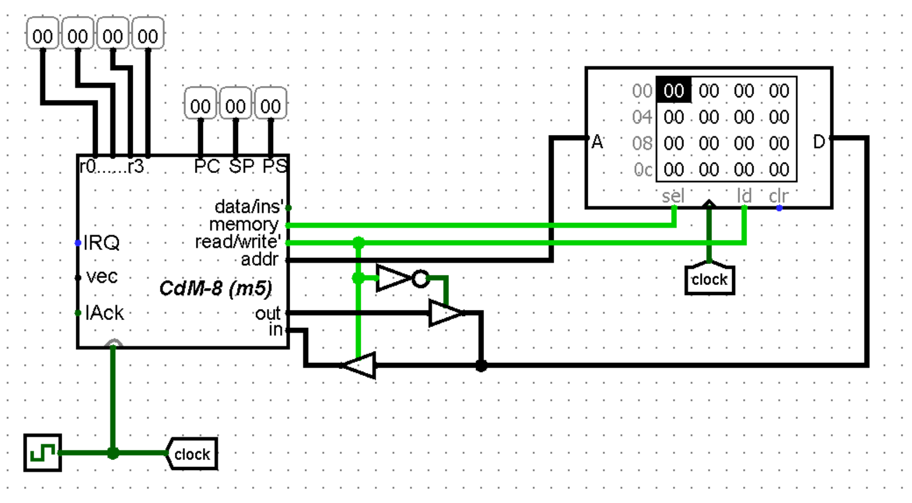

### [На главную](../introduction.md)
#### [Следующее задание](../L2/about.md)

# Фон Неймановская архитектура
Как я уже говорил, в этой архитектуре используется только 1 блок `RAM` размером 256 байт, а выход `data/ins'` использоваться не будет, так как он служит для определения, с какой сущностью из памяти мы работаем: с данными или инструкцией

---

**Задача:** 
1. Написать для ассемблера код, складывающий две константы и записывающий в память их сумму (проверить работу кода в CocoIDE и запомнить, в какую ячейку пишется результат)
2. Реализовать Фон Неймановскую архитектуру в Logisim
3. Создать образ и загрузить его в память
4. Запустить симуляцию тиков и удостовериться в корректности выполнения программы (проверить это можно, нажав на памяти ПКМ и выбрав `Edit contents...`, в открывшемся окне можно будет увидеть, записались ли данные в нужную ячейку)

---

Лично я не считаю, что нужно обязательно пилить схему самому без подсказок. Я переделывал её на основе лекций, так что оставлю тут скрин итоговой схемы. При пересборке её у себя и проделывании всех пунктов выше усвоение так и так будет неплохим, так что вот:

