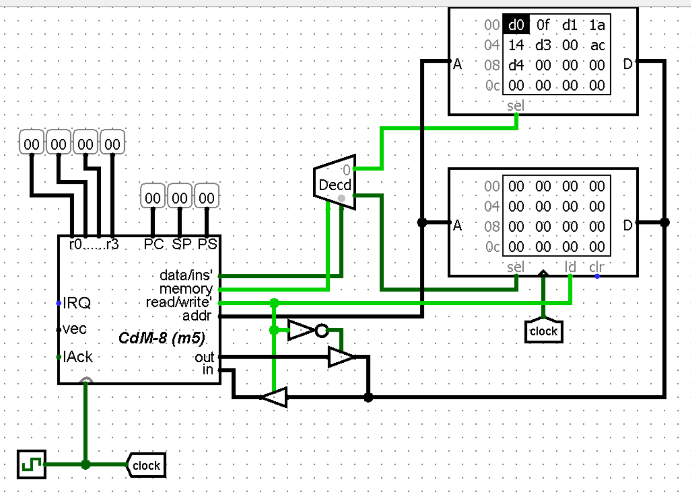

### [На главную](../introduction.md)
#### [Предыдущее задание](../L1/about.md) | [Следующее задание](../L3/about.md)

# Гарвардская архитектура
Главное отличие уже отмечал выше, тут лишь добавлю, что выбор блока производится при помощи декодера с двумя выходами: нулевой говорит о том, что сейчас выбран блок инструкций (ROM), первый - выбран блок с данными (RAM). Включает декодер выход процессора `memory`, а селектором служит выход `data/ins'`

**Задача:** реализовать аналогичный L1 алгоритм, но на Гарвардской архитектуре.

Чтобы переключить архитектуру в CocoIDE в меню нажми на `CDM8 -> Arch. = Harvard`. После этого надпись сменится на `Arch. = Von Neuman`, а справа над блоком памяти появятся 2 вкладки: ROM и RAM. Ясное дело, `.img` файл нужно будет загружать в ROM. Константы лучше всего задавать `ldi`, а не через псевдоинструкцию `dc` 

---

Моя реализация:
