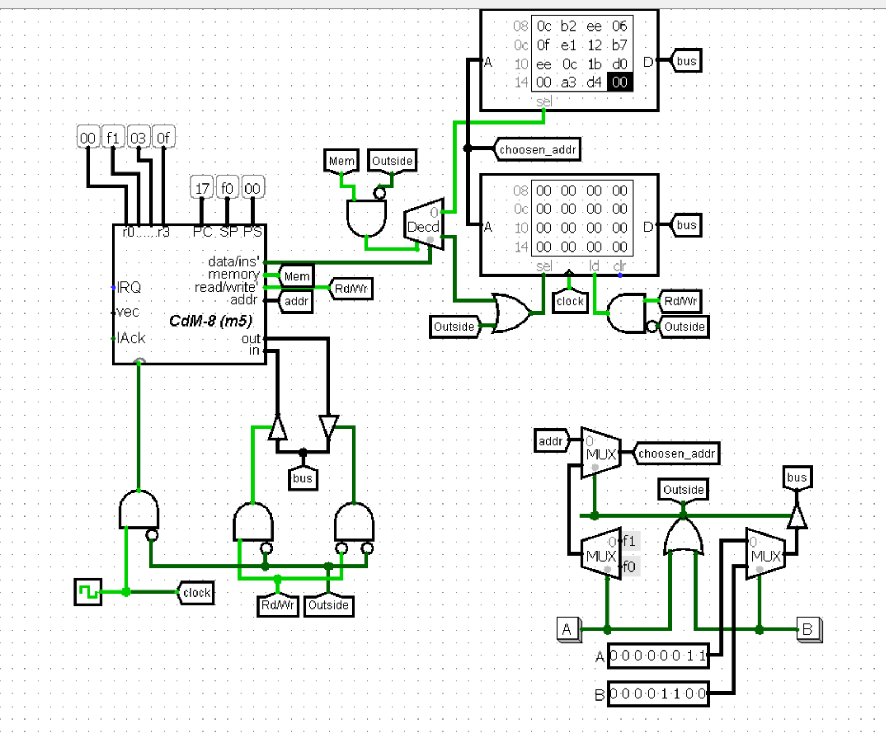
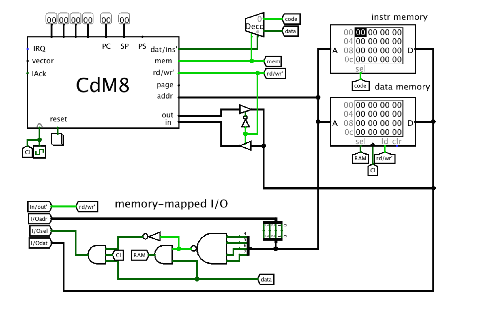
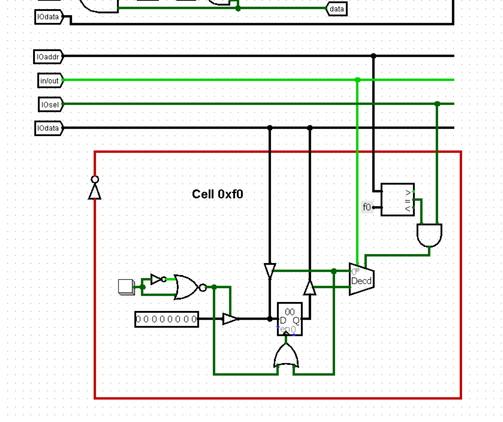

### [На главную](../introduction.md)
#### [Предыдущее задание](../L2/about.md)

# Memory-mapped I/O
**Рассматривать будем в комбинации с гарвардской архитектурой**

Главная суть этого простого метода связывания процессора с внешним миром заключается в том, что однобайтовую ячейку оперативной памяти легко можно представить как однобайтовый регистр, а уже к этому регистру мы легко можем подключить внешние схемы.

Таким образом главной задачей становится "обмануть" процессор, перенаправив отправляемые им сигналы с блоков памяти на регистры. В этом нам помогут 4 провода, особая логика из которых нужна всего лишь для одного:
- `in/out` - копирует сигнал с `read/write`
- `IOaddr` - копирует значение с `addr` (*в схемах из презентаций и книги брались лишь младшие биты, которые потом проверялись через логическое И, но для универсальности я решил использовать компораторы, поэтому необходимость резать байт адреса пропала*)
- `IOdata` - двунеправленная шина данных. Просто подсоединяется к шине процессора
- `IOsel` - 1 бит, поднят, когда процессор будет обращаться ко внешним устройствам. Для этого должны одновременно выполняться 2 условия:
  - адрес с выхода процессора `addr` находится в диапазоне адресов, выделенных нами для внешних регистров
  - процессор обращается к блоку данных (*подняты выходы процессора `mem` и `data/ins'` - далее везде, как и в прошлом задании на Гарвардскую архитекутуру буду называть этот совместный сигнал с декодера выходом `data`*)
  - дополнительно на вход вентилю И также подаётся сигнал `clock`, так как на внешних регистрах сигнал, зависящий от `IOsel` часто используется как триггер

Следующим важным отличием будет то, что нам нужна дополнительная проверка для работы с оперативной памятью: нам нужно, чтобы процессор обращался к адресу, не лежащему среди адресов внешних устройств и чтобы при этом выход `data` был поднят.

На практике под внешние устройства в CdM-8 обычно выделяют последний ряд, то есть ячейки `0xf0`-`0xff`. Таким образом нам достаточно проверять: если значение адреса меньше `0xf0`, значит мы обращаемся к ОЗУ, если значение больше или равно (инверсия прошлого условия), значит мы обращаемся ко внешним регистрам

Модификация схемы процессора на Гарвардской архитектуре для работы с внешними устройствами будет выглядеть так:

**Исходная схема из учебника:**

**Модифицированная схема без разрезания адреса на куски и с использованием компоратора:**

## Как этим пользоваться?
4 полученных сигнала мы далее используем со всеми внешними регистрами. 
1. Мы понимаем, что процессор работает с регистром, когда поднят сигнал `IOsel`, а на `IOaddr` содержится адрес ячейки, к которой должен будет обращаться процессор для доступа к этому регистру
2. Определяем, что хочет процессор от регистра: прочитать или записать значение (`in/out` = 1 => читать значение из регистра, 0 => записать значение в регистр)
   - **Обычно ставится декодер, которы будет включён, если поднят `IOsel` и соответствует `IOaddr`. В качестве селектора подаётся `in/out`. Таким образом, выход декодера 0 мы можем назвать `write`, а выход 1 - `read`** 
3. К входу и выходу регистра подсоединён `IOdata` с направленными буферами, один из которых откроется в зависимости от сигнала в прошлом пункте.
4. В качестве триггера для регистра будет подан выход `write`

Готово! Теперь команды процессора `ld`/`st` будут работать с этим регистром так, будто бы это ячейка памяти.

**На практике часто с `IOdata` связывается только вход или выход регистра, а другая его часть подключена к нашим внешним устройствам.** Тем не менее, сейчас для наглядности реализуем внешний регистр, связанный с процессором в обоих направлениях, а также принимающий данные с внешнего устройства.

---

**Задание 1:** задание очень похоже на прошлые, но теперь исходные слагаемые будут храниться во внешних регистрах с процессорными адресами `0xf0` и `0xf1`, а результат будет записываться в `0xf2`.

*Примечание:* нетрудно заметить, что внешние регистры по адресам `0xf0` и `0xf1` только читаются процессором, а ввод проходит только через внешнее устройство, тогда как в регистр по адресу `0xf2` данные только записываются, таким образом, на всех регистрах из двух направлений `IOdata` нас интересует только одно

---

**Задание 2:** Теперь у нас будет использоваться только регистр `0xf0`. Сначала в него извне будет вводиться число, потом оно будет читать процессором, умножаться на 2 и снова записываться в тот же регистр

*Примечание:* для каждого провода, подсоединённого от разных источников ко входу или выходу регистра необходимо использовать отдельный направленный буфер, чтобы избежать конфликта значений

**Решение** приведено выше, но здесь главное собрать эту схему самостоятельно и полностью осмыслить
