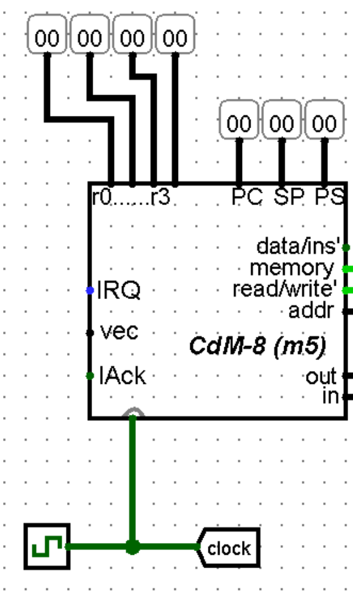

# Что вообще этот ваш CdM в Logisim
CdM-8 - восьмибитный процессор, исполняющий команды по кодам. В CocoIDE всё было просто: мы писали код и он преобразовывался в коды, показанные в центре (в соответствии командным строкам) и справа (в памяти), но в реальности коды команд хранятся не в самом процессоре, а во внешнем блоке памяти. 

Таким образом, главной задачей при интеграции CdM-8 в Logisim для нас становится соединить наш чип процессора с внешней памятью, в которую будут загружены команды.

# Как выглядит CdM-8 в Logisim
Не хочу повторяться, поэтому вставлю сюда кусок из своего конспекта. Английский там не особо сложный.

Здесь ещё добавлю только, что мы используем версию [CdM-8-mark5](https://drive.google.com/file/d/1LBynIqvYFjqyTnXPhX2tgX70vqPd9x3X/view), а в лекциях показана mark4. Отличия у них не слишком большие, но выглядеть наш чип будет немного иначе - ничего страшного (*обидно разве что, что инпут `reset` пропал*)

## CdM8 as a chip
Pins:
- North (*all 8 bits, for checking, not for work*):
  - `r0-r3`
  - `PC`
  - `SP`
  - `PS`
- South (all 1 bit and inputs):
  - `clock`
- West (for interrupting, inputs):
  - `IRQ` - input - tells that some device want to interrupt CPU
  - `vector` - input - 
  - `IAck` - output - CPU is ready to be interrupted
- East:
  - `in` - 8 bits
  - `out` - 8 bits
  - `addr` - address of read/written memory cell
  - `page` - not need (*for memory banks?*)
  - `read/write` - 1 bit, 1 => read, 0 => write, used for for `ld` input in [`RAM` block](#ram) and for controlled buffers on `in`/`out`
  - `memory` - 1 bit, in Harvard - see below, in Manchester set `sel` input of RAM
  - `data/ins'` - 1 bit, 1 => work with data bank (often we use this output with decoder is enabled by `mem` output)

Отдельного внимания заслуживают вход `in` и выход `out`, потому что они должны быть объединены в общую двунаправленную шину данных. Делается это при помощи буферов, направленных в разные стороны и сигнала с выхода `read/write`: **на in-буффер он подаётся прямо, для out-буффера - инвертируется.** Это позволит нам при чтении блокировать сигнал с `out`, тогда данные будут без проблем направляться на вход `in`, а при записи в память блокировать сигнал с `in`, чтобы данные с `out` направлялись в память.

## Как добавить CdM-8 в Logisim
Идём по следующему пути в меню `project -> load library -> Logisim library`, далее выбираем файл `.circ` (в нашем случае это `CdM-8-mark5-full.circ`). После этого в левом меню появится папка со всеми элементами из этой библиотеки. Нас будет интересовать лишь сам чип (в редких случаях можно пользоваться и другими).

## Как хоть что-то запустить?
Подключив даже один лишь `clock`, мы можем начать симуляцию тиков, но процессор будет просто увеличиваться счётчик команд, ведь ему не от куда брать коды.

Коды команд должны будут храниться в одном из двух блоков памяти: ROM или RAM.

В Фон Неймановской (Манчестерской) архитектуре будет использоваться только RAM, так как мы из этого блока и читаем команды, и читаем/записываем данные.

В Гарвардской архитектуре команды будут храниться в ROM, а данные - в RAM. Теперь рассмотрим устройство этих блоков памяти.

## RAM
Inputs:
- `A` - address of memory cell
- `sel` - enables work with RAM
- `ld` - if 1 => loads value to `D`, 0 => sets value from `D`
- `clock`
- `D` 

## ROM
The same as RAM, but without `ld` and `clock` thus `D` is always output of cells `A` when `sel` is 1

**Хранятся в Logisim блоки памяти во вкладке `memory`**

## Как загрузить коды команд в память и где их вообще взять
Тут всё просто)

1. Пишем код в CocoIDE
2. Выбираем в меню `CDM8 -> Save image` и сохраняем `.img` файл
3. В Logisim жмём ПКМ на блоке памяти и выбираем `Load image...`
4. Выбираем наш `.img` файл
5. **SUCCESS**

---

Фух! Теперь базы достаточно для решения задач:
1. [L1 (Фон Нейман)](./L1/about.md)
2. [L2 (Гарвард)](./L2/about.md)
