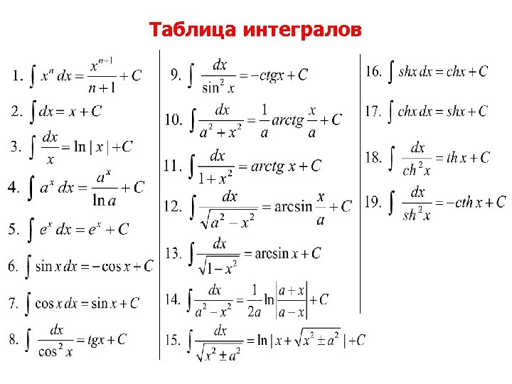

- [Примечание](#примечание)
- [22.10.19 - лекция](#221019---лекция)
- [22.10.26 - лекция](#221026---лекция)
  - [Асимптоматические отношения функций](#асимптоматические-отношения-функций)
    - [О-большое](#о-большое)
    - [Функции одного порядка](#функции-одного-порядка)
    - [о-малое](#о-малое)
    - [Эквивалентные функции](#эквивалентные-функции)
      - [Некоторые эквивалентные функции](#некоторые-эквивалентные-функции)
    - [Асимптота](#асимптота)
- [22.11.02 - лекция 9. "Производные и дифференциалы функции одной переменной"](#221102---лекция-9-производные-и-дифференциалы-функции-одной-переменной)
  - [Разностное отношение и производная](#разностное-отношение-и-производная)
  - [Некоторые производные](#некоторые-производные)
  - [Линейное приближение функции](#линейное-приближение-функции)
  - [Критерий дифференцируемости](#критерий-дифференцируемости)
  - [Дифференциал](#дифференциал)
  - [Уравнение касательной](#уравнение-касательной)
  - [Оператор дифференцирования](#оператор-дифференцирования)
  - [Дифференцирование сложной функции](#дифференцирование-сложной-функции)
  - [Гиперболические синус и косинус](#гиперболические-синус-и-косинус)
  - [Другие сложные функции](#другие-сложные-функции)
  - [Производная обратной функции](#производная-обратной-функции)
- [22.11.09 - лекция 9 - "Производные и дифференциалы функции одной перменной"](#221109---лекция-9---производные-и-дифференциалы-функции-одной-перменной)
  - [Множественные производные](#множественные-производные)
  - [Формула Лейбница](#формула-лейбница)
  - [Теорема Ферма (*Не великая*)](#теорема-ферма-не-великая)
  - [Теорема Ролля](#теорема-ролля)
  - [Теорема Лагранжа](#теорема-лагранжа)
  - [Кусочно-дифференцируемая функция](#кусочно-дифференцируемая-функция)
  - [Теорема Коши](#теорема-коши)
  - [Полином Тейлора](#полином-тейлора)
  - [Формула Маклорена](#формула-маклорена)
- [22.11.16 - лекция](#221116---лекция)
- [22.11.23 - лекция](#221123---лекция)
  - [Линейное пространство](#линейное-пространство)
  - [Линейная комбинация](#линейная-комбинация)
  - [Линейная оболочка](#линейная-оболочка)
  - [Матрица](#матрица)
    - [Умножение матриц](#умножение-матриц)
- [22.11.30 - лекция](#221130---лекция)
  - [Линейно зависимые векторы](#линейно-зависимые-векторы)
  - [Эквивалентность множеств векторов](#эквивалентность-множеств-векторов)
  - [Размерность линейного пространства](#размерность-линейного-пространства)
  - [Базис](#базис)
  - [Координаты](#координаты)
  - [Матрица перехода](#матрица-перехода)
- [22.12.01 - семинар](#221201---семинар)
  - [Определитель матрицы](#определитель-матрицы)
  - [Определитель верхнетреугольной матрицы](#определитель-верхнетреугольной-матрицы)
  - [Решение "квадратной системы уравнений" матричным методом (метод Крамера)](#решение-квадратной-системы-уравнений-матричным-методом-метод-крамера)
- [22.12.07 - лекция](#221207---лекция)
  - [Вещественное евклидово пространство](#вещественное-евклидово-пространство)
  - [Неравенство Коши-Буняковского](#неравенство-коши-буняковского)
- [22.12.08 - семинар](#221208---семинар)
  - [Минор и ранг матрицы](#минор-и-ранг-матрицы)
  - [СЛАУ](#слау)
  - [ФСР (фундаментальная система решений)](#фср-фундаментальная-система-решений)
  - [Теорема Кронекера-Капелли](#теорема-кронекера-капелли)
  - [Общее решение и ФСР для однородных СЛАУ](#общее-решение-и-фср-для-однородных-слау)
  - [Общее решение для неоднородной системы](#общее-решение-для-неоднородной-системы)
- [22.12.14 - лекция](#221214---лекция)
  - [Определитель матрицы (теория)](#определитель-матрицы-теория)
  - [Перестановки (*хз, зачем это тут, но пусть будет*)](#перестановки-хз-зачем-это-тут-но-пусть-будет)
  - [Ещё одно определение определителя](#ещё-одно-определение-определителя)
  - [Ещё рах про минор](#ещё-рах-про-минор)
  - [Теорема об ортогональности строк адъюнктам](#теорема-об-ортогональности-строк-адъюнктам)
  - [Определитель умноженных матрц](#определитель-умноженных-матрц)
  - [Ещё раз про метод Крамер](#ещё-раз-про-метод-крамер)
  - [Ещё о СЛАУ](#ещё-о-слау)
  - [Ещё раз о ранге](#ещё-раз-о-ранге)
  - [Ещё раз теорема КрОнекера-КАпелли](#ещё-раз-теорема-кронекера-капелли)
- [22.12.15 - семинар](#221215---семинар)
- [22.12.21 - лекция](#221221---лекция)
  - [Аффинные пространства](#аффинные-пространства)
  - [Аффинная система координат](#аффинная-система-координат)
  - [Преобразование аффинного пространства](#преобразование-аффинного-пространства)
  - [Свойства аффинных преобразований пространства](#свойства-аффинных-преобразований-пространства)
  - [Собственное аффинное преобразование](#собственное-аффинное-преобразование)
  - ["Геометрические" свойства аффинного пространства](#геометрические-свойства-аффинного-пространства)
    - [Плоскость](#плоскость)
- [23.02.01 - лекция](#230201---лекция)
  - [Кватернионы](#кватернионы)
  - [Операции над кватернионами](#операции-над-кватернионами)
  - [Сопряжённые кватернионов](#сопряжённые-кватернионов)
  - [Состав кватерниона](#состав-кватерниона)
  - [Векторное, скалярное и обычное произведение для кватернионов](#векторное-скалярное-и-обычное-произведение-для-кватернионов)
  - [Вращение при помощи кватернионов](#вращение-при-помощи-кватернионов)
- [23.02.03 - семинар](#230203---семинар)
  - [Линейные операторы](#линейные-операторы)
- [23.02.06 - лекция](#230206---лекция)
  - [Первообразная](#первообразная)
  - [Свойства неопределённых интегралов](#свойства-неопределённых-интегралов)
  - [Таблица интегралов](#таблица-интегралов)
  - [Интегрирование по частям](#интегрирование-по-частям)
  - [Вычисления интеграла через замену переменной интегрирования](#вычисления-интеграла-через-замену-переменной-интегрирования)
  - [Интегрирование рациональных дробей](#интегрирование-рациональных-дробей)
  - [Разбиения](#разбиения)
  - [Суммы Дарбу](#суммы-дарбу)
- [23.02.09 - семинар](#230209---семинар)
  - [Собственные вектора ЛО](#собственные-вектора-ло)
- [23.02.15 - лекция](#230215---лекция)
  - [Интегральная сумма Римана](#интегральная-сумма-римана)
  - [Интегралы Дарбу и Римана](#интегралы-дарбу-и-римана)
  - [Достаточные условия интегрируемости по Риману](#достаточные-условия-интегрируемости-по-риману)
  - [Колебание функции](#колебание-функции)
  - [Следствие критерия Римана](#следствие-критерия-римана)
  - [Мелкость сетки](#мелкость-сетки)
- [23.02.16 - семинар](#230216---семинар)
  - [Жорданова форма](#жорданова-форма)
  - [Жорданов базис](#жорданов-базис)
- [23.02.22 - лекция](#230222---лекция)
  - [LEQ-критерий интегрируемости](#leq-критерий-интегрируемости)
  - [Интегрирование на промежутках, связанных между собой каким-либо образом](#интегрирование-на-промежутках-связанных-между-собой-каким-либо-образом)
  - [Свойства определённого интеграла](#свойства-определённого-интеграла)
  - [Лемма об интегрировании функции на отрезках](#лемма-об-интегрировании-функции-на-отрезках)
  - [Продолжение свойств интегралов](#продолжение-свойств-интегралов)
  - [Линейная комбинация интегралов](#линейная-комбинация-интегралов)
  - [Аддитивность интегралов](#аддитивность-интегралов)
  - [Монотонность интеграла](#монотонность-интеграла)
  - [Интегральная теорема о среднем](#интегральная-теорема-о-среднем)
  - [Как называть интегралы](#как-называть-интегралы)
- [23.03.01 - лекция](#230301---лекция)
  - [Дифференцирование интеграла](#дифференцирование-интеграла)
  - [Формула Ньютона-Лейбница](#формула-ньютона-лейбница)
  - [Интегрирование по частям с использованием формулы Ньютона-Лейбница](#интегрирование-по-частям-с-использованием-формулы-ньютона-лейбница)
  - [Несобственные интегралы](#несобственные-интегралы)
  - [Сравнение несобственных интегралов для установления сходимости](#сравнение-несобственных-интегралов-для-установления-сходимости)
- [23.03.02 - семинар](#230302---семинар)
  - [Табличные интегралы](#табличные-интегралы)
  - [Как интегрировать чуть проще?](#как-интегрировать-чуть-проще)
  - [Ещё раз о введении аргумента (метод подстановки)](#ещё-раз-о-введении-аргумента-метод-подстановки)
- [23.03.09 - семинар](#230309---семинар)
  - [Интегрирование по частям](#интегрирование-по-частям-1)
  - [Интегрирование рациональных функций](#интегрирование-рациональных-функций)
    - [Метод неопределённых коэффициентов (*для тех, кто не мышь*)](#метод-неопределённых-коэффициентов-для-тех-кто-не-мышь)
- [23.03.15 - лекция](#230315---лекция)

# Примечание
Лектор - Васкевич Владимир Леонтьевич

Семинаристка - Рудомётова Анна Сергеевна

# 22.10.19 - лекция
Понятие предела функции в точке позволяет ввести класс непрерывности функции

**О** $f(x)$ с обл. опред $D(f)$ называется непрерывной в предельной точке $x_0 \in {Df}$, если $\exist \lim_{x->x_0}{f(x)} = f(x_0)$

Если $f(x)$ непрерывна в точке $x_0$ => $x_0$ - точка непрерывности, иначе $x_0$ - точка разрыва

Например, для $f(x) = 1/x$, $x_0 = 0$ - точка разрыва

**О** Если $x_0$ - точка разрыва $f(x)$ и при этом $\exist \lim$ (конечный), то $x_0$ - точка устранения разрыва. Если же $\exist f(x_0 - 0) \not = {f(x_0 + 0)}$, то $x_0$ - точка разрыва первого рода.

- $sign(x)$: $x_0 = 0$ - разрыв первого рода
- $|sign(x)|$: $x_0 = 0$ - устранимый разрыв

**О** *непрерывности функции (похоже на определение предела функции по Гейне)*. Функцмя $f(x)$ 

Если точка $x_0$ изолирована, то сходящаяся к ней последовательность стационарна

**О** ($\epsilon-\delta$): $f(x)$, опред. в $O(x_0)$ называется непрерывной в этой точке $x_0$, если: $\forall \epsilon > 0, \exist \delta > 0: \forall x, |x - x_0| < \delta \rArr |f(x) - f(x_0)| < \epsilon$

**Т** 
1. Если $f(x)$ непрерывна в точке $x_0$, то $|f(x)|$ также непрерывна в точке $x_0$
2. Если $f(x) \And g(x)$ непрерывны в точке $x_0$, то $f(x) \plusmn g(x)$, $f(x)*g(x)$ также непрерывны в точке $x_0$ (и $\frac{f(x)}{g(x)}$, если $g(x) \not= 0$)
3. Если $f(x) \And g(x)$ непрерывны в точке $x_0$, то сложная функция $f(g(x))$ также непрерывна в точке $x_0$

Если $f(x)$ непрерывна справа в точке $x_0$ $<=> \exist f(x_0+0) \And f(x_0 + 0) = f(x_0)$ (аналогично и для непрерывности слева для $f(x_0 - 0)$)

**Т**
Пусть функция $f(x)$ непрерывна на $[a, b] \rArr$ образ этого отрезка при отображении $f:[a,b] -> \R$ является замкнутым и ограниченым множеством
$$
f([a,b]) = \{y \in \R | \exist x \in [a, b], y = f(x)\}
$$
*Доказательство:* $x_0 \in [a,b], \exist .O(x_0): |f(x) - f(x_{...})| < 1$ ...

**Следствие**: $f(x)$, непрерывная на $[a,b]$, достигает на этом отрезке своего набольшего и наименьшего значений: 
$$
\exists x_1,x_2 : \begin{cases}
  \sup(f([a,b])) = f(x_1) \\
  \inf(f([a,b])) = f(x_2)
\end{cases}
$$

$\Delta = [\alpha, \beta] \in \R$ - обладает свойством транзитивности **(?)**: $a \in \Delta, b \in \Delta, a < b \rArr [a, b] \in \Delta$. $[a, b]$ - промежуток числовой оси.

**Т**: Если f(x) непрерывна на некотором промежутке $\Delta$ и принимает на нём значения $A, B: A < B$, то $\forall y=f(x) \in \Delta: A < y < B$

# 22.10.26 - лекция
## Асимптоматические отношения функций
### О-большое
Для функций $f(x)$ и $g(x)$, определённых на множестве $X \in D(f)$ $f(x)$ называется "О-большое от g(x) при $x \rarr x_0$", если 
$$
\exist const C > 0 \And O(x_0) (окрестность):\newline
|f(x)| \le C|g(x)|\newline
\forall x \in O(x_0) \And X, x \not= x_0
$$
Символически это отношение записывается как $f(x) = O(g(x))$ при $x \rarr x_0$

Запись $f(x) = O_{2\_нижних\_подчёркивания}(1)$ означает, что $f(x)$ ограничена в некоторой точке $x_0$ (далее будет обозначаться как $O_{\_\ \_}$). Примеры:
1. $sin(x) = O_{\_\ \_}$ при $x \rarr 0$
2. $sin(x) = O_{\_\ \_}$ при $x \rarr +\infin$
3. $sin^2(x) = O(sin(x))$ при $x \rarr +\infin$

Отношение O-большое транзитивно ($x \rarr x_0: f(x) = O(g(x)) \And g(x) = O(h(x)) \rArr f(x) = O(h(x))$)

**Т сложения.** $x \rarr x_0: f(x) = O(h(x)) \And g(x) = O(h(x)) \rArr f(x)+g(x) = O(h(x))$

### Функции одного порядка
$f(x)$ и $g(x)$ называются функциями одного порядка, если $x \rarr x_0: f(x) = O(g(x)) \And g(x) = O(f(x))$. $f(x)$ и $g(x)$ также могут называться подобными.

Обозначается такое отношение в виде равно, в котором линии вогнуты внутрь.

Отношение подобия рефлексивно, симметрично и транзитивно *=> оно эквивалентно*

**Т.**
$$
\lim_{x \rarr x_0}{\frac{|f(x)|}{|g(x)|}} = k
$$
1. $0 < k < +\infin \rArr$ $f(x)$ и $g(x)$ подобны
2. $k = 0 \rArr g(x) = O(f(x))$
3. $k = +\infin \rArr f(x) = O(g(x))$

Примеры:
1. $sin(x)$ подобны $x$ при $x \rarr 0$
2. $sin(3x)$ подобны $x$ при $x \rarr 0$
3. $2x^2 + x + 3$ подобны $x^2$ при $x \rarr +\infin$

Если $f(x) \equiv g(x)$ и $f(x)$ и $g(x)$ - БМФ, то $f(x)$ и $g(x)$ - бесконечно малые одного порядка

### о-малое
Для функций $f(x)$ и $g(x)$, определённых на множестве $X \in D(f)$ $f(x)$ называется "о-малое от g(x) при $x \rarr x_0$", если:
$$
\exist O(x_0)\newline
|f(x)| \le \alpha(x)|g(x)|\newline
\forall x \in O(x_0) \And X, x \not= x_0
$$
Где $\alpha(x)$ - бесконечно малое при $x \rarr x_0$

Символически о-малое записывается с двумя подчёркиваниями сверху (здесь этот факт будет игнорироваться)

Запись $f(x) = o(1)$ означает, что $f(x)$ является БМФ при $x \rarr x_0$

Примеры:
1. $sin(x) = o(1): x \rarr 0$
2. $sin(x) = o(x^{1/3}): x \rarr 0$
3. $x^2 = o(x): x \rarr 0$
4. $x = o(x^2): x \rarr +\infin$

$$
\lim_{x \rarr x_0}{\frac{f(x)}{g(x)}} = 0 \rArr f(x) = o(g(x))
$$

**Л**
$$
x \rarr x_0: f(x) = O(g(x)) \And g(x) = o(h(x)) \rArr f(x) = o(h(x))
$$

**Следствие.** 
1. Транзитивность о-малого 
2. Теорема сложения, как и для О-большого
3. $x \rarr x_0: f(x) = O(h(x)) \And g(x) = o(h(x)) \rArr f(x)*g(x) = o(h^2(x))$

### Эквивалентные функции
$f(x)$ эквивалентна $g(x)$, если $f(x) - g(x) = o(g(x)): x \rarr x_0$

Символически эквивалентность обозначается тильдой (здесь будет $\equiv$).

Эквивалентность симметрична, транзитивна *и рефлексивна (кто бы мог подумать...)* (доказывается из определния эквивалентности и о-малого и неравенства треугольника)

Если $f(x)$ и $g(x)$ эквивалетны, то они называются **асимптотически равными**

$f(x) = g(x) + o(g(x))$ - **асимптотическое равенство**

**Л.**
$$
x \rarr x_0: \forall x \in X, x \not= x_0 \newline
\exist \lim_{x \rarr x_0}{\frac{f(x)}{g(x)}} = 1
\rArr f(x) \equiv g(x)
$$
(Доказывается через подстановку формулы из определения эквивалентности и о-малого)

#### Некоторые эквивалентные функции

*Посмотреть потом где-нибудь про асимптоматическое расхождение функции по степени x (примеры идут по втором столбце в таблице выше*

### Асимптота
$f(x)$ определена при $x > a$, тогда прямая $l$ на графике $O_{xy}$ называется **асимптотой графика функции** $f(x): x \rarr +\infin$, если расстояние $\rho(x, l)$ от точки графика $(x, f(x))$ до прямой $l$ удовлетворяет асимптоматическому равенству $\rho(x, l) = o(1): x \rarr +\infin$

График функции $y = f(x)$ имеет асимптоту при $x \rarr +\infin \hArr \exist k, b: f(x) = kx + b + o(1)$

Из этой теоремы следует, что $\frac{f(x)}{x} = k + o(1) \And b = f(x) - kx + o(2)$. 
Следовательно:
$$
k = \lim_{x \rarr +\infin}{\frac{f(x)}{x}} \And b = \lim_{x \rarr +\infin}{(f(x) - k)}
$$

При $x \rarr -\infin$ асимптота определяется и ищется аналогично

# 22.11.02 - лекция 9. "Производные и дифференциалы функции одной переменной"
## Разностное отношение и производная
**О.** Для любой точки $x$ из $D(f): x \not= x_0$ частное
$$
\frac{f(x) - f(x_0)}{x - x_0} = \frac{f(x_0 + \Delta x) - f(x_0)}{\Delta x}
$$
Называется разностным отношением функции $f$ в точке $x_0$

**О.** Если существует предел разностного отношения при $\Delta \rarr 0$, то этот предел называется производной функции $f$ в точке $x_0$

Обозначается $f'(x_0)$ либо $\frac{df}{dx}(x_0)$

Если есть только односторонние пределы, то они называются левым и правым (*Где какой, надеюсь, понятно*). Обозначаются $f_-'(x_0)$ и $f_+'(x_0)$

**О.** $f$ называется дифференцируемой в точке $x_0$, если $x_0 \in D(f) \And \exist f'(x_0)$

**О.** Операция нахождения производной называется дифференцированием, а оператор дифференцирования обозначается как $\frac{d}{dx}:y \rarr y'$. $\frac{d}{dx} \equiv D$

## Некоторые производные
*Самые элментарные я писать не стал*
$$
(a^x)' = a^x\ln a
$$
$$
(\log_{a} x)' = \frac{\log_{a} e}{x}
$$
$$
(\tg x)' = \frac{1}{\cos^2x}
$$
$$
(\ctg x)' = \frac{-1}{\sin^2x}
$$

## Линейное приближение функции
Если функция $f(x)$ дифференцируема в точке $x_0$, то она представима в таком виде:
$$
f(x) = f(x_0) + f'(x_0)(x - x_0) + \alpha(x)(x - x_0)
$$
Где $\alpha(x)$ непрерывна в точке $x_0$ и равна нулю. Из этого следует, что допустима записб в виде такого асимптоматического равенства:
$$
f(x) = f(x_0) + f'(x_0)\Delta x + o(\Delta x)
$$

*Дописать про А-большое (upd.: перечитал и не совсем понял, зачем оно мне нужно, но да ладно)*

**Л.** 
$$
\exist A \in \R: f(x) = f(x_0) + A\Delta x + o(\Delta x) \newline
\rArr \exist f'(x_0) = A
$$

## Критерий дифференцируемости
Функция $f(x)$ дифференцируема в точке $x_0$ тогда и только тогда, когда выполняется следующее асимптоматическое равенство
$$
\exist A: f(x) = f(x_0) + A\Delta x + o(\Delta x)
$$

## Дифференциал
Линейная функция $\Delta x \rarr f'(x_0)\Delta x$ называется дифференциалом $f$ в точке $x_0$ и обозначается как $df(x_0)$

## Уравнение касательной
*Следует из определения производной*

Из уравнения касательно получаем, что:
$$
f'(x_0) = \tg \alpha = k
$$
Где $k$ - коэффициента наклона угла касательной по отношению к абсциссе, а $\alpha$ - угол наклона

## Оператор дифференцирования
**Т о свойствах**
1. Сумма и разность производных
2. $(uv)' = u'v + uv'$
3. $(\frac{u}{v})' = \frac{u'v - uv'}{v^2}$

## Дифференцирование сложной функции
$$
y = f(g(x)) \newline
y' = f'(g(x))g'(x)
$$
Другой вариант записи
$$
\frac{dy}{dx} = \frac{dy}{dg}\frac{dg}{dx}
$$
Из этого свойства выводится формула $(x^a)' = ax^{a-1}$ (через представление $x^a = e^{a\ln x}$)

## Гиперболические синус и косинус
Синус: $\sh x = \frac{e^x - e^{-x}}{2}$. $(\sh x)' = \sh x$
Синус: $\ch x = \frac{e^x + e^{-x}}{2}$. $(\ch x)' = \ch x$

## Другие сложные функции
$$
(u^v)' = (e^{v \ln u})' = (e^{v \ln u})(v \ln u)' = u^v(v'\ln u + \frac{vu'}{u}) \newline
\rArr (x^x)' = x^x(1 + \ln x)
$$

## Производная обратной функции
Если производная обратной к $y = f(x)$ функции $x = g(y)$ не равна 0, то получаем:
$$
y_0 = f(x_0): f'(x_0) = \frac{1}{g'(y_0)}
$$

# 22.11.09 - лекция 9 - "Производные и дифференциалы функции одной перменной"
## Множественные производные
Производная второго порядка - производная от производной
$$
f''(x) = (f'(x))' = \frac{d^2y}{dx^2}(x)
$$
Производная n-го порядка определяется индуктивно
$$
f^{(n)}(x) = \frac{d^n y}{dx^n}(x)
$$

Производная выского порядка от суммы равна сумме производных выского порядка *(Как с обычными производными)*

## Формула Лейбница
**Т.** Для любых двух функций $u = u(x)$ и $v = v (x)$, имеющих в точке $x_0$ все производные до порядка $n$ включительно, их произведение также имеет производную порядка $n$, вычисляемую по формуле:
$$
(uv)^{(n)} = \sum^n_{k=0} C^k_n u^{(k)} v^{(n-k)}
$$
**Доказывается через индукцию и правило биноминальных коэффициентов** $C^k_n + C^{k+1}_n = C^k_{n+1}$

## Теорема Ферма (*Не великая*)
Если $\exist f'(x_0) = 0$, то $x_0$ - точка экстремума. **При условии, что это внутренняя точка области определения**

**Доказывается через левую и правую производные на коерстности внутри данной окрестности и отношение этих производныех к нулю при вычитании из производной нулевой точки**

## Теорема Ролля
Если функция непрерывна на $[a, b]$ и дифференцируема на $(a, b)$ и при этом $f(a) = f(b) \rArr \exist \xi \in (a, b): f'(\xi) = 0$

**Доказывается через теорему Вейрштрасса и Ферма**

**Л.** Если производная на всём интервале равна нулю, то на данном отрезке функция тождественно постоянна

## Теорема Лагранжа
Если функция непрерывна на $[a, b]$ и дифференцируема на $(a, b)$ и при этом $f(a) = f(b)$ 
$$
\rArr \exist \xi \in (a, b): f'(\xi) = \frac{f(b) - f(a)}{b - a}
$$
**Доказывается через теорему Ролля**

**Следствия:**
1. Если функция непрерывна в $O(x_0)$ и дифференцируема в $.O(x_0)$
$$
\rArr \forall x \in .O(x_0): \exist \xi \in (x,x_0) + (x_0,x): f(x) - f(x_0) = f'(\xi)(x - x_0)
$$
2. В другом виде описанное выше следствие можно записать так
$$
\rArr \forall x \in .O(x_0): \exist \theta \in (0,1): f(x) - f(x_0) = f'(x_0 + \theta \Delta x)\Delta x
$$

## Кусочно-дифференцируемая функция
Функция называется кусочно-дифференциремой на отрезке, если имеет конечную производную во всех точках этого отрезка за исключением некоторого возможного конечного множества точек.

Кусочно-дифференцируемая функция будет тождественно постоянно, если во всех точках кроме некоторого возможного конечного множества её производная равна нулю.

## Теорема Коши
Если функции $f(x), g(x)$ непрерывны на $[a, b]$ и дифференцируемы на $(a, b)$ и при этом $g(x) \not= 0$
$$
\rArr \exist \xi \in (a,b): \frac{f(b) - f(a)}{g(b) - g(a)} = \frac{f'(\xi)}{g'(\xi)}
$$

## Полином Тейлора
$$
P_n(x) = \sum^n_{k=0} \frac{f^{(k)}(x_0)}{k!} (x - x_0)^k
$$
Полином Тейлора функции $f(x)$ в точке $x_0$

Полином Тейлора обладает следующими интерполяционными свойствами:
$$
\forall k \in \N \And k <= n: P_n^{(k)}(x_0) = f^{(k)}(x_0)
$$

Погрешность приближения: $r_n(x) = f(x) - P_n(x)$, а $f(x) = P_n(x) + r_n(x)$ - формула Тейлора для функции $f(x)$ с остаточным членом $r_n(x)$

Также остаточный член может записываться в форме Лагранжа:
$$
f(x) = P_n(x) + \frac{f^{(n+1)} \xi}{(n + 1)!} (x - x_0)^{n+1}
$$

## Формула Маклорена
Это полином Тейлора с $X_0 = 0$:
$$
f(x) = \sum^n_{k=0} \frac{f^{(k)}(0)}{k!} x^k + r_n(x)
$$
*Здесь формула также записана с остаточным членом*

# 22.11.16 - лекция

# 22.11.23 - лекция
Линейное пространство - множество векторов (векторное пространство). Определение будет дано далее.

Основные аксиомы векторного пространства подразделяются на 3 группы.

Группа условий A для множества векторов: 
На произведении множеств $X$x$X$ задана операция, записываемая как сложение. При этом множество X, снабжённое этой операцией, образует Абелеву группу:
- Коммутативность
- Ассоциативность
- Нейтральный элемент (нулевой вектор)
- Существование обратного вектора, такого что $x + (-x) = \vec{0}$

Умножение вектора на скаляр обладает группой свойств B:
- Унитарность ($1 * x = x$)
- Ассоциативность ($(a*b)*\vec{x} = a*(b*\vec{x})$)

Группа свойств C связана с дистрибутивностью между сложением векторов и умножением вектора на скаляр

## Линейное пространство
**О.** Множество векторов $X$ с введёнными на нём операциями сложения и умножения на скаляр из поля $K$, удовлетворяющее всем группам условий, называется линейным пространством над полем $K$.

## Линейная комбинация
**О.** Для любого конечного набора векторов из линейного пространства и скаляров из поля определена сумма:
$$
\lambda_1 x_1 + \lambda_2 x_2 + ... + \lambda_n x_n = \sum_{j=1}^n{\lambda_j x_j} 
$$
Которая также является вектором из этого линейного пространства. Называется такая сумма линейной комбинацией векторов с коэффициентами.

## Линейная оболочка
**О.** это множество всевозможных линейных комбинаций. Обозначается как $<M>$ (в действительности уголки более тупые). Альтернтаивное обозначение: $<M> = span\{x_j \in M | j \in I\}$

## Матрица
**О.** Матрицей над полем $K$ называется прямоугольная таблица, составленная из элементов $K$ и содержащая $m$ строк одинаковой длины $n$. ($A_{m*n} = (a_{i,j})_{m*n}$). Элементы матрицы называются коэффициентами.

Для множества всевозможных матриц одного размера вводятся следующие операции:
- Сумма матриц - матрица с коэффициентами из суммы коэффициентов складываемых матриц.
- Произвдение матрицы на скаляр - матрица с коэффициентами, равными соответствующим коэффициентам исходной матрицы, умноженным на скаляр.

*нетрудно заметить, что выполняются все 3 группы условий => матрицы над полем K - линейное пространство*

**О.** Если $m = n$, то матрицу называют квадратной. Если при этом все элементы, кроме, возможно, главной диагонали, равным нулю, матрица называется диагональной и кроме обычной записи имеет такую: $D = diag\{d_{11}, d_{22}, ..., d_{nn}\}$

**О.** Если у диагональной матрицы все элементы диагонали равны единицам, то матрица единичная. Обозначается букваой $E$ либо $I$

**О.** Линейное пространство квадратных матриц размера $n*n$ над полем $K$ обозначается $M_n(K)$ и для любых двух матриц из него определена операция умножения.

### Умножение матриц
Каждый коэффициент будет ровняться сумме произведений всех элементов ряда одной матрицы на столбец другой:
$$
C = AB \newline c_{ij} = \sum_{k=1}^n{a_{ik}b_{kj}}, \forall i, j \in [1, n-1]
$$

Умножение матриц **НЕ КОММУТАТИВНО**, хотя и ассоциативно.

Умножение матрицы на единичную матрицу даёт исходную матрицу (*конкретно в этом случае коммутативность работает, лол*)

# 22.11.30 - лекция
## Линейно зависимые векторы
**О.** Это векторы, для которых существует равная нулю линейная комбинация при условии, что хотя бы один из скаляров не равен нулю
- Комбинация с нулевым вектором
- Комбинация с обратными или одинаковыми векторами

**О.** Если условие линейной зависимости не выполняется, то вектора будут линейно независимыми.

**Т.** Векторы линейно зависимы $\hArr$ какой-либо один из векторов можно представить как линейную комбинацию всех остальных векторов.

Если подмножество векторов линейно зависимо, то и всё множество будет линейно зависимо. Независимым будет множество, если независимы все его подмножества.

**Т.** Если каждый вектор множества является линейной комбинацией некоторых векторов из другого множества, то первое множество не может быть больше второго.

**О.** Линейно независимая система называется максимальной, если при добавлении к ней любого ненулевого вектора она становится зависимой.

## Эквивалентность множеств векторов
**О.** Множества векторов эквивалентны, если каждый вектор каждого из множеств является линейной комбинацией векторов другого множества.

## Размерность линейного пространства
Для любого линейного пространства возможна одна из двух ситуаций:
1. В пространстве существуют линейно независимые комбинации векторов любой длины. В таком случае говорят, что пространство бесконечномерно и пишут $\dim X = +\inf$
2. В пространстве есть линейно зависимые комбинации векторов длиной до некоторого очень большого натурального числа. Тогда говорят, что пространство конечномерно и пишут $\dim X < +\inf$

**В линейной алгебре работают с конечномерными пространствами. Далее везде будут подразумеваться именно они.**

## Базис
**О.** Если в линейном пространстве любая максимальная независимая система состоит из $n$ векторов, то такое пространство называют $n$-мерным, а $n$ - размерностью. Записывают как $\dim X = n$

**О.** Любая максимальная система линейного пространства называется базисом этого пространства.

Любой вектор линейного пространства можно представить в виде линейной комбинации его базиса, при том единственной. (*Следует из определения максимальной линейно независимой системы, а единственность - из определения независимой системы самой по себе*)

**Т.** Любую систему меньше базиса можно дополнить до него.

## Координаты
**О.** Координатой вектора называется сумма всех его скалярных коэффициентов при разложении на базис (*Также могут называть коорданатами и все отедельные скаляры при элементах базиса*)

## Матрица перехода
**О.** Векторы из одного базиса можно получить через линейную комбинацию другого базиса. Если расположить слагаемые этого другого базиса с их коэффициентами в виде матрицы, где сумма каждого ряда - скалярная координата линейной комбинации для получения элемента первого базиса, то мы получим матрицу перехода от одного базиса, к другому.

**О.** $X, Y$ - изоморфные пространства над общим полем, если существует биективное отображение $f: X \mapsto Y$, такое, что $f(\alpha u + \beta v) = \alpha f(u) + \beta f(v)$ либо просто $f(\alpha v) = \alpha f(v)$ (*условно это свойство можно назвать дистрибутивностью*). $f$ в таком случае называется изоморфизмом.
- По определнию для изоморфизма всегда будет обратная функция.
- Базис, проведённый через изоморфизм, станет базисом пространства, в которое отображает этот изоморфизм
- *Ну это уже максимально очевидно, но да ладно.* Размерности изоморфных пространств совпадают.

**Т.** Конечномерные пространства одинаковой размерности изоморфны между собой.

# 22.12.01 - семинар
## Определитель матрицы
Общее правило нахождения определителя таково: складываем для любой строки или столбца произведение $a_{ij}A_{ij} = a_{ij}(-1)^{i+j}M_{ij}$, где $M_{ij}$ - минор элемента $a_{ij}$, равный определителю матрицы, из которой изъяты $i$-я строка и $j$-ый столбец.

*$A_{ij}$ называется алгебраическим дополнением к $a_{ij}$*

## Определитель верхнетреугольной матрицы
**О.** Верхнетреугольная матрица - матрица, в которой ниже главной диагонали все элементы равны нулю. Её определитель равен произведению главной диагонали.

## Решение "квадратной системы уравнений" матричным методом (метод Крамера)
**Применимо только для линейных уравнений**

Если мы возьмём все коэффициенты при переменных и расположим их в матрице $A$ по соответствующим столбцам, то:
- Если $\det A \not = 0 \rArr$ существует единственное решение.
- Представляем значения уравнений как матрицу из одного столбца и подставляем его на место столбцов, соответствующих переменным.
- Значение определителя такой матрицы, поделённое на $\det A$ и будет значением данной переменной.

# 22.12.07 - лекция
## Вещественное евклидово пространство
**О.** Так называется $X$, если:
- конечномерное линейной пространство над полем $\R$
- задаёт скалярное произведение любых двух своих элементов

Опреация скалярного произведения $x$ на $y$ обозначается как $(x,y)$:
- $(x,x) > 0$
- $(0, 0) = (0, x) = (x, 0) = 0$
- $(x,y) = (y,x)$
- Линейно по каждому из своих аргументов ($(\alpha x + \beta y, z) = \alpha(x, z) + \beta(x, z)$ *и со вторым аргументом можно также*)

**О.** Норма вектора - это его длина: $||v|| = \sqrt{(v,v)}$

**О.** Расстояние между векторами: $||u - v|| = \sqrt{(u - v, u - v)}$

Скалярное произведение $n$-мерных векторов - это сумма произведения векторов, полученных при разложении $x$ и $y$ по базису.

## Неравенство Коши-Буняковского
**Т.** $|(u, v)| \le ||u|| * ||v||$

**С. "Неравенство треугольника"** $||u + v|| \le ||u|| + ||v||$

Из теореме Коши-Буняковского также следует, что $-1 \le \frac{(u,v)}{||u|| * ||v||} \le 1$

И отсюда определяется угол между векторами $\phi = \arccos(\frac{(u,v)}{||u|| * ||v||})$

**О.** Если угол между векторами прямой, то векторы оротогональны друг другу. **Нулевой вектор ортогонален любому вектору**

**Т. "Пифагора"** Если все векторы в некотором множестве попарно ортогональны, то справедливо следующее равенство:
$$
||\sum_{i=1}^n{v_i}||^2 = \sum_{i=1}^n{(||v_i||^2)}
$$
*Доказывается через определение скалярного произведения и нормы*

**О.** Базис евклидова пространства называется ортогональным, если скалярное произвдение любых двух его различных векторов равно нулю. Если при этом длина любого вектора равна 1, то базис называется **ортонормированным** (*то есть если скалярное произведение на самого себя равно 1*)

**Т.** Любые ненулевые взаимноортогональные векторы линейно независимы

**О.** В евклидовом пространстве оболочка $span\{e\}$ называется прямой, а $e$ - направляющим вектором

**О.** Если вектор $e$ - единичный, то $(v, e)e$ - проекция $v$ на прямую $span\{e\}$

Прямые с направляющими из базиса - это оси координат.

**О.** Ортогональное дополнение к ненулевому вектору - это множество всех векторов, ортогональных к данному. Обозначается $X_1^\perp$

*Дальше идёт какой-то слишком жуткий мрак про ортогонализацию...*

# 22.12.08 - семинар
## Минор и ранг матрицы
Минор матрицы - определитель, полученный произвольным выбором из матрицы одинаового количества столбцов и строк.

Главный минор мы получим, если будем брать столбцы и строки с левого верхнего угла.

Ранг матрицы $k$-го порядка - это:
- максимальный ненулевой минор.
- максимальное число линейно независимых столбцов или строк (**Не может быть больше минимального из количеств стлбцов и строк** (*Что следует из первого определения*))

Методы нахождения ранга:
- количество единиц в матрице, полученное после всех возможных линейных преобразований
- колиечство ненулевых элементов в последнем столбце после преобразований, благодаря которым ниже главной диагонали остались только нули
- Метод Гаусса (*обобщённый вид методов выше*) - рангом будет колиечство строк с ненулевыми элементами, которое после всех возможных преобразований
- Также можно просто считать миноры от самых малых к самым большим

**Важно! В преобразованиях Гаусса мы не можем линейно комбинировать столбцы, только строки**

## СЛАУ
СЛАУ - система алгебраических линейных уравнений может быть выражена в виде матрицы из коэффициентов при переменных + столбец со свободными членами.

- Если все свободные члены = 0, то СЛАУ называется однородной, иначе - неоднородной
- Если СЛАУ не имеет решений => СЛАУ несовместная
- Имеет решения => СЛАУ совместная
  - Решение одно => СЛАУ определённая
  - Бесконечное множество решений => СЛАУ неопределённая

## ФСР (фундаментальная система решений)
**О.** Это любая совокупность линейно независимых решений. Существует у однородных СЛАУ. Практически, это набор некоторыех матриц, помноженных на константы, дающий итоговые значения для переменных уравнения.

## Теорема Кронекера-Капелли
**Т.** СЛАУ совместима (то есть имеет решения) тогда и только тогда, когда ранг её основной матрицы равен рангу её расширенной матрицы.

*Основная ($A$) - коэффициенты. Расиширенная ($\tilde{A}$) - с добавлением столбца свободных членов*

## Общее решение и ФСР для однородных СЛАУ
**С. из теоремы Кронекера-Капелли** Если в однородной матрице $rang < n$ (кол-во переменных, то система совместима и неопределенённа, а значит имеет множество решений), то матрица имеет ФСР из $n - r$ линейно независимых решений.

Общее решение такой СЛАУ находится через выбор базисных переменных по рангу матрицы и разделение её на базисную и другую часть (Данное действие аналогично перекидыванию переменных в уравнениях). Предварительно будет крайне желательно базисную часть свести к единичкам преобразованиями Гаусса.

ФСР можно будет найти, если записать на месте свободных переменных единичную матрицу, а потом из неё значения подставить в базисную часть. Сумма наборов получившихся значений, помноженная на константы и будет ФСР.

## Общее решение для неоднородной системы
Решением будет сумма векторов ФСР однодродной системы с константами + частное решение неоднородной системы

# 22.12.14 - лекция
## Определитель матрицы (теория)
**О.** Определение вводится индуктивно из универсального метода подсчёта через алгебраическое дополнение. (см. [в конспекте семинара](#определитель-матрицы))

Свойства матрицы (*рядами будут обозначаться сразу столбцы и строки*):
1. Транспонирование матрицы не влияет на определитель
2. Определитель матрицы меняет знак при перестановки рядов
3. Коэффициент при ряде можно вынести из-под определителя
4. Если ряд равен нулям, то определитель равен нулю
5. Если ряды матрицы пропорциональны (линейная комбинация с некоторым $k$ даёт нуль), то определитель равен нулю
6. Линейная комбинация рядов не влияет на значение определителя

## Перестановки (*хз, зачем это тут, но пусть будет*)
**Изменение позиции двух элементов в перестановке называется транспозицией** (*лол*)

**О.** Перестановка называется чётной, если она получена из главной перестановки чётным числом транспозиций. Обычно число транспозиций, дающее вектор $\vec{g}$ обозначается как $t(\vec{g})$

## Ещё одно определение определителя
Из понятий перестановок можно вывести следующее определение:

**О.** Определитель матрицы $n*n$ ($T = n!$) - $\det A = \sum_{j=1}^T((-1)^{t(j)}a_{1,1j}a_{2,2j}...a_{3,nj})$

*ИМХО: определение с семинара, на которое есть ссылка в начале этой лекции куда приятнее, хотя это и более фундаментально*

## Ещё рах про минор
*Просто обозначу, что говорили тут о нём, ничего нового не было (Всё важное [тут](#минор-и-ранг-матрицы) и по ссылке в начале этой лекции)*

**О.** Диагональная матрица - все элементы за исключением главной диагонали равны нулю. Ограничений на элементы главной диагонали не накладывается

**О.** Единичная матрица - матрица, в которой главная диагональ равна единицам, а все прочие элементы - нулям

## Теорема об ортогональности строк адъюнктам
**Т.** *осмыслить и дописать*

## Определитель умноженных матрц
$\det AB = \det A * \det B$

## Ещё раз про метод Крамер
*Смотри [тут](#решение-квадратной-системы-уравнений-матричным-методом-метод-крамера)*

**Доказывается при помощи метода поиска определителя через алгебраические дополнения**

## Ещё о СЛАУ
*[Основной материал](#слау)*

Тривиальное решение - $X = (0)$. Гарантированно есть у однородных СЛАУ

## Ещё раз о ранге
*Ну и снова [туда же](#минор-и-ранг-матрицы)*

Полученные из матрицы $n*m$ миноры называются порождёнными определеителями

## Ещё раз теорема КрОнекера-КАпелли
*[ТЫК](#теорема-кронекера-капелли)*

# 22.12.15 - семинар
*Очевидно, но достаточно полезно:*

**Если не дополненная матрица имеет максимально возможный ранг, то и у дополненно матрицы ранг будет такой же**

# 22.12.21 - лекция
## Аффинные пространства
**О.** Это непустое множество $A$ над векторным пространством $X$ точек в $n$-мерном (**конечномерном**) пространстве. Любым двум точкам $\dot{A}, \dot{B}$ сопоставляется вектор из $X$, связывающий эти точки.

Аксиомы аффинного пространства:
1. $\forall\dot{A} \in A \space \forall\vec{\alpha} \in X: !\exist\dot{B} \in A : \vec{AB} = \alpha$
2. $\forall\dot{A}\dot{B}\dot{C} \in A : \vec{AB} + \vec{BC} = \vec{AC} \rArr \vec{AB} + \vec{BC} + \vec{CA} = 0$

$\dim A = \dim X$

## Аффинная система координат
**О.** Аффинная система координат в пространстве $A$ называется совокупность из фиксированной точки $\dot{O}$ и базиса линейного пространства $X$. Записывается как $O_{e_1,e_2,...,e_n}$

Для произвольной точки $\dot{A}$ вектор $\vec{OA}$ будет радиус-вектором этой точки. В таком случае $\vec{OA}$ представим в виде линейной комбинации $\vec{OA} = \sum_{i=1}^n (\alpha_i e_i)$. Вектор скаляров $(\alpha_1,...,\alpha_n)$ называют координатами точки $\dot{A}$ в системе $O_{e_1,e_2,...,e_n}$

**Т.** Любые 2 аффинных пространства одинаковой размерности изоморфны друг другу

## Преобразование аффинного пространства
**О.** Аффинное преобразование - преобразование аффинного пространства в себя, заданное формулой $\vec{y} = C\vec{x} + \vec{b}$, где $C$ - невырожденная матрица $n*n$, векторы $\vec{x}, \vec{y}$ - координаты точек

**Т.** "Общего вида аффинного преобразования". Изменение системы координат аффинного пространства аффинное преобразование имеет другое представление, но остаётся справедливым. При этом определитель матрицы $C$ никак не зависит от выбранной системы координат, то есть является **инвариантом**

## Свойства аффинных преобразований пространства
1. Любое аффинное преобзование является однозначно обратимым: $y = Cs + b \hArr x = C^{-1}y - C^{-1}b$
2. Последовательгность нескольких аффинных преобразований также является аффинным преобразованием и называется композицией
3. Произведение аффинных преобразований ассоциативно
4. Тождественное преобразование точки саму в себя также является аффинным. С единичной матрицей $C$ и $b = \vec{0}$

## Собственное аффинное преобразование
**О.** Преобразование матрицы в себя, где $\det C > 0$ называется собственным

## "Геометрические" свойства аффинного пространства
$A$ - аффинное пространство, с которым ассоциировано векторное пространство $X$. $Y \subset X$

### Плоскость
**О.** Плоскость - это подмножество точек $P$ аффинного пространства, заданное равенством: $P = \dot{M} + Y = \{\dot{N} \in A | \dot{N} = \dot{M} + y, y \in Y\}$

$\dim P = m = \dim Y \le n$

- $Y$ - направляющая $P$
- $\dot{M}$ - точка, лежащая в $P$

- $m = 0 \rArr P$ - это точка
- $m = 1 \rArr P$ - это прямая
- $m = n-1 \rArr P$ - это гиперплоскость 

**Т.** Всякая плоскость в аффинном пространстве сама является аффинным пространством с ассоциированным вектором-направляющим

**О.** Любые две плоскости аффинного пространства в направлении одного и того же линейного пространства параллельны

**Т.** Взаимнооднозначное преобразование аффинного пространства в себя, при котором всякая прямая отображается в прямую того же пространства, является аффинным преобразованием

**Л.** При аффинном преобразовании сохраняются все параллельности и пересечения пространств и прямых

**Т.** "Основное свойство аффинного преобразования". Аффинное преобразование евклидова пространства сохраняет отношение длин направленных отрезков, лежащих на одной прямой аффинного пространства.

# 23.02.01 - лекция
## Кватернионы
$\dim \mathbb{H} = 4$ - $\mathbb{H}$ - кватернионы. Являются расширением комплексных чисел $C$

$g = t + xi + yj +zk \space : \space t, i, j, k \in \R$. Коэффициенты $i, j, k$ - **кватернионные единицы** или **базисные кватернионы** (*являются мнимыми*)

## Операции над кватернионами
Для кватернионов вводятся операции сложения и умножения. При этом почти все свойства этих операций сохраняются также, как и у $\R$, кроме коммутативности умножения. Для него есть особое правило.

Сложение осущствляется по тем же правилам, что и для комплексных чисел.

Также для $\mathbb{H}$ вводится умножение на $\R$, за счёт которого мы получаем четырёхмерное векторное пространство (*фактически, это операция умножения на скаляр*)

- Перемножение единицы с любым элементом кватерниона даёт тот же элемент (*конкретно тут коммутативность работает*)
- Умножение кватернионной единицы на саму себя даёт $-1$
- Для последующих операций удобно представить замкнутое кольцо кватернионных единиц: $..., i, j, k, i, j, k, ...$
  - Умножение идущих слева направао единиц даёт следующую кватернионную единицу ($ij = k$, $jk = i$, $ki = j$)
  - Умножение единиц, идущих справа налево даёт идущую перед ними единицу со знаком минус ($ji = -k$, $kj = -i$, $ik = -j$)
- **За счёт этих правил можно вывести формулу умножения кватернионов, получаемую классическим раскрытием скобок при умножении**

Прострнаство кватернионов с введёнными на нём операциями сложения, векторного умножения и умножения на скаляр обладает некоторвми свойствами векторного пространства:
1. Коммутативность сложения
2. Ассоциативность умножения и сложения
3. Дистрибутивность обоих видов

**При этом умножение для квантернионов не коммутативно!**

## Сопряжённые кватернионов
$g = t + xi + yj + zk \rArr \vec{g} = t - xi - yj - zk$

$g\overline{g} = t^2 + x^2 + y^2 + z^2$

Отсюда мы можем определить модуль кватерниона: $|g| = \sqrt{g\overline{g}}$

**Л.**
1. $|gh| = |g||h|$
2. $\overline{gh} = \overline{g}\overline{h}$
3. $\overline{\overline{g}} = g$

**Л.** $\forall g \in \mathbb{H} : \exist! g^{-1} : gg^{-1} = g^{-1}g = 1$. Так как операция деления для кватернионов не определена, выводится это число следующим способом: $g \not ={0} \rArr g^{-1} = \frac{1}{g} = \frac{\overline{g}}{g\overline{g}} = \frac{1}{|g|^2}\overline{g}$

Кватернионы с модулем равным $1$ образуют замкнутую относительно умножения группу $\mathbb{H}_1$

## Состав кватерниона
**О.** Для кватерниона $g = t + xi + yj +zk$:
- $t$ - скалярная часть. $t = \frac{g + \overline{g}}{2}$
- кватернион $u = xi + yj +zk$ - векторная часть. $u = \frac{g - \overline{g}}{2}$

**О.** Кватернион без скалярной части является вектором и называется вектор-кватернион. Вектор-кватернион удовлетворяет равенству $-g = \overline{g}$

## Векторное, скалярное и обычное произведение для кватернионов
Вектор-кватернионы образуют линейное пространство $\mathbb{H}_0$, изоморфное пространству $\R^3$

Для этого пространства по классическим правилам определены скалярное произведение и векторное (через определитель матрицы).

Два вида произведений векторов связаны с произведением кватернионов (*коими вектор-кватернионы всё также являются*) следующим равенством: $uv = -(u,v) + u \times v$

$\rArr u,v \in \mathbb{H}_0 \hArr (u,v) = 0$ 

## Вращение при помощи кватернионов
Для любого кватерниона $g$ из группы $\mathbb{H}_1$ можно составить особую матрицу $Q = T(g)$, *элементы которой считаются по столь непонятному закону, что приведу я их тут только в качестве скриншота*

*ПРЕДПОЛОЖЕНИЕ!*

*Возможно матрица Q находится умножением вектор-кватерниона на сопряжённый?*

**О.** Особенностью этих матриц является то, что при умножении на произвольный вектор-кватернион они дают вектор-кватернион такой же длины. При этом определитель этих матриц также = 1. Такие матрицы относительно матричного умножения образуют группу матриц вращения, которая обозначается $SO(3)$.

**Т.** Геометрически, умножение точки из $\R^3$ на матрицу $Q = T(g)$, где $g = s + \vec{a}$ - кватернион с ненулевым кватернион-вектором $\vec{a}$ - означает вращение этой точки относительно прямой, проходящей через начало координат с направляющей $\vec{n} = \frac{\vec{a}}{|\vec{a}|} : |\vec{n}| = 1$. Угло вращения $\omega$ зависит от кватерниона следующим образом: $s = \cos{\frac{\omega}{2}}$

При этом кватернион вращения $g$ можно представить как $g = \cos{\frac{\omega}{2}} + \vec{n}\sin{\frac{\omega}{2}}$

**Л. "Об умножении матриц вращения"** $Q_1 Q_2 = T(g_1) T(g_2) = T(g_1 g_2)$

Путём не очень сложных, но долгих преобразований мы можем прийти к выражению:
- $g_1 = s_1 + \vec{a_1}$
- $g_2 = s_2 + \vec{a_2}$
- $\rArr g_1 g_2 = (s_1 s_2 - (\vec{a_1}, \vec{a_2})) + (s_1 \vec{a_2} + s_2 \vec{a_1} + \vec{a_1} \times \vec{a_2})$
- $\rArr$
  - $\vec{n} = s_1 \vec{a_2} + s_2 \vec{a_1} + \vec{a_1} \times \vec{a_2}$
  - $\cos{\frac{\omega}{2}} = s_1 s_2 - (\vec{a_1}, \vec{a_2})$

# 23.02.03 - семинар
## Линейные операторы
Отображение одного линейного пространства в другое называется линейным оператором, если оно аддитивно и однородно:
1. $a(X + Y) = aX + aY$
2. $\lambda(aX) = a(\lambda X)$

Ядро линейного оператора (*далее* **ЛО**): $\ker A = \{ x \in X | a(x) = 0 \}$

Образ ЛО: $Im \space A \{ y \in X | a(x) = y \}$

Размерность образа - ранг ЛО

Размерность ядра - дефект ЛО

**Т.** Сумма ядра и дефекта равна размерность всего лин. пространства.

**Т.** Обратный ЛО существует $\hArr$ дефект ЛО = 0

Если для пространства $X$ мы возьмём базис $E = (e_1, ..., e_n)$, то ЛО $a$ можно сопоставить матрицу $A = (ae_1, ..., ae_n)$

Зная матрицу отображения, можно вычислить ранг и дефект.

Дефект равен размерности ФСР из матрицу, которая представляется в виде однородной СЛАУ. Вычислив ядро, мы должны найти линейно независимые столбцы матрицы в количестве (`столбцы_матрицы` - `размерность_ядра`) - это и будет базис образа

Ранг находится при помощи алгоритма Чуркина: 
- Дописываем над матрицей $A$ единичную матрицу $E$ и преобразованиями столбцов получаем новую матрицу. $E \rarr B$, $A \rarr C$. $C$ должна быть ступенчатой
- Ненулевые столбцы матрицы $B$ - векторы базиса ядра
- Ненулевые столбцы матрицы $C$ - векторы базиса образа

При переходе от одного базиса к другому матрицу отображения в новом базисе можно найти по формуле $A' = B^{-1}AB$, где:
- $A$ - исходная матрица
- $B$ - матрица перехода

Если ЛО отображает один вектор в другой, то матрицу можно вычислить следующим образом:
- $V$ - исходные векторы, расположенные по столбцам
- $U$ - полученные векторы
- $A$ - матрица отображения $a$

$AV = U \rArr AVV^{-1} = UV^{-1} \rArr A = UV^{-1}$

# 23.02.06 - лекция
## Первообразная
**О.** Функция $F(x)$ называется первообразной для функции $f(x)$ на отрезке $\delta$, если $F(x)$ дифференцируема на этом промежутке и $F'(x) = f(x); x \in \delta$

**Л.** $\forall C - const : (F(x) + C)' = F'(x) = f(x)$

**О.** Если $F(x)$ дифференцируется не на всём промежутке $\delta$, но количество точек без производной конечно, то при $F'(x) = f(x)$ $F(x)$ всё также будет первообразной. *Лемма выше также справедлива и для кусочно-дифференцируемой первообразной*

**О.** Любая первообразная функции $f(x)$ также называется неопределённым интегралом и обозначается $\int{f(x)dx}$:
- $\int$ - знак интеграла
- $f(x)dx$ - подынтегральное выражение
- $f(x)$ - подынтегральная функция

Взятие неопределённого интеграла от функции - интегрирование функции

## Свойства неопределённых интегралов
1. $\frac{d}{dx}(\int f(x)dx) = f(x)$
2. $\int F'(x)dx = \int dF(x) = F(x) + C$
3. Интеграл суммы = сумма интегралов
4. Наружу можно выносить свободный коэффиуиент (однородность)

## Таблица интегралов
1. $\int 0dx = C$
2. $\int x^a dx = \frac{1}{a + 1}x^{a+1} + C$; $a \not = -1$
   1. При $a = -1$: $\int \frac{1}{x}dx = \ln |x| + C$
3. $\int \frac{1}{1 + x^2}dx = \arctg |x| + C$
4. $\int \frac{1}{\sqrt{1 - x^2}}dx = \arcsin x + C$
5. $\int a^x dx = \frac{1}{\ln a}a^x + C$; $a > 0, a \not = 1$
   1. $\rArr \int e^x dx = e^x$ 
6. $\int \sin x dx = -\cos x + C$
7. $\int \cos x dx = \sin x + C$
8. $\int \frac{dx}{\cos^2x} = \tg x + C$
8. $\int \frac{dx}{\sin^2x} = -\ctg x + C$
9. $\int \frac{dx}{\sqrt{x^2 \plusmn 1}} = \ln |x + \sqrt{x^2 \plusmn 1}| + C$

## Интегрирование по частям
Если функция $u = f(x)$ и $v = g(x)$ дифференцируемые на промежутке $\delta$, тогда если произведение $f'(x)g(x)$ имеет на этом промежутке первообразную, то и функция $f(x)g'(x)$ также имеет первообразную и при этом:
$$
\int f(x)g'(x)dx = f(x)g(x) - \int f'(x)g(x)dx
$$
Или иной вариант записи:
$$
\int udv = uv - \int vdu
$$

## Вычисления интеграла через замену переменной интегрирования
Пусть функции $f(y)$ и $\phi(x)$ определены на некотором промежутке. $\phi(x)$ дифференцируема и при этом имеет смысл выражение $f(\phi(x))$, тогда произведение $f(\phi(x))\phi'(x)$ имеет в качестве первообразной $F(\phi(x))$, где $F(y)$ - первообразная для $f(y)$:
$$
\int f(\phi(x))\phi'(x)dx = \int f(y)dy
$$

## Интегрирование рациональных дробей
$R(x) = \frac{Q_m(x)}{Q_n(x)}$. Если $m < n \rArr$ дробь правильная.

**Л.** О разложении полиномов на множители. Любой полином $P_n(x)$ представим в виде $(x - a)^k$ и $((x - \alpha)^2 + \beta^2)^k \space : \space \beta > 0$. При этом сумма степеней всех сомножителей в этом полиноме равна его степени $n$

Чтобы проинтегрировать рациональную дробь, мы интегрируем сумму её целой и дробной части (дробная часть имеет $m-n$ слагаемых). Для интегрирования правильных дробей существуют следующие формулы: 
- $\int \frac{A}{(x - a)^k} = $
  - $\frac{A}{(x - a)^k}$ при $K > 1$
  - $A \ln|x - a|$ при $k = 1$
- $\int \frac{A}{((x - \alpha)^2 + \beta^2)^k} = $ лин. комбинация простых дробей того же вида и, возможно, функции $\ln ((x - \alpha)^2 + \beta^2)$ или $\arctg \frac{x - \alpha}{\beta}$

## Разбиения
В этой теме далее везде пойдёт речь о конечных и непустых промежутки

**О.** Разбиение промежутка - это множество попарно не пересекающихся не пустых промежутков, которые в объединении дают исходный промежуток. Обозначается $\tau(\Delta)$

Продолжение разбиения - это новое разбиение относительно старого, если любой мелкий промежуток новго разбиения содержится в некотором промежутке старого разбиения.

Переход от некоторого разбиения к его продолжению называется измельчением сетки узлов.

**Л.** Для любых двух разбиений одного и того же отрезка существует третье разбиение, которое является продолжением двух данных. *Доказывается через множество непустых объекдинений двух данных разбиение, которое, в свою очередь, также будет разбиением*

## Суммы Дарбу
Возьмём некоторую функцию $f(x)$, определённую на промежутке $\Delta$, а также разбиение $\tau(\Delta)$. Условимся обозначать:
- $m_i = \inf_{x \in \Delta_i} f(x)$
- $M_i = \sup_{x \in \Delta_i} f(x)$
- $|\Delta_i| = |x_i - x_{i-1}|$ - длина промежутка. Иногда также обозначается $\Delta x_i$ и называется приращением переменной на промежутке

С этими обозначениями мы можем определить 2 линейные комбинации:
- $s(f, \tau) = \sum_{i = 1}^N m_i |\Delta_i|$
- $S(f, \tau) = \sum_{i = 1}^N M_i |\Delta_i|$

Эти комбинации называются нижней и верхней интегральной суммой Дарбу соответственно

$s(f, \tau) \le S(f, \tau)$

**Л.** о поведении сумм Дарбу при измельчении. Пусть $\tau(\Delta)$ - продолжение разбиения $\tau'(\Delta)$. Тогда $s(f, \tau') \le s(f, \tau) \le S(f, \tau) \le S(f, \tau')$. *Доказывает через разбиение какого-то из промежутков пополам и факт того, что для каждого из этих новых промежутков $m$ будет `>=` исходному, а $M$ - `<=` исходному*

# 23.02.09 - семинар
## Собственные вектора ЛО
**О.** Собственный вектор $\vec{v}$ линейного оператора (с.в.)

**О.** Собственное значение $\lambda$ линейного оператора (с.з.)

Найти с.з. можно через уравнение с матрицей отображения: $det(A - \lambda E) = 0$

Далее для поиска с.в. используем $(A - \lambda E)\vec{v} = \vec{0}$

$det(A - \lambda E)$ можно представить в виде следующего многочлена: $(-\lambda)^{n} + (-\lambda)^{n-1}c_1 + ... + (-\lambda)^{n-k}c_k + ... + c_n$, где $c_i$ - сумма всех главных миноров $i$-го порядка **изначальной матрицы $A$**. Кратность некоторых корней может быть `> 1`. Это называется алгебраической кратностью. Геометрической кратностью будет размерность полученного с.в.

Также собственные вектора можно получить методом Чуркина, если в качестве нижней матрицы использовать $A - \lambda E$

С.з. и с.в. не зависят от базиса

Если матрицу из с.в. умножить на матрицу отображения, то мы получим диагональную матрицу, где на диагонали будут располагаться все с.з. Этот процесс называется диагонализация. Она возможна только в случае, когда для кратность алгебраическая и геометрическая равны.

Спектр матрицы - множество с.з.

Если мы работаем с полем комплексных чисел, то для $\lambda_1 = \overline{\lambda_2} \hArr v_1 = \overline{v_2}$

# 23.02.15 - лекция
## Интегральная сумма Римана
**О.** Для данных $f(x), x \in \Delta, \tau(\Delta)$ линейная комбинация $\sigma(f, \tau) = \sum_{i=1}^N(f(\xi_i)|\Delta_i|) : \forall \xi_i \in \Delta_i$ - интегральная сумма Римана функции $f$. Также обозначается как $\sigma(f; \tau, \xi) : \xi = \{\xi_i | \xi_i \in \Delta_i\}$

Из определения сумм Дарбу и Римана следует, что: 
- $s(f, \tau) \le \sigma(f; \tau, \xi) \le S(f, \tau)$
- $s(f, \tau) = \inf_{\xi} \sigma(f; \tau, \xi)$
- $S(f, \tau) = \sup_{\xi} \sigma(f; \tau, \xi)$

## Интегралы Дарбу и Римана
**О.**
- $\underline{J}(f) = \sup_{\tau} s(f, \tau)$ - нижний интеграл Дарбу
- $\overline{J}(f) = \inf_{\tau} S(f, \tau)$ - верхний интеграл Дарбу

$\underline{J}(f) \le \overline{J}(f)$

Данные интегралы никак не зависят от исходного разбиения, только от функции.

Если верхний и нижний интегралы Дарбу конечны и равны, то функция, дающая их, называется интегрируемой по Риману на заданном промежутке. $J = \underline{J}(f) = \overline{J}(f)$ - интеграл Римана от функции $f$ на промежутке $\Delta$. Также обозначается как $\int_{\Delta} f(x)dx$

Для ступенчатой функции $f(x) = C_i : \forall x \in \Delta_i$: $\int_{\Delta} f(x)dx = \sum_i^N (C_i \Delta_i)$

**Т.** Если функция интегрируема по Риману на промежутке числовой оси, то она ограничена на этом промежутке. (*Доказывается от противного: если функция будет неограничена сверху или снизу, то её сумммы Дарбу и, как следствие, интегралы Дарбу не будут сходиться*).

Ограниченность функции на отрезке - необходимое, но недостаточное условие интегрируемости этой функции.

## Достаточные условия интегрируемости по Риману
**Т. "Критерий Римана"** Функция интегрируема на некотором промежутке $\hArr \forall \epsilon > 0 : \exist \tau_{\epsilon}(\Delta) : S(f, \tau_{\epsilon}) - s(f, \tau_{\epsilon}) < \epsilon$

## Колебание функции
**О.** Колебание функции $f(x)$ на промежутке $g \subset Df$ - это разность $\omega(f, g) = \sup_{x \in g} f(x) - \inf_{x \in g} f(x)$.
- Любая ограниченная функция имеет конечное неотрицательное колебание
- $\forall x,y \in g : |f(x) - f(y)| \le \omega(f, g)$

Через колебания можно представить разность верхней и нижней суммы Дарбу: $S(f, \tau) - s(f, \tau) = \sum_i^N((M_i - m_i)|\Delta_i|) = \sum_i^N(\omega(f, \Delta_i)|\Delta_i|)$

Через этот переход можно сформулировать **критерий Римана** следующим образом: *[вступление такое же]* $\hArr \forall \epsilon > 0 : \exist \tau_{\epsilon}(\Delta) : \sum_i^N(\omega(f, \Delta_i)|\Delta_i|) < \epsilon$

## Следствие критерия Римана
**Л. О последовательности разбиений** *[Вступление то же, что и критерия]* $\hArr \exist \{ \tau_k(\Delta) \}_{k=1}^{\infty}: \lim_{k \rarr +\infty} (S(f, \tau_k) - s(f, \tau_k)) = 0$ и при этом:
$$
\int_{\Delta} f(x)dx = \lim_{k \rarr +\infty} S(f, \tau_k) = \lim_{k \rarr +\infty} s(f, \tau_k)
$$

## Мелкость сетки
**О.** Максимальный шаг сетки называют её мелкостью и обозначают $|\tau| = \max_i^N |\Delta_i|$

**Т. О пределе суммм Дарбу** Если к множеству из Леммы о последовательности разбиений добавить условие: $|\tau_k| \rarr 0$, то будет выполняться равенство (*уже писал его выше, но `Ctr+C`, `Ctr+V` ничего не стоит XD*):
$$
\int_{\Delta} f(x)dx = \lim_{k \rarr +\infty} S(f, \tau_k) = \lim_{k \rarr +\infty} s(f, \tau_k)
$$

*Доказательство слишком страшное, чтобы когда-либо его вспоминать, озвучивать и тем более записывать*

# 23.02.16 - семинар
## Жорданова форма
Жорданова нормальная форма линейного оператора - матрица блочно-диагонального вида, состоящая из расположенных на главной диагонали Жордановых клеток $J_{k_i}(\lambda_i)$ - матриц, где на главной диагонали находится $\lambda_i$, а диагональ сразу над главной - единицы. Всё остальное - нули. Размерность матрицы - $k_i$

Для данной $\lambda^*$ можно посчитать следующие параметры:
- $m_j$ - кол-во Жордановых клеток размерности $j$. $m_j = r_{j-1} + 2r_j + r_{j+1}$
- $r_k$ - ранги миноров размера $n - k$ матрицы $A - \lambda E$ (то есть $r_0 = rang A$)

## Жорданов базис
Жорданов базис $X = W_1 + W_2 + ... W_n$. $\dim W_i = m_i$. $\sum m_i = n$

Алгоритм построения:
1. Для каждого $\lambda$ определим алгебраическую кратность $k$ и  геометрическую кратность $r$
   1. $r = k \rArr \lambda$ соответствует $k$ Жордановых клеток 1*1
2. $r < k \rArr$ находим собственные вектора $v$, а далее $n - k$ присоединённых векторов $u$ через формулу $\det(A - \lambda E)u = v$. (**Система неоднородная, поэтому особое внимание надо уделять наличию или отсутствию совместности по [Кронекеру-Капелли](#теорема-кронекера-капелли)**)

# 23.02.22 - лекция
## LEQ-критерий интегрируемости
Функция $f(x)$ интегрируема $\hArr$ на промежутке $\Delta \subset Df$ найдйтся хотя бы одна последовательность $\tau_k(\Delta)$, что при $\lim_{k \rarr \infty} |\tau_k| = 0$ (Будет исчезающей) и выполняется следующее предельное равенство $\lim_{k \rarr \infty} (S(f, \tau_k) - s(f, \tau_k)) = 0$ (*у меня стойкое ощущение, что [это](#следствие-критерия-римана) то же самое, что было выше...*)

При выполнении всех этих условий интеграл также можно записать в виде $\int_{\Delta} f(x)dx = \lim_{k \rarr \infty} \sigma(f; \tau_k, \xi)$

## Интегрирование на промежутках, связанных между собой каким-либо образом
**Л.** Если $f(x)$ интегрируема по Риману на промежутке $\Delta \rArr$ она будет интегрируема и на любом промежутке $\Delta' \subset \Delta$

**Л.** Если $f(x)$ интегрируема на смежных и, возможно, пересекающихся промежутках $\Delta'$ и $\Delta''$, то она будет интегрируема и на $\Delta = \Delta' \cup \Delta''$ (*Для нетривиальных случаев (ими мы считаем $\Delta = \Delta'$ или $\Delta = \Delta''$) оказывается через взятие разности множеств $\Delta''' = \Delta'' \\ \Delta'$ и дальнейшее вычисление интегральных сумм Дарбу для $\Delta'''$ и $\Delta'$*)

## Свойства определённого интеграла
1. Пусть функция $f(x)$ интегируема на $\Delta$, тогда функция $|f|(x)$ также будет интегрируема на этом промежутке
2. Если функция $f(x)$ интегируема на $\Delta$ и при этом $\forall x \in \Delta : |f(x)| \ge C > 0 \rArr \frac{1}{f}$ - тоже интегрируемая функция
3. Если функции $f(x), g(x)$ интегрируемы на $\Delta$, то их сумма, разность и произведение также будут интегрируемы на этом промежутке (*Все эти 3 пункта доказываются достаточно похоже: берём $\Delta' \subset \Delta$ и, переходя к колебаниям функций, сводим всё к оценке с теоремой о двух полицейских*)
4. Если функция $f(x)$ ограничена на интервале $(a, b)$ и при этом интегрируема на любом отрезке $[\alpha, \beta]$, вложенном в $(a, b) \rArr$ функция интегрируема на $(a, b)$ (*Доказывается через взятие такого разбиения $\tau$, что его крайние отрезки $\Delta_0 = (a, \alpha), \Delta_{N+1} = (\beta, b)$ и проверку далее критерия Римана через колебания*) 

## Лемма об интегрировании функции на отрезках
Функции, интегрируемые по Риману на $\Delta$, образуют бесконечномерное векторное пространство. 

**Л.** Любая непрерывная на отрезке функция будет на нём интегрируема (*Доказывается достаточно тривиально через определение колебания для отрезка и нахождение бесконечно мелкого разбиения этого отрезка, а затем - выражение через колебания разности сумм Дарбу для этого разбиения*)

**С. 1** Любая непрерывная и ограниченная на интервале функция будет на нём интегрируема

**С. 2** Если функция ограничена и кусочно непрерывна на конечном промежутке, то она интегрируема на этом промежутке

## Продолжение свойств интегралов
5. Если $f(x) \not = 0$ лишь в конечном числе точек из $\Delta$, то $\int_{\Delta} f(x)dx = 0$
6. Если $f(x)$ ступенчата, то есть $\exist \tau(\Delta) : \forall x \in \Delta_i : f(x) = C_i$. Тогда $\int_{\Delta} f(x)dx = \sum_{i=1}^N C_i \Delta_i$

## Линейная комбинация интегралов
**Т.** Линейная комбинация интегрируемых функций всё также будет интегрируема, причём:
$$
\int_{\Delta} (\lambda f(x) + \mu g(x))dx = \lambda \int_{\Delta} f(x)dx + \mu \int_{\Delta} g(x)dx
$$
*Доказывается через линейность интегральной суммы Римана*

**С. 1** Если на данном промежутке изменить значение функции в конечном числе точек, то интеграл останется неизменным. (*Доказывается через введение дополнительной функции $g(x) \not = 0$ только в точках, где значение исходной функции было изменено, таким образом, благодаря линейной комбинации и свойству `5` вычисляем, что интеграл остался прежним*)

**С. 2** Интегралы функции на промежутках $(a, b), [a, b), (a, b], [a, b]$ будут одинаковы. Поэтому, независимо от типа промежутка записываются интегралы следующим образом: $\int^b_a f(x)dx$

## Аддитивность интегралов
**Т.** Если промежутки $\Delta, \Delta', \Delta''$ связаны соотношениями $\Delta = \Delta' \cup \Delta''$, $\Delta' \cap \Delta'' = \empty$ и функция $f(x)$ интегрируема на $\Delta$, то $\int_{\Delta} f(x)dx = \int_{\Delta'} f(x)dx + \int_{\Delta''} f(x)dx$

## Монотонность интеграла
**Т.** Если функции $f(x), g(x)$ интегрируемы на $\Delta$ и $\forall x \in \Delta : f(x) \le g(x) \rArr \int_{\Delta} f(x)dx \le \int_{\Delta} g(x)dx$ (*Доказывается практически полностью через оперделение суммы Римана для бесконечно малых разбиений*)

**С. 1** Если $f(x)$ интегрируема и неотрицательна на промежутке $\Delta \rArr \int_{\Delta} f(x)dx \ge 0$

**С. 2** Если $f(x)$ интегрируема на $\Delta \rArr |\int_{\Delta} f(x)dx| \le \int_{\Delta} |f(x)|dx$

**С. 2** Если $f(x)$ интегрируема на $\Delta$ и $\exist m, M : \forall x \in \Delta : m \le f(x) \le M \rArr m|\Delta| \le \int_{\Delta} f(x)dx \le M|\Delta|$

## Интегральная теорема о среднем
**Т.** Пусть функции $f(x), g(x)$ интегрируемы на $\Delta$, функция $f(x)$ непрерывна, а $g(x)$ - неотрицательна. Тогда $\exist \xi \in \Delta : \int_{\Delta} f(x)g(x)dx = f(\xi) \int_{\Delta} g(x)dx$ (*Доказывается через поиск $\inf, \sup$ для $f(x)$ и сравнение их с интегралом произведения функций*)

## Как называть интегралы
Интегралом от $f(x)$ по $dx$ от $a$ до $b$ называется интеграл вида:
$$
\int_a^b f(x)dx = \int_{[a, b]} f(x)dx
$$

Если интегрирование ведётся от большей точки к меньшей, то перед интегралом отрезка будет минус:
$$
\int_b^a f(x)dx = - \int_a^b f(x)dx = - \int_{[a, b]} f(x)dx
$$

**О.** Интегралы вида $\int_a^b f(x)dx$ и $\int_b^a f(x)dx$ называются интегралами по ориентированным промежуткам. На них распространяются основные свойства определённого интеграла:
1. [Линейная комбинация](#линейная-комбинация-интегралов)
2. Если $f(x)$ интегрируема на $\Delta \rArr \forall a,b,c \in \Delta : \int_a^b f(x)dx = \int_a^c f(x)dx + \int_c^b f(x)dx$ (сходно с [аддитивностью интегралов](#аддитивность-интегралов))
3. [Теорема о среднем](#интегральная-теорема-о-среднем)

# 23.03.01 - лекция
**О.**

Для интегрируемой на $\Delta$ функции $f(x)$ и точки $c \in \Delta$ существуеют интегралы с переменным верхним ($F(x) = \int_c^x f(t)dt$) и нижним ($Ф(x) = \int_x^c f(t)dt$) пределом, которые связаны следующим отношением:
$$
F(x) = \int_c^x f(t)dt = - \int_x^c f(t)dt = - Ф(x)
$$

**Т. О приращении интеграла**. Для функции, интегрируемой на $\Delta$ с интегралом с верхним пределом $F(x) = \int_c^x f(t)dt$:
$$
\forall x_1, x_2 \in \Delta : |F(x_2) - F(x_1)| \le ||f|| \space |x_2 - x_1|
$$
где $||f|| = \sup_{x \in \Delta} |f(x)|$. *Доказывается через сложение интегралов $F$-ок и их [аддитивность на непересекающихся промежутках](#аддитивность-интегралов)*

*Альтернативная форма записи:*
$$
\forall \Delta' < \Delta : \int_{\Delta'} f(x)dx \le ||f|| \space |\Delta'|
$$

**С.** Если функция интегрируема на некотором промежутке, то интеграл с переменным верхним пределом на этом промежутке будет непрерывной функцией.

## Дифференцирование интеграла
**Т.** Если функция интегрируема на $\Delta$ и непрерывно в точке $x_0 \in \Delta$, то интеграл с верхним пределом $F(x)$ имеет в точке $x_0$ производную и при этом $F'(x_0) = f(x_0)$ (*Доказательство выводится из определения производной и критерия интегрируемости*)

**С. 1** Обозначенная выше $F(x)$ является первообразной для $f(x)$

**С. 2** Любая непрерывная на промежутке функция имеет на этом промежутке первообразную

**С. 3** Для непрерывной функции операция интегрирования будет обратной для операции дифференцирования (*нафига это писать, если пункт выше говорит фактически то же самое*). Если мы берём интеграл с переменным нижним пределом, то его дифференцирование даст нам функцию со знаком минус.

## Формула Ньютона-Лейбница
**Т.** Пусть функция $f(x)$ интегрируема на $[a, b]$ и имеет первообразную $F(x)$, тогда:
$$
\int_a^b f(x)dx = F(b) - F(a) = F(x)|_a^b
$$
*Доказывается через взятие бесконечно мелкого разбиения отрезка $[a, b]$, и стремление интегральныъ суммм Римана к интегралу. Если при этом в $[a, b]$ есть конечное количество не дифференцируемых для $F(x)$ точек либо таких, в которых $F'(x) \not = f(x)$, то на итоговую формулу это никак не повлияет из-за возможности разбить отрезок на такие участки, которые пропускают эти точки, но при этом дают нам полный интеграл за счёт аддитивности интегралов*

**С. 1** Если функция интегрируема на $[a, b]$ и имеет там первообразную, то $F(x) = F(a) + \int_a^x f(t)dt$

**С. 2** Если функция интегрируема на $[a, b]$ и имеет там первообразную, то $\exist \xi \in (a,b) : \int_a^b f(x)dx = f(\xi)(b - a)$ *Для доказательство дополнительно нужно [теорему Лагранжа о среднем](#интегральная-теорема-о-среднем) применить к $F(b) - F(a)$*

## Интегрирование по частям с использованием формулы Ньютона-Лейбница
Для непрерывных и кусочно дифференцируемых на отрезке $[a, b]$ функций $u(x), v(x)$, производные которых интегрируемы на том же отрезке, справедлива следующая формула:
$$
\int_a^b u(x)v'(x)dx = u(x)v(x)|_a^b - \int_a^b u'(x)v(x)dx
$$
*Для доказательства достаточно заметить, что для $f(x) = u(x)v(x)$ мы имеем первообразную $F(x) = u(x)v'(x) + u'(x)v(x)$, а затем посчитать интеграл на отрезке $[a,b]$ по формуле Ньютона-Лейбница*

Через метод интегрирования по частям можно выключить остаточный член для [формулы Тейлора](#полином-тейлора):
$$
r_n(x) = \frac{1}{n!}\int_{x_0}^x f^{(n+1)}(t)(x - t)^n dt
$$
*Доказывается индукцией для всей формулы полинома Тейлора... ОЧЕНЬ СТРАШНОЙ ИНДУКЦИЕЙ*

## Несобственные интегралы
**О.** Для $f(x)$, определённой на $[a, +\infty)$ и интегрируемой на $[a, \beta]$, предел интеграла $Ф(\beta) = \int_a^{\beta} f(x)dx$ при $\beta \rarr +\infty$, если только такой предел существует, называется несобственным интегралом от $f(x)$ по бесконечному промежутку $[a, +\infty)$. Обозначается достаточно логично: $\int_a^{+\infty} f(x)dx$
$$
\int_a^{+\infty} f(x)dx = \lim_{\beta \rarr +\infty} \int_a^{\beta} f(x)dx
$$

Если такой интеграл существует и конечен, то он называется сходящимся, а $f(x)$ - интегрируемой по $[a, +\infty)$ в несобственном смысле. Если же предел не существует или бесконечен, то несобственный интеграл нахывается расходящимся.

Определение для несобственного интеграла на $(-\infty, b]$ даётся аналогично с переходом к обозначенному выше несобственному интегралу через внесение минуса под интеграл.

**О.** Если функция определена на $[a, b)$, интегрируема по Риману на любом собственном отрезке этого полуинтвервала и неограничена на $[a, b]$, то:
$$
\lim_{\beta \rarr b-0} Ф(x) = \lim_{\beta \rarr b-0} \int_a^{\beta} f(x)dx
$$
будет называться несобственным интегралом $f(x)$ по промежутку $[a, b]$. В остальном терминологию аналогично интегрированию в несобственном смысле для $[a, +\infty)$

Интеграл по Риману называется **Собственным**

Точки, представляющие собой левый и правый пределы, а также $\plusmn \infty$ называются особыми пределами несобственных интегралов. Возможна ситуация, когда обе точки особые, тогда для особых точек $a, b$ мы получаем выражение:
$$
\int_a^b f(x)dx = \int_a^c f(x)dx + \int_c^b f(x)dx
$$
где интегралы справа уже представляют обозначенные выше несобственные интегралы. Чтобы сходился такой интеграл, должны сходиться оба интеграла из суммы.

Несмотря на свои особенности, несобственные интегралы также:
- Линейны
- Аддитивны (*что уже даже показывалось выше*)
- Монотонны

**[Формула Ньютона-Лейбница](#формула-ньютона-лейбница) также почти аналогична, с той лишь разницей, что вместо конкретного $F(b)$ мы должны считать предел для $F(\beta)$**

## Сравнение несобственных интегралов для установления сходимости
**Т.** Несобственный интеграл от неотрицательной функции сходится $\hArr$ соответствующая ей первообразная ограничена на промежутке определения.

**Т. (Признак совместной сходимости)** Если на отрезке $[a, b)$ неотриицательны функции $f(x) = O(g(x))$ при $x \rarr b - 0$, то:
- $\int_a^b g(x)dx$ сходится $\rArr \int_a^b f(x)dx$ сходится
- $\int_a^b f(x)dx$ расходится $\rArr \int_a^b g(x)dx$ расходится

*Доказывается через определение [O-большого](#о-большое) и сравнение интегралов*

# 23.03.02 - семинар
## Табличные интегралы

## Как интегрировать чуть проще?
Несколько простых методов, помогающих искать интегралы:
1. Разбивать дробь на отдельные (когда в числителе слагаемые)
2. Прибавлять и отнимать одно и то же выражение
3. Домножать на одно и то же выражение числитель и знаменатель

## Ещё раз о введении аргумента (метод подстановки)
Для интегрируемой функции $f(x)$ берём значение $u = \phi(x)$ - непрерывно дифф. функцию
$$
\int f(x)dx = \int (f(u) du) = \int (f(\phi(x)) \phi'(x) dx)
$$
**Важно!** $dx$ мы должны выражать через дифференциалы честным путём через определение дифференциалов

Существует хитрый и не самый простой приём внесения под дифференциал, который во многом похож на замену переменной, но работает быстрее. Суть его в том, что мы подбираем удобное нам выражение для интегрирования (исходя их таблицы интегралов), находим его производную в нашем выражении и вносим под дифференциал его первообразную. Вот простейший пример:
$$
\int \frac{xdx}{1 + x^4} = \int \frac{0.5 d(x^2)}{1 + x^4} = \frac{1}{2} \arctg (x^2) + C
$$
**В таблице есть интеграл $\int \frac{d(x)}{a^2 + x^2} = \frac{1}{a} \arctg \frac{x}{a} + C$. Значит мы хотим, чтобы интегрирование велось по $x^2$. У нас есть в числителе $x$, его первообразная будет $\frac{x^2}{2}$. $0.5$ сразу выносим из-под дифференциала, а далее можем спокойно интегрировать по таблице.**

# 23.03.09 - семинар
## Интегрирование по частям
Формулу есть [тут](#интегрирование-по-частям)

1. Логарифмы, арк-триг. функции, полиномы часто берутся за $u$
2. Выражения $e^{ax} \sin bx$, $e^{ax} \cos bx$,  $\sin \ln x$, $\cos \ln x$ представляют собой циклический интеграл, решаемый через уравнение. Из записанных выше выражений чаще всего рекомендуется брать за $u$ тригонометрическую функцию

## Интегрирование рациональных функций
Теория [тут](#интегрирование-рациональных-дробей)

Ещё раз:
- Если можем выразить целую часть, то делаем это и считаем её интеграл как сумму степенных функций (*гарантированный способ - деление многочленов в столбик*)
- иначе раскладываем методом неопределённых коэффициентов на суммму простых дробей вида:
  - $\frac{A}{(x + p)^k}$ 
  - и $\frac{Ax + B}{(x^2 + px + q)^k}$. 
  - $k \ge 1$ (в знаменателях у нас есть конкретные или почти конкретные корни). Эти дроби уже куда проще дифференцировать

### Метод неопределённых коэффициентов (*для тех, кто не мышь*)
[Статья](http://www.mathprofi.ru/integraly_ot_drobno_racionalnoj_funkcii.html)

1. Раслкадываем знаменатель на множители, подбирая корни по свободному коэффициенту. В итоге у нас в скобках должны остаться иксы только в 1-й или, если для какого-то из квадртаных уравнений нет решений, во 2-й степени. Должна получиться дробь такого вида
$$
\frac{x^2 - 19x + 6}{x^3 (x + 2) (x + 3)^2 (x^2 + 2x + 13)}
$$
2. Представляем дробь в виде суммы дробей, записывая у них в числителях неопределённые (пока что) коэффициенты. Для знаменателей с конкретным корнем это будет просто число, для знаменателей, которые разложились только до $x^2$ - полином вида $Ax + B$
   - Если у множителя степень `n > 1`, выписываем отдельные слагаемые дроби со знаменталями всех степеней `1 <= k <= n`. Представленная выше дробь примет вид:
$$
\frac{A}{x} + \frac{B}{x^2} + \frac{C}{x^3} + \frac{D}{x + 2} + \frac{E}{x + 3} + \frac{F}{(x + 3)^2} + \frac{Gx + H}{x^2 + 2x + 13} = \frac{x^2 - 19x + 6}{x^3 (x + 2) (x + 3)^2 (x^2 + 2x + 13)}
$$
3. Приводим дроби слева к общему знаменателю, раскрываем скобки и приводим подобные слагаемые и зачёркиваем знаменатели слева и справа
4. Замечаем, что для одной и той же степени икса мы можем взять слева сумму коэффициентов, а справа - известный нам коэффициент (*если справа или слева коэффициента нет, то он `0` - ваш кэп (если коэффициент есть справа, но отсутствует слева, у вас проблемы)*)
5. Для всех степеней икса выписываем отдельные уравнения и [решаем СЛАУ](#слау)
6. Записываем сумму дробей уже с определёнными коэффициентами и благодаря линейности интегралов, находим интегралы для каждого слагаемого по отдельности
7. **PROFIT**

# 23.03.15 - лекция
*Да кому они вообще нужны?..*