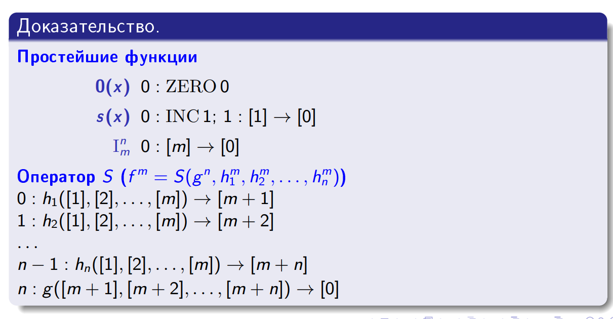
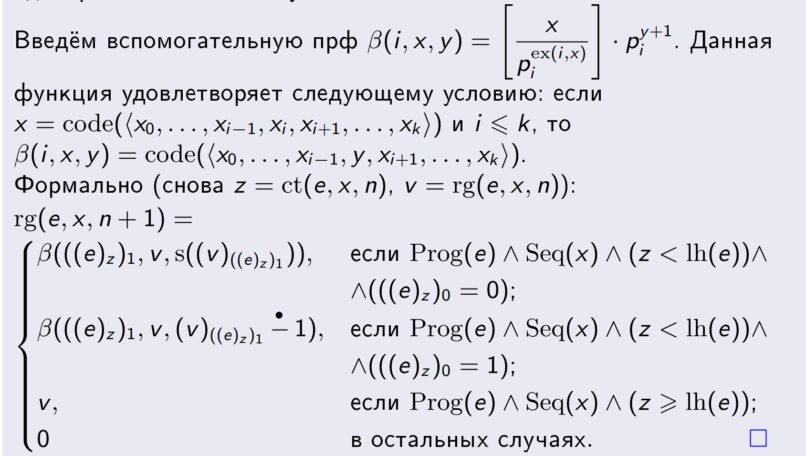

- [Инфо](#инфо)
- [Вычислимость](#вычислимость)
  - [1. Машина Шёнфилда](#1-машина-шёнфилда)
  - [2. Функции, вычислимые на МШ](#2-функции-вычислимые-на-мш)
  - [3. Операторы S, R, M; Простейшие функции](#3-операторы-s-r-m-простейшие-функции)
  - [4. ПРФ и ЧВФ](#4-прф-и-чвф)
  - [5. Вычислимые функции и множества](#5-вычислимые-функции-и-множества)
  - [6. ВПМ: эквивалентные определения](#6-впм-эквивалентные-определения)
  - [7. Теорема Поста](#7-теорема-поста)
  - [8. Замкнутость ВПМ и ВМ относительно операций](#8-замкнутость-впм-и-вм-относительно-операций)
  - [9. Примеры ПРФ и ПРМ](#9-примеры-прф-и-прм)
  - [10. Эквивалентность ЧВФ и вычислимых на Шёнфилде функций](#10-эквивалентность-чвф-и-вычислимых-на-шёнфилде-функций)
    - [От МШ к функциям](#от-мш-к-функциям)
    - [От функций к МШ](#от-функций-к-мш)
      - [Коды](#коды)
      - [Совместная рекурсия](#совместная-рекурсия)
      - [Регистры и счётчик](#регистры-и-счётчик)
      - [Ещё раз теореме об эквивалентности ЧВФ и вычислимых на Шёнфилде функций](#ещё-раз-теореме-об-эквивалентности-чвф-и-вычислимых-на-шёнфилде-функций)
  - [11. Универсальные функции для семейств](#11-универсальные-функции-для-семейств)
  - [12. Существование и несуществование универсальных функций](#12-существование-и-несуществование-универсальных-функций)
  - [13. Канторовская нумерующая функция](#13-канторовская-нумерующая-функция)
  - [14. Теорема об униформизации](#14-теорема-об-униформизации)
  - [15. Теорема о редукции](#15-теорема-о-редукции)
  - [16. Теорема о графике](#16-теорема-о-графике)
  - [17. Существование вычислимо неотделимой пары ВПМ](#17-существование-вычислимо-неотделимой-пары-впм)
  - [18. Теорема Майхилла об изоморфизме](#18-теорема-майхилла-об-изоморфизме)
  - [19. Эквивалентные определения цилиндра](#19-эквивалентные-определения-цилиндра)
  - [20. Определение простого множества](#20-определение-простого-множества)
  - [21. Определение продуктивного множества](#21-определение-продуктивного-множества)
  - [22. Полнота множеств и творческие множества](#22-полнота-множеств-и-творческие-множества)
- [Лямбды](#лямбды)
  - [1. Лямбда-термы](#1-лямбда-термы)
  - [2. Альфа- и бета-конвесрии](#2-альфа--и-бета-конвесрии)
  - [3. Теорема Чёрча-Россера](#3-теорема-чёрча-россера)
  - [4. Лямбда-исчисление](#4-лямбда-исчисление)
  - [5. Определение нормализуемого и сильно нормализуемого лямбда-термов](#5-определение-нормализуемого-и-сильно-нормализуемого-лямбда-термов)
  - [6. Типизация лямбда-терма](#6-типизация-лямбда-терма)
  - [7. Алгоритм унификации Дж. РОбинсона и Хиндли](#7-алгоритм-унификации-дж-робинсона-и-хиндли)
  - [8. Модель множеств, экстенсиональная структура представлений](#8-модель-множеств-экстенсиональная-структура-представлений)
  - [9. Бета-модель, не экстенсиональность](#9-бета-модель-не-экстенсиональность)
  - [10. Модель бета-эта-термов](#10-модель-бета-эта-термов)
  - [11. Модели Хенкина. Корректность и полнота](#11-модели-хенкина-корректность-и-полнота)
  - [12. Основная теорема об ЛП](#12-основная-теорема-об-лп)
  - [13. Омега-домены и домены](#13-омега-домены-и-домены)
  - [14. Непрерывность и омега-непрерывность](#14-непрерывность-и-омега-непрерывность)

# Инфо
*Тут их называют "конвертами"... Ну что за безвкусица?.. Ладно, не суть. В общем, сюда вставлю выжимки из [основного файла](./note.md)*

# Вычислимость
## 1. Машина Шёнфилда
Состоит из двух команд:
- `INC I` - увеличивает содержимое регистра `I` и счётчик команд на единицу
- `DEC I, n` - если содержимое регистр `I` больше нуля, уменьшает его на единицу и ставит счётчик команд на позицию `n`, иначе ничего не делает с `I`-м регистром и инкриментирует счётчик команд 

Машина Шёнфилда задаётся:
- Потенциально бесконечным множеством регистров, занумерованных натуральными числами и содержащих натуральные числа. Любая фиксированная машина Шёнфилда работает с конечным числом регистров
- Счётчик команд - особая ячейка памяти, значение которой в начальный момент времени равно нулю
- Программа - конечное множество команд, пронумерованных натуральными числами. **Шаг машины** - выполнение команды в ячейке, равной счётчику команд. Если команды с таким номером нет, программа остановится

## 2. Функции, вычислимые на МШ
**Частичная числовая функция от n аргументов будет вычислимой на машине Шёнфилда**, если в ячейках i: `1 <= i <= n` хранятся аргументы (**в остальных - нули**), а после выполнения программы P, машина завершится и в нулевой ячейке будет значение функции. Если функция не определена, машина должна работать бесконечно

Функции в машине Шёнфилда удобно использовать через макросы.

## 3. Операторы S, R, M; Простейшие функции
**Простейшие функции:**
- `0(x) = 0`
- `SUCC(x) = x + 1`
- $I_m^n(x_1, ..., x_n) = x_m$ - n, m - натуральные (целые и `>= 1`), `m <= n` - функция проекции

**Оператор суперпозиции (`S`)**. Пусть есть частичные функции такие, `h(y1, ..., yM)`, `g1(x1, ..., xN)`, ..., `gM(x1, ..., xN)` и результатом применения оператора суперпозиции к этим функциям назовём функцию `f(x1, ..., xN) = S(h, g1, ..., gM)` такую, что `f(x1, ..., xN) = h(g1(x1, ..., xN), ..., gM(x1, ..., xN))`

**Оператор примитивной рекурсии (`R`)**. Пусть есть частичные функции $h^n(\vec{x})$ и $g^{n+2}(\vec{x}, y, z)$, то результатом применения оператора примитивной рекурсии $R(h, g)$ к этим функциям назовём функции $f^{n+1}$:
$$
\begin{cases}
f(\vec{x}, 0) = h(\vec{x}) \\
f(\vec{x}, y+1) = g(\vec{x}, y, f(y, \vec{x}))
\end{cases}
$$

Примитивная рекурсия для числа $a \in \omega$ и $h(y, z)$ будет определяться проще:
$$
\begin{cases}
f(0) = a \\
f(y+1) = h(y, f(y))
\end{cases}
$$

**Оператор минимизации (`M`)** Принимает функцию $g(\vec{x}, z)$, и возвращает $f(\vec{x})$ такую, что $f(\vec{x}) = y \hArr \forall i < y$ ($g(\vec{x}, i)$ определена и не равна нулю) и $g(\vec{x}, y) = 0$. В противном случае $f$ не определена

$f(\vec{x}) = \mu y (g(\vec{x}, y) = 0)$ - так полностью записывается оператор минимизации

--- 

Функция $f(\vec{x})$ получается из всюду определённых функций $g(\vec{x}, y)$ и $h(\vec{x})$ с помощью ограниченного $\mu$-оператора, если $g(\vec{x}, y) = 0$ и значение $y \le h(\vec{x})$ и $\forall i < y : g(\vec{x}, i) \ne 0$, тогда $f(\vec{x}) = y$

Если $g(\vec{x}, y) \ne 0$ для всех $y \le h(\vec{x})$, то $f(\vec{x}) = h(\vec{x}) + 1$

Записывается ограниченное $\mu$ так:
$$
\mu y \le h(\vec{x})(g(\vec{x}, y) = 0)
$$

*Говоря по-человечески, мы ищем значение не ограниченно далеко вверх, а до какого-то значения, определяемого функцией $h(\vec{x})$. Если условие $g(\vec{x}, y) = 0$ при таких значениях не было удовлетворено, то мы результатом оператора будет $h(\vec{x}) + 1$*

Если $g, h$ - ПРФ, то ограниченная минимизация тоже вернёт ПРФ. *Доказывается через тот факт, что результат ограниченной минимизации представим через:*
$$
f(\vec{x}) = \sum_{i=0}^{h(\vec{x})} sg(\prod_{j=0}^i g(\vec{x}, j))
$$

## 4. ПРФ и ЧВФ
Частичная функция f называется **примитивно рекурсивной**, если существует последовательность таких функций $f_1, ..., f_n = f$, что каждая функция либо простейшая, либо вычислима из предыдущих операторами суперпозиции и рекурсии. Говоря иначе, класс ПРФ является замыканием класса простейших функций относительно операторов `S`, `R`. Любая ПРФ всюду определена.

Частичная функция f называется **частично вычислимой**, если существует последовательность таких функций $f_1, ..., f_n = f$, что каждая функция либо простейшая, либо вычислима из предыдущих операторами суперпозиции, рекурсии и минимизации. Говоря иначе, класс ПРФ является замыканием класса простейших функций относительно операторов `S`, `R`, `M`. ЧВФ называется просто **вычислимой**, если она всюду определена

ПРФ $\subset$ ВФ $\subset$ ЧВФ

## 5. Вычислимые функции и множества
*ВФ - всюду определённая ЧВФ (см. прошлый пункт), а тут речь пойдёт о множествах (их также справедливо называть отношениями)*

Отношение $R \in \omega^n$ называется **вычислимым (примитивно рекурсивным)**, если его характеристическая функция, равняется нулю для любой точки в множестве $R$ и единице для любой точки вне него, примитивно рекурсивна.

## 6. ВПМ: эквивалентные определения
Множество ВПМ, если оно в точности совпадает с ООФ некоторой ЧВФ

Эквивалентные утверждения:
1. $A = \delta \phi$, $\phi$ - ЧВФ
2. $\chi^*_A$ - ЧВФ
3. $A = \rho \phi$, $\phi$ - ЧВФ
4. $A = \emptyset$ или $A = \rho f$, $f$ - ВФ
5. $A$ конечно или $A = \rho f$, $f$ - инъективная ВФ
6. $A = \exist y Q(x, y)$, $Q$ - вычислимый предикат
7. Существует такая сильно вычислимая последовательность, что $\emptyset = A_0 \subseteq A_1 \subseteq A_2 \subseteq ... \subseteq A_s \subseteq A_{s+1} \subseteq \cup_s A_s = A$
8. Существует сильно вычислимая последовательность из пункта выше и дополнительно с условием $\forall s \in \omega : |A_{s+1} - A_s| \le 1$

*Док-ва (надеюсь, для критов они не нужны, но пусть будут):*
- `1 => 2` - такая ЧХФ - это буквально та самая ЧВФ из первого условия, на которую навесили $0()$
- `2 => 1` - очевидно, $\delta$ такой ЧХФ даёт нам $A$
- `2 => 3` - из такой ЧХФ легко сделать функцию $\psi(x) = x * s(\chi_A^*(x)) \rArr \rho \psi = \delta \chi_A^* = A$
- `3 => 4` - по теореме Клини, для $\psi(x)$ из прошлого пункта найдутся ПРФ $U$ и $T(x, y)$, отсюда определим:
$$
f_1(x, s) = \begin{cases}
  U(\mu y \le s . T(x, y)), \exist y \le sT(x, y) \\
  x_0, \forall y \le s!T(x, y)
\end{cases}
$$
($x_0 \in A$), отсюда определим $f(x) = f_1(l(x), r(x)) \rArr A = \rho f$
- `5 => 4` - если $A$ бесконечно, то найдётся какая-нибудь ВФ с $\rho f = A$, если $A$ конечно, то через сумму произвдений элементов на сигнумы номеров легко определить функцию с $A = \rho f$
- `4 => 5` - если $A$ бесконечно и $f$ - ВФ с $A = \rho f$, то определив вычислимую $g(x)$ выдающую наименьшие $f$-номера элементов, мы получим $f_0(x) = f(g(x))$, которая будет вычислима, инъективна и $A = \rho f_0$
- `4 => 8`:
  - Если $A = \emptyset$, то сильно вычислимая последовательность определяется тривиально с ХФМ тождественно единицей и $|A_n| = 0$
  - Если есть некая ВФ $f$ с $A = \rho f$, то отношение принадлежности легко определяется через $\exist i < n : m = f(i)$, а $\max(A_n \cup \{ 0 \}) = g(n)$, где $g(n)$ рекурсивно ищет наибольший элемент из всех множеств (хотя выглядит вообще так, будто тут рекурсия не очень нужна)
  - Если $A_0 = \emptyset$, то $\exist i < 0 : m = f(i)$ (*что это за херня?! Как у нас может быть число меньше нуля?..*)
  - $A_s \subseteq A_{s+1}$ - очевидно, что $\forall x \in A_s : x = f(i_j)$ - и те же самые индексы будут для всех тех же элементов и в $A_{s+1}$ 
  - $A_s \subseteq A$ - аналогично
  - $(A \subseteq \cup_s A_s)$ - *тут я не понял, что за дичь написана, поэтому также предлагаю сказать "в силу общих индексов в $f(i)$*
- `8 => 7` - очевидно (забавно, что тут это реально очевидно)
- `7 => 6` - $Q(x, y)$ - тот самый предикат для пар из определения сильно вычислимой последовательности
- `6 => 1` - навешиваем на $Q$ минимизацию и получаем, что $\delta$ это ЧВФ $= A$

Унарные ВПМ и k-местные преобразуются одни в другие по леммам о взаимном преобразовании унарных и k-местных функций за счёт канторовской нумерации

ВМ $\subset$ ВПМ

## 7. Теорема Поста
Пусть $A \subseteq \omega$. Тогда $A$ вычислимо $\hArr A$ и $\overline{A} = \omega \backslash A$ - ВПМ

*Доказательство:*

`=>` следует из того, что вычислимые множества также являются и ВПМ, а также ВМ замкнуты относительно операции дополнения

`<=` предположим, что $A$ и $\overline{A}$ - ВПМ, тогда будут предикаты $A = \exist y Q_0(x, y)$ и $\overline{A} = \exist y Q_1(x, y)$, где $Q_0, Q_1$ - вычислимые. Далее возьмём функцию $f(x)$, которая будет подбирать такой $y$, чтобы он удовлетворял хотя бы одному из предикатов: $f(x) = \mu y (Q_0(x, y) \vee Q_1(x, y))$ - всюду определённая ЧВФ (т.к. $A \cup \overline{A} = \omega$), тогда $x \in A \hArr Q_0(x, f(x)) \rArr \chi_A(x) = \chi_{Q_0}(x, f(x)) \rArr A$ вычислимо

## 8. Замкнутость ВПМ и ВМ относительно операций
Для двух таких отношений определяются операции объединения, пересечения, дополнения и импликации, причём если оба отношения ПР, то и отношение, полученное как результат операций, также будет ПР. *Доказывается через очень тривиально определяемые характеристические функции новых множеств (произвдение хар. функций исходных множеств для объединения и т.п.)*

Также достаточно тривиально определяется декартово произведение двух отношений. И также отношение, образованное этой операцией, будет ПР, если ПР его аргументы.

Отсюда делаем вывод, в частности, для бинарных отношений $=, \ne, <, >, \le, \ge$. В частности, для отношения равенства характеристической функцией будет $sg(|x - y|)$

Суперпозиция для отношений определяется тривиально как суперпозиция для характеристической функции

Оператор минимизации вводится для отношений через условие равенства характеристической функции нулю (aka принадлежности отношению), причём результат минимизации для ПР отношения будет ЧВФ, а для ПР отношения и ограниченной минимизации - ПРФ.

---

Операции над ВПМ
- Пересечение и декартово произведение ВПМ - тоже ВПМ (общая $\delta$ - это ООФ композиции их ЧВФ)
- Объединение ВПМ - тоже ВПМ (здесь получим общий предикат $Q$ за счёт $\vee$ между изначальными)
- Проекция ВПМ с минус одной размерностью также будет ВПМ. Доказывается за счёт уменьшения размерности предиката $Q$ при помощи канторовской k-местной нумерации
- Все предикаты $\exist <, \exist \le, \forall <, \forall \le$ - также ВПМ
- Суперпозиция над элементами ВПМ даст также ВПМ
- Отображение ВПМ при помощи ЧВФ даст ВПМ

## 9. Примеры ПРФ и ПРМ
Примитивно рекурсивными будет функции:
- `x + y`
- `x * y`
- `x^y` (`0^0 = 1`)
- `sg(x)`
- `!sg(x)`
- $x \dot{-} y$
- `|x - y|`

**Т.** Если функция $g(\vec{x}, y)$ - ЧВФ (ПРФ), то и функции
$$
f(\vec{x}, y) = \sum_{i=0}^y g(\vec{x}, i) \\
h(\vec{x}, y) = \prod_{i=0}^y g(\vec{x}, i) \\
$$
также будут ЧВФ (ПРФ). *Доказывается через тот факт, что и сумма и произведение представимы через оператор примтивной рекурсии*

Используя бинарные отношения (они все ПРМ) $=, \ne, <, >, \le, \ge$, может ещё ряд операций определить:

`x div y` - ЧВФ. Деление на ноль не опр.

Если мы используем оператор огр. минимизации, то `x div y` станет ПРФ, но при этом `x div 0 = x`

ПРФ:
1. `x mod y`: `f(x, y) = x -. (x div y)*y`
2. $y | x = \exist z \le y (z*x = y)$
3. `prime(x)` - `x` - простое число - $((x > 1) \wedge \forall y \le x (y|x \rarr (y = x) \vee (y = 1)))$
4. `p(x)` - `x`-е простое число
5. `ex(i, x)` - показатель `i`-го просто числа в разложении числа `x`

*Шатал я переписывать эти формулы, так что для них будут просто скрины:*

## 10. Эквивалентность ЧВФ и вычислимых на Шёнфилде функций
### От МШ к функциям
**Т.** Любая ЧВФ вычислима на некоторой машине Шёнфилда. *Доказывается через тот факт, что все примитивные функции и операторы S, R, M вычислимы на машине Шёнфилда:*

### От функций к МШ
*Вообще, есть вторая запись об этой теме... Да и пусть она тут тоже будет в целом, тут мы будем не определять функции на МШ, а описывать МШ при помощи функций*

#### Коды
$code(<x_0, ..., x_{k-1}>)$ - код последовательности, определяется как $code(<x_0, ..., x_{k-1}>) = p_0^{x_0+1} * ... * p_{k-1}^{x_{k-1}+1}$ и $code(<>) = 1$
- В таком случае, если $x$ - код, то $lh(x) = \mu i \le x . (ex(i, x) = 0)$ - длина последовательности
- $(x)_i = ex(i, x) - 1$ - i-я координата кода
- Множество Seq всех кодов является примитивно рекурсивным

Теперь можем определить коды команд:
- `cd(INC i) = code(<0, i>)`
- `cd(DEC i, n) = code(<1, i, n>)`
- Множество Com всех кодов команд примитивно рекурсивно (определяется тривиально через функции для кодов)

Теперь мы можем закодировать программу из $P_0, ..., P_{k-1}$ команд как $code(P) = code(<cd(P_0), ..., cd(P_{k-1})>)$
- Множество Prog всех кодов программ примитивно рекурсивно (определяется через принадлежность координаты множеству Com)

#### Совместная рекурсия
$$
f_0(\vec{x}, 0) = g_0(\vec{x}) \\ 
f_1(\vec{x}, 0) = g_1(\vec{x}) \\ 
f_0(\vec{x}, y+1) = h_0(\vec{x}, y, f_0(\vec{x}, y), f_1(\vec{x}, y)) \\ 
f_1(\vec{x}, y+1) = h_1(\vec{x}, y, f_0(\vec{x}, y), f_1(\vec{x}, y)) \\ 
$$
Если $g_0, g_1, h_0, h_1$ - ПРФ, то $f_0, f_1$ - ПРФ.

*Доказывается через тот факт, что мы можем определить функцию $F(\vec{x}, y) = code(<f_0(\vec{x}, y), f_1(\vec{x}, y)>)$, которая будет кодироваться как бы по дереву (ну не хочу я эту безумную формулу выписывать)*

#### Регистры и счётчик
Определим 2 функции, описывающими всё состояние определённой машины Шёнфилда:
- `ct(e, x, n)` - возвращает значение счётчика команд после выполнения `n` команд программы с кодом `e` и начальными данными с кодом `x` (то есть $x = code(<x_0, ..., x_{k-1}>) \rArr 0, x_0, ..., x_{k-1}, 0, ..., 0, ...$ - содержимое регистров в начальный момент времени)
- `rg(e, x, n)` - аргументы по смыслу те же - возвращает код регистров $r = code(<r0, ..., r_{e+k-1}>)$
- *Если функциям даны некорректные данные (коды не соответствуют ни одной программе (хотя не уверен, что это возможно)), то обе функции вернут ноль*
- Обе функции - ПРФ

*Последнее утверждение имеет просто монструозное доказательство, поэтому вот несколько скринов:*

*А теперь менее формально:*
- И ту, и другую функцию можно выразить через оператор совместной рекурсии, теперь надо определить `g` и `h`
- `ct` в начальный момент времени равно нулю, `rg` - код регистров вида $0, x_0, ..., x_{k-1}, 0, ..., 0, ...$
- Далее `ct` на `n`-м шаге определяется весьма тривиально через разбор всех возможных случае с разными командами (мы можем получить номер любой команды и понять, что делать, за счёт операций над кодами, которые также ПРФ)
- `rg` на `n`-м шаге также может либо увеличить какой-то регистр на единицу, либо уменьшить, либо не менять ни одного регистра, Проверяя коды, проводим нужные модификации
- Таким образом, функции `ct` и `rg` определились чрез совместную рекурсию с использованием сугубо ПРФ - **доказано**

`stop(e, x, n)` - предикат остановки программы с кодом `e` с входными данными с кодом `x` на шаге `n`. Также ПРФ

Теперь можем определить код вычисления как `y = code(<rg(e, x, 0), rg(e, x, 1), ..., rg(e, x, n)>)` - отсюда мы можем получить результат вычисления, обратившись к нулевой координате последнего элемента - обозначим функцию взятия результата как `U(y)`. Если `e, x` не удовлетворяют `stop(e, x, n)` ни для какого `n`, то код вычисления считаем неопределённым.

**Предикат Клини** $T(e, x_1, ..., x_k, y)$ говорит о том, что программа `e` с начальным кодом `x = code(<x1, ..., xk>)` придёт к коду программы `y`. ПРФ для $k \ge 1$

#### Ещё раз теореме об эквивалентности ЧВФ и вычислимых на Шёнфилде функций
Любая частичная функция, вычислимая на Шёнфилде - ЧВФ

Возьмём произвольную функцию, вычислимую на Шёнфилде и произвольные начальные данные $n_1, ..., n_k$:
- Если $f(n_1, ..., n_k)$ определена, то машина остановится. Возьмём минимальный код $y_0$, на котором это произойдёт, тогда $f(n_1, ..., n_k) = U(y_0) = U(\mu y.(T(e, n_1, ..., n_k, y)))$ - а эта функция ЧВФ
- Если $f(n_1, ..., n_k)$ не определена, то $T(e, n_1, ..., n_k, y)$ всегда ложно, а значит и $U(\mu y.(T(e, n_1, ..., n_k, y)))$ не определена

## 11. Универсальные функции для семейств
Для $k \ge 1$ местных частичных функций, собранных в семейство `S` $k + 1$ местная функция $F$ называется **универсальной для семейства `S`**, если $S = \{ \lambda x_1x_2...x_k . F(e, x_1, ..., x_k) | e \in \omega \}$. Если `S` - семейство всех частичных функций, то $F$ будет называться просто **универсальной**

*Человеческая интерпретация*: универсальной будет называться функция, которая может при подборе одного аргумента образовать любую функцию из множества

## 12. Существование и несуществование универсальных функций
Какого бы ни было $k \ge 1$, не существует универсальной ЧВФ (ПРФ) семейства всех k-местных ПРФ. *Доказывается из того факта, что в противном случае у нас существовала бы универсальная функция, обращаемая бы одновременно в $f$ и $s(f)$, что создаёт противоречие*

Какого бы ни было $k \ge 1$, не существует универсальной ЧВФ (ПРФ) семейства всех k-местных ПРФ, принимающих значения 0 или 1. *Доказывается из того факта, что в противном случае у нас существовала бы универсальная функция, обращаемая бы одновременно в $f$ и $!sg(f)$, что создаёт противоречие*

**Т.** Какого бы ни было $k \ge 1$, существует универсальная $k + 1$ местная ЧВФ для семейства всех $k$-местных ЧВФ. *Доказывается через существование $U(\mu y.T_k(e_0, x_1, ..., x_k, y))$, связанной с машинами Шёнфилда (либо просто говорим, что с точки зрения машин мы можем считать номером универсальной функции номер команды)* (с теми же словами справедливо и для функций, принимающих значения только 0 и 1)

## 13. Канторовская нумерующая функция
Канторовская нумерация определяется ПРФ $C^2(x, y) = \frac{(x + y + 1)(x + y)}{2} + x = \frac{(x + y)^2 + 3x + y}{2}$, отображает $\N^2$ в $\N$ и делает это биективно
- $l(C^2(x, y)) = x$
- $r(C^2(x, y)) = y$
- $C^2(l(x), r(x)) = x$

Рядами в поле таких чисел будут нумероваться по побочным диагоналям, начиная обход с верхнего левого угла.

Количество рядов до точки `(x, y) = x + y`

Сумма точек до ряда с точкой `(x, y) = (x + y + 1)(x + y)/2`

Основной смысл канторовской нумерации в том, что мы можем осуществлять взаимно однозначное соответствие между $\N^2$ и $\N$, что позволяет оперировать нам с парами, как обычными числами. В более общем случае мы можем взаимно отобразить $\N^n$ в $\N$, рекурсивно применяя канторовскую нумерацию к первым двум аргументам:
- $c^1(x) = x$
- $c^n(x_1, ..., x_n) = c^2(c^{n-1}(x_1, ..., x_{n-1}), x_n)$
- Тогда определена также ПРФ $c_{n,i}(c^n(x_1, ..., x_n)) = x_i$

## 14. Теорема об униформизации
Пусть $R \subseteq \omega^{n+1}$ - ВПМ, тогда найдётся $n$-местная ЧВФ $\psi$, униформизующая данный предикат, то есть выполняющая 2 условия:
- $\delta \psi = \exist y : R(x_1, ..., x_n, y)$
- $\Gamma_{\psi} \subseteq R$ (говоря иначе, $\forall <x_1, ..., x_n> \in \delta \psi : R(x_1, ..., x_n, \psi(x_1, ..., x_n))$)

*Попытка в человеческую интерпретацию:* униформизующая функция - это функция, которая позволяет понизить размерность множества на единицу в любой его точке, причём комбинация из её аргументов и значения будет принадлежать изначальному множеству

*Доказательство:*
- Для начала определим эту самую $\psi$. Если $R \subseteq \omega^{n+1}$ - ВП, то и $c^{n+1}(R) \subseteq \omega$ - ВП $\rArr c^{n+1}(R) = \exist y : Q(x, y) \rArr R = \exist y : Q(c^{n+1}(x_1, ..., x_{n+1}), y)$, тогда определим $\psi(x_1, ..., x_n) = l(\mu z . Q(c^{n+1}(x_1, ..., l(z)), r(z)))$ - ЧВФ. Теперь докажем, что она удовлетворяет условиям теоремы
- Определённость $\psi(x_1, ..., x_n)$ при $\exist y : R(x_1, ..., x_n, y)$:
  - `=>` если такая пси определена, то будет такое $z_0$, которое даст нам $y = r(z_0)$, значит $Q(c^{n+1}(x_1, ..., l(z_0)), r(z_0))$, значит $R(x_1, ..., l(z_0))$, а значит $\exist y : R(x_1, ..., x_n, y)$
  - `<=` если $\exist y : R(x_1, ..., x_n, y)$, то $Q(c^{n+1}(x_1, ..., x), y)$, если возьмём а дальше $z = c(x, y)$, а затем подберём минимальное $z_0$ для $Q(c^{n+1}(x_1, ..., l(z)), r(z))$ через минимизацию, то получим в точности $\psi$, которая, следовательно, будет определена
  - *В сущности, выглядит так, будто в обе стороны доказывается фразой "вытекает из определения $\psi$, которое тесно связано со свойством $R = \exist y : Q$*
- *Ну а тут реально доказывается за счёт существования вот этого построения*

## 15. Теорема о редукции
Какими бы ни были ВПМ $A, B$, найдутся такие ВПМ $A_0, B_0$, что:
- $A_0 \subseteq A, B_0 \subseteq B$
- $A_0 \cup B_0 = A \cup B$
- $A_0 \cap B_0 = \emptyset$

*По-человечески:* любые 2 множества могут быть заменены меньшими или равными множествами так, чтобы новые множества покрывали всю ту же область и не пресекались

*Доказательство:* возьмём множество $R = \{ A \times \{ 0 \} \} \cup \{ B \times \{ 1 \} \}$ (объединим множества в, разделив по номерам источников элементов), а затем определим униформизующую функцию $\psi$, которая по теореме об униформизации найдётся и при том её область определения будет в точности $\exist y : R(x, y) = A \cup B$, а область значений 0 и 1. Обозначим $A_0 = \psi^{-1}(0), B_0 = \psi^{-1}(1)$, тогда $A_0 \cap B_0 = \psi^{-1}(0) \cap \psi^{-1}(1) = \emptyset$, $A_0 \cup B_0 = \delta \psi = A \cup B$, ну а из факта наличия элемента в новых множествах следует (**и только в одну сторону**), что он есть в $R(x, 0)$ либо в $R(x, 1)$ только в случае его наличия в исходных множествах, а значит $A_0 \subseteq A$ и $B_0 \subseteq B$

## 16. Теорема о графике
Пусть $\psi(x_1, ..., x_k)$ - ЧФ. Она будет ЧВФ $\hArr$ $\Gamma_{\psi}$ - ВПМ

*Доказательство:*
- `=>` Пусть $\psi(x_1, ..., x_k)$ - ЧВФ, определим далее ЧВФ $\psi_1(x_1, ..., x_k) = c^{k+1}(x_1, ..., x_k, \psi(x_1, ..., x_k)) \rArr \rho \psi_1 = \rho \psi_2 = c^{k+1}(\Gamma_{\psi})$, где $\psi_2(x) = c^{k+1}(c_{k,1}(x), ..., c_{k,k}(x), \psi(c_{k,1}(x), ..., c_{k,k}(x)))$, отсюда следует, что $c^{k+1}(\Gamma_{\psi})$ - ВПМ - а значит и $\Gamma_{\psi}$ - также ВПМ
- `<=` Если у нас уже есть $\Gamma_{\psi}$ - ВПМ, то по теореме об униформизации найдётся новая k-местный униформизатор, причём ЧВФ, значение которой в силу условия будет равняться $y$, а значит $\psi$ будет равняться униформизатору, из чего следует, что она тоже ЧВФ

## 17. Существование вычислимо неотделимой пары ВПМ
Непересекающиеся ВПМ $A, B$ называются **вычислимо отделимыми** в случае, когда существует ВМ $C$ такое, что $A \subseteq C \subseteq \overline{B}$ (можно окружить одно из множеств так, чтобы граница не касалась другого множества). В противном случае будет называться **вычислимо неотделимым**. 

Неотделимая пара ВПМ существует (*например, множества значений универсальной функции для семейства унарных функций, принимающих значения 0 и 1 - в одно множество вносим все унификаторы для значения 0, в другое - для значения 1*)

## 18. Теорема Майхилла об изоморфизме
*Немного вводной части из нумераций:*

**Нумерация** - любое сюрьективное отображение натуральных чисел на непустое не более чем счётное множество $S$. Все нумерации множества обозначаются как $N(S)$

Нумерация $\nu_0$ сводится к нумерации $\nu_1$, если существует $f$ такая, что $\nu_0 = \nu_1 f$ (обозначается как $\nu_0 \le \nu_1$)

Нумерация $\nu_0$ **1-сводится** к нумерации $\nu_1$, если существует инъективная ВФ $f$ такая, что $\forall n \in \omega : \nu_0(n) = \nu_1 f(n)$ (обозначается как $\nu_0 \le_1 \nu_1$)

Нумерации $\nu_0$ и $\nu_1$ **вычислимо изоморфны**, если существует вычислимая перестановка $p$ такая, что $\forall n \in \omega : \nu_0(n) = \nu_1 p(n)$ (обозначается как $\nu_0 \approx \nu_1$)

**Т.** $\nu_0 \le_1 \nu_1 \wedge \nu_1 \le_1 \nu_0 \rArr \nu_0 \approx \nu_1$ (*собственно, почти Майхилл, но настоящий Майхилл для множеств*)

*Доказательство не буду тут приводить, ясное дело. Только совсем общую мысль - мы строим особую конструкцию множества из пар, где первые и вторые элементы уникальны по отдельности, за счёт инъективности сводящих функций делаем так, что она будет покрывать всю нумерацию, а далее просто заявляем, что это множество и представляем собой ту самую вычислимую перестановку*

---

*А теперь для множеств*

$A, B \in \omega$

$A$ **m-сводится** к $B$, если существует ВФ $f$ такая, что $x \in A \hArr f(x) \in B$. Обозначается $A \le_m B$

Если $A \le_m B$ и $B \le_m A$, то $A \equiv_m B$ (**m-эквивалентны**)

**1-сводятся** - $f$ вдобавок инъективна

**Вычислимая изморфность** *определяется аналогично через вычислимую перестановку с учётом замены записи на принадлежность множествам*

*Ну и, собственно, Майхилл:*

**Т.** Если $A \le_1 B$ и $B \le_1 A$, то $A \approx B$

## 19. Эквивалентные определения цилиндра
*Сначала о цилиндрах для нумераций*

**Цилиндром** нумерации $\nu$ называется нумерация $c(\nu) : \omega \rarr S$ для которой $c(\nu)(c(x, y)) = y$ либо, что то же самое $c(\nu)(x) = \nu(r(x))$ (*да-да! Так круто, что для обозначения изменнения нумерации используется та же буква, что и для канторовской функции...*)

Нумерация будет **цилиндрической**, если она вычислимо изоморфна своему цилиндру

**Следующие утверждения эквивалентны**:
- $\nu$ - цилиндрическая нумерация
- $\exist$ ВФ такая, что $\forall x : (f(x) > x) \wedge (\nu(f(x)) = \nu x)$
- $\forall \nu' : (\nu' \le \nu) \rarr (\nu' \le_1 \nu)$

*Доказательства:*
- `1 => 2` - из цилиндричности нумерации следует существование перестановок $p_1, p_2$ таких, что $\nu = c(\nu)p_1$ и $c(\nu) = \nu p_2$, тогда определим $f(x) = p_2(c(z, rp_1(x)))$, где $z$ будет подбираться минимизацией так, чтобы значение $f(x)$ было больше $x$. В силу того факта, что это канторовская нумерация и перестановки, такое число будет найдено, а значит $f(x)$ вычислима, в силу определения, $\nu f = \nu p_2(c(z, rp_1(x))) = c(\nu)(c(z, rp_1(x))) = \nu r p_1(x) = c(\nu) p_1(x) = \nu x$
- `2 => 3` - определим сводящую функцию $g$ и сплинтер $F$ над функцией $f$, а дполнительно ещё и рекурсивную $h$, которая при нуле будет просто возвращать все сведённые элементы, применяя к ним сплинтер. В силу такого опрделения функций и полученное из пункта 2 функции $f$, $h$ будет инъективна, из чего следует, что $\nu' \le \nu \rarr \nu' \le_1 \nu$
- `3 => 1` - просто берём $\nu'$ как $c(\nu)$, функцией для $c(\nu) \le_1 \nu$ будет $r(x)$, а для $\nu \le_1 c(\nu)$ - $\lambda x . c(0, x)$ - из чего по определению и следует цилиндрическая нумерация

**С.** Всякий цилиндр является цилиндрической нумерацией (*по второму свойству из списка выше берём $f(x) = c(s(l(x)), r(x))$ - нетрудно заметить, что её значение будет всегда больше $x$, а $c(\nu)(x) = \nu r x = c(\nu)(f(x)) = c(\nu)(c(s(l(x)), r(x))) = c(\nu)(r(x)) = \nu r x$*)

---

*А теперь о цилиндрах для множеств:*

Множество $A \subseteq \omega$ называется **цилиндром** если $A$ и $c(\omega \times D)$ вычислимо изоморфны для некоторого $D \subseteq \omega$

$A$ - **цилиндрификация** множества $B$, если $A = c(\omega \times B)$

Следующие утверждения эквивалентны:
- $A$ - цилиндр
- $\exist$ ВФ такая, что $\forall x : (f(x) > x) \wedge (x \in A \hArr f(x) \in A)$
- $\forall B : (B \le_m A) \rarr (B \le_1 A)$

## 20. Определение простого множества
Множество $A$ **иммунно**, если оно бесконечно и не содержит в качестве подмножества бесконечное ВПМ (*Забавный логичный факт - если $A$ иммунно, то оно не может быть ВПМ*)

ВПМ с иммунным дополнением называются **простыми**

Свойства иммунности и простоты инвариантны (то есть не зависят от перестановок)

## 21. Определение продуктивного множества
Множество $P$ **продуктивно**, если существует ЧВФ $\psi(x)$, называемая **продуктивной функцией** для $P$, что $\forall x : (\pi_x \subseteq P) \rArr (\psi(x) \downarrow \wedge (\psi(x) \in P \backslash \pi_x))$ (то есть $P$ включает себя и ОДЗ и ООФ некоторой функции для всех ОДЗ, входящих в него)

ВПМ $C$ **творческое**, если $\overline{C}$ продуктивно

*Пример:* $\overline{K}$ продуктивно для $\psi(x) = x$

## 22. Полнота множеств и творческие множества
ВПМ $M$ называется **m-полным**, если $\forall A$ ВПМ $: A \le_m M$

**1-полное** множество определяется аналогично

Любые 2 1-полных множества вычислимо изоморфны

ВПМ $C$ **творческое**, если $\overline{C}$ продуктивно

*Пример:* множество $K = \pi_x$ творческое, поскольку $\overline{K}$ продуктивно для $\psi(x) = x$

**Т.**
- Если $P$ - продуктивно, то $\overline{K} \le_1 P$
- Если $C$ - творческое, то оно 1-полно и в частности, $C \approx \overline{K}$ (*доказывается напрямую из первого утверждения и определения творческого множества*)

эквивалентные утверждения для продуктивных множеств:
- $P$ продуктивно
- $\overline{K} \le_1 P$
- $\overline{K} \le_m P$

эквивалентные утверждения для творческих множеств:
- $C$ твореческое
- $C$ 1-полно
- $C$ m-полно

# Лямбды
## 1. Лямбда-термы
**Лямбда-терм (выражение)** можно определить индуктивно:
1. Переменная - лямбда-терм
2. Константа сигнатуры $\sigma$ - лямбда-терм
3. Если `A`, `B` - лямбда-термы, то `(A B)` - лямбда-терм
   - `(A B)` - оператор аппликации
4. Если $A$ - лямбда-терм и $x$ - переменная, то $\lambda x.A$ - лямбда-терм
   - Операция называется абстракцией
5. Других лямбда-термов нет

## 2. Альфа- и бета-конвесрии
**Альфа-конверсия** - преобразование $\lambda x.T \rarr \lambda y.[T]^x_y$. При этом $y$ Должна быть свободна для $x$ в $T$
- $\rarr$ означает "за одни шаг переходит в ..."
- $\rArr$ означает "за конечное число шагов переходит в ..." или просто "преобразуется в ..." - рефлексивное транзитивное замыкание оператора $\rarr$

**Бета-конверсия** - преобразование $(\lambda x.T R) \rarr [T]^x_R$, при условии, что $R$ свободная для $x$ в $T$

## 3. Теорема Чёрча-Россера
Если $T \rArr R$ и $T \rArr S$, то найдётся такой терм $Q$, что $R \rArr Q$ и $S \rArr Q$. Это свойство называется **конфлюэнтностью**

*Доказательство:*
- Вводится особый вид конверсии $\rarr_1$, при которой бета-конверсия к каждому подтерму применяется не более одного раза. В силу определения для неё будут справедливы леммы:
  - Если $T \rarr_1 R$, то $T \rArr R$
  - $\rArr$ - транзитивное замыкание $\rarr_1$ и альфа-конверсии
  - Если $\lambda x . T \rarr_1 R$, то $R$ имеет вид $\lambda x . R_0$ для подходящего $R_0$
  - $(T R) \rarr_1 S$, то $S = (Q V)$, где либо $T \rarr_1 Q$ и $R \rarr_1 V$, либо $T = \lambda x . Q$, тогда $S = [Q_1]^x_{R_1}$ где $T \rarr_1 Q_1$ и $R \rarr R_1$
  - Если $T \rarr_1 R$ и $S \rarr_1 Q$, то $[T]^x_S \rarr_1 [T]^x_Q$ (при соблюдении свободности, разумеется. *Доказывается индукцией по построению*)
  - $\rarr_1$ обладает свойством конфлюэнтности (*Доказывается также индукцией с применением прошлых лемм*)
- А тперь мы просто говорим, что бета-конверсия - транзитивное замыкание $\rarr_1$, которое инфлюэнтно, а значит и $\rArr$ конфлюэнтно

## 4. Лямбда-исчисление
**Лямбда-исчисление** или **комбинаторная логика** - набор конверсий и равенств, соответствующих одному и тому же выражению:
- $t = t$
- Альфа-конверсия
- Бета-конверсия
- $$\frac{t = u}{u = t}$$
- $$\frac{t = u ; u = r}{t = r}$$
- $$\frac{t = u}{tr = ur}$$
- $$\frac{t = u}{rt = ru}$$
- $$\frac{t = u}{\lambda x . t = \lambda x . u}$$

Формула $t = u$ выводима в комбинаторной логике $\hArr$ существует такой терм $v$, что $t \rArr v \wedge u \rArr v$

## 5. Определение нормализуемого и сильно нормализуемого лямбда-термов
**Нормальная форма лямбда-терма** - лямбда-терм, если к любому его подтерму или результату альфа-конверсии над ним не применима бета-конверсия.

**Нормальзуемый** терм - терм, приводящийся к нормальному за конечное число конверсий

Для термов $M_1 \rArr^1_{\beta} M_2$ означает, что существует такой терм с дырой $T$, что $M_1 = T[R_1]$ и $M_2 = T[R_2]$, где $R_1 \rarr_{\beta} R_2$. Если $M_1 \rArr^1_{\beta} M_2$, то $M_1 \rArr M_2$

Обозначение $M_1 \rArr^n_{\beta} M_2$ означает, что существуют такие $n+1$ термов $N_i$, что $N_i \rArr^1_{\beta} N_{i+1}$, $M_1 = N_0$, $M_2 = N_n$

**Бета-ранг терма** $M$: будем считать, что $rk_{\beta}(M) \ge n$, если:
- $n = 0$: $M$ - любой терм
- $0 < n < \omega$: $\exist M' : M \rArr^n_{\beta} M'$
- $n = \omega$: существует (*бесконечная счётная?*) последовательность $M_i$: $M_i \rArr^1_{\beta} M_{i+1}$

Соответственно, равеным $n$ ранг будет, если $rk_{\beta}(M) \ge n \wedge rk_{\beta}(M) < n + 1$

**Нормальный терм имеет нулевой ранг**

Лямбда-терм **сильно нормализуем**, если его бета-ранг меньше $\omega$

Любой сильно нормализуемый лямбда-терм нормализуем (*доказывается от противного (а я бы и вовсе сказал, что в силу определния ранга мы можем заявить, что терм с рангом меньше бесконечности допускает лишь конечное число бета-конверсий, что и доказывает его нормализуемость)*)

## 6. Типизация лямбда-терма
Каждому лямбда-терму приписывается тип, это накладывает ограничения.

Предполагаем, что есть набор базовых типов

Можем строить составные типы по $\tau_0$ и $\tau_1$, обозначая тип как $(\tau_0 \rarr \tau_1)$ - называется классом всех отображений из $\tau_0$ в $\tau_1$

**Типом** будет любой базовый тип, а также составной тип, состоящий из типов

$x : \tau$ - $x$ имеет тип $\tau$. Сопоставление типа переменной будет называться **типизирование**

Как задать тип терму:
1. Нужно задать типы всех переменных и констант
2. Если $M : \pi \rarr \tau$ и $N : \pi$, то $(M \space N) : \tau$
3. Если $M : \tau$ и $x : \pi$, то $\lambda x . M : \pi \rarr \tau$

Лямбда-терм типизируемый, если его переменным можно приписать типы так, чтобы сам терм тоже получил тип

Какова бы ни была типизация переменных, терм может получить не более одного типа (*доказывается индукцией*)

Тип терма не меняется от конверсий.

## 7. Алгоритм унификации Дж. РОбинсона и Хиндли
*Немного базы про унификацию:*

**Типовые переменные** - простейшие типы

Подстановка типов пишется как $\sigma[\alpha_1 / \rho_1, ..., \alpha_n / \rho_n]$, где $\alpha_i$ - различные типовые переменные, $\rho_i$ - произвольные типы, $\sigma$ - преобразуемый тип. $S = \sigma[\alpha_1 / \rho_1, ..., \alpha_n / \rho_n]$. Остаётся добавить лишь одно правило $(\alpha \rarr \beta)S = (\alpha S \rarr \beta S)$ (*ну и, разумеется, не затронутые подстановкой типы остаются неизменными*)

Равенство $\sigma = \tau$ имеет **унификатор**, если существует подстановка $S$ такая, что $\sigma S \equiv \tau S$. $S$ - собственно, **унификатор**

$S$ - **наиболее общий унификатор (НОУ)**, если $S$ унификатор для $\sigma, \tau$ и для любого другого их унификатора $S'$ найдётся такой унификатор $T$, что $\sigma S' \equiv \sigma S T$ и $\tau S' \equiv \tau S T$

Если один тип содержит другой, то у них не будет унификатора

---

*Робинсон:*

Для типов строится древо, листы которого помечаются (собственно, типами):
- Типовая переменная - лист
- Если тип $(\alpha \rarr \beta)$, то будет 2 поддерева по таким же правилам

Сам алгоритм:
- Строим деревья для обоих типов
- Начинам параллельный левосторонний обход в глубину
- Если дошли для вершин, из которых хотя бы одна помечена, то смотрим, нет ли помеченной тем же типом вершины во втором поддереве (очевидно, всё второе поддерево также может быть вершиной):
  - Если есть, унификация невозможна
  - В ином случае добавляем к унификатору замену типа из помеченной вершины на тип второго поддерева
- Когда различий в деревьях не осталось, можно заявить, что унификатор построен

**Т.** Алгоритм Робинсона позволяет определить, имеет ли выражение $\sigma = \tau$ унификатор. Если унификатор имеется, то алгоритм выдаст наиболее общий унификатор

*Доказательство:*
- `=>` Алгоритм конечен в силу конечности типов, а значит если алгоритм дошёл до конца, равенство унифицируемо
- `<=` Если равенство унифицируемо, то докажем индукцией, что на любом шаге у нас будет унификатор, который можно получить из НОУ
  - То есть у нас имеется некий промежуточный унификатор $S'$, а строить мы будем $T_i$
  - $T_0 = S'$
  - Если на `i + 1` шаге возможно добавление подстановки к $S_i$, то та же подстановка будет выниматься из $T_i$, а значит, в силу базы индукции и того, что $S_iT_i = S'$, получаем $S_{i+1}T_{i+1}$
- В силу построения, заключаем, что финальное $S_n$ будет НОУ

---

*Хиндли:*

Система равенств $\sigma_1 = \tau_1, ..., \sigma_n = \tau_n$ **унифицируема**, если существует подстановка, унифицирующая все равенства в ней

Проблема унификации системы сводится к проблеме унификации $\sigma = (...(\sigma_1 \rarr \sigma_2) \rArr ... \rArr \sigma_n)$ и $\tau = (...(\tau_1 \rarr \tau_2) \rArr ... \rArr \tau_n)$

$\sigma$ - **наиболее общий тип (НОТ)** терма $M$ с типами переменных $T$, если $T \vdash M : \sigma$ и для любого другого типа $\sigma'$ с типизацией переменных $T'$ такого, что $T' \vdash M : \sigma'$ найдётся подстановка $S$ такая, что $\sigma' = \sigma S$. Определяется НОТ по построению:
- Если $M \equiv x$ - терм-переменная, то $((x : \sigma) \vdash x) : \sigma$ ($\sigma$ - НОТ)
- Если $M \equiv \lambda x . P$ и $T \vdash P : \tau$ - НОТ, то $((T \backslash \{ x : \sigma \}) \vdash \lambda x . P) : (\sigma \rarr \tau)$ - НОТ (*если в $T$ нет типа для $x$, то, очевидно, вычитать его не надо*)
- Если $M \equiv (P Q)$ и $T_1 \vdash P : \sigma_1$, $T_2 \vdash Q : \sigma_2$, то производим переименование типов так, чтобы в сигмах были разные типы, а затем ищем унификатор для системы:
  - $$\begin{cases} \sigma_1 = (\sigma_2 \rarr \tau) \\ \alpha_i = \beta_i \\ ... \end{cases}$$
  - $\alpha_i = \beta_i$ нужны для тех случаев, когда у нас общая переменная в $P$ и $Q$ (**не путать с общими типами, от которых мы избавились в начале**)
  - Если система унифицируемая НОУ $S$, то $((T_1 S \cup T_2 S) \vdash M) : \tau S$

Это и есть алгоритм Хиндли

**Т.** Алгоритм Хиндли выдаёт наиболее общий тип, если терм типизируем (*доказывается очень похоже на алгоритм Робинсона*)

*Вариант очень душный и подробный. Сам Пузырь на консультации говорил, что Хиндли - это по факту Робинсон для систем, а главное его отличие в действии при аппликации*

## 8. Модель множеств, экстенсиональная структура представлений
$\Sigma$ - множество всех типов, построенных из атомарных типов. Лямбда-термы (в частности, переменные) рассматриваются как априори типизированные. $A \rarr B$ - множество всех функций, действующих из $A$ в $B$

Для атомарных типов фиксируем множества $D_{\sigma}$:
- $D_{\tau \rarr \sigma} = D_{\tau} \rarr D_{\sigma}$
- $D_{\alpha \rarr (\beta \rarr \gamma)} = (D_{\alpha} \times D_{\beta}) \rarr D_{\gamma}$

**Означивание переменной** $x : \sigma$ - Отображение $\delta : x \rarr D_{\sigma}$

$$
\delta[y^{\tau} \rarr a](x^{\sigma}) = \begin{cases}
  \delta(x^{\sigma}), x^{\sigma} \not{\equiv} y^{\tau} \\
  a, x^{\sigma} \equiv y^{\tau}
\end{cases}
$$
Я бы назвал это операцию... *Присваиванием?*

При помощи означивания $\delta$ мы можем провести **интерпретацию** терма $M$, определеяемую индуктивно:
- $[[x^{\sigma}]]_{\delta} = \delta(x) \in D_{\sigma}$
- Если $M : \tau \rarr \sigma$ и $N : \tau$, также уже заданы $[[M]]_{\delta} \in D_{\tau \rarr \sigma}$ и $[[N]]_{\delta} \in D_{\tau}$, то $[[(M N)]]_{\delta} = [[M]]_{\delta}([[N]]_{\delta}) \in D_{\sigma}$
- Если $M : \sigma$ и уже задано $[[M]]_{\delta} \in D_{\sigma}$, то $[[\lambda x^{\tau}. M]]_{\delta} = (((a \in D_{\tau}) \rarr [[M]]_{\delta[x^{\tau} \rarr a]}) : D_{\tau} \rarr D_{\sigma}) \in D_{\tau \rarr \sigma}$

Интерпретация завсит **толкьо от типов свободных переменных**. Таким образом, если свободных переменных нет, можно писать $[[M]]$

- Сопоставим каждому типу $\sigma$ множество $A_{\sigma}$
- Каждой паре типов $\sigma, \tau$ отображение $app_{\sigma, \tau} : (A_{\sigma \rarr \tau} \rarr (A_{\sigma} \rarr A_{\tau}))$

Пара $\Alpha = (A_{\sigma}, app_{\sigma, \tau})$ называется **структурой представлений**. Если отображение $app$ к тому же инъективно для всех $\sigma, \tau \in \Sigma$, то это будет **экстенисональная структура**, то есть 2 различных элемента $f, g \in A_{\sigma \rarr \tau}$ будут кодировать разные функции $A_{\sigma} \rarr A_{\tau}$

**Моделью множеств** будет структура, в которой $app_{\sigma, \tau}$ - тождественное отображение

## 9. Бета-модель, не экстенсиональность
Для терма $M$ типа $\sigma$ будем обозначать через $<M>$ класс бета-эквивалентностей тпизированных термов $M'$, который также содержит и сам $M$. Обозначим $T_{\sigma} = \{ <M> \}$

Если $<M> \in T_{\tau \rarr \sigma}$ и $<N> \in T_{\tau}$, то $<N> \rarr <MN> : T_{\tau \rarr \sigma}$ - это отображение будет определять $app_{\tau, \sigma} : T_{\tau \rarr \sigma} \rarr (T_{\tau} \rarr T_{\sigma})$. 

Таким образом, $(T_{\sigma}, app_{\sigma, \tau})$ Будет называться **бета-моделью** термов

Бета-модель **не экстенсиональна**. Пример:
- $Q_1 = y^{\sigma \rarr \tau}$
- $Q_1 = \lambda x^{\sigma}. (y^{\sigma \rarr \tau} x^{\sigma})$
- Для какого либо $P \in T_{\sigma}$ получим, что:
  - $app_{\sigma, \tau}(<Q_1>)(
) = <(y^{\sigma \rarr \tau} P)>$
  - $app_{\sigma, \tau}(<Q_2>)(
) = <(y^{\sigma \rarr \tau} P)>$
- **Не инъективно**

## 10. Модель бета-эта-термов
$\lambda x.(Px) \rArr_{\eta} P$, при условии, что $x$ не входит свободно в $P$

Терм $E = \lambda x. \lambda y. (x y) \rArr_{\eta} \lambda x. x \equiv I$ - примечательно, что оба терма изначально в нормальной форме (в силу её определения через возможность бета-конверсий), поэтому $E \ne I$, хотя их действие на 2 аргумента будет идентичным

**$\eta$-нормальная форма** терма - форма, в которой больше нельзя применить эта-редукцию. Каждый терм за конечное число эта-редукций приводится к эта-нормальной форме (*в силу того, что по определнию этот тип редукции сокращает выражение, избавляясь от асбтракций безвозвратно*)

Конечное число применений $\beta, \eta$ редукций будем записывать как $M \rArr_{\beta\eta} N$. Это отношение рефлексивно и транзитивно, а также замкнуто относительно контекста и подстановок

Отношение $\beta\eta$-редукции конфлюэнтно (смотри про конфлюэнтность в [основном топике про теорему Чёрча-Россера](#теорема-чёрча-россера))

Терм в **$\beta\eta$-нормальной форме**, если он одновременно в эта-нормальной форме и в простой нормальной форме. (*очевидно, если терм приводится к норфмальной форме, то он приводится и к бета-эта, верно и обратное*)

Термы $M, N$ будут **$\beta\eta$-эквивалентны** ($M \approxeq_{\beta\eta} N$), если найдётся такой терм $P$, что $M \rArr_{\beta\eta} P \wedge N \rArr_{\beta\eta} P$. Несколько дополнительных утверждений без доказательства из-за их очевидности:
- Каждый класс бета-эта-эквивалентности состоит из нескольких классов равенства, потому что $M = N$ влечёт $M \approxeq_{\beta\eta} N$
- $x \not{\in} (FV(M) \cup FV(N)) \wedge (M x) \approxeq_{\beta\eta} (N x) \rArr M \approxeq_{\beta\eta} N$
- $FV(P) \cap (FV(M) \cup FV(N)) = \empty \wedge (M P) \approxeq_{\beta\eta} (N P) \rArr M \approxeq_{\beta\eta} N$

Возьмём для $M$ класс бета-эта-эквивалентности $<M>_{\beta\eta}$, $S_{\sigma}$ множество классов типа $\sigma$

Тогда $S = (S_{\sigma}, app_{\sigma, \tau})_{\sigma, \tau \in \Sigma}$ будет называться **моделью $\beta\eta$-термов**. В отличие от бета-модели, она будет экстенсиональна в силу свойств бета-эта-эквивалентности

## 11. Модели Хенкина. Корректность и полнота
Как мы задавали интерпретацию типов $[[]]_{\delta} \in D_{\sigma}$, зададим теперь интерпретацию для компонентов экстенсиональной структуры представлений $(A_{\sigma}, app_{\sigma, \tau})$. Также индукцией по построению (считая, что $\delta(x^{\sigma}) \in A_{\sigma}$):
- $[[x^{\sigma}]]_{\delta} = \delta(x)$
- Для термов $P : (\sigma \rarr \tau), Q : \sigma$, для которых уже заданы интерпретации $[[P]]_{\delta} \in A_{\sigma \rarr \tau}, [[Q]]_{\delta} \in A_{\sigma}$, то полагаем $[[PQ]]_{\delta} = app([[P]]_{\delta})([[Q]]_{\delta}) \in A_{\tau}$
- Для терма $Q : \tau$ с $[[Q]]_{\delta} \in A_{\tau}$ полагаем, что $[[\lambda x^{\tau} Q]]_{\delta}' = (a \rarr [[Q]]_{\delta[x^{\sigma} \rarr a]}) : (A_{\sigma} \rarr A_{\tau})$, однако нам нужно определить $A_{\sigma \rarr \tau}$, поэтому любая функция вида $a \rarr [[Q]]_{\delta[x^{\sigma} \rarr a]}$ должна дополнительно удовлетворять условию попадания в образ отображения $app$ (**условие `H`**), тогда мы можем наконец заявить, что $[[\lambda x^{\sigma} . Q]]_{\delta} = app^{-1}([[\lambda x^{\tau} Q]]_{\delta}')$

Экстенсиональную структуру, удовлетворяющую `H`, назовём **моделью Хенкина**

Модель множеств является моделью Хенкина, а вот для бета-эта-модели требуется доказательство.

Для этого возьмём бета-эта-модель $(S_{\sigma}, app_{\sigma, \tau})$, а также определим означивание $\delta$, которое каждой пермеменной будет сопоставлять некоторы класс бета-эта-эквивалентности подходящего терма, то есть $\delta(x^{\sigma}) = <r(x^{\sigma})>_{\beta\eta}$, теперь можем определить интерпретацию $M[r] = [M]^{x_1^{\sigma_1}, ...,x_n^{\sigma_n}}_{r(x_1^{\sigma_1}), ..., r(x_n^{\sigma_n})}$

А теперь заявляем, что бета-эта-модель будет моделью Хенкина такой, что $\forall M : [[M]]_{\delta} = <M[r]>_{\beta\eta}$. Доказываться это будет индукцией по построению (*есть вообще в лямбдах хоть что-то, что доказывается не индукцией???*)
- $M \equiv x^{\sigma}$: $[[x^{\sigma}]]_{\delta} = \delta(x^{\sigma}) = <r(x^{\sigma})>_{\beta\eta} = <[x^{\sigma}]^{x^{\sigma}}_{r(x^{\sigma})}>_{\beta\eta}$
- $M \equiv (PQ)$, $P : \sigma \rarr \tau, Q : \sigma$: $[[(PQ)]]_{\delta} = app([[P]]_{\delta})([[Q]]_{\delta}) = <(P[r]Q[r])>_{\beta\eta} = <(PQ)[r]>_{\beta\eta}$
- $M \equiv \lambda x^{\sigma}. Q$, $Q : \tau$, а также возьмём все термы $N : \sigma$. Тогда $[[Q]]_{\delta[x^{\sigma} \rarr N]} = <Q[r[x^{\sigma} \rarr N]]>_{\beta\eta} = <M[r]N>_{\beta\eta} = app(<M[r]>)(<N>)$, отсюда заключаем, что $<N>_{\beta\eta} \rarr [[Q]]_{\delta[x^{\sigma} \rarr N]}$ лежит в образе $app$, а значит $[[\lambda x^{\sigma}. Q]]_{\delta} = <M[r]>_{\beta\eta}$

---

Модель Хенкина будет **корректной**, если из $M \approxeq_{\beta\eta} N$ следует $[[M]]_{\delta} = [[N]]_{\delta}$ для любого означивания

*Аксиомы лямбда-бета-эта-исчисления представляют собой всё те же альфа- и бета-конверсии, эта-редукцию, эквивалентность + [формулы вывода](#лямбда-исчисление) с той лишь разницей, что добавляется обозначение типов у иксов в $\lambda x.$*

**Т. О корректности:** Все модели Хенкина в лямбда-бета-эта-исчислении корректны

*Доказательество:*
- Все правила вывода и свойство эквивалентности проверяются из определения модели и модели Хенкина в частности, так что отедльно остановимся лишь на альфе, бете и эте
- $\eta$: Хитро манипулируем с отображением $app$: $[[\lambda x^{\sigma} . (M x)]]_{\delta} = app^{-1}(a \rarr [[(M x)]]_{\delta[x^{\sigma} \rarr a]}) = app^{-1}(a \rarr app([[M]]_{\delta})([[x]]_{\delta[x^{\sigma} \rarr a]})) = app^{-1}(app([[M]]_{\delta})) = [[M]]_{\delta}$ (*последний переход мне мало понятен, но пусть он тут остаётся*)
  - **Доп. лемма**: если $N$ свободен для $x$ в $M$, то $[[[M]^x_N]]_{\delta} = [[M]]_{\delta[x^{\sigma} \rarr [[N]]_{\delta}]}$
- $\alpha$: $[[\lambda y^{\sigma} [M]^x_y]]_{\delta} = app^{-1}(a \rarr [[M]]_{\delta[y \rarr a][x \rarr a]}) = app^{-1}(a \rarr [[M]]_{\delta[x \rarr a]}) = [[\lambda x^{\sigma}. M]]_{\delta}$
- $\beta$: $[[(\lambda x^{\sigma}. MN)]]_{\delta} = app([[\lambda x^{\sigma}. M]]_{\delta})([[N]]_{\delta}) = app(app^{-1}(a \rarr [[M]]_{\delta[x \rarr a]}))([[N]]_{\delta}) = (a \rarr [[M]]_{\delta[x \rarr a]})([[N]]_{\delta}) = [[M^x_N]]_{\delta}$

---

Модель Хенкина называется **полной**, если из $[[M]]_{\delta} = [[N]]_{\delta}$ для любого означивания следует $M \approxeq_{\beta\eta} N$

**Т. О полноте:**
- Модель $\beta\eta$-термов полна
- Если в модели множеств каждый атомарный тип интерпретируется бесконечным множеством, тогда эта модель полна

*Доказательство:*
- *Почему-то только первого пункта...* Если $[[M]]_{\delta} = [[N]]_{\delta}$, то для любого означивания будет справедливо, что $<M[r]>_{\beta\eta} = <N[r]>_{\beta\eta}$ (при условии, разумеется, что $\delta(x^{\sigma}) = <r(x^{\sigma})>_{\beta\eta}$ для любого входящего в $M, N$ икса). Если при этом возьмём $r(x) = x$, то получим, что $M[r] = M, N[r] = N \rArr <M>_{\beta\eta} = <N>_{\beta\eta} \rArr M \approxeq_{\beta\eta} N$

## 12. Основная теорема об ЛП
Будем работать с моделью Хенкина $\Alpha = (D_{\sigma}, app_{\sigma, \tau})$, вместо $app_{\sigma, \tau}(f)$ будем писать $\^f$

**Логический предикат (ЛП)** на $\Alpha$ - семейство $\R = \{ R_{\sigma} \}$ подмножеств $R_{\sigma} \subseteq D_{\sigma}$, где:
- Для каждого атомарного типа $\sigma$ множество $R_{\alpha}$ - произвольное фиксированное подмножество $D_{\alpha}$
- $R_{\sigma \rarr \tau} = \{ f | f \in D_{\sigma \rarr \tau} \wedge (\forall a \in R_{\sigma} : \^f(a) \in R_{\tau}) \}$ или, говоря проще, $f \in R_{\sigma \rarr \tau} \hArr \^f(R_{\sigma}) \subseteq R_{\tau}$

**Основная теореме о ЛП:** если $\R$ - ЛП на модели Хенкина, то $[[M]] \in R_{\sigma}$ для любого замкнутого терма $M : \sigma$

## 13. Омега-домены и домены
УМ $(D, \le)$ называется **$\omega$-доменом**, если оно имеет наименьший элемент $\perp$ и любая $\omega$-цепь элементов из $D$ имеет точную верхнюю грань в $D$

УМ $(D, \le)$ называется **доменом**, если оно имеет наименьший элемент $\perp$ и любая любое направленное подмножество из $D$ имеет точную верхнюю грань в $D$ (*вообще, немного непонятно, зачем тут говорить про направленность, ведь цепь по определению тоже направленное УМ (хах, на следующей странице и сказали, что можно заменить на любую цепь)*)

- Любой домен является омега-доменом
- Плоский домен является доменом
- $\omega \cup \{ \perp \}$ - $\omega$-домен
- Любое конечное УМ с наименьшим элементом - домен

## 14. Непрерывность и омега-непрерывность
Для УМ $(D, \le_1), (E, \le_2)$:
- $f: D \rarr E$ **монотонна**, если $\forall a, b \in D : a \le_1 b \rArr f(a) \le_2 f(b)$
- Если УМ - омега-домены, а функция монотонна и точная верхняя грань любой омега-цепи $D$ отображаются функцией в точные грани цепей из $E$, то функция **омега-непрерывна** (для простых доменов почти также с учётом той разницы, что там у нас простые цепи, ну и свойство называется просто **непрерывностью**)