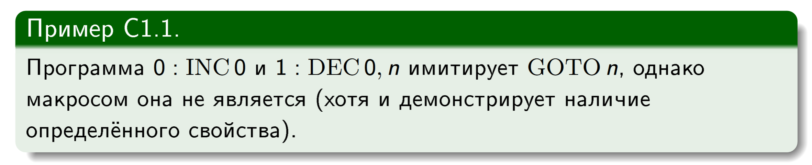
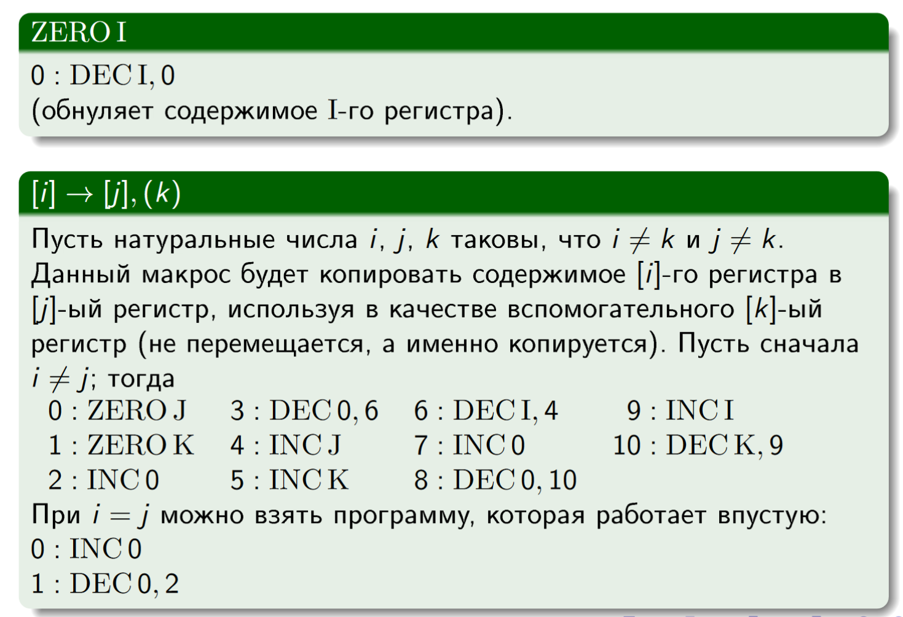
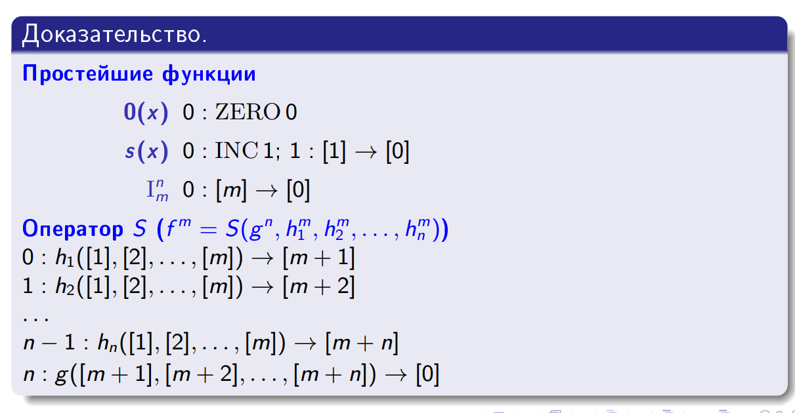
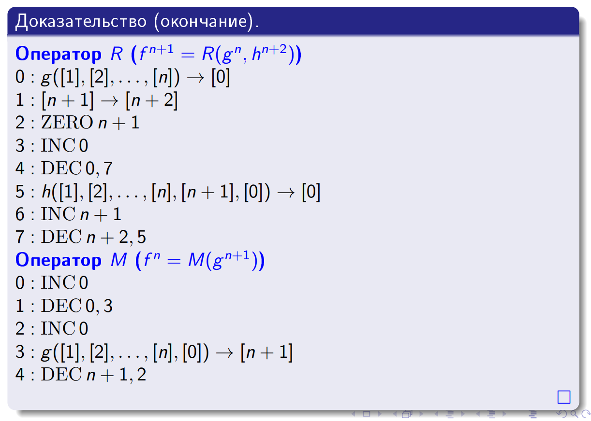
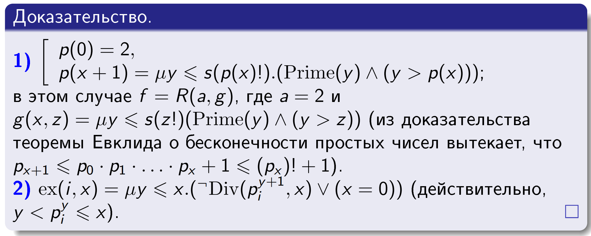
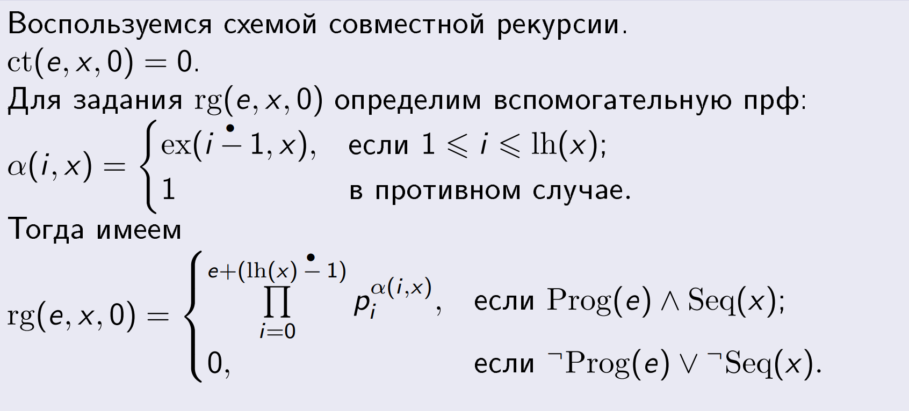
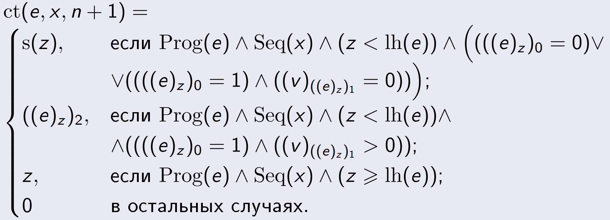
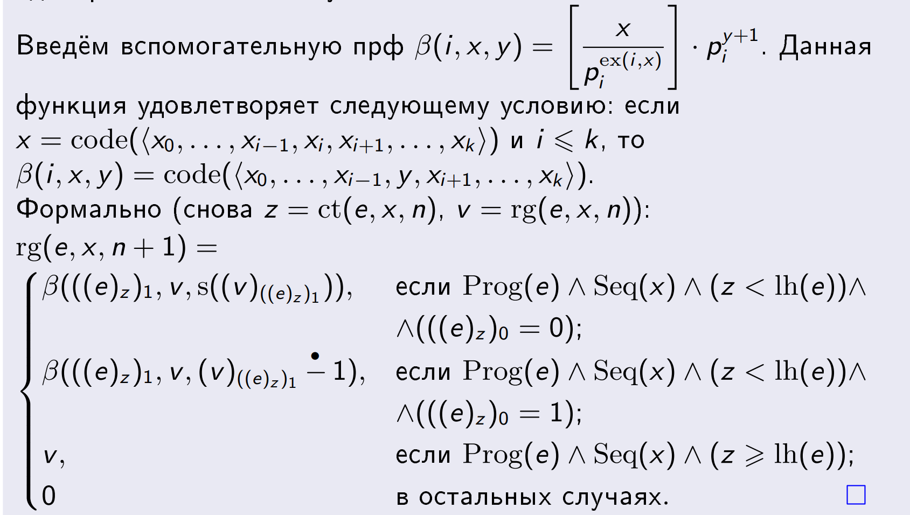
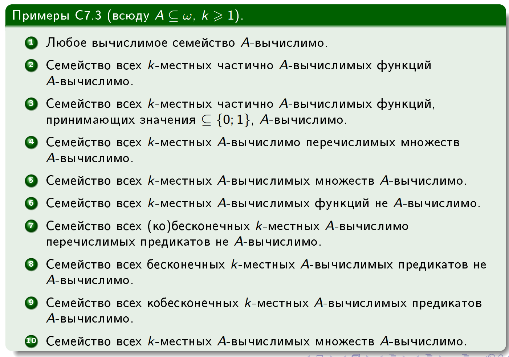
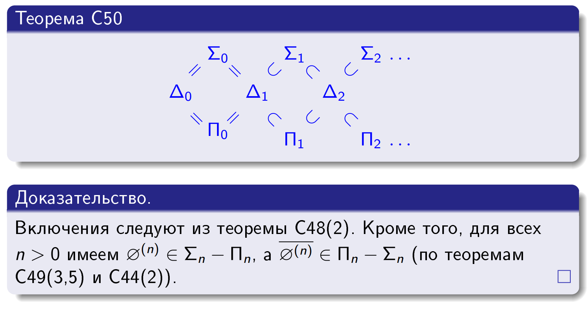

- [Инфо](#инфо)
- [Пометки с консультации](#пометки-с-консультации)
- [Машина Шёнфилда](#машина-шёнфилда)
- [Вчислимые на машине Шёнфилда функции](#вчислимые-на-машине-шёнфилда-функции)
- [Простейшие функции и операторы S, R, M](#простейшие-функции-и-операторы-s-r-m)
- [ПРФ и ЧВФ](#прф-и-чвф)
  - [Эквивалентность ЧВФ и вычислимых на Шёнфилде функций](#эквивалентность-чвф-и-вычислимых-на-шёнфилде-функций)
- [Ограниченная минимизация](#ограниченная-минимизация)
- [Примитивно рекурсивные отношения](#примитивно-рекурсивные-отношения)
- [Функции на машинах Шёнфилда](#функции-на-машинах-шёнфилда)
  - [Коды](#коды)
  - [Совместная рекурсия](#совместная-рекурсия)
  - [Регистры и счётчик](#регистры-и-счётчик)
  - [Ещё раз теореме об эквивалентности ЧВФ и вычислимых на Шёнфилде функций](#ещё-раз-теореме-об-эквивалентности-чвф-и-вычислимых-на-шёнфилде-функций)
- [Универсальная функция](#универсальная-функция)
- [Нумерация Кантора](#нумерация-кантора)
- [НЕвычислимые функции](#невычислимые-функции)
- [Множества](#множества)
  - [Сильно вычислимые множества](#сильно-вычислимые-множества)
  - [Вычислимо перечислимые множества](#вычислимо-перечислимые-множества)
  - [Теорема Поста](#теорема-поста)
  - [Теорема об униформизации](#теорема-об-униформизации)
  - [Теорема о редукции](#теорема-о-редукции)
  - [Теорема о графике](#теорема-о-графике)
  - [Универсальные предикаты](#универсальные-предикаты)
  - [Теорема Мучника](#теорема-мучника)
- [Универсальный язык](#универсальный-язык)
  - [Вычислимо отделимые и неотделимые множества](#вычислимо-отделимые-и-неотделимые-множества)
- [Нумерация](#нумерация)
- [Полурешётка (*а это вообще надо?..*)](#полурешётка-а-это-вообще-надо)
- [1-сводимость](#1-сводимость)
- [Цилиндры](#цилиндры)
  - [Эквивалентные утверждения для цилиндрических нумераций](#эквивалентные-утверждения-для-цилиндрических-нумераций)
- [Сводимости для множеств](#сводимости-для-множеств)
  - [Цилиндры для множеств](#цилиндры-для-множеств)
  - [Теорема Майхилла](#теорема-майхилла)
  - [Эквивалентные определения цилиндров](#эквивалентные-определения-цилиндров)
- [Инвариантность](#инвариантность)
- [Простые множества](#простые-множества)
  - [Теорема о существовании простого множества](#теорема-о-существовании-простого-множества)
- [Полные множества](#полные-множества)
- [Семейства множеств и вычислимость нумераций](#семейства-множеств-и-вычислимость-нумераций)
  - [Теорема о невычислимости семейства всех бесконечных вычислимых множеств](#теорема-о-невычислимости-семейства-всех-бесконечных-вычислимых-множеств)
  - [Главная нумерация](#главная-нумерация)
  - [Теорема о главной вычислимой нумерации n-арных ЧВФ](#теорема-о-главной-вычислимой-нумерации-n-арных-чвф)
  - [S-M-N теорема и теорема Клини о неподвижной точке](#s-m-n-теорема-и-теорема-клини-о-неподвижной-точке)
- [Постовская нумерация](#постовская-нумерация)
- [Индексные множества](#индексные-множества)
  - [Теорема Райса](#теорема-райса)
  - [Виды индексных множеств](#виды-индексных-множеств)
    - [Равномерные переходы между сильными, слабыми, вычислимыми и хараткеристическими индексами](#равномерные-переходы-между-сильными-слабыми-вычислимыми-и-хараткеристическими-индексами)
    - [Неподвижная точка для постовской нумерации](#неподвижная-точка-для-постовской-нумерации)
    - [Теорема Райса (*но теперь с док-вом*)](#теорема-райса-но-теперь-с-док-вом)
  - [Теорема Райса-Шапиро](#теорема-райса-шапиро)
- [Продуктивные и творческие множества](#продуктивные-и-творческие-множества)
  - [1-полнота](#1-полнота)
    - [Множество твореское если и только если оно 1-полно](#множество-твореское-если-и-только-если-оно-1-полно)
- [Тьюринговая вычислимость](#тьюринговая-вычислимость)
  - [Оракул A](#оракул-a)
    - [А-полнота](#а-полнота)
  - [Строки](#строки)
    - [ГЛАВНАЯ ТЕОРЕМА О ПЕРЕЧИСЛЕНИИ](#главная-теорема-о-перечислении)
    - [КРАСНАЯ ТЕОРЕМА](#красная-теорема)
  - [Ещё немного определений по оракулам](#ещё-немного-определений-по-оракулам)
    - [Скачок и теорема о нём](#скачок-и-теорема-о-нём)
    - [Модуль](#модуль)
      - [Лемма о модуле](#лемма-о-модуле)
      - [Лемма о пределе](#лемма-о-пределе)
- [Иерархия](#иерархия)
  - [Теорема об иерархии](#теорема-об-иерархии)
  - [Теорема Поста об иерархии (хз, какая из двух теорем ожидается в билете)](#теорема-поста-об-иерархии-хз-какая-из-двух-теорем-ожидается-в-билете)
- [Полные пары](#полные-пары)
- [Теорема Фридберга](#теорема-фридберга)
- [Критерий полноты Фридберга](#критерий-полноты-фридберга)
- [Теорема Клини-Поста-Спектора](#теорема-клини-поста-спектора)
- [Машины Тьюринга](#машины-тьюринга)
- [Нетипизированное лямбда-исчисление](#нетипизированное-лямбда-исчисление)
  - [Лямбда-терм](#лямбда-терм)
  - [Конверсии](#конверсии)
  - [Нормализуемость (не сильная)](#нормализуемость-не-сильная)
  - [Теорема Чёрча-Россера](#теорема-чёрча-россера)
  - [Лямбда-исчисление](#лямбда-исчисление)
  - [Теорема о неподвижной точке](#теорема-о-неподвижной-точке)
- [Типизируемое лямбда-исчисление](#типизируемое-лямбда-исчисление)
  - [Алгоритм типизации](#алгоритм-типизации)
  - [Унификация](#унификация)
    - [Алгоритм унификации Робинсона](#алгоритм-унификации-робинсона)
    - [Алгоритм унификации Хиндли](#алгоритм-унификации-хиндли)
- [Нормализация лямбда-термов](#нормализация-лямбда-термов)
  - [Бета-ранг и сильная нормализуемость](#бета-ранг-и-сильная-нормализуемость)
  - [Любой типизируемый терм сильно нормализуем](#любой-типизируемый-терм-сильно-нормализуем)
- [Числа Чёрча](#числа-чёрча)
  - [ЧВФ и лямбды](#чвф-и-лямбды)
    - [Комбинатор неподвижной точки](#комбинатор-неподвижной-точки)
    - [И снова разные функции](#и-снова-разные-функции)
      - [Умножение](#умножение)
      - [Простейшие функции](#простейшие-функции)
      - [Суперпозиция](#суперпозиция)
      - [Примтивная рекурсивя](#примтивная-рекурсивя)
      - [Минимизация (неограниченная)](#минимизация-неограниченная)
- [Модель множеств и экстенсиональная структура](#модель-множеств-и-экстенсиональная-структура)
- [Бета-модель и её не экстенсиональность](#бета-модель-и-её-не-экстенсиональность)
- [Эта-редукция и бета-эта-редукция](#эта-редукция-и-бета-эта-редукция)
  - [Модель бета-эта-термов](#модель-бета-эта-термов)
- [Модель Хенкина](#модель-хенкина)
  - [Корректность модели Хенкина](#корректность-модели-хенкина)
  - [Полнота модели Хенкина](#полнота-модели-хенкина)
- [Логические предикаты](#логические-предикаты)

# Инфо
- [Лекции прошлых лет](https://drive.google.com/drive/folders/15iKYkDVJR-yGO-eQ-DMXjvYs1m6YACVy) (не сильно отличаются от текущих)
- [Криты от 13шки](https://docs.google.com/document/d/1elSGgSWXKBaqathMS4h1jTJD7G3vZzsYJbiFL-axAaM/edit?usp=sharing)
- [Билеты от 13шки](https://docs.google.com/document/d/14jA0uRz4wOzBdfJh-rPBWKsv_8QAyh8nHPK9bRsu1Zw/edit#heading=h.glzeml3znxk3)

Описывать буду по лекциям, оставляя дополнительные пометки в местах, где идёт ответ на конкретный вопрос (*ну или не буду - как пойдёт*)

# Пометки с консультации
Ну... Релятивизация - перенос утверждений с одними входными условиями на утверждение с немного отличающимися входными условиями, при которых, тем не менее, изначальное утверждение будет также справедливо

*Зачем-то ксор множеств решил объяснить, но он ведь был в лекциях...* Ладно, уточнил, что если сводятся оба множества в сумме, то будет сводиться и их сумма

Да, те дополнительные функции для операторов S, R, M в лямбдах используются для возвращения частичности

# Машина Шёнфилда
Состоит из двух команд:
- `INC I` - увеличивает содержимое регистра `I` и счётчик команд на единицу
- `DEC I, n` - если содержимое регистр `I` больше нуля, уменьшает его на единицу и ставит счётчик команд на позицию `n`, иначе ничего не делает с `I`-м регистром и инкриментирует счётчик команд 

Машина Шёнфилда задаётся:
- Потенциально бесконечным множеством регистров, занумерованных натуральными числами и содержащих натуральные числа. Любая фиксированная машина Шёнфилда работает с конечным числом регистров
- Счётчик команд - особая ячейка памяти, значение которой в начальный момент времени равно нулю
- Программа - конечное множество команд, пронумерованных натуральными числами. **Шаг машины** - выполнение команды в ячейке, равной счётчику команд. Если команды с таким номером нет, программа остановится

Любой обычной команде P может быть сопоставлен **макрос** P*. Макрос может быть использован как отдельная программа. Программа с макросами - **макропрограмма**. Макросы могут пользоваться значениями регистров, но не могут пользоваться номерами строк вне самих себя.

Пример НЕ МАКРОСА `GOTO`:

Пример макроса копирования:

Здесь мы обнуляем значения J, K, поединично переносим I в J, K, а затем из K также переносим число обратно в I

**Макросы эквивалентны**, если для одинаковых входных данных они дают одинаковые выходные данные или оба не останавливаются

**Т.** Любая макропрограмма эквивалентна некоторой программе без макросов. *Доказывается индуктивным уменьшением количества макросов на единицу с правильной заменой адресов внутри макроса и после него (с учётом вставленных программных строк)*

# Вчислимые на машине Шёнфилда функции
**Частичная числовая функция от n аргументов будет вычислимой на машине Шёнфилда**, если в ячейках i: `1 <= i <= n` хранятся аргументы (**в остальных - нули**), а после выполнения программы P, машина завершится и в нулевой ячейке будет значение функции. Если функция не определена, машина должна работать бесконечно

Функции в машине Шёнфилда удобно использовать через макросы.

# Простейшие функции и операторы S, R, M

**Простейшие функции:**
- `0(x) = 0`
- `SUCC(x) = x + 1`
- $I_m^n(x_1, ..., x_n) = x_m$ - n, m - натуральные (целые и `>= 1`), `m <= n` - функция проекции

**Оператор суперпозиции (`S`)**. Пусть есть частичные функции такие, `h(y1, ..., yM)`, `g1(x1, ..., xN)`, ..., `gM(x1, ..., xN)` и результатом применения оператора суперпозиции к этим функциям назовём функцию `f(x1, ..., xN) = S(h, g1, ..., gM)` такую, что `f(x1, ..., xN) = h(g1(x1, ..., xN), ..., gM(x1, ..., xN))`

**Оператор примитивной рекурсии (`R`)**. Пусть есть частичные функции $h^n(\vec{x})$ и $g^{n+2}(\vec{x}, y, z)$, то результатом применения оператора примитивной рекурсии $R(h, g)$ к этим функциям назовём функции $f^{n+1}$:
$$
\begin{cases}
f(\vec{x}, 0) = h(\vec{x}) \\
f(\vec{x}, y+1) = g(\vec{x}, y, f(y, \vec{x}))
\end{cases}
$$

Примитивная рекурсия для числа $a \in \omega$ и $h(y, z)$ будет определяться проще:
$$
\begin{cases}
f(0) = a \\
f(y+1) = h(y, f(y))
\end{cases}
$$

**Оператор минимизации (`M`)** Принимает функцию $g(\vec{x}, z)$, и возвращает $f(\vec{x})$ такую, что $f(\vec{x}) = y \hArr \forall i < y$ ($g(\vec{x}, i)$ определена и не равна нулю) и $g(\vec{x}, y) = 0$. В противном случае $f$ не определена

$f(\vec{x}) = \mu y (g(\vec{x}, y) = 0)$ - так полностью записывается оператор минимизации

# ПРФ и ЧВФ
Частичная функция f называется **примитивно рекурсивной**, если существует последовательность таких функций $f_1, ..., f_n = f$, что каждая функция либо простейшая, либо вычислима из предыдущих операторами суперпозиции и рекурсии. Говоря иначе, класс ПРФ является замыканием класса простейших функций относительно операторов `S`, `R`. Любая ПРФ всюду определена.

Частичная функция f называется **частично вычислимой**, если существует последовательность таких функций $f_1, ..., f_n = f$, что каждая функция либо простейшая, либо вычислима из предыдущих операторами суперпозиции, рекурсии и минимизации. Говоря иначе, класс ПРФ является замыканием класса простейших функций относительно операторов `S`, `R`, `M`. ЧВФ называется просто **вычислимой**, если она всюду определена

ПРФ $\subset$ ВФ $\subset$ ЧВФ

## Эквивалентность ЧВФ и вычислимых на Шёнфилде функций
**Т.** Любая ЧВФ вычислима на некоторой машине Шёнфилда. *Доказывается через тот факт, что все примитивные функции и операторы S, R, M вычислимы на машине Шёнфилда:*

Примитивно рекурсивными будет функции:
- `x + y`
- `x * y`
- `x^y` (`0^0 = 1`)
- `sg(x)`
- `!sg(x)`
- `x -. y`
- `|x - y|`

**Т.** Если функция $g(\vec{x}, y)$ - ЧВФ (ПРФ), то и функции
$$
f(\vec{x}, y) = \sum_{i=0}^y g(\vec{x}, i) \\
h(\vec{x}, y) = \prod_{i=0}^y g(\vec{x}, i) \\
$$
также будут ЧВФ (ПРФ). *Доказывается через тот факт, что и сумма и произведение представимы через оператор примтивной рекурсии*

# Ограниченная минимизация
Функция $f(\vec{x})$ получается из всюду определённых функций $g(\vec{x}, y)$ и $h(\vec{x})$ с помощью ограниченного $\mu$-оператора, если $g(\vec{x}, y) = 0$ и значение $y \le h(\vec{x})$ и $\forall i < y : g(\vec{x}, i) \ne 0$, тогда $f(\vec{x}) = y$

Если $g(\vec{x}, y) \ne 0$ для всех $y \le h(\vec{x})$, то $f(\vec{x}) = h(\vec{x}) + 1$

Записывается ограниченное $\mu$ так:
$$
\mu y \le h(\vec{x})(g(\vec{x}, y) = 0)
$$

*Говоря по-человечески, мы ищем значение не ограниченно далеко вверх, а до какого-то значения, определяемого функцией $h(\vec{x})$. Если условие $g(\vec{x}, y) = 0$ при таких значениях не было удовлетворено, то мы результатом оператора будет $h(\vec{x}) + 1$*

Если $g, h$ - ПРФ, то ограниченная минимизация тоже вернёт ПРФ. *Доказывается через тот факт, что результат ограниченной минимизации представим через:*
$$
f(\vec{x}) = \sum_{i=0}^{h(\vec{x})} sg(\prod_{j=0}^i g(\vec{x}, j))
$$
*А здесь всё ПРФ по доказанному выше*

# Примитивно рекурсивные отношения
Отношение $R \in \omega^n$ называется **вычислимым (примитивно рекурсивным)**, если его характеристическая функция, равняется нулю для любой точки в множестве $R$ и единице для любой точки вне него, примитивно рекурсивна.

Для двух таких отношений определяются операции объединения, пересечения, дополнения и импликации, причём если оба отношения ПР, то и отношение, полученное как результат операций, также будет ПР. *Доказывается через очень тривиально определяемые характеристические функции новых множеств (произвдение хар. функций исходных множеств для объединения и т.п.)*

Также достаточно тривиально определяется декартово произведение двух отношений. И также отношение, образованное этой операцией, будет ПР, если ПР его аргументы.

Отсюда делаем вывод, в частности, для бинарных отношений $=, \ne, <, >, \le, \ge$. В частности, для отношения равенства характеристической функцией будет $sg(|x - y|)$

Суперпозиция для отношений определяется тривиально как суперпозиция для характеристической функции

Для дизъюнктивной последовательности вычислимых отношений и функций можно определить функцию, которая будет возвращать значение $f_i(\vec{x})$ при условии, что $R_i(\vec{x})$. Эта функция также будет вычислима (определяется через сумму произведений !сигнумов над хар. функцией отношений на функции)

Оператор минимизации вводится для отношений через условие равенства характеристической функции нулю (aka принадлежности отношению), причём результат минимизации для ПР отношения будет ЧВФ, а для ПР отношения и ограниченной минимизации - ПРФ.

Определив все эти отношения, можем определить функции для ещё целого ряда операций:

`x div y` - ЧВФ. Деление на ноль не опр.

Если мы используем оператор огр. минимизации, то `x div y` станет ПРФ, но при этом `x div 0 = x`

Доказать, что функции ПРФ:
1. `x mod y`: `f(x, y) = x -. (x div y)*y`
2. $y | x = \exist z \le y (z*x = y)$
3. `prime(x)` - `x` - простое число - $((x > 1) \wedge \forall y \le x (y|x \rarr (y = x) \vee (y = 1)))$
4. `p(x)` - `x`-е простое число
5. `ex(i, x)` - показатель `i`-го просто числа в разложении числа `x`

*Шатал я переписывать эти формулы, так что для них будут просто скрины:*

# Функции на машинах Шёнфилда
*Здесь речь пойдёт о кодировании ВСЕГо в машине Шёнфилда натуральными числами*

## Коды
$code(<x_0, ..., x_{k-1}>)$ - код последовательности, определяется как $code(<x_0, ..., x_{k-1}>) = p_0^{x_0+1} * ... * p_{k-1}^{x_{k-1}+1}$ и $code(<>) = 1$
- В таком случае, если $x$ - код, то $lh(x) = \mu i \le x . (ex(i, x) = 0)$ - длина последовательности
- $(x)_i = ex(i, x) - 1$ - i-я координата кода
- Множество Seq всех кодов является примитивно рекурсивным

Теперь можем определить коды команд:
- `cd(INC i) = code(<0, i>)`
- `cd(DEC i, n) = code(<1, i, n>)`
- Множество Com всех кодов команд примитивно рекурсивно (определяется тривиально через функции для кодов)

Теперь мы можем закодировать программу из $P_0, ..., P_{k-1}$ команд как $code(P) = code(<cd(P_0), ..., cd(P_{k-1})>)$
- Множество Prog всех кодов программ примитивно рекурсивно (определяется через принадлежность координаты множеству Com)

## Совместная рекурсия
$$
f_0(\vec{x}, 0) = g_0(\vec{x}) \\ 
f_1(\vec{x}, 0) = g_1(\vec{x}) \\ 
f_0(\vec{x}, y+1) = h_0(\vec{x}, y, f_0(\vec{x}, y), f_1(\vec{x}, y)) \\ 
f_1(\vec{x}, y+1) = h_1(\vec{x}, y, f_0(\vec{x}, y), f_1(\vec{x}, y)) \\ 
$$
Если $g_0, g_1, h_0, h_1$ - ПРФ, то $f_0, f_1$ - ПРФ.

*Доказывается через тот факт, что мы можем определить функцию $F(\vec{x}, y) = code(<f_0(\vec{x}, y), f_1(\vec{x}, y)>)$, которая будет кодироваться как бы по дереву (ну не хочу я эту безумную формулу выписывать)*

## Регистры и счётчик
Определим 2 функции, описывающими всё состояние определённой машины Шёнфилда:
- `ct(e, x, n)` - возвращает значение счётчика команд после выполнения `n` команд программы с кодом `e` и начальными данными с кодом `x` (то есть $x = code(<x_0, ..., x_{k-1}>) \rArr 0, x_0, ..., x_{k-1}, 0, ..., 0, ...$ - содержимое регистров в начальный момент времени)
- `rg(e, x, n)` - аргументы по смыслу те же - возвращает код регистров $r = code(<r0, ..., r_{e+k-1}>)$
- *Если функциям даны некорректные данные (коды не соответствуют ни одной программе (хотя не уверен, что это возможно)), то обе функции вернут ноль*
- Обе функции - ПРФ

*Последнее утверждение имеет просто монструозное доказательство, поэтому вот несколько скринов:*

*А теперь менее формально:*
- И ту, и другую функцию можно выразить через оператор совместной рекурсии, теперь надо определить `g` и `h`
- `ct` в начальный момент времени равно нулю, `rg` - код регистров вида $0, x_0, ..., x_{k-1}, 0, ..., 0, ...$
- Далее `ct` на `n`-м шаге определяется весьма тривиально через разбор всех возможных случае с разными командами (мы можем получить номер любой команды и понять, что делать, за счёт операций над кодами, которые также ПРФ)
- `rg` на `n`-м шаге также может либо увеличить какой-то регистр на единицу, либо уменьшить, либо не менять ни одного регистра, Проверяя коды, проводим нужные модификации
- Таким образом, функции `ct` и `rg` определились чрез совместную рекурсию с использованием сугубо ПРФ - **доказано**

`stop(e, x, n)` - предикат остановки программы с кодом `e` с входными данными с кодом `x` на шаге `n`. Также ПРФ

Теперь можем определить код вычисления как `y = code(<rg(e, x, 0), rg(e, x, 1), ..., rg(e, x, n)>)` - отсюда мы можем получить результат вычисления, обратившись к нулевой координате последнего элемента - обозначим функцию взятия результата как `U(y)`. Если `e, x` не удовлетворяют `stop(e, x, n)` ни для какого `n`, то код вычисления считаем неопределённым.

**Предикат Клини** $T(e, x_1, ..., x_k, y)$ говорит о том, что программа `e` с начальным кодом `x = code(<x1, ..., xk>)` придёт к коду программы `y`. ПРФ для $k \ge 1$

## Ещё раз теореме об эквивалентности ЧВФ и вычислимых на Шёнфилде функций
Любая частичная функция, вычислимая на Шёнфилде - ЧВФ

Возьмём произвольную функцию, вычислимую на Шёнфилде и произвольные начальные данные $n_1, ..., n_k$:
- Если $f(n_1, ..., n_k)$ определена, то машина остановится. Возьмём минимальный код $y_0$, на котором это произойдёт, тогда $f(n_1, ..., n_k) = U(y_0) = U(\mu y.(T(e, n_1, ..., n_k, y)))$ - а эта функция ЧВФ
- Если $f(n_1, ..., n_k)$ не определена, то $T(e, n_1, ..., n_k, y)$ всегда ложно, а значит и $U(\mu y.(T(e, n_1, ..., n_k, y)))$ не определена

**Теорема Клини о нормальной форме**: существует такая ПРФ `U`, что для любого $k \ge 1$ найдётся ПРО $T_k(e, x_1, ..., x_k, y)$ такое, что: для любой `k`-местнй ЧВФ $\phi$ найдётся $e_0$ для которого имеет место $\phi(x_1, ..., x_k) = U(\mu y.T_k(e_0, x_1, ..., x_k, y))$

**С. 1** Любая ЧВФ может быть получена с помощью операторов S, R, M, причём минимизация используется не более одного раза

# Универсальная функция
Для $k \ge 1$ местных частичных функций, собранных в семейство `S` $k + 1$ местная функция $F$ называется **универсальной для семейства `S`**, если $S = \{ \lambda x_1x_2...x_k . F(e, x_1, ..., x_k) | e \in \omega \}$. Если `S` - семейство всех частичных функций, то $F$ будет называться просто **универсальной**

*Человеческая интерпретация*: универсальной будет называться функция, которая может при подборе одного аргумента образовать любую функцию из множества

Какого бы ни было $k \ge 1$, не существует универсальной ЧВФ (ПРФ) семейства всех k-местных ПРФ. *Доказывается из того факта, что в противном случае у нас существовала бы универсальная функция, обращаемая бы одновременно в $f$ и $s(f)$, что создаёт противоречие*

Какого бы ни было $k \ge 1$, не существует универсальной ЧВФ (ПРФ) семейства всех k-местных ПРФ, принимающих значения 0 или 1. *Доказывается из того факта, что в противном случае у нас существовала бы универсальная функция, обращаемая бы одновременно в $f$ и $!sg(f)$, что создаёт противоречие*

**Т.** Какого бы ни было $k \ge 1$, существует универсальная $k + 1$ местная ЧВФ для семейства всех $k$-местных ЧВФ. *Доказывается через существование $U(\mu y.T_k(e_0, x_1, ..., x_k, y))$* (с теми же словами справедливо и для функций, принимающих значения только 0 и 1)

# Нумерация Кантора
Канторовская нумерация определяется ПРФ $C^2(x, y) = \frac{(x + y + 1)(x + y)}{2} + x = \frac{(x + y)^2 + 3x + y}{2}$, отображает $\N^2$ в $\N$ и делает это биективно
- $l(C^2(x, y)) = x$
- $r(C^2(x, y)) = y$
- $C^2(l(x), r(x)) = x$

Рядами в поле таких чисел будут нумероваться по побочным диагоналям, начиная обход с верхнего левого угла.

Количество рядов до точки `(x, y) = x + y`

Сумма точек до ряда с точкой `(x, y) = (x + y + 1)(x + y)/2`

Основной смысл канторовской нумерации в том, что мы можем осуществлять взаимно однозначное соответствие между $\N^2$ и $\N$, что позволяет оперировать нам с парами, как обычными числами. В более общем случае мы можем взаимно отобразить $\N^n$ в $\N$, рекурсивно применяя канторовскую нумерацию к первым двум аргументам:
- $c^1(x) = x$
- $c^n(x_1, ..., x_n) = c^2(c^{n-1}(x_1, ..., x_{n-1}), x_n)$
- Тогда определена также ПРФ $c_{n,i}(c^n(x_1, ..., x_n)) = x_i$

**Л.** Если $\psi$ - k-местная функция и $A \subseteq \omega^k$ - множество, то:
- $\psi$ - ЧВФ $\hArr \psi(c_{n,1}(x), ..., c_{n,n}(x))$ - ЧВФ
- $\psi$ - ВФ $\hArr \psi(c_{n,1}(x), ..., c_{n,n}(x))$ - ВФ
- $\psi$ - ПРФ $\hArr \psi(c_{n,1}(x), ..., c_{n,n}(x))$ - ПРФ
  - *Все 3 утверждения в прямую сторону доказываются тем, что если $\psi$ относится к определённому классу, то оператор суперпозиции на это никак не повлияет. В обратную сторону подставляем на место $x$ k-местную канторовскую нумерацию $c^k(x_1, ..., x_k)$ - новая функция сохранит класс предыдущей и при этом будет равно исходной $\psi$*
- $A$ вычислимо $\hArr c^k(A)$ вычислимо
- $A$ ПР $\hArr c^k(A)$ - ПР
  - *Для этих случае на доказательство для прошлых случаев навешиваем специфику характеристической функции множества - только и всего*

**Л.** Если $\psi$ - унарная функция и $A \subseteq \omega$ - множество, то:
- $\psi$ - ЧВФ $\hArr \psi(c^k(x_1, ..., x_k))$ - ЧВФ
- $\psi$ - ВФ $\hArr \psi(c^k(x_1, ..., x_k))$ - ВФ
- $\psi$ - ПРФ $\hArr \psi(c^k(x_1, ..., x_k))$ - ПРФ
- $A$ вычислимо $\hArr B = \{ <c_{k,1}(x), ..., c_{k,2}(x)> | x \in A \}$ вычислимо
- $A$ ПР $\hArr B = \{ <c_{k,1}(x), ..., c_{k,2}(x)> | x \in A \}$ - ПР
  - *Доказательства что для функций, что для множеств строятся точно также, как и в прошлой лемме*

Как следствие из этих лемм, вот ещё парочка:
- Если $f(x_0, x_1)$ - ЧВФ и $k \ge 1$, тогда $f(x_0, x_1)$ универсальная $\hArr f(x_0, c^k(x_1, ..., x_k))$ универсальна (*доказывается из определения универсальности и прошлых лемм*)
- Если $k \ge 1$ и $f(x_0, x_1, ..., x_k)$ - ЧВФ, тогда $f(x_0, x_1, ..., x_k)$ универсальна $\hArr f(x_0, c_{k,1}(x_1), ... c_{k,k}(x_1))$ универсальна (*доказывается также*)

# НЕвычислимые функции
Какого бы ни было $k \ge 1$, существует всюду определённая k-местная функция, не являющаяся вычислимой.

*Доказательство:* Для доказательства приведём такие одноместные функции (чего вполне достаточно благодаря леммам выше). Пусть $F(x_0, x_1)$ - универсальная ЧВФ для семейства всех унарных ЧВФ, а $X$ - множество таких $e$, что при их применении к $F$ мы получим вычислимые функции, $g : \omega \rarr X$ (биективно). Тогда функция $f(x) = F(g(l(x)), r(x))$ всюду определена. Для вычислимости $f(x)$ надо, чтобы $f(c(x, y))$ была вычислимой, но тогда $F(g(l(c(x, y))), r(c(x, y))) = F(g(x), y)$ была бы вычислимой и универсальной для семейства всех одноместных функций, что противоречит утверждению о несущствовании такой универсальной функции

# Множества
Кроме простой характеристической функции (далее ХФ), есть также частичная. Где обычная функция давала бы единицу, эта функция будет не определена

Множество вычислимо, если вычислима его ХФ

## Сильно вычислимые множества
Последовательность конечных множеств $\{ A_n \}_{n \in \omega}$ называется **сильно вычислимой**, если:
- Вычислимо $\{ <m, n> | m \in A_n\}$
- Одно из следующих условий:
  - $n \rarr |A_n|$ вычислима
  - $n \rarr \max(A_n \cup \{ 0 \})$ вычислима
  - Существует вычислимая функция $f(n)$ такая, что $\forall n,m : (m \in A_n) \rarr (m \le f(n))$ (*выглядит так, будто бы это почти та же функция максимума*)

**Каноническая нумерация**:
$$
\gamma(n) = \begin{cases}
  \emptyset, n = 0 \\
  \{ x_1 < x_2 < ... < x_k \}, n = 2^{x_1} + 2^{x_2} + ... + 2^{x_k}
\end{cases}
$$

Последовательность конечных множеств $\{ A_n \}_{n \in \omega}$ называется **сильно вычислимой**, если существует такая ВФ $f$, что $\forall n : A_n = \gamma(f(n))$

Все 4 вторых условия эквивалентны и выполняются или нет одновременно:
- `1 => 2`: определим вспомогательную ЧВФ $\phi(n, k)$, которая будет возвращать $k$-й элемент множества $A_n$ (рекурсия + минимизация) и $\phi(n, 0) = 0$. Эта функция позволит нам определить $\max(A_n \cup \{ 0 \}) = \phi(n, |A_n|) \rArr \square$
- `2 => 3`: Если взять функцию $f(n) = \max(A_n \cup \{ 0 \})$, то условие будет выполняться $\square$
- `3 => 4`: Если определим функцию, задающую верхнюю границу элементов множеств $g(n)$, а функцию $f(n)$ для аргумента канонической нумерации как сумму степеней двойки принадлежащих множеству элементов, то эта функция сумму будет ВФ
- `4 => 1`: $f(n)$ - та же функция, что и в пункте выше. Принадлежность элемента множеству будет описывать характеристической функцией отрицательного сигнума от остатка деления на 2 всей сумму на $2^m$ - эта функция вычислима. И через эту характеристическую функцию тривиально определяем функцию для возвращения мощности множества

## Вычислимо перечислимые множества
Множество ВПМ, если оно в точности совпадает с ООФ некоторой ЧВФ

Эквивалентные утверждения:
1. $A = \delta \phi$, $\phi$ - ЧВФ
2. $\chi^*_A$ - ЧВФ
3. $A = \rho \phi$, $\phi$ - ЧВФ
4. $A = \emptyset$ или $A = \rho f$, $f$ - ВФ
5. $A$ конечно или $A = \rho f$, $f$ - инъективная ВФ
6. $A = \exist y Q(x, y)$, $Q$ - вычислимый предикат
7. Существует такая сильно вычислимая последовательность, что $\emptyset = A_0 \subseteq A_1 \subseteq A_2 \subseteq ... \subseteq A_s \subseteq A_{s+1} \subseteq \cup_s A_s = A$
8. Существует сильно вычислимая последовательность из пункта выше и дополнительно с условием $\forall s \in \omega : |A_{s+1} - A_s| \le 1$

*Док-ва:*
- `1 => 2` - такая ЧХФ - это буквально та самая ЧВФ из первого условия, на которую навесили $0()$
- `2 => 1` - очевидно, $\delta$ такой ЧХФ даёт нам $A$
- `2 => 3` - из такой ЧХФ легко сделать функцию $\psi(x) = x * s(\chi_A^*(x)) \rArr \rho \psi = \delta \chi_A^* = A$
- `3 => 4` - по теореме Клини, для $\psi(x)$ из прошлого пункта найдутся ПРФ $U$ и $T(x, y)$, отсюда определим:
$$
f_1(x, s) = \begin{cases}
  U(\mu y \le s . T(x, y)), \exist y \le sT(x, y) \\
  x_0, \forall y \le s!T(x, y)
\end{cases}
$$
($x_0 \in A$), отсюда определим $f(x) = f_1(l(x), r(x)) \rArr A = \rho f$
- `5 => 4` - если $A$ бесконечно, то найдётся какая-нибудь ВФ с $\rho f = A$, если $A$ конечно, то через сумму произвдений элементов на сигнумы номеров легко определить функцию с $A = \rho f$
- `4 => 5` - если $A$ бесконечно и $f$ - ВФ с $A = \rho f$, то определив вычислимую $g(x)$ выдающую наименьшие $f$-номера элементов, мы получим $f_0(x) = f(g(x))$, которая будет вычислима, инъективна и $A = \rho f_0$
- `4 => 8`:
  - Если $A = \emptyset$, то сильно вычислимая последовательность определяется тривиально с ХФМ тождественно единицей и $|A_n| = 0$
  - Если есть некая ВФ $f$ с $A = \rho f$, то отношение принадлежности легко определяется через $\exist i < n : m = f(i)$, а $\max(A_n \cup \{ 0 \}) = g(n)$, где $g(n)$ рекурсивно ищет наибольший элемент из всех множеств (хотя выглядит вообще так, будто тут рекурсия не очень нужна)
  - Если $A_0 = \emptyset$, то $\exist i < 0 : m = f(i)$ (*что это за херня?! Как у нас может быть число меньше нуля?..*)
  - $A_s \subseteq A_{s+1}$ - очевидно, что $\forall x \in A_s : x = f(i_j)$ - и те же самые индексы будут для всех тех же элементов и в $A_{s+1}$ 
  - $A_s \subseteq A$ - аналогично
  - $(A \subseteq \cup_s A_s)$ - *тут я не понял, что за дичь написана, поэтому также предлагаю сказать "в силу общих индексов в $f(i)$*
- `8 => 7` - очевидно (забавно, что тут это реально очевидно)
- `7 => 6` - $Q(x, y)$ - тот самый предикат для пар из определения сильно вычислимой последовательности
- `6 => 1` - навешиваем на $Q$ минимизацию и получаем, что $\delta$ это ЧВФ $= A$

Унарные ВПМ и k-местные преобразуются одни в другие по леммам о взаимном преобразовании унарных и k-местных функций за счёт канторовской нумерации

ВМ $\subset$ ВПМ

Операции над ВПМ
- Пересечение и декартово произведение ВПМ - тоже ВПМ (общая $\delta$ - это ООФ композиции их ЧВФ)
- Объединение ВПМ - тоже ВПМ (здесь получим общий предикат $Q$ за счёт $\vee$ между изначальными)
- Проекция ВПМ с минус одной размерностью также будет ВПМ. Доказывается за счёт уменьшения размерности предиката $Q$ при помощи канторовской k-местной нумерации
- Все предикаты $\exist <, \exist \le, \forall <, \forall \le$ - также ВПМ
- Суперпозиция над элементами ВПМ даст также ВПМ
- Отображение ВПМ при помощи ЧВФ даст ВПМ

## Теорема Поста
Пусть $A \subseteq \omega$. Тогда $A$ вычислимо $\hArr A$ и $\overline{A} = \omega \backslash A$ - ВПМ

*Доказательство:*

`=>` следует из того, что вычислимые множества также являются и ВПМ, а также ВМ замкнуты относительно операции дополнения

`<=` предположим, что $A$ и $\overline{A}$ - ВПМ, тогда будут предикаты $A = \exist y Q_0(x, y)$ и $\overline{A} = \exist y Q_1(x, y)$, где $Q_0, Q_1$ - вычислимые. Далее возьмём функцию $f(x)$, которая будет подбирать такой $y$, чтобы он удовлетворял хотя бы одному из предикатов: $f(x) = \mu y (Q_0(x, y) \vee Q_1(x, y))$ - всюду определённая ЧВФ (т.к. $A \cup \overline{A} = \omega$), тогда $x \in A \hArr Q_0(x, f(x)) \rArr \chi_A(x) = \chi_{Q_0}(x, f(x)) \rArr A$ вычислимо

## Теорема об униформизации
Пусть $R \subseteq \omega^{n+1}$ - ВПМ, тогда найдётся $n$-местная ЧВФ $\psi$, униформизующая данный предикат, то есть выполняющая 2 условия:
- $\delta \psi = \exist y : R(x_1, ..., x_n, y)$
- $\Gamma_{\psi} \subseteq R$ (говоря иначе, $\forall <x_1, ..., x_n> \in \delta \psi : R(x_1, ..., x_n, \psi(x_1, ..., x_n))$)

*Попытка в человеческую интерпретацию:* униформизующая функция - это функция, которая позволяет понизить размерность множества на единицу в любой его точке, причём комбинация из её аргументов и значения будет принадлежать изначальному множеству

*Доказательство:*
- Для начала определим эту самую $\psi$. Если $R \subseteq \omega^{n+1}$ - ВП, то и $c^{n+1}(R) \subseteq \omega$ - ВП $\rArr c^{n+1}(R) = \exist y : Q(x, y) \rArr R = \exist y : Q(c^{n+1}(x_1, ..., x_{n+1}), y)$, тогда определим $\psi(x_1, ..., x_n) = l(\mu z . Q(c^{n+1}(x_1, ..., l(z)), r(z)))$ - ЧВФ. Теперь докажем, что она удовлетворяет условиям теоремы
- Определённость $\psi(x_1, ..., x_n)$ при $\exist y : R(x_1, ..., x_n, y)$:
  - `=>` если такая пси определена, то будет такое $z_0$, которое даст нам $y = r(z_0)$, значит $Q(c^{n+1}(x_1, ..., l(z_0)), r(z_0))$, значит $R(x_1, ..., l(z_0))$, а значит $\exist y : R(x_1, ..., x_n, y)$
  - `<=` если $\exist y : R(x_1, ..., x_n, y)$, то $Q(c^{n+1}(x_1, ..., x), y)$, если возьмём а дальше $z = c(x, y)$, а затем подберём минимальное $z_0$ для $Q(c^{n+1}(x_1, ..., l(z)), r(z))$ через минимизацию, то получим в точности $\psi$, которая, следовательно, будет определена
  - *В сущности, выглядит так, будто в обе стороны доказывается фразой "вытекает из определения $\psi$, которое тесно связано со свойством $R = \exist y : Q$*
- *Ну а тут реально доказывается за счёт существования вот этого построения*

## Теорема о редукции
Какими бы ни были ВПМ $A, B$, найдутся такие ВПМ $A_0, B_0$, что:
- $A_0 \subseteq A, B_0 \subseteq B$
- $A_0 \cup B_0 = A \cup B$
- $A_0 \cap B_0 = \emptyset$

*По-человечески:* любые 2 множества могут быть заменены меньшими ли равными множествами так, чтобы новые множества покрывали всю ту же область и не пресекались

*Доказательство:* возьмём множество $R = \{ A \times \{ 0 \} \} \cup \{ B \times \{ 1 \} \}$ (объединим множества в, разделив по номерам источников элементов), а затем определим униформизующую функцию $\psi$, которая по теореме об униформизации найдётся и при том её область определения будет в точности $\exist y : R(x, y) = A \cup B$, а область значений 0 и 1. Обозначим $A_0 = \psi^{-1}(0), B_0 = \psi^{-1}(1)$, тогда $A_0 \cap B_0 = \psi^{-1}(0) \cap \psi^{-1}(1) = \emptyset$, $A_0 \cup B_0 = \delta \psi = A \cup B$, ну а из факта наличия элемента в новых множествах следует (**и только в одну сторону**), что он есть в $R(x, 0)$ либо в $R(x, 1)$ только в случае его наличия в исходных множествах, а значит $A_0 \subseteq A$ и $B_0 \subseteq B$ \rArr \rho \psi_1 = \rho \psi_2 = c^{k+1}(\Gamma_{\psi})
, где $\psi_2$

## Теорема о графике
Пусть $\psi(x_1, ..., x_k)$ - ЧФ. Она будет ЧВФ $\hArr$ $\Gamma_{\psi}$ - ВПМ

*Доказательство:*
- `=>` Пусть $\psi(x_1, ..., x_k)$ - ЧВФ, определим далее ЧВФ $\psi_1(x_1, ..., x_k) = c^{k+1}(x_1, ..., x_k, \psi(x_1, ..., x_k)) \rArr \rho \psi_1 = \rho \psi_2 = c^{k+1}(\Gamma_{\psi})$, где $\psi_2(x) = c^{k+1}(c_{k,1}(x), ..., c_{k,k}(x), \psi(c_{k,1}(x), ..., c_{k,k}(x)))$, отсюда следует, что $c^{k+1}(\Gamma_{\psi})$ - ВПМ - а значит и $\Gamma_{\psi}$ - также ВПМ
- `<=` Если у нас уже есть $\Gamma_{\psi}$ - ВПМ, то по теореме об униформизации найдётся новая k-местный униформизатор, причём ЧВФ, значение которой в силу условия будет равняться $y$, а значит $\psi$ будет равняться униформизатору, из чего следует, что она тоже ЧВФ

## Универсальные предикаты
$k + 1$ местный предикат $R$ называется **универсальным для семейства** $k$-местных предикатов $S$, если $S = \{ \lambda x_1...x_k . R(e_0, x_1, ..., x_k) | e_0 \in \omega \}$. Либо просто **универсальным**, если $S$ - все $k$-местные предикаты.

Какого бы ни было $k \ge 1$, существует универсальный $k + 1$ местный ВП предикат. *Доказывается безумно тривиально через теорему о существовании $k + 1$ местной универсальной ЧВФ*

**С.** Существует ВП, но не вычислимое множество. *Доказательство:* доказывается через взятие последовательности ВП множеств $W_n$ и определение предиката $R = \{ <m, n> | m \in W_n \}$ - универсального бинарного ВП предиката. Из него может быть получена ЧВФ, определяющая ВП $A = \{ n | n \in W_n \}$. Если же мы предположим, что $A$ просто вычислимо, то по Потсу $\overline{A} = \{ n | n \not{\in} W_n \}$ должно быть ВП. Учитывая, что $R$ универсальное, мы можем подобрать $e_0 : \overline{A} = W_{e_0}$, однако тогда приходим к противоречию $e_0 \in W_{e_0} \hArr e_0 \in \overline{A} \hArr e_0 \not{\in} W_{e_0}$ - противоречие. *Дууушно! Думаю, можно просто сказать, что доказывается через взятие последовательности множеств, универсальное множество над ними и теорему Поста*

## Теорема Мучника
Существует бинарный универсальный ВП предикат, универсальный для семейства всех вычислимых множеств (которое воспринимается как подсемейство всех ВП множеств)

*Доказательство:*
- Возьмём ЧВФ $\phi(x_0, x_1)$, универсальную для семейства всех ЧВФ, принимающих значения 0 и 1. Из теоремы о графике следует, что $\Gamma_{\phi}$ - ВПМ $\rArr c^3(\Gamma_{\phi})$ - ВПМ, а значит, по восьмому определению ВПМ будет существовать медленно растущая сильно вычислимая последовательность $A_s$, стремящаяся к $c^3(\Gamma_{\phi})$
- Далее будем строить последовательность $B_n$ со следующими условиями
  - $R = \{ <n, m> | m \in B_n \}$ - ВП
  - Если $\phi_n(x)$, полученная из универсальной $\phi(x_0, x_1)$, то $\phi_n = \chi_{B_n}$
  - Если $\phi_n(x)$ не всюду опр., то $B_n$ конечно
  - Из этих условий следует, что $R$ - универсальный ВП предикат для семейства всех вычислимых множеств
- Ещё одно доп. построение:
  - Введём конечную функцию $\phi_{n,s}$ и $\Gamma_{\phi_{n,s}} = \{ <m, k> | c^3(n, m, k) \in A_s \}$, где $k(n, s)$ возвращает максимальное число, которое больше любого числа из ООФ $\phi_{n,s}$
  - $B_n = \cup_s B_{n,s}$ и $R_s = \cup_n c(\{ n \} \times B_{n,s})$
- А теперь строим *КоНсТрУкЦиЮ*:
  - **Шаг s** - для всех $B_{n,s} = \{ m < k(n,s) | \phi_{n,s}(m) = 0 \}$
  - *В пизду эту хуйню! Потом попытаюсь осознать (в чём я согрешил, видимо...) Ладно, в общем, это примерно стр. 102 из лекции c3*

# Универсальный язык
Язык $L \subseteq (\Sigma_1 \cup \Sigma)^*$ называется **универсальным** для семейства $S \subseteq P(\Sigma^*)$, если $S = \{\{ \beta \in \Sigma^* | \alpha^\beta \in L \} | \alpha \in \Sigma_i^*\}$. *Гхм... Тут я очень осторожен в формулировках, но вроде бы это должно звучать так:* $L$ - универсальный язык для семейства всех подмножеств, если в подмножествах содержатся все возможные постфиксы для всех возможных суффиксов из слов, содержащихся в $L$

*И на этом, блять, об этих языках всё... Зачем я вкуривал в это определение 15 минут?!*

---

Для множества $A \subseteq \omega$ выполняются следующие условия:
- Множество $A$ вычислимо и бесконечно $\hArr$ существует строго возрастающая ВФ, для которой $A$ - область значений (*в прямую сторону доказывается через определение рекурсивной функции, возвращающей по номеру элемент из множества с таким начальным условием (бесконечно и растёт), в обратную сторону легко считается через просто предикат существования и факт строгого возрастания*)
- Множество $A \ne \emptyset$ вычислимо $\hArr$ существует возрастающая ВФ, для которой $A$ - область значений (*если $A$ бесконечно, то см. прошлый пункт, если конечно, то вместо рекурсивно функции определяем её как сумму элементов, помноженных на отрицательные сигнумы, а вот в обратную сторону... Ну давайте я также скажу, что из существования такой функции для бесконечного случая всё считается также, как и в пункте 1, а если функция не строго возрастает, значит $A$ конечно, ок?*)

**Т.** Если $A$ - бесконечное ВПМ, тогда существуют 2 непересекающихся ВПМ, входящие в $A$. *Доказывается* через факт существования инъективной ВФ, для которой $A$ - область значений, а затем определяем 2 функции, которые будут брать лишь чётные и нечётные аргументы для этой функции. Получим также 2 строго возрастающих инъективных ВФ, а значит множества из их ОДЗ также бесконечны и при этом не имеют пересечений в силу инъективности исходной функции.

Если $A$ - бесконечное ВПМ, тогда существует бесконечное ВМ $B \subseteq A$ такое, что $A \backslash B$ бесконечно. *Тривиально доказывается из прошлой теоремы*

ВПМ $A$ называется **максимальным**, если $\forall B : A \subseteq B$ выполняется $|B - A| < \infty$ либо $|\omega - B| < \infty$

## Вычислимо отделимые и неотделимые множества
Непересекающиеся ВПМ $A, B$ называются **вычислимо отделимыми** в случае, когда существует ВМ $C$ такое, что $A \subseteq C \subseteq \overline{B}$ (можно окружить одно из множеств так, чтобы граница не касалась другого множества). В противном случае будет называться **вычислимо неотделимым**. Неотделимая пара ВПМ существует (*например, множества значений для универсальной функции для семейства унарных функций, принимающих значения 0 и 1 - в одно множество вносим все унификаторы для значения 0, в другое - для значения 1*)

**Продолжение ЧВФ $\phi$** - это ВФ $f$ такая, что $\Gamma_{\phi} \subseteq \Gamma_f$

**Т.** Пусть $A$ - ВПМ, $A_s$ - его аппроксимация. Тогда функция $f(x)$ - возвращающая номер первого множества из $A_s$, где появляется $x$ будет иметь продолжение если и только если $A$ вычислимо

**С.** Существует ЧВФ, не имеющая продолжения. *Достаточно взять для прошлой теоремы $A$ ВПМ, но не ВМ*

# Нумерация
**Нумерация** - любое сюрьективное отображение натуральных чисел на непустое не более чем счётное множество $S$. Все нумерации множества обозначаются как $N(S)$

Нумерация $\nu_0$ сводится к нумерации $\nu_1$, если существует $f$ такая, что $\nu_0 = \nu_1 f$ (обозначается как $\nu_0 \le \nu_1$)

$o$ - пустая нумерация

Для ЧУМ $<A_0, \le_0>$ и $<A_1, \le_1>$ $f : A_0 \rarr A_1$ - **изоморфизм**, если:
- $f$ биективно
- $\forall a,c \in A_0 : a \le_0 c \hArr f(a_0) \le_1 f(c)$

Через нумерацию $\nu$ можно определить отношение эквивалентности, делящее множество $S$ на $|S|$ классов: $\eta_{\nu} = \{ <n, m> | \nu(n) = \nu(m) \}$, тогда мы можем ввести понятия для нумерации $\nu$:
- **однозначная**: $\nu(n) = \nu(m) \hArr n = m$
- **Разрешимая**: $\eta_{\nu}$ вычислима
- **Позитивная**: $\eta_{\nu}$ - ВПМ
- **Разрешимая**: $\omega^2 \backslash \eta_{\nu}$ - ВПМ

1. Любая однозначная нумерация разрешима
2. Любая разрешимая нумерация однозначна, позитивна и негативна (по Посту)

# Полурешётка (*а это вообще надо?..*)
**Верхняя полурешётка** - ЧУМ $<X, \le>$, если для любой пары существует точная верхняя грань

**Нижняя полурешётка** - ЧУМ $<X, \le>$, если для любой пары существует точная нижняя грань

**Решётка** - ЧУМ с обеими точными гранями. Например, любое ЛУМ

Любая конечная верхняя полурешётка с наименьшим элементом является решёткой

*Судя по вопросам, это вообще не надо... Ладно, хотя бы времени на них не много потратил*

# 1-сводимость
Нумерация $\nu_0$ **1-сводится** к нумерации $\nu_1$, если существует инъективная ВФ $f$ такая, что $\forall n \in \omega : \nu_0(n) = \nu_1 f(n)$ (обозначается как $\nu_0 \le_1 \nu_1$)

Нумерации $\nu_0$ и $\nu_1$ **вычислимо изоморфны**, если существует вычислимая перестановка $p$ такая, что $\forall n \in \omega : \nu_0(n) = \nu_1 p(n)$ (обозначается как $\nu_0 \approx \nu_1$)

**Т.** $\nu_0 \le_1 \nu_1 \wedge \nu_1 \le_1 \nu_0 \rArr \nu_0 \approx \nu_1$

*Доказательство:*
- Из условия следует, что есть такие $f$, $g$, что $\nu_0(x) = \nu_1 f(x)$ и $\nu_1(x) = \nu_0 g(x)$, определим теперь рекурсивные функции $h_0, h_1$, которые будут первым аргументом применять $x$, а вторым $t$, а далее $t$ раз применять к $x$ сначала $f$, потом $g$ и, соответственно, наоборот. Из этого определения следует, что $\forall t \in \omega : \nu_0(x) = \nu_0 h_0(x, t) \wedge \nu_1(x) = \nu_1 h_1(x, t)$, $S_0, S_1$ - множества функций $h_0, h_1$ соответственно со всеми возможными значениями $t$
- Теперь дополнительная лемма:
  - **Л.** Если $S_0(x)$ (либо $S_1(x)$) - конечное множество, тогда $S_1(f(x))$ (либо $S_0(g(x))$) - также конечное множество, имеющее столько же элементов, и наоборот.
  - Кроме того, если $y$ таково, что $S_0(x) \cap S_0(y) \ne \emptyset$ (либо $S_1(x) \cap S_1(y) \ne \emptyset$), то $S_0(x) = S_0(y)$ (либо $S_1(x) = S_1(y)$), в частности, $S_0(x) = S_0(gf(x))$ (либо $S_1(x) = S_1(fg(x))$) (*можно сказать, что мы переводим работу в новый цикл*)
  - *Доказательство:*
    - В силу того, что $f, g$ инъективны, $h_0, h_1$ также инъективны. Если $S_0$ конечно, то для конкретного $x$ оно будет состоять из $k + 1$ элемента. За счёт инъективности $f, g$, получаем $fg(f(x)) = f(gf(x)) = x$, а значит, $S_1(f(x))$ также будет состоять из $k + 1$ элемента, а отображение $y \rarr f(y)$ взаимно однозначно сопоставляет $S_0(x)$ и $S_1(f(x))$ (версия в скобках доказывается аналогично)
    - Теперь пусть у нас будет такое $y$, что $z \in S_0(x) \cap S_0(y)$, значит повторённая $0 \le y_0 \le k$ раз композиция $gf$ отображает $x$ в $z$. Отсюда получаем, что применённая $k+1$ раз к $x$ либо $k + 1 - y_0$ раз к $z$ композиция $gf$ даёт нам $x \in S_0(y)$ (*каким, сука, образом, мы этот вывод сделали?!*) $\rArr S_0(x) \subseteq S_0(y)$
    - $S_0(y)$ конечно, далее, пусть $z = (gf)^{z_0}(y)$, тогда $S_0(y) = \{ (gf)^i(y) | 0 \le i \le z_0 \} \cup S_0(z) \subseteq \{ (gf)^i(y) | 0 \le i \le z_0 \} \cup S_0(x)$, а из того, что $S_0(y)$ конечно, следует, что $z_1 > z_0$ такое, что $(gf)^{z_1}(y) = y$ ввиду строгой периодичности, из чего следует, что $y = (gf)^{z_1 - z_0}(z) \in S_0(x)$ (*и что это доказывает?.. Ладно, может быть что-то и доказывает...*)
- Возвращаемся к основной теореме: будем строить множество пар $M = \{ <n, m> \}$ такое, что:
  - $\forall n : \exist ! m : <n, m> \in M$
  - $\forall m : \exist ! n : <n, m> \in M$
  - $\forall <n,m> \in M : \nu_0 n = \nu_1 m$
  - *По человечески, это, наверное, должно звучать так: $M$ содержит все пары, причём их первые и вторые элементы по отдельности уникальны, а вместе эти элементы первой и второй нумерацией отображаются в один и тот же элемент*
- На каждом шаге в сильную аппроксимацию множества $M$ под названием $M_t$ будет добавляться не более одной пары, причём:
  - Если $2n < t$, то будет единственное $m$ такое, что $<n, m> \in M_t$
  - Если $2n + 1 < t$, то будет единственное $m$ такое, что $<m, n> \in M_t$
  - Если $<m, n> \in M_t$, то $n \in S_1(f(m))$ или $m \in S_0(g(n))$ (из этого условия и следует, что $\nu_0 m = \nu_1 n$)
- Шаг $0$: $M_0 = \emptyset$
- Шаг $t = 2n + 2$: 
  - если в $M_{2n + 1}$ имеется пара вида $<m, n>$, то $M_{2n + 2} = M_{2n + 1}$
  - если подходящей пары нет для всех $m$, тогда находим $t_0 = \mu t(\forall x : <h_0(g(n), t), x> \not{\in} M_{2n + 1})$ и добавляем пару из-под минимизации в $M_{2n + 1}$, получая $M_{2n + 2}$, причём за счёт дополнительной леммы, доказанной выше и природы множеств $S_0, S_1$ $t_0$ будет найдено всегда (иначе возникнет противоречие условию о единственности пары)
- Шаг $t = 2n + 1$
  - если в $M_{2n}$ имеется пара вида $<n, m>$, то $M_{2n + 1} = M_{2n}$
  - в противном случае ищем $t_0$ похожим на прошлый шаг образом: $t_0 = \mu t(\forall x : <x, h_1(f(n), t)> \not{\in} M_{2n})$ и добавляем пару из-под минимизации
- Шаг $t = \omega \rArr M \cup_t M_t$
- Ввиду выполнения условий построения, будут выполнены условия на вид множества $M$, которая за счёт этих условий будет $\Gamma_p$, которая ($p$) всюду определена и вычислима в силу того, что $M$ - вп. При этом $p$ будет перестановкой натурального ряда, а в силу третьего условия, $\nu_0 = \nu_1 p$, из чего и следует, что $\nu_0 \approx \nu_1$

# Цилиндры
**Цилиндром** нумерации $\nu$ называется нумерация $c(\nu) : \omega \rarr S$ для которой $c(\nu)(c(x, y)) = y$ либо, что то же самое $c(\nu)(x) = \nu(r(x))$ (*да-да! Так круто, что для обозначения изменнения нумерации используется та же буква, что и для канторовской функции...*)

Нумерация будет **цилиндрической**, если она вычислимо изоморфна своему цилиндру

Если $\nu_0, \nu_1$ - две нумерации и существует вычислимая $f$, сводящая $\nu_0$ к $\nu_1$ и при том $\rho f = \omega$, тогда $\nu_0 = \nu_1$. *Доказывается буквально через определение сводимости и возможность подобрать $g$ для сводимости в другую сторону за счёт ОДЗ $f$*

Для однозначных нумераций если $\nu_0 \le_1 \nu_1 \rArr \nu_1 \le_1 \nu_0 \rArr \nu_0 \approx \nu_1$

Какова бы ни была нумерация $\nu$: $\nu \le_1 c(\nu) \le \nu$, в частности $\nu \equiv c(\nu)$ (*ВФ $\lambda x.c(0, x)$ инъективна и сводит $\nu$ к $c(\nu)$, а $r(x)$ - ВФ и сводит $c(\nu)$ к $\nu$*)

Существуют эквивалентные, но не вычислимо изоморфные нумерации (если $\nu$ - однозначная нумерация счётного множества, то $\nu \equiv c(\nu)$). Всязая нумерация, вычислимо изоморфная однозначной, также будет однозначной, но $c(\nu)$ - не однозначная $\rArr \nu \not{\approx} c(\nu)$

## Эквивалентные утверждения для цилиндрических нумераций
Следующие утверждения эквивалентны:
- $\nu$ - цилиндрическая нумерация
- $\exist$ ВФ такая, что $\forall x : (f(x) > x) \wedge (\nu(f(x)) = \nu x)$
- $\forall \nu' : (\nu' \le \nu) \rarr (\nu' \le_1 \nu)$

*Доказательства:*
- `1 => 2` - из цилиндричности нумерации следует существование перестановок $p_1, p_2$ таких, что $\nu = c(\nu)p_1$ и $c(\nu) = \nu p_2$, тогда определим $f(x) = p_2(c(z, rp_1(x)))$, где $z$ будет подбираться минимизацией так, чтобы значение $f(x)$ было больше $x$. В силу того факта, что это канторовская нумерация и перестановки, такое число будет найдено, а значит $f(x)$ вычислима, в силу определения, $\nu f = \nu p_2(c(z, rp_1(x))) = c(\nu)(c(z, rp_1(x))) = \nu r p_1(x) = c(\nu) p_1(x) = \nu x$
- `2 => 3` - определим сводящую функцию $g$ и сплинтер $F$ над функцией $f$, а дполнительно ещё и рекурсивную $h$, которая при нуле будет просто возвращать все сведённые элементы, применяя к ним сплинтер. В силу такого опрделения функций и полученное из пункта 2 функции $f$, $h$ будет инъективна, из чего следует, что $\nu' \le \nu \rarr \nu' \le_1 \nu$
- `3 => 1` - просто берём $\nu'$ как $c(\nu)$, функцией для $c(\nu) \le_1 \nu$ будет $r(x)$, а для $\nu \le_1 c(\nu)$ - $\lambda x . c(0, x)$ - из чего по определению и следует цилиндрическая нумерация

**С.** Всякий цилиндр является цилиндрической нумерацией (*по второму свойству из списка выше берём $f(x) = c(s(l(x)), r(x))$ - нетрудно заметить, что её значение будет всегда больше $x$, а $c(\nu)(x) = \nu r x = c(\nu)(f(x)) = c(\nu)(c(s(l(x)), r(x))) = c(\nu)(r(x)) = \nu r x$*)

# Сводимости для множеств
$A, B \in \omega$

$A$ **m-сводится** к $B$, если существует ВФ $f$ такая, что $x \in A \hArr f(x) \in B$. Обозначается $A \le_m B$

Если $A \le_m B$ и $B \le_m A$, то $A \equiv_m B$ (**m-эквивалентны**)

**1-сводятся** - $f$ вдобавок инъективна

**Вычислимая изморфность** *определяется аналогично через вычислимую перестановку с учётом замены записи на принадлежность множествам*

## Цилиндры для множеств
Множество $A \subseteq \omega$ называется **цилиндром** если $A$ и $c(\omega \times D)$ вычислимо изоморфны для некоторого $D \subseteq \omega$

$A$ - **цилиндрификация** множества $B$, если $A = c(\omega \times B)$

Некоторые замечания о свойствах множеств:
- $A \le_m B \hArr \chi_A \le \chi_B$
- $A \equiv_m B \hArr \chi_A \equiv_m \chi_B$
- $A \le_1 B \hArr \chi_A \le_1 \chi_B$
- $A \approx B \hArr \chi_A \approx \chi_B$
- $A$ - цилиндр $\hArr \chi_A$ - цилиндрическая нумерация
- $A$ - цилиндрификация $B \hArr \chi_A = c(\chi_B)$

## Теорема Майхилла
Если $A \le_1 B$ и $B \le_1 A$, то $A \approx B$ (*доказывается из примечаний выше и аналогичной теоремы для нумераций из [этого блока](#1-сводимость)*)

## Эквивалентные определения цилиндров
Следующие утверждения эквивалентны:
- $A$ - цилиндр
- $\exist$ ВФ такая, что $\forall x : (f(x) > x) \wedge (x \in A \hArr f(x) \in A)$
- $\forall B : (B \le_m A) \rarr (B \le_1 A)$

*Доказываются из замечаний выше и аналогичной [теоремы для нумераций](#эквивалентные-утверждения-для-цилиндрических-нумераций)*

# Инвариантность
Свойство $P$ над всеми возможными подмножествами $\omega$ **вычислимо инвариантно**, если $P(A) \hArr P(\pi(A))$, где $\pi$ - вычислимая перестановка. 

Инвариантным не будет, например, наличие элемента $x$, зато будет свойство размера, вычислимости, ВП, цилиндричности

Свойство инвариантности замкнуто относительно операций отрицания, конъюнкции, дизюнкции.

# Простые множества
Множество $A$ **иммунно**, если оно бесконечно и не содержит в качестве подмножества бесконечное ВПМ (*Забавный логичный факт - если $A$ иммунно, то оно не может быть ВПМ*)

ВПМ с иммунным дополнением называются **простыми**

Свойства иммунности и простоты инвариантны

## Теорема о существовании простого множества
Простые множества существуют

*Доказательство 1:*
- Будем строить простое множество $S$ через сильную аппроксимацию $S_t$. Пусть $W_n$ - такая последовательность ВП множеств, что $R = \{ <n, m> | m \in W_n \}$ - универсальный ВП предикат. Пусть также $B_s$ - сильная аппроксимация $c(R)$, причём на каждом шаге добавляется не более одного числа и $W_{n,s} = \{ m | c(m, n) \in B_s \}$ для всех $n, s \in \omega$
- Шаг $0$ - $S_0 = \emptyset$
- Шаг $t + 1$ - ищем наименьшее число $m \le t$ такое, что $W_{m, t+1} \cap S = \emptyset \wedge \exist x : (x \in W_{m, t+1} \wedge x > 2m)$
  - Если такое $m$ существует, то добавляем к $S_t$ число $s_{m, t+1} = \min \{ x \in W_{m, t+1} | x > 2m \}$
  - Если такого $m$ не существует, то переходим к следующему шагу. 
- Из построения следует $S$ - ВПМ, а из-за условия $W_{m, t+1} \cap S = \emptyset$ следует, что из отрезка $[0, 2m]$ в $S$ будет добавлено не более чем $m$ чисел, поэтому $\overline{S}$ бесконечно
- Для доказательства иммунности $\overline{S}$ надо доказать, что если $A$ - бесконечное ВПМ, то $A \cap S \ne \emptyset$ (*то есть это бесконечное ВПМ не будет подмножеством дополнения к $S$*)
  - Введём множество $N_A = \{ m | W_m = A \}$ (*номера всех множеств, равных $A$*) и $t_A = \min \{ t | \exist x,m : (m \in N_A) \wedge (x \in W_{m,t}) \wedge (x > 2m) \}$ (*подбираем минимальный шаг построения, на котором в множестве содержится $x$ более чем в 2 раза больший, чем подобранный номер $W$*) и также сохраняем подобранный $m$ как $m_A$
  - Если $W_{m_A, t_A} \cap S_{t_A + 1} \ne \emptyset$, то $W_{m_A} \cap S = A \cap S \ne \emptyset$
  - Если же $W_{m_A, t_A} \cap S_{t_A + 1} = \emptyset$, то $W_{m_A, t_A + m_A + 1} \cap S_{t_A + m_A + 2} \ne \emptyset \rArr W_{m_A} \cap S = A \cap S \ne \emptyset$
- Из этого следует, что $S$ - ВПМ с иммунным дополнением

*Доказательство 2:*
- Также возьмём последовательность $W_s$ и универсальный придикат $C = \{ <n, m> | m \in W_n \}$, тогда бинарный предикат $R(n, m) = [(m \in W_n) \wedge (m > 2n)]$ будет ВП
- Далее возьмём ЧВФ $\phi$, униформизующую предикат $R$. Докажем, что $B = \rho \phi$ - простое
  - $B$ - ВПМ в силу определения
  - $\overline{B}$ бесконечно, т.к. $\phi(n) > 2n$, а значит число значений на отрезке $[0, 2n]$ конечно
  - $B$ бесконечно в силу бесконечности $\rho \phi$, вытекающей из универсальности предиката $C$ и бесконечности $\delta \phi$ (*не совсем понятно, зачем этот пункт вообще нужен, ну ладно...*)
  - Если $D$ - бесконечное ВПМ, то $B \cap D \ne \emptyset$: в силу универсальности $C$, можем найти $D = W_{n_0}$, отсюда существует $m_0 \in D : m_0 > 2m_0$, а значит $\phi(n_0)$ опр. и лежит в $D$, но $\rho \phi$ образует $B$, а значит $\phi(n_0) \in B \cap D \ne \emptyset$

# Полные множества
ВПМ $M$ называется **m-полным**, если $\forall A$ ВПМ $: A \le_m M$

**1-полное** множество определяется аналогично

Любые 2 1-полных множества вычислимо изоморфны

# Семейства множеств и вычислимость нумераций
Будем рассматривать нумерацию $\nu$ семейства $S \subseteq P(\omega^k)$

$\Gamma_{\nu}^* = \{ <n, m_1, ..., m_k> | <m_1, ..., m_k> \in \nu(n) \}$

Нумерация будет **вычислимой** если её $\Gamma^*$ - ВПМ. Семейство $S$ будет **вычислимым**, если оно имеет хотя бы одну вычислимую нумерацию

Семейство $n$-арных частичных функцию будет **вычислимо**, если нумерация $(\Gamma \nu)(x) = \Gamma \nu(x)$ вычислима (В частности, будет вычислимой нумерация, если $n+1$ арная функция, применяющая к нумерации от первого аргумент остальные аргументы - ЧВФ, что следует из теоремы о графике)

Вычислимыми будут семейства всех конечных и вычислимых множеств, а также унарных ЧВФ

В то же время, не вычислимыми будут семейства всех унарных ВФ, а также всех бесконечных ВПМ

## Теорема о невычислимости семейства всех бесконечных вычислимых множеств
*Вся теорема приведена в заголовке, так что тут сразу доказательство:*
- Докажем, что для любой вычислимой нумерации $\nu$ некоторого подсемейства $S$ семейства всех бесконечных вычислимых множеств найдётся такое бесконечное ВМ $A$, что $A \not{\in} S$
- Будем строить строго возрастающую ВФ $f$, такую, чтобы $\forall n \in \omega : \rho f \ne \nu(n)$
- $B_{n,s}$ - сильная аппроксимация $\nu(n)$, в которой каждое последующее множество превосходит предыдущее не более чем на 1 элемент
- Делаем конструкцию:
  - Шаг $0$: находим такое $t_0$, чтобы $B_{0, t_0} \ne \emptyset$, возьмём этот единственный элемент $m_0$ и положим $f(0) = m_0 + 1$
  - Шаг $n + 1$: $f(0), ..., f(n)$ уже определены, находим такое $t_{n+1}$, чтобы в $m \in B_{n+1, t+1} \wedge m > f(n)$ и сохраняем из $B_{n+1, t+1}$ элемент, на который оно отличается от идущих до него множеств. Назовём его $m_{n+1}$ и определим $f(n+1) = m_{n+1} + 1$
- Из конструкции заключаем, что $f$ - строго монотонная, а значит $\rho f$ - бесконечное ВМ
- При этом в силу определения $f(n) - 1 \subseteq \nu(n)$, но $f(n) \not{\in} \rho f \rArr \rho f \ne \nu(n)$, что и доказывает несуществование нумерации для семейства всех бесконечных ВМ, а значит невычислимость их семейства

---

В силу определения, вычислимость замкнута относительно ксора и сведения

## Главная нумерация
Если $S$ вычислимо, то $N^0(S)$ - семейство всех его вычислимых нумераций, а $L^0(S)$ - множество всех классов эквивалентности вычислимых нумераций семейства $S$

**Главная** вычислимая нумерация семейства $S$ - нумерация, к которой сводится любая вычислимая нумерация этого семейства

Если $\nu$ - главная нумерация $S$, а $\nu_0$ - главная нумерация $S_0$, то $S_0 \subseteq S \rArr \nu_0 \le \nu$

## Теорема о главной вычислимой нумерации n-арных ЧВФ
Семейство всех $n$-арных ЧВФ имеет главную вычислимую нумерацию

*Доказательство:*
- Для начала введём (*нечто продолговатое во всех студентов...*) функцию скобки Мальцева: $[x, y] = c(l(x), c(r(x), y))$ (*то есть модифицируем хитрым образом правую часть канторовского числа $x$... зачем-то*) - ПРФ
  - Очевидно, что $[c(x, y), z] = c(x, c(y, z))$
  - Также вводятся рекурсивная функция $[x_1, x_2, x_3 ..., x_n] = [[...[[x_1, x_2], x_3], ...], x_n]$
  - Ну и $[x]_{n,i}$, возвращающая элемент мальцевского числа
- Теперь пусть у нас есть $T^2(x,y)$ - произвольная универсальная ЧВФ для класса одноместных ЧВФ, определеим $K^2(x_0, x_1) = T^2(l(x_0), C(r(x_0), x_1))$ - **клиниевская нумерующая функция**, а также $K^3, ..., K^n$ - **клиниевские универсальные функции**, для которых $K^{n+1}(x_0, x_1, ..., x_n) = K^n([x_0, x_2], ..., x_n)$
- Для любого $n > 0$ ЧВФ $K^{n+1}$ универсальна (*доказывается через факт того, что $T^{n+1}$ - универсальная ЧВФ (в силу своей связи с машинами Шёнфилда)*), а также эта функция определяет **клиниевскую** вычислимую нумерацию $\varkappa^n : \omega \rarr PCF_n$ ($K^{n+1} = F_{\varkappa_n}$)
- Теперь докажем, что $\varkappa^n$ - главная нумерация. Доказываться это будет при помощи вспомогательной функции $h(x) = c(m, x)$ и универсальную функцию произвольной нумерации $F_{\nu}(x_0, ..., x_n) = T^{n + 2}(m, x_0, ..., x_n) = K^{n+1}(c(m,x_0), x_1, ..., x_n) = K^{n+1}(h(x_0), x_1, ..., x_n) = \varkappa^n(h(x_0))(x_1, ..., x_n) \rArr \nu x = \varkappa^nh(x)$
- $\rArr \nu \le \varkappa^n$, а учитывая инъективность функции $h$, даже $\nu \le_1 \varkappa^n$

*Вроде и не самое страшное, а всё равно жесть...*

## S-M-N теорема и теорема Клини о неподвижной точке
**S-M-N:**

Для любых $n, m \ge 1$ существует $m + 1$ местная инъективная вычислимая функция $s_n^m$ такая, что $\varkappa_e^{m+n}(y_1, ..., y_m, x_1, ..., x_n) = \varkappa^n_{s_n^m(e, y_1, ..., y_m)}(x_1, ..., x_n)$ для всех натуральных аргументов

*Доказательство:* 
- определим $\nu : \omega \rarr PCF_n$ как $\nu(x) = \varkappa^{m+n}_{c_{m+1,1}(x)}(c_{m+1, 2}(x), ..., c_{m+1, m+1}(x), x_1, ..., x_n)$ (понижаем тем самым размерность функции на $m-1$), тогда найдётся такая инъективная ВФ $h$, что $\nu(x) = \varkappa^n_{h(x)}$
- Если теперь возьмём $x$ как канторовское число из $e, y_1, ..., y_m$ и выразим $s^m_n(e, y_1, ..., y_m) = h(c^{m+1}(e, y_1, ..., y_m))$, тогда получим $\varkappa_e^{m+n}(y_1, ..., y_m, x_1, ..., x_n) = \nu(x)(x_1, ..., x_n) = \varkappa^n_{h(x)}(x_1, ..., x_n) = \varkappa^n_{s_n^m(e, y_1, ..., y_m)}(x_1, ..., x_n)$

**О неподвижной точке:**

Для каждой $m+1$-местной ЧВФ $h$ найдётся $m$-местная инъективная ВФ $g$ такая, что: $\varkappa^n_{h(y_1, ..., y_m, g(y_1, ..., y_m))}(x_1, ..., x_n) = \varkappa^n_{g(y_1, ..., y_m)}(x_1, ..., x_n)$

*Доказательство:*
- В силу s-m-n теоремы: $\varkappa_e^{m+n+1}(z, y_1, ..., y_m, x_1, ..., x_n) = \varkappa^n_{s_n^{m+1}(e, z, y_1, ..., y_m)}(x_1, ..., x_n)$
- В силу самой природы нумерации Клини: для $\varkappa^n_{h(y_1, ..., y_m, s_n^{m+1}(z, z, y_1, ..., y_m))}(x_1, ..., x_n)$ найдётся такое $a$, что $\varkappa^n_{h(y_1, ..., y_m, s_n^{m+1}(a, a, y_1, ..., y_m))}(x_1, ..., x_n) = \varkappa^n_a(a, y_1, ..., y_m, x_1, ..., x_n)$
- И теперь обратно в силу s-m-n теоремы: $\varkappa^n_a(a, y_1, ..., y_m, x_1, ..., x_n) = \varkappa^n_{s^{m+1}_n(a, y_1, ..., y_m)}(x_1, ..., x_n)$, из чего заключаем, что $g = s^{m+1}_n$

**С.** Для любой унарной ЧВФ $h$ найдётся такое $a$, что $\varkappa^n_{h(a)}(x_1, ..., x_n) = \varkappa^n_a(x_1, ..., x_n)$

# Постовская нумерация
Нумерация, отображающая число в область определения соответствующей ЧВФ из нумерации Клини, называется Постовской: $\pi^n_x = \delta \varkappa^n_x$. Нетрудно заметить, что постовская нумерация будет главной нумерацией для семейства всех ВПМ (*на самом деле, это теорема целая, но я уже не в силах её обработать*)

# Индексные множества
Множество $A \subseteq \omega$ называется $\varkappa$-индексным, если $[(x \in A) \wedge (\varkappa_x = \varkappa_y)] \rArr (y \in A)$

$K = \pi_x$

$K_0 = \{ c(x, y) | y \in \pi_x \}$

Если $A$ индексное и $A \ne \emptyset, \omega$, то $K \le_1 A$ или $K \le_1 \overline{A}$ (*доказывается через определение индексного множества и s-m-n теорему*)

## Теорема Райса
Если $C$ - произвольный класс ЧВФ, тогда множество $\{ n | \varkappa_n \in C \}$ вычислимо $\hArr$ либо $C = \emptyset$, либо $C = PCF_1$

*А к ней нет доказательства XD... Наверное, это не теорема из билета*

## Виды индексных множеств
- $e$ - слабое, ВП или $\Sigma_1$-индекс ВПМ $A$, если $A = \pi_e$
- $c(e, i)$ - вычислимый или $\Delta_1$-индекс ВМ $A$, если $A = \pi_e$ и $\overline{A} = \pi_i$
- $e$ - характеристический или $\Delta_0$-индекс ВМ $A$, если $\chi_A = \varkappa_e$
- $e$ - сильный или $\gamma$-индекс конечного множества $A$, если $A = \gamma_e$ ($\gamma$ - нумерация всех конечных множеств)

### Равномерные переходы между сильными, слабыми, вычислимыми и хараткеристическими индексами
Межде индексами возможны следующие переходы:
$$
\gamma \rArr \Delta_0 \hArr \Delta_1 \rArr \Sigma_1
$$

*Доказательства:*
- $\gamma \rArr \Delta_0$ (от сильного к характеристическому): $\gamma(n)$ - сильно вычислимая последовательность, следовательно, можно составить вычислимое множество $B = \{ <n, m> | m \in \gamma(n) \}$, тогда найдётся $m_0$ такое, что $\varkappa^2_{m_0}(x,y) = \chi_B(x,y)$, а отсюда по s-m-n теореме заключаем, что $\exist f(e) : \varkappa_{f(e)}(y) = \chi_B(e, y)$, а значит, если $e$ - сильный индекс конечного $A$, то $f(e)$ - характеристический индекс этого множества
- $\Delta_0 \rArr \Delta_1$ (от характеристического к вычислимому): подберём функции, которые через клиниевскую нумерацию для данных $e, x$ подберут все значения, входящие в множество (= 0) и не входящие (= 1), затем по s-m-n теореме получаем функции $g_0(e)$ и $g_1(e)$, позволяющие получить из постовской нумерации исходное множество и его дополнение. Заключаем, что если $e$ - характеристический индекс, то $f(e) = c(g_0(e), g_1(e))$
- $\Delta_0 \lArr \Delta_1$ (от вычислимой к характеристической): 
  - *здесь происходит что-то очень мутное... но ладно.* 
  - В общем, берём сильно вычислимую последовательность сильно вычислимых последовательностей, которые будут аппроксимациями значений из постовской нумерации. Над этим всем строим множество $B = \{ <n, s, k> | k \in W_{n, s} \}$
  - Затем определяем функцию $\psi(n, m, x)$, которая будет находить шаг аппроксимации $s$, на котором $x$ есть и в $W_n$, и в $W_m$, а также $\phi(n, m, x) = \chi_B(n, \psi(n, m, x), x)$
  - По s-m-n теореме: $\exist f(n, m): \varkappa_{f(n, m)}(x) = \phi(n, m, x)$
  - Если $c(e, i)$ вычислимый индекс $A$, то $\lambda x . \psi(e, i, x)$ будет вычислима, а значит $\phi(e, i, x)$ - характеристическая функция множества $A$, из чего заключаем, что $f(e, i)$ - характеристический индекс этого множества
- $\Delta_1 \rArr \Sigma_1$ (от вычислимой к слабой) - просто берём левое число из аргументов функции канторовской нумерации

*Так, блять, охуенно, когда мы доказываем всё время просто те факты, что это ВОЗМОЖНО! Ну заебись, я понял. Дальше, что?!..*

### Неподвижная точка для постовской нумерации

Существуют такие инъективные ВФ $f_0(x, y), f_1(x, y)$, что:
- $\pi_{f_0(x, y)} = \pi_x \cup \pi_y$
- $\pi_{f_1(x, y)} = \pi_x \cap \pi_y$

$\rArr$ класс ВИ замкнут относительно операций пересечения, объединения и доплнения, а также все эти операции равномерны относительно вычислимых индексов

**Т. О неподвижной точке 1** (*но эта не нужна в билете вроде бы, однако пусть будет без доказательства*): для каждого ВП предиката $P \subseteq \omega^{m+1}$ найдётся $m$-арная инъективная ВФ $h$ такая, что $P(x, y_1, ..., y_m) \hArr x \in \pi(h(y_1, ..., y_m))$ (*чуть ли не полностью доказывается из s-m-n теоремы*)

**Т. О неподвижной точке 2**: для каждого ВП предиката $P \subseteq \omega^{m+2}$ найдётся $m$-арная инъективная ВФ $g$ такая, что $P(x, y_1, ..., y_m, g(y_1, ..., y_m)) \hArr x \in \pi(g(y_1, ..., y_m))$ (*доказывается через прошлую теорему и теорему Клини о неподвижной точке*)

**Т. О неподвижной точке 3**: для любой $m+1$-арной ЧВФ $h$ найдётся $m$-арная инъективная ВФ $g$ такая, что $\pi(h(y_1, ..., y_m, g(y_1, ..., y_m))) = \pi(g(y_1, ..., y_m))$ (*приведена без доказательства*)

Множество $A$ называется $\pi$-индексным, если $(x \in \pi) \wedge (\pi_x = \pi_y) \rArr (y \in A)$

### Теорема Райса (*но теперь с док-вом*)
Пусть $C$ - класс ВПМ, тогда множество $l = \{ n | \pi_n \in C \}$ вычислимо $\hArr C \in \{ \emptyset, CEP_1 \}$

*Доказывается* от противного через предположение, что $l$ не пустое, но и не полное. Для него определяется нумерация, которая отображает номер, входящий в $l$ через $\pi_a, a \not{\in} l$ и не входящий в $l$ номер через $\pi_b, b \in l$. В силу того, что нумерация $\pi$ главная, существует функция, сводящая нашу новую нумерацию к $\pi$, а далее приходим через теорему о неподвижной точке для множеств к противоречию, что некоторый номер $n_0 \in l \hArr n_0 \not{\in} \omega$

---

Существует ВФ такая, что $\forall x \in \omega : \gamma(x) = \pi(f(x))$ (*в силу ВП $\Gamma^*_{\gamma}$ и главности $\pi$*)

## Теорема Райса-Шапиро
Индексное множество $l$ семейства $\Alpha$ ВП множеств перечеслимо $\hArr$ существует ВПМ $W$, для которого $\pi(x) \in \Alpha \hArr \exist y : (y \in W) \wedge (\gamma(y) \subseteq \pi(x))$

*Доказательство:*
- `<=` достаточно отметить, что $\{ <x, y> | \gamma(y) \subseteq \pi(x) \}$
- `=>` а вот сейчас будет больно... Для начала, дополнительные леммы:
  1. Если $B$ - ВПМ - и для некоторого $A \subseteq B$: $A \in \Alpha$, то $B \in \Alpha$
     - Для начала, определим вычислимую нумерацию, равную $A$ для элементов не из $l$ и $B$ в противном случае (вычислимой она будет в силу определения её $\Gamma_{\nu}^*$). Она будет сводиться к $\pi$ при помощи некоторой $g$
     - По теореме о неподвижной точке, найдётся такое $n_0$, что $\pi(g(n_0)) = \pi n_0$, причём $n_0 \in l$ (в противном случае придём к противоречию), из чего выходит, $\pi(g(n_0)) = \pi n_0 = B$, из чего и следует, что $B \in \Alpha$
  2. Если $A \in \Alpha$, то и некоторое конечное подмножество $A$ также принадлежит $\Alpha$
     - Берём аппроксимации $l$ и $A$. Затем также строим особую нумерацию: если $x$ не в $l$, также берём $A$, а в ином случае, берём наименьший шаг апроксимации $A_t$ такой, чтобы $x \in l_t$. Гамма-звезда этой номерации также будет ВПМ, а знчит нумерация вычислима, а значит сводится к пи. 
     - Далее рассуждение один в один как в первой лемме. На основании него приходим к выводу, что для некоторого $t \in \omega : A \in \Alpha \rArr A_t \in \Alpha$
- *Собственно, доказательство:*
  - Пусть у нас будет ВФ $h$ такая, что $\gamma(x) = \pi(h(x))$, а ВПМ $D = h^{-1}(l)$ (ВПМ, потому что прообраз $h$), тогда докажем, что семейство $\Beta = \{ \pi_x | \exist y : (y \in D) \wedge (\gamma(y) \subseteq \pi_x) \}$ совпадает с $\Alpha$ - это и докажет теорему в прямом направлении
    - $\pi_x \in \Beta \rArr \forall y [(y \in D) \wedge (\gamma(y) \subseteq \pi_x)] : h(y) = l \rArr \pi(h(y)) \in \Alpha$ - следует из определения $\Beta$ и $h$. Затем $\gamma(y) \subseteq \pi_x \rArr \pi_x \in \Alpha$ (по первой доп. лемме) $\rArr \Beta \subseteq \Alpha$
    - Если же $\pi_x \in \Alpha$, значит по второй доп. лемме некоторое конечное его подмножество $\gamma(n) \in \Alpha$, следовательно $h(n) \in l$, $n \in D$, а из $\gamma(n) \subseteq \pi_x$, получаем по первой доп. лемме $\pi_x \in \Beta \rArr \Alpha \subseteq \Beta$

# Продуктивные и творческие множества
Множество $P$ **продуктивно**, если существует ЧВФ $\psi(x)$, называемая **продуктивной функцией** для $P$, что $\forall x : (\pi_x \subseteq P) \rArr (\psi(x) \downarrow \wedge (\psi(x) \in P \backslash \pi_x))$ (то есть $P$ включает себя и ОДЗ и ООФ некоторой функции для всех ОДЗ, входящих в него)

ВПМ $C$ **творческое**, если $\overline{C}$ продуктивно

*Пример:* множество $K = \pi_x$ творческое, поскольку $\overline{K}$ продуктивно для $\psi(x) = x$

Для любого продуктивного множества существует инъективная ВФ, продуктивная для этого множества (*доказывать не буду...*)

Если $P$ - продуктивное, то:
- Оно не ВП (*иначе будет противоречит определению*)
- Содержит в качестве подмножество ВПМ
- Если $P \le_m A$, то $A$ также продуктивно (если свдеение происходит функцией $f$, то можно определить $h$ так, чтобы  $\pi(h(x)) = f^{-1}(\pi(x))$, тогда $fph$ - продуктивная функция для $A$)

## 1-полнота
**Т.**
- Если $P$ - продуктивно, то $\overline{K} \le_1 P$
- Если $C$ - творческое, то оно 1-полно и в частности, $C \approx \overline{K}$ (*доказывается напрямую из первого утверждения и определения творческого множества*)

эквивалентные утверждения:
- $P$ продуктивно
- $\overline{K} \le_1 P$
- $\overline{K} \le_m P$

---

эквивалентные утверждения:
- $C$ твореческое
- $C$ 1-полно
- $C$ m-полно

### Множество твореское если и только если оно 1-полно
*Почему из всех утверждений выше только это попало в билет, но ладно. Хз, как его отдельно доказывать, так что здесь будет доказательство этой теоремы (будто бы из неё оно и вытекает)*

**Т.**
- Если $P$ - продуктивно, то $\overline{K} \le_1 P$
- Если $C$ - творческое, то оно 1-полно и в частности, $C \approx \overline{K}$ (*доказывается напрямую из первого утверждения и определения творческого множества и теорему Майхилла*)

*Доказательство пункта 1:*

Пусть $p$ - инъективная ВФ, продуктивная для $P$, тогда найдётся другая инъективная ВФ $g$, что $\pi(g(y)) = \{ p(g(y)) \}$, если $y \in K$, а в ином случае - $\emptyset$. *А дальше какое-то любтое непотребство в формуле на 3 строки, которое я бы описал как... "А далее приходим к противоречию, предоположив, что оно не продуктивно по определению"*

# Тьюринговая вычислимость
## Оракул A
Функция называется **частично вычислимой относительно $A$** (А-ЧВФ), если существует последовательность функций, приводящая к этой функции, причём все промежуточные функции либо простейшие, либо $\chi_A$, либо образованы при помощи операторов S, R, M.

Функция **А-ВФ**, если она А-ЧВФ и всюду определена

Примеры А-ЧВФ:
- Любая ЧВФ
  - Если А - ВМ, то любая А-ЧВФ будет ЧВФ
- $\chi_A$
- $\chi_{\overline{A}}$
- $g(x) = f_0(x)$ при $x \in A$ и $g(x) = f_1(x)$ при $x \not{\in} A$ (если $f_0, f_1$ - ЧВФ)

Модифицируем машину Шёнфилда, добавив к командам `INC I`, `DEC I n` команду `SET I n`, которая при наличии значения `I`-го регистра в $A$ помещает `n` в счётчик команд, а в противном случае увеличивает его на 1. Такая МШ будет называться **машиной Шёнфилда с оракулом $A$** (А-МШ)

Любая А-ЧВФ вычислима с помощью некоторой А-МШ (*доказывается также, как для простой МШ + определением $\chi_A$ на этой машине*)

$cd(SET [i], j) = code(<2, i, j>)$

Остальные функции для кодирование МШ практически не меняются (см. [выше](#коды))

Коды программы в А-МШ не зависят от $A$

Предикат $B \subseteq \omega^n$ **вычислимый относительно $A$** (А-вычислимый, $B \le_T A$), если функция $\chi_B(x_1, ..., x_n)$ - А-ВФ

Функции $ct^A(e, x, n)$, $rg^A(e, x, n)$ и отношения $stop^A(e, x, n), T^A_k(e, x_1, ..., x_k, y)$ А-вычислимы

Утверждения об универсальных функциях и теорема Клини о нормальной форме также справедливы и для универсальных А-ЧВФ, причём единственное отличие в том, что меняется "ПРФ" на "А-вычислимые", так что смотри текст теорем [тут](#универсальная-функция)

Предикат $B \subseteq \omega^n$ **А-вычислимый**, если существует А-ВФ $f$ такая, что $A_n = \gamma(f(n))$

ычислимо перечислимый относительно $A$** (А-ВП, $B \le_{CE} A$), если функция $B = \delta \phi$, где $\phi$ - А-ЧВФ

**Сильно А-вычислимые последовательности** определяются [также, как сильно вычислимые](#сильно-вычислимые-множества) лишь с модификацией ВФ в А-ВФ

**Определения для А-вычислимо перечислимых** множеств [также аналогичны](#вычислимо-перечислимые-множества) с добавлением везде $B$ вместо множества $A$ и А-ЧВФ, А-ВФ и т.п.

Теоремы [Поста](#теорема-поста) и [о графике](#теорема-о-графике) также аналогичны с учётом добавления А

**А-вычислимые нумерации и семейства** [аналогична](#семейства-множеств-и-вычислимость-нумераций)

*Примеры А-вычислимых нумераций:*

**Главная А-вычислимая нумерация** [тоже аналогична](#главная-нумерация)

**Теорема о главной нумерации всех n-арных ЧВФ** [тоже похожа](#теорема-о-главной-вычислимой-нумерации-n-арных-чвф). Клиниевская нумерация в данном случае будет обозначаться $\varkappa^{A,n}_m$, а также $\varkappa^A_e = \{ e \}^A$

**Теоремы s-m-n и Клини о неподвижной точке** [аналогичны](#s-m-n-теорема-и-теорема-клини-о-неподвижной-точке) (*ну только помним, что у нас теперь $\varkappa^{A,n}_m$*)

Те же модификации претерпевает **[постовская нумерация](#постовская-нумерация) и её [теоремы о неподвижной точке](#неподвижная-точка-для-постовской-нумерации)**

### А-полнота
*Хах, хоть что-то немнооого новое*

А-ВПМ $M$ называется **А-полным**, если $B \le_1 M$ для любого А-ВПМ $B$

Следующие множества A-полные
- $K^A = \{ x | x \in \pi^A_x \}$
- $K^A_0 = \{ c(x, y) | y \in \pi^A_x \}$
- $K^A_1 = \{ x | \pi^A_x \ne \emptyset \}$

## Строки
**Строки** $\sigma \in 2^{< \omega}$ будет рассматриваться как **конечные начальные сегменты характеристических функций**. Будем отождествлять $A$ с его характеристической функцией и запишем $\sigma \sqsubset A$, если $\sigma(x) = \chi_A(x)$ для всех $x \in \delta \sigma$

Длина строки $Lh(\sigma) = |\delta \sigma|$, то есть число $n_0$ такое, что $\sigma \in 2^{n_0}$ (ну а самое понятное: $Lh(\sigma) = \mu x [\sigma(x) \uparrow]$)

$\sigma \uparrow x$ - строка длины $x$, являющаяся префиксом $\sigma$

Функция определяется $\{ e \}^A_s(x) = y$, если $x, y, e < s$, $s > 0$ и $\{ e \}^A(x) = y$ вычисляется за $< s$ шагов программой $P$, причём в процессе вычисления используются только числа $< s$

**Функции использования**:
- $u(A; e, x, s)$ - 1+наибольшее число, использованное в вычислении, если $\{ e \}^A_s(x) \downarrow$ и 0 в ином случае
- $u(A; e, x) = u(A; e, x, s)$, если $\{ e \}^A_s(x) \downarrow$ для некоторого $s$
  - $u(A; e, x) = u(A; e, x, s) \uparrow$ в ином случае

$\{ e \}^{\sigma}_s(x) = y$, если $\{ e \}^A_s(x) = y$ для некоторого $\sigma \sqsubset A$, а в процессе используются только числа $z < lh(\sigma)$. $\{ e \}^{\sigma}(x) = y \equiv \exist s : \{ e \}^{\sigma}_s(x) = y$

### ГЛАВНАЯ ТЕОРЕМА О ПЕРЕЧИСЛЕНИИ
*Звучит так, будто весь этот курс был вообще чисто ради неё XD*

- Множество $\{ <e, \sigma, x, s> | \{ e \}^{\sigma}_s(x)\downarrow \}$ вычислимо (*будет таковым, если вычислимо $\{ e \}^{\sigma}_s(x) = y$, а оно будет таковым в силу Клиниевской нумерации и свойств машины Шёнфилда*)
- Множество $L = \{ <e, \sigma, x> | \{ e \}^{\sigma}(x)\downarrow \}$ ВП (*по сути, нам сразу дают функцию, для которой множество будет ООФ, так что реально ОЧЕВИДНО*)

### КРАСНАЯ ТЕОРЕМА
*Просто её доказательство - это упражнение. При этом выглядит она не так уж и страшно*

Для любых множеств $A, B \subseteq \omega$. $B$ А-вычислимо $\hArr \exist f,g$ ВФ:
- $x \in B \hArr \exist \sigma : (\sigma \in \pi(f(x))) \wedge (\sigma \sqsubset A)$
- $x \in \overline{B} \hArr \exist \sigma : (\sigma \in \pi(g(x))) \wedge (\sigma \sqsubset A)$

## Ещё немного определений по оракулам
Множества $A, B \subseteq \omega$ **Т-эквивалентны**, если $A \le_T B \wedge B \le_T A$. Пишут $A \equiv_T B$

**Тьюринговая степень (степень неразрешимости)** множества $A$ - это $\deg(A) = \{ B | B \equiv_T A \}$
- Степень ВП относительно $\deg(B)$, если $\deg(A)$ содержит В-ВПМ
- $\deg(A) \le \deg(B) \hArr A \le_T B$
- $\deg(A) < \deg(B) \hArr A <_T B$, то есть $A \le_T B$, но $A \not{\equiv}_T B$
- $\deg(A \oplus B)$ - точная верхняя грань $\deg(A)$ и $\deg(B)$

### Скачок и теорема о нём
Упомянутое ранее $K^A = \{ x | x \in \pi^A_x \}$ называется также **скачком** множества $A$ и обозначается $A'$. Индуктивно будут определяться скачки более высоких степеней $A^{(n)}$

**Т.**
1. $A'$ - А-ВПМ ($A' \le_{CE} A$)
2. $A'$ - не А-вычислимо ($A' \not{\le}_T A$)
3. $B \le_{CE} A \hArr B \le_1 A'$
4. Если $A \le_{CE} B$ и $B \le_T C$, то $A \le_{CE} C$
5. $B \le_T A \hArr B' \le_1 A'$
6. $B \equiv_T A \rArr B' \approx A'$ (а значит и $B' \equiv_T A'$)
7. $B \le_{CE} A \hArr B \le_{CE} \overline{A}$

*Доказательства:*
- `1, 2, 3` - следуют из определения $K^A$, которое является А-ВПМ, но не А-ВМ и при этом оно А-полно
- `4` - следует из существования некой В-ВФ, ООФ которой даёт $A$, следовательно, это фаункция будет и С-ВФ, так как $B \le_T C$
- `5`
  - `=>` $B \le_T A \rArr B' \le_{CE} A$, так как $B' \le_{CE} B \rArr B' \le_1 A'$
  - `<=` $B' \le_1 A' \rArr B, \overline{B}$ - А-ВП, поскольку $B$ такое, что $\overline{B} \le_1 B'$, а значит по теореме Поста $B \le_T A$
- `6` следует из `5`
- `7` следует из `4`

---

$a' = \deg(A')$, если $A \in a$, при этом $a' > a$ и $a'$ - a-ВП

### Модуль
Последовательность всюду определённых функций $f_s(x)$ **поточечно скходится** к $f(x)$ и записывается $f(x) = \lim_s f_s(x)$, если $\forall x : \exist s_x : \forall t \ge s_x : f_t(x) = f(x)$ (*ну охереть, определение предела спустя 1,5 года после матана решили ещё рассказать... Спасибо!*)

**Модуль сходимости** $m(x)$ - функция, возвращающая нам для каждого икса то самое $s$, с которого наблюдается равенство $f_s(x) = f(x)$

**Наименьший модуль** $m_0(x)$ - комменатрии излишни (*ну... можно добавить, что определяется он через минимищацию*)

#### Лемма о модуле
Если функция $f$ А-ВФ, а само $A$ - ВПМ, то найдётся вычислимая последовательность, сходящаяся к $f$ и А-вычислимый модуль сходимости этой последовательности

*Доказательство:*
- Возьмём ВПМ $A$ и его сильную апроксимацию $A_s$, а также А-ВФ $f = \varkappa^A_e$
- Теперь определим $f_s(x) = \{ e \}^{A_s}_s(x)$, если эта функция определена, иначе $f(x) = 0$
- Далее определим функцию модуля следующим образом: $m(x) = \mu s [\exist z \le s : (\{ e \}^{A_s \uparrow z}_s (x) \downarrow) \wedge A_s \uparrow z = A \uparrow z]$ - она будет подбирать такой $s$, чтобы он был больше некоторого $z$, определяющего длину элемента апроксмации, который будет определён и при том не будет уступать по длине всему $A$ (*херню мне кажется, я тут написал, но да ладно*)
- В силу вычислимости предиката определённости функции, последовательность $f_s$ будет вычислимой, равно как и $m(x)$ - А-ВФ
- При этом любое значение $s \ge m(x)$ будет давать $f_s(x) = f(x)$, а значит $m(x)$ - модуль

#### Лемма о пределе
Для любой $f$: $f$ А'-ВФ ($f \le_T A'$) $\hArr$ существует такая А-вычислимая последовательность $f_s$, что $f = \lim_s f_s$

*Доказательство:*
- `=>` - $A'$ - А-ВПМ, а значит $f \le_T A' \rArr f \le_T A \rArr$ по лемме о модуле, найдётся такая последовательность $f_s$, что $f = \lim_s f_s$
- `<=`
  - пусть у нас есть такая $f_s$, что $f = \lim_s f_s$
  - теперь определим $A_x = \{ s | \exist t : (s \le t) \wedge f_t(x) \ne f_{t+1}(x) \}$ (то есть множество таких индексов $s$ для $f_s$, что они ещё не сошлись) - $A_x$ будут конечны для любого $x$
  - $B = \{ <s, x> | s \in A_x \}$ будет А-ВП, а значит $B \le_T A'$, а значит по данному $x$ можно вычислить с оракулом $B$, а значит и с оракулом $A'$ модуль $m(x) = \mu s [s \not{\in} A_x]$, из чего и следует, что $f \le_T A'$

# Иерархия
Пусть $B \subseteq \omega^n$:
- $B$ принадлежит $\Sigma_0$ ($\Pi_0$), если $B$ вычислимо
- $B$ принадлежит $\Sigma_n$, если существует такое отношение $R(x_1, ..., x_k, y_1, ..., y_n)$, что $B(x_1, ..., x_k) \hArr \exist y_1 \forall y_2 ... Q y_n : R(x_1, ..., x_k, y_1, ..., y_n)$ (нет двух одинаковых кванторов подряд)
- $B$ принадлежит $\Pi_n$, если существует такое отношение $R(x_1, ..., x_k, y_1, ..., y_n)$, что $B(x_1, ..., x_k) \hArr \forall y_1 \exist y_2 ... Q y_n : R(x_1, ..., x_k, y_1, ..., y_n)$ (нет двух одинаковых кванторов подряд) (*да-да, отличается только начальный квантор чередования*)
- $B$ принадлежит $\Delta_n$, если $B \in \Sigma_n \cap \Pi_n$
- $B$ арифметическое, если $B \in \cup_n (\Sigma_n \cup \Pi_n)$

## Теорема об иерархии
1. $A \in \Sigma_n \hArr \overline{A} \in \Pi_n$
2. $A \in \Sigma_n(\Pi_n) \rArr \forall m > n : A \in \Delta_m$
3. $A, B \in \Sigma_n(\Pi_n) \rArr A \cup B, A \cap B \in \Sigma_n(\Pi_n)$
4. $R(\vec{x}, y)$ (aka $n+1$-мерное множество) $\in \Sigma_n \wedge n \ge 1 \wedge A = \{ \vec{x} | \exist y : R(\vec{x}, y) \}$ (aka множество с пониженной на 1 степенью), то $A \in \Sigma_n$
5. $B \le_m A \wedge A \in \Sigma_n \rArr B \in \Sigma_n$
6. Если $R \in \Sigma_n(\Pi_n)$, а предикаты $A, B$ определены как $A(\vec{x}, y) \hArr \exist z \le y : R(\vec{x}, y, z)$ и $B(\vec{x}, y) \hArr \forall z \le y : R(\vec{x}, y, z)$, то $A, B \in \Sigma_n(\Pi_n)$

*Доказательства:*
1. Доказывается из определения, в котором кванторы инвертируются. Очевидно, что при инверсии множества справедлива будет инверсия кванторов
2. Если справедливо, что на шаге $n$ $A \in \Sigma_n$, то для справедливости на шаге $n + 1$ мы добавим в начало либо в конец противоположный соседнему квантор, а значит справедливо будет $A \in \Delta_{n+1}$
3. Банально для $\cup$ соединяем предикаты через $\vee$, а для $\cap$ - через $\wedge$
4. В силу определения $R$ и $A$ мы убираем один элемент из начала, а значит искомый предикат получится убиранием одного аргумента внутреннего предиката через канторовскую нумерацию
5. Предикат поменяется лишь тем, что к элементу из $B$ будет сначала применяться ВФ $f$, обеспечивающая m-сводимость, что не нарушает порядка кванторов в предикате
6. Доказывается через индукцию с постепенным наращиванием аргументов и пункт 4

---

- Fin $\in \Sigma_2$
- $\{ <x, y> | \pi_x \subseteq \pi_y \} \in \Pi_2$
- Tot $\in \Pi_2$

$A$ будет **$\Sigma_n$-полным** (**$\Pi_n$-полным**), если для $A \in \Sigma_n(\Pi_n)$ и $\forall B \in \Sigma_n(\Pi_n) : B \le_1 A$

## Теорема Поста об иерархии (хз, какая из двух теорем ожидается в билете)
- $B \in \Sigma_{n+1} \hArr B$ - ВПМ относительно некоторого $\Pi_n$-множества
- $B \in \Sigma_{n+1} \hArr B$ - ВПМ относительно некоторого $\Sigma_n$-множества
- Множество $\empty^{(n+1)}$ является $\Sigma_{n+1}$-полным
- $B \in \Sigma_{n+1} \hArr B \le_{CE} \empty^{(n)}$
- $B \in \Delta_{n+1} \hArr B \le_T \empty^{(n)}$

*Доказательства:*
- `1 =>` - если $B \in \Sigma_{n+1}$, тогда $x \in B \hArr \exist y : R(x, y)$ для некоторого $\Pi_n$ отношения $R$, а значит $B$ - $\Sigma_1$ относительно $c(R)$, поэтому $B$ - ВПМ относительно $c(R)$
- `1 <=` - *тут ебанина какая-то лютая, поэтому... Давайте скажем, что мы берём некоторое $\Pi_n$ множество $C$, для которого $B$ Будет ВПМ, затем проводим ряд операций непонятного содержания с использованием слов (не русского языка, а те, которые $\sigma$), после чего получаем, что $(\sigma(y) = 0 \wedge y \in C) \in \Pi_n$ и $(\sigma(y) = 1 \wedge y \not{\in} C) \in \Sigma_n$, а значит $B \in \Sigma_{n+1}$*
- `2` - прямое следствие из пункта 1 и взаимосвязи $\Sigma_n$ и $\Pi_n$
- `3` - доказывается индукцией. Если $\empty^{(n)}$ $\Sigma_n$-полное, то $B \in \Sigma_{n+1}$ только когда $B$ - ВПМ относительно $\Sigma_n$, а значит $B \le_{CE} \empty^{(n)}$, а значит $B \le_1 \empty^{(n+1)}$
- `4` - следует из `2` и `3`, т.к. $\empty^{(n)}$ $\Sigma_n$ полным
- `5` - $B \in \Delta_{n+1} \hArr B, \overline{B} \in \Sigma_{n+1} \hArr B \le_{CE} \empty^{(n)}, \overline{B} \le_{CE} \empty^{(n)} \hArr B \le_T \empty^{(n)}$

*И ещё одна теоремка, которыю переписывать смысла ноль:*

# Полные пары
*Скип*

# Теорема Фридберга
Существует однозначная вычислимая нумерация семейства $PCF$

*Доказательство:*
- Разобьём семейство по ОДЗ входящих в него функций: в $L_1$ будут функции с чётной мощностью ОДЗ, а в $L_2$ - с нечётной или бесконечной. $L_1$ будет $\gamma$-вычислимым ($\gamma^{-1}(L_1)$ вычислимо) (*доказывается через свойства $\gamma$-нумерации*), $L_2$ вычислимо (*доказывается через дполнительную нумерацию, сильную апроксимацию и кучу всякой другой хуйни*)
- Дополнительные структуры для нумерации $\theta$:
  - $h$ - строго возрастающая ВФ такая, что $L_1 = \{ \gamma(h(n)) | n \in \omega \}$
  - $\^f(x) = \lim_s f(x, s)$, $\^f(x)$ - инъективная $\empty'$-ВФ, $f(x, s)$ - ВФ
  - Будем строить конструкцию $\theta_{x, s}$ с двумя типа меток: $i_0, i_1$ (далее буду называть первый вариант метки **слабой**, а второй - **сильной**)
    - Для каждого $i \in \omega$ существует ровно одна метка из двух
    - Если на числе $x$ на шаге $s$ стоит метка $i$ слабая, то она может быть замещена на $j$ сильную на каком-то из последующих шагов, сильная метка не может быть изменена в дальнейшем
    - Если $x$ на шаге $s$ помечено $i$-слабой, то имеются намерения в перечислении $\nu(\^f(x))$ в $\theta(x)$ (*что бы это ни значило...*)
    - Если на шаге $t > s$ $f(x, s) \ne f(x, t)$, и на $x$ есть метка $i$ слабая, то меняем её на $j$ сильную при условии, что $j$ ранеее не встречалось + должно выполняться улосвие $\theta_{x,t} \subseteq \gamma(h(j))$
    - Если на шаге $s$ число $x$ помечено $i$ сильной, то для всех последющих шагов $t \ge s : \theta_{x, t} = \gamma(h(i))$, а значит $\theta(x) = \gamma(h(x))$
- Наконец переходим к построению конструкции:
  - Шаг $0$ будем считать, что $\theta_{x, 0} = \lambda y. \uparrow$ для всех $x \in \omega$ (*ну типа какая-то определённая функция*)
  - Шаг $c(i, s) + 1$ выполняем пункты `1`, `2`, `3`:
    - `1`:
      - Если ни на каком числе нет слабой метки, то ставим её на первое возможное $x_0$, полагая $\theta_{x_0, c(i, s) + 1} = \psi_{f(i, s), s}$
      - Если есть слабая метка, но $f(i, s) = f(i, s \dot{-} 1)$, ничего не меняем
      - Если есть слабая метка и $f(i, s) \ne f(i, s \dot{-} 1)$, то убираем слабую метку и ставим такую сильную $j$, чтобы такая $j$ не стояля ни на каком числе и $\theta_{x,c(i,s)+1} \subseteq \gamma(h(j))$
    - `2` - находим такое $i_0$, на котором не установлена сильная метка $i_0$, затем находим наименьшее $x_1$, на котором нет никакой метки и ставим на него сильную $i_0$, также сохраняя условие $\theta_{x,c(i,s)+1} \subseteq \gamma(h(i_0))$
    - `3` - для всех ранее иксов, кроме определённых в пунктах `1` и `2` сохраняем нумерацию неизменной
  - Шаг $\omega$ (*уходим в бесконееееееееееееееееееечность*). Заключаем, что $\forall x \in \omega : \theta(x) = \cup_{s \in \omega} \theta_{x, s}$
- Описанная конструкция будет вычислима, а значит вычислима и нумерация $\theta$, которая будет описывать всё $PCF$ за счёт неизбежности установления меток на все числа, а однозначной за счёт инъективности $\^f$ и $h$

# Критерий полноты Фридберга
Степень $a$ называется **полной**, если $a \ge 0'$

**Т.** Для любой степени $b \ge 0'$ существует такая степень $a$, что $b = a \sqcup 0' = a'$ (то есть найдётся такое $a$, точная верхняя грань которого с $0'$ будет равняться степени $a$ и самому $b$)

*Доказательство:*
- Пусть $B \in b$, а также у нас будет $f = \chi_A$, образованная из начальных сегментов $f_s$ - В-вычислимых. Далее проводим построение:
- Шаг $0$ - $f_0 = \empty$
- Шаг $s + 1 = 2e + 1$ - здесь мы проверяем, что некоторое $e \in A'$ и в некоторых случая добавляем новую строку $\sigma$ как новый элмент $f_{s+1}$
- Шаг $s + 1 = 2e + 2$ - производим кодирование $B(e)$ в $A$ за счёт взятия длины строки $f_s$ и определённого нами множества $B$
- На шаге $s + 1 = 2e + 1$ используются 2 оракула: $\empty' \le_T B$ на нечётных шагах и $B$ на чётных. Из этого и $A \oplus \empty' \le_T A'$ заключаем, что нам надо просто доказать $A' \equiv_T B \equiv_T A \oplus \empty'$, а для этого достаточно доказать:
  - $A' \le_T B$ - справедливо за счёт В-вычислимости $f_s$ (*и какой-то ещё херни, но я уже почти полностью потерял нить*)
  - $B \le_T A \oplus \empty'$ - $B(e)$ - элемент строки $f_{2e+2}$, поэтому мы просто индуктивно доказываем, что эта функция $A \oplus \empty'$-вычислима, что доказывается за счёт индуктивного определения $f_{2e+2} = f_{2e+1} \^ A(Lh(f_{2e+1}))$, таким образом, $f_{2e+2}$ вычисляется по оракулу $A$, а все $f_{2e+1}$ и меньше - по оракулу $\empty'$

# Теорема Клини-Поста-Спектора
**Сама теорема**: для любой возрастающей последовательности степеней $\{ a_n \}$ существуют такие верхние грани $b$ и $c$, что $\forall d : (d \le b \wedge d \le c) \rarr (\exist n : d \le a_n)$ (*типа для любого $d$ будет найден такой $a_n$, что он будет не меньше $d$*)

*Доказательство:*
Сначала доп. определения:
- **$y$-сечение** $A^{[y]} = \{ c(x, z) | c(x, z) \in A \wedge z = y \}$ и $A^{[<y]} = \cup\{ A^{[z]} | z < y \}$
- $B$ будет называться **А-густым**, если $T_y : B^{[y]} =* A^{[y]}$, где $=*$ - симметрическая разность (объединение дополнений $A$ к $B$ и $B$ к $A$)
- **совместимые функции** ($compat(f, g)$), если они имеют общее продолжение, то есть нет такого $x$, чтобы $f(x) \downarrow \ne g(x) \downarrow$
- Теперь наконец можем перейти к доказательству:
  - Возьмём все $A_y \in a_y$, а зтаем построим $A = \{ c(x, y) | x \in A_y \}$
  - Построим функции $f = \chi_B$ и $g = \chi_C$, $B,C$ - А-густые
  - Из таких определний вытекает, что $b = \deg(B)$ и $c = \deg(C)$ будут верхними гранями последовательности $a_y$
  - *А дальше идёт просто безумная конструкция, на которую лучше не смотреть вовсе... Её общая цель, насколько я понял, довести до бесконечности исполнение описанных выше свойств, а вообще, я, блять, не заметил в этой теореме финальных заключений, доказывающих её вводные данные*

**С. 1** Никакая строго возрастающая последовательность степеней не имеет точной верхней грани

**С. 2** Существуют степени $b, c$, не имеющие точной верхней грани

# Машины Тьюринга
*Какого-то хрена о них в лекциях ни слова... Так что вот инфа с семинаров:*

У машины Тьюринга есть:
- Внешний алфавит (зачастую рассматриваем символы `0` и `1`)
- Набор внутренних состояний $\{q_0, q_1, ..., q_s\}$
  - $q_1$ - начальное состояние, с которого машина начинает свою работу
  - $q_0$ - конечное состояние, в котором машина останавливается
- Программа - конечный набор команд следующего вида:
  - `q_i a_j -> q_k a_l` - находясь в `q_i` при значении `a_i` в указателе
  - `q_i a_j -> q_k a_l R`
  - `q_i a_j -> q_k a_l L`

Более наглядное представление:
- У машины Тьюринга есть лента, бесконечная в обе стороны, в ячейках которой содержатся символы внешнего алфавита. Когда мы сдвигаемся в пустую ячейку, мы автоматически пишем туда нулевой символ.
- Есть указатель, который смотрит на конкретную ячейку. Мы знаем только символ в ней
- Номер состояния. В начальный момент единица

Команды в программе **могут располагаться в каком угодно порядке**. Порядок их исполнения будет определяться условиями слева от стрелки

**Машинное слово** описывает состояние машины Тьюринга. Состоит из состояния ленты, указателя на ленту и текущего состояния. Записывается как строка из всех значений ленты, а перед тем, на которое сейчас указывает указатель, пишется текущее состояние `q_i`

Функции, вычислимые на машине Тьюринга в точности составляют множество ЧВФ

$f : A \rarr \N, A \subseteq \N^k$ правильно вычислима на машине Тьюринга, если $\forall x_1, ..., x_k$
1. Если $f(x_1, ..., x_k) \downarrow$, то $q_1 0 1^{x_1} 0 ... 0 1^{x_k} \rArr_Т = q_0 0 1^{f(x_1, ..., x_k)} 0 ... 0$
2. Если $f(x_1, ..., x_k) \uparrow$, то машина Тьюринга бесконечно работает не выходя за левый край

# Нетипизированное лямбда-исчисление
Эти исчисления являются основой для функционального программирования

Скобки прм лямбда-записи опускаются. Вместо `f(g)` пишем `f g` и говорим, что `f`  применяем к `g`

$\lambda x.t(\vec{a}, x)$ - правило, сопоставляющее любому иксу какое-то выражение, содержащее этот икс. $\vec{a}$ - набор констант. Лямбда называется квантором.

## Лямбда-терм
**Лямбда-терм (выражение)** можно определить индуктивно:
1. Переменная - лямбда-терм
2. Константа сигнатуры $\sigma$ - лямбда-терм
3. Если `A`, `B` - лямбда-термы, то `(A B)` - лямбда-терм
   - `(A B)` - оператор аппликации
4. Если $A$ - лямбда-терм и $x$ - переменная, то $\lambda x.A$ - лямбда-терм
   - Операция называется абстракцией
5. Других лямбда-термов нет

Подтерм лямбда-терма $T$ - подслово $T$, само являющееся лямбда-термом
- Из лямбда-терма можно построить дерево, где корнем будет весь лямбда-терм, аппликация даст двух потомков, абстракция - одного из выражения под ней, а переменные и константы будут листьями

**Свободная переменная** - переменная, которая не стоит под действием квантора $\lambda$. Обозначается $FV$. *Чуть более формально:*
- $FV(c) = \empty$ ($c$ - константа)
- $FV(x) = \{ x \}$ ($x$ - переменная)
- $FV((A B)) = FV(A) \cup FV(B)$ ($A, B$ - термы)
- $FV(\lambda x . A) = FV(A) \backslash \{ x \}$ ($x$ - переменная, $A$ - терм)

**Замкнутый терм (комбинатор)** - терм, в котором нет свободных переменных

Вхождение $\eta$ переменной $x$ в лямбда-терм называется **свободным**, если оно не находится по действием квантора квантора $\lambda x$, то есть в терме нед подтермов вида $\lambda x . R$, где $R$ содержит вхождение $\eta$

Лямбда-терм $R$ называется **свободным** для $x$ в терме $T$, если не существует свободного вхождения $x$ в $T$, находящегося под действием квантора $\lambda y$, где $y$ - свободная переменная из $R$ (*то есть подставив на место $x$ наше $R$ мы не получим ситуации, когда переменная из $R$, бывашая свободной, станет несвободной. **свободность $x$, на место которого мы подставляем $R$ существенна!***)

**Подстановка** $[T]^x_R$ - Замена всех свободных вхождений $x$ на $R$. При этом $R$ должен быть свободен для $x$ в $T$. *Вообще, определяется индуктивно, но определение это столь тривиально, что приводить его здесь не буду, кроме случая с абстракцией:*
- Если для подстановки $[T]^x_R$ терм $T = \lambda x . A \rArr [T]^x_R = T$ (нет свободных вхождений $x$)
- Если для подстановки $[T]^x_R$ терм $T = \lambda y . A \rArr [T]^x_R = \lambda y . [A]^x_R$ (при условии, что $R$ свободен для $x$, то есть в $R$ нет $y$)

## Конверсии
**Альфа-конверсия** - преобразование $\lambda x.T \rarr \lambda y.[T]^x_y$. При этом $y$ Должна быть свободна для $x$ в $T$
- $\rarr$ означает "за одни шаг переходит в ..."
- $\rArr$ означает "за конечное число шагов переходит в ..." или просто "преобразуется в ..." - рефлексивное транзитивное замыкание оператора $\rarr$

**Бета-конверсия** - преобразование $(\lambda x.T R) \rarr [T]^x_R$, при условии, что $R$ свободная для $x$ в $T$

## Нормализуемость (не сильная)
**Нормальная форма лямбда-терма** - лямбда-терм, если к любому его подтерму или результату альфа-конверсии над ним не применима бета-конверсия.

**Нормальзуемый** терм - терм, приводящийся к нормальному за конечное число конверсий

**Терм с дырой** - терм, в котором есть подтерм-дыра ($\square$). $T[R]$ обозначает замену дыры в терме $T$ на $R$. Дыра может быть только одна (*как-то не по-биологически*)

## Теорема Чёрча-Россера
Если $T \rArr R$ и $T \rArr S$, то найдётся такой терм $Q$, что $R \rArr Q$ и $S \rArr Q$. Это свойство называется **конфлюэнтностью**

*Доказательство:*
- Вводится особый вид конверсии $\rarr_1$, при которой бета-конверсия к каждому подтерму применяется не более одного раза. В силу определения для неё будут справедливы леммы:
  - Если $T \rarr_1 R$, то $T \rArr R$
  - $\rArr$ - транзитивное замыкание $\rarr_1$ и альфа-конверсии
  - Если $\lambda x . T \rarr_1 R$, то $R$ имеет вид $\lambda x . R_0$ для подходящего $R_0$
  - $(T R) \rarr_1 S$, то $S = (Q V)$, где либо $T \rarr_1 Q$ и $R \rarr_1 V$, либо $T = \lambda x . Q$, тогда $S = [Q_1]^x_{R_1}$ где $T \rarr_1 Q_1$ и $R \rarr R_1$
  - Если $T \rarr_1 R$ и $S \rarr_1 Q$, то $[T]^x_S \rarr_1 [T]^x_Q$ (при соблюдении свободности, разумеется. *Доказывается индукцией по построению*)
  - $\rarr_1$ обладает свойством конфлюэнтности (*Доказывается также индукцией с применением прошлых лемм*)
- А тперь мы просто говорим, что бета-конверсия - транзитивное замыкание $\rarr_1$, которое инфлюэнтно, а значит и $\rArr$ конфлюэнтно

## Лямбда-исчисление
**Лямбда-исчисление** или **комбинаторная логика** - набор конверсий и равенств, соответствующих одному и тому же выражению:
- $t = t$
- Альфа-конверсия
- Бета-конверсия
- $$\frac{t = u}{u = t}$$
- $$\frac{t = u ; u = r}{t = r}$$
- $$\frac{t = u}{tr = ur}$$
- $$\frac{t = u}{rt = ru}$$
- $$\frac{t = u}{\lambda x . t = \lambda x . u}$$

Формула $t = u$ выводима в комбинаторной логике $\hArr$ существует такой терм $v$, что $t \rArr v \wedge u \rArr v$

## Теорема о неподвижной точке
Для любого терма $t$ Найдётся такой терм $u$, что $u = (t u)$

*Доказательство:* $w = \lambda x . (t (x x))$, $u = (ww)$, путём несколкьих бета-конверсий получим, что $u = (ww) = (t (ww)) (t u)$

# Типизируемое лямбда-исчисление
Каждому лямбда-терму приписывается тип, это накладывает ограничения.

Предполагаем, что есть набор базовых типов

Можем строить составные типы по $\tau_0$ и $\tau_1$, обозначая тип как $(\tau_0 \rarr \tau_1)$ - называется классом всех отображений из $\tau_0$ в $\tau_1$

**Типом** будет любой базовый тип, а также составной тип, состоящий из типов

$x : \tau$ - $x$ имеет тип $\tau$. Сопоставление типа переменной будет называться **типизирование**

Как задать тип терму:
1. Нужно задать типы всех переменных и констант
2. Если $M : \pi \rarr \tau$ и $N : \pi$, то $(M \space N) : \tau$
3. Если $M : \tau$ и $x : \pi$, то $\lambda x . M : \pi \rarr \tau$

Лямбда-терм типизируемый, если его переменным можно приписать типы так, чтобы сам терм тоже получил тип

Какова бы ни была типизация переменных, терм может получить не более одного типа (*доказывается индукцией*)

Тип терма не меняется от конверсий.

*Более точно и формально:* тип не меняется от бета-конверсии. Для доказательство этого утверждения используется лемма: если терм $M : \alpha$, а $x, N$ имеют один и тот же тип, тогда $[M]^x_N : \alpha$ - это утверждение доказывается индукцией из определения подстановки и типов для термов. Изначальное утверждение по сути сводится к доказательству леммы, так что и добавлять тут нечего

## Алгоритм типизации
- Приписываем всем переменным и константам типы
- Считаем, что последовательность термов $T_0, ..., T_n$ образует терм $T$ (то есть каждый $T_i$ - подтерм $T$)
- Пытаемся присвоить всем $T_i$ типы, опираясь на присвоенные ранее типы и правила типизации абстракции и аппликации

## Унификация
**Типовые переменные** - простейшие типы

Подстановка типов пишется как $\sigma[\alpha_1 / \rho_1, ..., \alpha_n / \rho_n]$, где $\alpha_i$ - различные типовые переменные, $\rho_i$ - произвольные типы, $\sigma$ - преобразуемый тип. $S = \sigma[\alpha_1 / \rho_1, ..., \alpha_n / \rho_n]$. Остаётся добавить лишь одно правило $(\alpha \rarr \beta)S = (\alpha S \rarr \beta S)$ (*ну и, разумеется, не затронутые подстановкой типы остаются неизменными*)

Равенство $\sigma = \tau$ имеет **унификатор**, если существует подстановка $S$ такая, что $\sigma S \equiv \tau S$. $S$ - собственно, **унификатор**

$S$ - **наиболее общий унификатор (НОУ)**, если $S$ унификатор для $\sigma, \tau$ и для любого другого их унификатора $S'$ найдётся такой унификатор $T$, что $\sigma S' \equiv \sigma S T$ и $\tau S' \equiv \tau S T$

Если один тип содержит другой, то у них не будет унификатора

### Алгоритм унификации Робинсона
Для типов строится древо, листы которого помечаются (собственно, типами):
- Типовая переменная - лист
- Если тип $(\alpha \rarr \beta)$, то будет 2 поддерева по таким же правилам

Сам алгоритм:
- Строим деревья для обоих типов
- Начинам параллельный левосторонний обход в глубину
- Если дошли для вершин, из которых хотя бы одна помечена, то смотрим, нет ли помеченной вершины во втором поддереве (очевидно, оно также может быть вершиной):
  - Если есть, унификация невозможна
  - В ином случае добавляем к унификатору замену типа из помеченной вершины на тип второго поддерева
- Когда различий в деревьях не осталось, может заявить, что унификатор построен

**Т.** Алгоритм Робинсона позволяет определить, имеет ли выражение $\sigma = \tau$ унификатор. Если унификатор имеется, то алгоритм выдаст наиболее общий унификатор

*Доказательство:*
- `=>` Алгоритм конечен в силу конечности типов, а значит если алгоритм дошёл до конца, равенство унифицируемо
- `<=` Если равенство унифицируемо, то докажем индукцией, что на любом шаге у нас будет унификатор, который можно получить из НОУ
  - То есть у нас имеется некий промежуточный унификатор $S'$, а строить мы будем $T_i$
  - $T_0 = S'$
  - Если на `i + 1` шаге возможно добавление подстановки к $S_i$, то та же подстановка будет выниматься из $T_i$, а значит, в силу базы индукции и того, что $S_iT_i = S'$, получаем $S_{i+1}T_{i+1}$
- В силу построения, заключаем, что финальное $S_n$ будет НОУ

### Алгоритм унификации Хиндли
Система равенств $\sigma_1 = \tau_1, ..., \sigma_n = \tau_n$ **унифицируема**, если существует подстановка, унифицирующая все равенства в ней

Проблема унификации системы сводится к проблеме унификации $\sigma = (...(\sigma_1 \rarr \sigma_2) \rArr ... \rArr \sigma_n)$ и $\tau = (...(\tau_1 \rarr \tau_2) \rArr ... \rArr \tau_n)$

$\sigma$ - **наиболее общий тип (НОТ)** терма $M$ с типами переменных $T$, если $T \vdash M : \sigma$ и для любого другого типа $\sigma'$ с типизацией переменных $T'$ такого, что $T' \vdash M : \sigma'$ найдётся подстановка $S$ такая, что $\sigma' = \sigma S$. Определяется НОТ по построению:
- Если $M \equiv x$ - терм-переменная, то $((x : \sigma) \vdash x) : \sigma$ ($\sigma$ - НОТ)
- Если $M \equiv \lambda x . P$ и $T \vdash P : \tau$ - НОТ, то $((T \backslash \{ x : \sigma \}) \vdash \lambda x . P) : (\sigma \rarr \tau)$ - НОТ (*если в $T$ нет типа для $x$, то, очевидно, вычитать его не надо*)
- Если $M \equiv (P Q)$ и $T_1 \vdash P : \sigma_1$, $T_2 \vdash Q : \sigma_2$, то производим переименование типов так, чтобы в сигмах были разные типы, а затем ищем унификатор для системы:
  - $$\begin{cases} \sigma_1 = (\sigma_2 \rarr \tau) \\ \alpha_i = \beta_i \\ ... \end{cases}$$
  - $\alpha_i = \beta_i$ нужны для тех случаев, когда у нас общая переменная в $P$ и $Q$ (**не путать с общими типами, от которых мы избавились в начале**)
  - Если система унифицируемая НОУ $S$, то $((T_1 S \cup T_2 S) \vdash M) : \tau S$

Это и есть алгоритм Хиндли

**Т.** Алгоритм Хиндли выдаёт наиболее общий тип, если терм типизируем (*доказывается очень похоже на алгоритм Робинсона*)

# Нормализация лямбда-термов
Для термов $M_1 \rArr^1_{\beta} M_2$ означает, что существует такой терм с дырой $T$, что $M_1 = T[R_1]$ и $M_2 = T[R_2]$, где $R_1 \rarr_{\beta} R_2$. Если $M_1 \rArr^1_{\beta} M_2$, то $M_1 \rArr M_2$

Обозначение $M_1 \rArr^n_{\beta} M_2$ означает, что существуют такие $n+1$ термов $N_i$, что $N_i \rArr^1_{\beta} N_{i+1}$, $M_1 = N_0$, $M_2 = N_n$

## Бета-ранг и сильная нормализуемость
**Бета-ранг терма** $M$: будем считать, что $rk_{\beta}(M) \ge n$, если:
- $n = 0$: $M$ - любой терм
- $0 < n < \omega$: $\exist M' : M \rArr^n_{\beta} M'$
- $n = \omega$: существует (*бесконечная счётная?*) последовательность $M_i$: $M_i \rArr^1_{\beta} M_{i+1}$

Соответственно, равеным $n$ ранг будет, если $rk_{\beta}(M) \ge n \wedge rk_{\beta}(M) < n + 1$

**Нормальный терм имеет нулевой ранг**

Лямбда-терм **сильно нормализуем**, если его бета-ранг меньше $\omega$

Любой сильно нормализуемый лямбда-терм нормализуем (*доказывается от противного (а я бы и вовсе сказал, что в силу определния ранга мы можем заявить, что терм с рангом меньше бесконечности допускает лишь конечное число бета-конверсий, что и доказывает его нормализуемость)*)

## Любой типизируемый терм сильно нормализуем
Вся теорема уже есть в заголовке, так что сразу к доказательству

*Доказательство:*
- Определим множество $N$ всех сильно нормализуемых термов, для которого:
  - Если $M$ нормальный, то $M \in N$
  - Если $M \in N$, то $\lambda x . M \in N$
  - Если $M \in N \wedge M \rArr^n_{\beta} M'$, то $M' \in N$ (т.к. ранг $M'$ также не бесконечен (**обратное утверждение не верно**))
  - $M \in N \hArr \forall M' \lArr^1_{\beta} M : M' \in N$
  - Аппликация термов из $N$ также будет в $N$ ($(...((x M_1)M_2)... M_n) \in N$)
- А далее нам нужна куча доп. лемм

**Л. 1:** если $Q \in N$ и $(...(([P]^x_Q M_1)M_2)... M_n) \in N$, то $(...(((\lambda x . P Q) M_1)M_2)... M_n) \in N$
- Доказывается индукцией по сумме бета-рангов всего подтерма $M = (...(((\lambda x . P Q) M_1)M_2)... M_n)$, в котором мы рассматриваем $R$ как различные подтермы, применяем к нему бета-редукцию и сводим $M$ к $M'$, который уже в $N$ (То есть сильно нормализуем) - ИМХО, расписывать эти случаи отдельно нет большого смысла, так как во всех них будет та же самая бета-конверсия над лямбдами с примененим третьего правила множества $N$ в некоторых случаях

Теперь кое-какие доп опредления:
- Для множеств термов $A, B \subseteq \Lambda$ определим $A \rarr B = \{ M \in \Lambda | (M N) \in B \wedge N \in A \}$ (*типа берём такие функции для которых апликация уместна... Хотя для термов, а не типов это звучит странновато*)
- Множество $B \subseteq \Lambda$ будет **N-насыщенным**, если при $Q \in N \wedge (...(([P]^x_Q M_1)M_2)... M_n) \in B$ будет выполняться $(...(((\lambda x . P Q) M_1)M_2)... M_n) \in B$ (множество $N$, по доказанной ранее лемме, будет N-насыщенным)

**Л. 2:** если $B$ N-насыщено и $A \ne \empty$, то $A \rarr B$ - также N-насыщенное (*доказывается также из первой леммы и принадлежности аппликации терма из N к N*)

Определим $N_{\sigma} \subseteq \Lambda$ для типа $\sigma$:
- $N_{\alpha} = N$ (простой тип)
- $N_{\alpha \rarr \beta} = N_{\alapha} \rarr N_{\beta}$ (вот теперь стрелочка для множеств начинает выглядеть логично)

По второй лемме любое $N_{\sigma}$ будет N-насыщенным

**Л. 3:** для типа $\sigma$ выполняются:
- Для любой переменной $x$ и термов $M_i \in N$ имеем $(...((x M_1)M_2)... M_n) \in N_{\sigma}$
- $N_{\sigma} \subseteq N$
- *Оба утвреждения доказываются индукцией благодаря определению $N$, $N_{\sigma}$ и леммы 2*

**Л. 4 (об адекватности (*ахах*)):** если терму $M$ может быть прописан тип $\tau$, то $M \in N_{\tau}$ (*кажется, то, ради чего всеь сыр-бор и был*). Более того, какой бы ни была типизация $\{ x_1 : \sigma_1, ..., x_n : \sigma_n \} \vdash M : \tau$, будет выполняться $[M]^{x_1, ..., x_n}_{M_1, ..., M_n} \in N_{\sigma}$ как только $M_1 \in N_{\sigma_1}, ..., M_n \in N_{\sigma_n}$

*Доказывается индукцией (буду обозначать $S = \{ x_1 : \sigma_1, ..., x_n : \sigma_n \}$)*
- Если $M \equiv x_i$, тогда $\tau = \sigma_i$, а значит $[M]^{...}_{...} \equiv M_i \in N_{\sigma_i} = N_{\tau}$
- Если $M \equiv (PQ)$, значит $S \vdash P : \sigma \rarr \tau$ и $S \vdash Q : \sigma$, сотюда по определению $[P] \in N_{\sigma \rarr \tau}$ и $[Q] \in N_{\sigma}$ (а также их переименования), а значит $[M] \in N_{\tau}$
- Если $M \equiv \lambda x . P$, при условии, что $x$ не входит свободно в $M_1, ..., M_n$ и отличается от $x_1, ..., x_n$, тогда заключаем, что $\tau = (\tau_1 \rarr \tau_2), x : \tau_1, P : \tau_2$. По предополжению индукции, реализация подстановки даст нам $[P] \in N_{\tau_2}$, а значит, так как $x$ не входит свободно, можем скомбинировать полученную ранее подстановку с этой, а затем заключить, что в силу насыщенности $N_{\tau_1}$ и $N_{\tau_2}$, получаем $N_{\tau_1} \rarr N_{\tau_2} = N_{\tau_1 \rarr \tau_2} = N_{\tau}$

*И НАКОНЕЦ, из двух последних лемм сразу заключаем, что теорема верна*

# Числа Чёрча
С помощью лямбда-термов можно задать натуральные числа:
- $\underline{0} \rArr \lambda y . \lambda x . x$
- $\underline{1} \rArr \lambda y . \lambda x . (y x)$
- $\underline{2} \rArr \lambda y . \lambda x . (y (y x))$
- ...

Все числа Чёрча находятся в НФ

Аппликация двух чисел Чёрча эквивалентна операции возведения в степень: $(\underline{n} \space \underline{m}) = \underline{n^m}$

Частичная функция $f: \omega^k \rarr \omega$ представима с помощью лямбда-терма F, если для любых натуральных чисел выполняется:
- Если $f(\vec{n}) \downarrow$, то $((((F \underline{n_1}) \underline{n_2})...)\underline{n_k}) \rArr \underline{f(\vec{n})}$
- Если $f(\vec{n}) \downarrow$, то $((((F \underline{n_1}) \underline{n_2})...)\underline{n_k})$ не нормализуем

*Вспоминаем [простейшие функции и операторы S, R, M](#простейшие-функции-и-операторы-s-r-m)*

*Вспоминаем определения [ЧВФ и ПРФ](#прф-и-чвф)*

## ЧВФ и лямбды
**Т.** Функция является ЧВФ $\hArr$ она представима некоторым лямбда-термом

*Для доказательство достаточно будет доказать, что все элементарные компоненты ЧВФ представимы через термы (то есть оператор константы, саксессор, взятие элемента, а также операторы S, R, M)*

Элементарные функции:
- `s(n) = n + 1`: $SUCC \equiv \lambda z . \lambda y . \lambda x . (y ((z y) x))$
  - $(SUCC \underline{n}) \rArr \underline{n + 1}$
- Взятие элемента и константный ноль - *пока что опустили*

Простые функции:
- `a + b`: $ADD \equiv \lambda u . \lambda v . \lambda y . \lambda x . ((u y)(v y) x)$
  - $((ADD \underline{a}) \underline{b}) \rArr \underline{a + b}$
- Буелвы функции:
  - $TRUE \equiv \lambda x. \lambda y. x$
  - $FALSE \equiv \lambda x. \lambda y. y$
  - $COND \equiv \lambda x. \lambda y. \lambda z. ((x y) z)$
    - $(((COND \space TRUE) E_1) E_2) \rArr E_1$
    - $(((COND \space FALSE) E_1) E_2) \rArr E_2$
    - *И мне всё ещё непонятно, зачем нам $COND$, который при аппликации с булевыми термами выполняет то же действие, что и сами термы*
  - $ISNULL \equiv \lambda y. ((y \lambda x.FALSE) TRUE)$
    - $(ISNULL \underline{0}) \rArr TRUE$
    - $n > 0$: $(ISNULL \underline{n}) \rArr FALSE$
- Кортежи:
  - $<M_1, M_2> \equiv \lambda z. ((z M_1) M_2)$
  - $1^{st} \equiv \lambda z. (z \lambda x. \lambda y. x)$
    - $(1^{st} <M_1, M_2>) \rArr M_1$
  - $2^{nd} \equiv \lambda z. (z \lambda x. \lambda y. y)$
    - $(2^{nd} <M_1, M_2>) \rArr M_2$
  - $PAIR \equiv \lambda x. \lambda y. \lambda z. ((z x) y)$
    - $((PAIR M_1) M_2) \rArr \lambda z. ((z M_1) M_2) \equiv <M_1, M_2>$
  - $n-TUPLE \equiv \lambda x_1. \space... \lambda x_n .((PAIR x_1) ((PAIR x_2) ... ((PAIR x_{n-1}) x_n)...))$
  - $<M_1, ..., M_n> = (...((n-TUPLE M_1) M_2) ... M_n)$
  - $(pr^n_i t)$ - возвращает $i$ элемент из кортежа $t$ длины $n$ (*Я НЕ БУДУ ПИСАТЬ ЕГО ФОРМУЛУ, но вообще... выражается через комбинацию $1^{st}$ и $2^{nd}$*)
- ВЫЧИТАНИЕ (*а это реально страшно, поверьте*):
  - Вспомогательный терм: $P \equiv \lambda y. \lambda z. <FALSE, (((COND (1^{st} z))(2^{nd} z))(y (2^{nd} z)))>$
    - *Ну... вроде как аппликация из $n$ таких штук с первым аргументом $y$ будет брать кортеж из двух элементов и приписывать к его второму элементу $n-1$, если в кортеже первым `TRUE`, либо $n$, если первым в кортеже `FALSE`, терм $y$ (`FALSE` на первом месте в возвращаемом значении как раз для того, чтобы мы только один раз пропустили приписывание $y$)
    - $((P y) <TRUE, x>) \rArr <FALSE, x>$
    - $((P y)((P y) <TRUE, x>)) \rArr <FALSE, (y x)>$
    - $((P y)((P y)((P y) <TRUE, x>))) \rArr <FALSE, (y (y x))>$
  - $PRED \equiv \lambda u. \lambda y. \lambda x.(2^{nd}((u (P y)))<TRUE, x>)$ - *"Нетрудно"* заметить, что:
    - $(PRED \underline{n + 1}) \rArr \underline{n}$
    - $(PRED \underline{0}) \rArr \underline{0}$
    - *Вообще, это упраженния, но доказывать их сейчас у меня нет ни времени, ни сил*

А теперь уличная магия: в силу определения чисел Чёрча аппликация $(\underline{n} OP)$ позволит нам как бы "размножить" операцию $OP$ и $n$ раз, именно за счёт этого трюка мы можем определить такие штуки:
- $PLUS \equiv \lambda u. \lambda v.((v SUCC)u)$
  - $((PLUS \underline{a}) \underline{b}) \rArr \underline{a + b}$
- $CUTDIF \equiv \lambda u. \lambda v.((v PRED)u)$
  - $((CUTDIF \underline{a}) \underline{b}) \rArr \underline{a \dot{-} b}$

*И... Вот ещё 2 операции, но принцип их работы для меня остаётся загадочным... Вроде как тоже используется механика самих чисел Чёрча, но вот как именнно - хз*
- $TIMES \equiv \lambda u. \lambda v.((u (PLUS v)) \underline{0})$
- $DEGR \equiv \lambda u. \lambda v.((u (TIMES v)) \underline{1})$

### Комбинатор неподвижной точки
$$
Y = \lambda y. (\lambda x. (y (x x)) \lambda x. (y (x x))) \\
Y \rarr_{\beta} \lambda y. (y Y) \rarr_{\beta} \lambda y. (y (y Y)) \\
\rArr (Y m) \rArr (m (Y m)) \rArr ...
$$

**Т.**:
- Для любого терма $M$ найдётся такой терм $F$, что $F = M^y_F$ (*а какого хреня они решили в подстановке опустить квадратные скобки?!*). Другими словами, равенство $y = M$ имеет нетривиальное решение $y = F$
- Пусть $y, x_1, ..., x_n$ - попарно различные переменные и $M$ - терм. Тогда существует терм $F$ такой, что $(...((F x_1) x_2)...x_n) = M^y_F$. Другими словами, равенство $(...((y x_1) x_2)...x_n) = M$ имеет нетривиальное решение $y = F$

*Доказательство:*
- Просто берём $F = Y \lambda y. M$, из чего и получаем $F = Y \lambda y. M \rArr (\lambda y. M (Y \lambda y. M)) \rArr M^y_F$
- Здесь также берём $F = (Y \lambda y. \lambda x_1. ...\lambda x_n. M)$ и за счёт свойства комбинатора получаем искомый ответ

### И снова разные функции
#### Умножение
Определяется рекурсвино:
$$
m * n = \begin{cases}
  0, m = 0 \\
  (m - 1) * n + n, otherwis
\end{cases}
$$

Тогда, оперируя уже ранее введёнными операторами, можем записать его через лямбды:
$$
MULT = \lambda u. \lambda v. (((COND (ISNULL \underline{u})) \underline{0})((ADD \underline{v}) ((MULT (PRED \underline{u})) \underline{v}))) \\
((MULT \overline{m}) \overline{n}) = (((COND (ISNULL \underline{m})) \underline{0})((ADD \underline{n}) ((MULT (PRED \underline{m})) \underline{n})))
$$
Можно определить также кусками, выразив рекурсию через Y-комбинатор:
$$
M = \lambda u. \lambda v. (((COND (ISNULL \underline{u})) \underline{0})((ADD \underline{v}) ((y (PRED \underline{u})) \underline{v}))) \\
\rArr MULT = (Y \lambda y. M)
$$

#### Простейшие функции
- `0(x)`: $ZERO = \lambda z. \lambda y. \lambda x. x$
- `s(x)`: $SUCC = \lambda z. \lambda y. \lambda x. (y ((z y) x))$
- $I^n_m(x_1, ..., x_n)$: $I^n_m = \lambda x_1. ... \lambda x_n.x_m$

#### Суперпозиция
*Напоминать определение этого оператора нужным не считаю*

Положим, у нас есть термы $H^n, G_1^m, ..., G_n^m$, тогда их суперпозицией будет терм:
$$
F = \lambda x_1. ... \lambda x_m . (...((H (...((G_1 x_1) x_2) ... x_m)) (...((G_2 x_1) x_2) ... x_m)) ... (...((G_n x_1) x_2) ... x_m))
$$
**ВАЖНО:**
- Разумеется, все $G_1, ..., G_n$ должны быть свободны для $x_1, ..., x_m$
- Для частичных функций может работать некорректно, например, для ЧВФ $f(x)$ функция $0(f(x))$ в то время как в лямбдах это будет всюду определённая константа

#### Примтивная рекурсивя
*А здесь всё-таки напомню:*

**Оператор примитивной рекурсии (`R`)**. Пусть есть частичные функции $h^n(\vec{x})$ и $g^{n+2}(\vec{x}, y, z)$, то результатом применения оператора примитивной рекурсии $R(h, g)$ к этим функциям назовём функции $f^{n+1}$:
$$
\begin{cases}
f(\vec{x}, 0) = h(\vec{x}) \\
f(\vec{x}, y+1) = g(\vec{x}, y, f(y, \vec{x}))
\end{cases}
$$

*Запишу только версию с комбинатором:* $H$ - $n$-местный терм, $G$ - $n+2$-местный терм, тогда результатом оператора примитивной рекурсии будет терм $F$:
$$
M \equiv \lambda x_1 . ... \lambda x_n. \lambda k (((COND (ISNULL \underline{k})) (...((H x_1) x_2) ... x_n)) ((((...((G x_1) x_2) ... x_n) (PRED \underline{k})) ((...((y x_1) x_2)...x_n) (PRED \underline{k}))))) \\
\rArr F \equiv (Y \lambda y. M)
$$
**Также некорректно работает для частичных функций**

#### Минимизация (неограниченная)
*Повторим:*

**Оператор минимизации (`M`)** Принимает функцию $g(\vec{x}, z)$, и возвращает $f(\vec{x})$ такую, что $f(\vec{x}) = y \hArr \forall i < y$ ($g(\vec{x}, i)$ определена и не равна нулю) и $g(\vec{x}, y) = 0$. В противном случае $f$ не определена

$f(\vec{x}) = \mu y (g(\vec{x}, y) = 0)$ - так полностью записывается оператор минимизации

$G$ - $n+1$ местный предикат, по которому и будем проводить эту минимизацию

*Я чувствую, что уже в своём познании настолько преисполнился, что смогу записать его сам!*
$$
M \equiv \lambda i. \lambda x_1. ... \lambda x_n. ( ((COND (ISNULL ((...((G x_1) x_2)...x_n)i))) \underline{i}) (...((y (SUCC i)) x_1)...x_n) ) \\
\rArr F = (Y \lambda y. M)
$$

# Модель множеств и экстенсиональная структура
$\Sigma$ - множество всех типов, построенных из атомарных типов. Лямбда-термы (в частности, переменные) рассматриваются как априори типизированные. $A \rarr B$ - множество всех функций, действующих из $A$ в $B$

Для элементарных типов фиксируем множества $D_{\sigma}$:
- $D_{\tau \rarr \sigma} = D_{\tau} \rarr D_{\sigma}$
- $D_{\alpha \rarr (\beta \rarr \gamma)} = (D_{\alpha} \times D_{\beta}) \rarr D_{\gamma}$

**Означивание переменной** $x : \sigma$ - Отображение $\delta : x \rarr D_{\sigma}$

$$
\delta[y^{\tau} \rarr a](x^{\sigma}) = \begin{cases}
  \delta(x^{\sigma}), x^{\sigma} \not{\equiv} y^{\tau}
  a, x^{\sigma} \equiv y^{\tau}
\end{cases}
$$
Я бы назвал это операцию... *Присваиванием?*

При помощи означивания $\delta$ мы можем провести **интерпретацию** терма $M$, определеяемую индуктивно:
- $[[x^{\sigma}]]_{\delta} = \delta(x) \in D_{\sigma}$
- Если $M : \tau \rarr \sigma$ и $N : \tau$, также уже заданы $[[M]]_{\delta} \in D_{\tau \rarr \sigma}$ и $[[N]]_{\delta} \in D_{\tau}$, то $[[(M N)]]_{\delta} = [[M]]_{\delta}([[N]]_{\delta}) \in D_{\sigma}$
- Если $M : \sigma$ и уже задано $[[M]]_{\delta} \in D_{\sigma}$, то $[[\lambda x^{\tau}. M]]_{\delta} = (((a \in D_{\tau}) \rarr [[M]]_{\delta[x^{\tau \rarr a}]}) : D_{\tau} \rarr D_{\sigma}) \in D_{\tau \rarr \sigma}$

Интерпретация завсит **толкьо от типов свободных переменных**. Таким образом, если свободных переменных нет, можно писать $[[M]]$

- Сопоставим каждому типу $\sigma$ множество $A_{\sigma}$
- Каждой паре типов $\sigma, \tau$ отображение $app_{\sigma, \tau} : (A_{\sigma \rarr \tau} \rarr (A_{\sigma} \rarr A_{\tau}))$

Пара $\Alpha = (A_{\sigma}, app_{\sigma, \tau})$ называется **структурой представлений**. Если отображение $app$ к тому же инъективно для всех $\sigma, \tau \in \Sigma$, то это будет **экстенисональная структура**, то есть 2 различных элемента $f, g \in A_{\sigma \rarr \tau}$ будут кодировать разные функции $A_{\sigma} \rarr A_{\tau}$

# Бета-модель и её не экстенсиональность
Для терма $M$ типа $\sigma$ будем обозначать через $<M>$ класс бета-эквивалентностей тпизированных термов $M'$, который также содержит и сам $M$. Обозначим $T_{\sigma} = \{ <M> \}$

Если $<M> \in T_{\tau \rarr \sigma}$ и $<N> \in T_{\tau}$, то $<N> \rarr <MN> : T_{\tau \rarr \sigma}$ - это отображение будет определять $app_{\tau, \sigma} : T_{\tau \rarr \Sigma} \rarr (T_{\tau} \rarr T_{\sigma})$. 

Таким образом, $(T_{\sigma}, app_{\sigma, \tau})$ Будет называться **бета-моделью** термов

Бета-модель **не экстенсиональна**. Пример:
- $Q_1 = y^{\sigma \rarr \tau}$
- $Q_1 = \lambda x^{\sigma}. (y^{\sigma \rarr \tau} x^{\sigma})$
- Для какого либо $P \in T_{\sigma}$ получим, что:
  - $app_{\sigma, \tau}(<Q_1>)(
) = <(y^{\sigma \rarr \tau} P)>$
  - $app_{\sigma, \tau}(<Q_2>)(
) = <(y^{\sigma \rarr \tau} P)>$
- **Не инъективно**

# Эта-редукция и бета-эта-редукция
*Выше был как раз завязанный на ней пример*

$\lambda x.(Px) \rArr_{\eta} P$, при условии, что $x$ не входит свободно в $P$

Терм $E = \lambda x. \lambda y. (x y) \rArr_{\eta} \lambda x. x \equiv I$ - примечательно, что оба терма изначально в нормальной форме (в силу её определения через возможность бета-конверсий), поэтому $E \ne I$, хотя их действие на 2 аргумента будет идентичным

**$\eta$-нормальная форма** терма - форма, в которой больше нельзя применить эта-редукцию. Каждый терм за конечное число эта-редукций приводится к эта-нормальной форме (*в силу того, что по определнию этот тип редукции сокращает выражение, избавляясь от асбтракций безвозвратно*)

Конечное число применений $\beta, \eta$ редукций будем записывать как $M \rArr_{\beta\eta} N$. Это отношение рефлексивно и транзитивно, а также замкнуто относительно контекста и подстановок

Отношение $\beta\eta$-редукции конфлюэнтно (смотри про конфлюэнтность в [основном топике про теорему Чёрча-Россера](#теорема-чёрча-россера))

Терм в **$\beta\eta$-нормальной форме**, если он одновременно в эта-нормальной форме и в простой нормальной форме. (*очевидно, если терм приводится к норфмальной форме, то он приводится и к бета-эта, верно и обратное*)

Термы $M, N$ будут **$\beta\eta$-эквивалентны** ($M \approxeq_{\beta\eta} N$), если найдётся такой терм $P$, что $M \rArr_{\beta\eta} P \wedge N \rArr_{\beta\eta} P$. Несколько дополнительных утверждений без доказательства из-за их очевидности:
- Каждый класс бета-эта-эквивалентности состоит из нескольких классов равенства, потому что $M = N$ влечёт $M \approxeq_{\beta\eta} N$
- $x \not{\in} (FV(M) \cup FV(N)) \wedge (M x) \approxeq_{\beta\eta} (N x) \rArr M \approxeq_{\beta\eta} N$
- $FV(P) \cap (FV(M) \cup FV(N)) = \empty \wedge (M P) \approxeq_{\beta\eta} (N P) \rArr M \approxeq_{\beta\eta} N$

## Модель бета-эта-термов
Возьмём для $M$ класс бета-эта-эквивалентности $<M>_{\beta\eta}$, $S_{\sigma}$ множество классов типа $\sigma$

Тогда $S = (S_{\sigma}, app_{\sigma, \tau})_{\sigma, \tau \in \Sigma}$ будет называться **моделью $\beta\eta$-термов**. В отличие от бета-модели, она будет экстенсиональна в силу свойств бета-эта-эквивалентности

# Модель Хенкина
Как мы забавали интерпретацию типов $[[]]_{\delta} \in D_{\sigma}$, зададим теперь интерпретацию для компонентов экстенсиональной структуры представлений $(A_{\sigma}, app_{\sigma, \tau})$. Также индукцией по построению (считая, что $\delta(x^{\sigma}) \in A_{\sigma}$):
- $[[x^{\sigma}]]_{\delta} = \delta(x)$
- Для термов $P : (\sigma \rarr \tau), Q : \sigma$, для которых уже заданы интерпретации $[[P]]_{\delta} \in A_{\sigma \rarr \tau}, [[Q]]_{\delta} \in A_{\sigma}$, то полагаем $[[PQ]]_{\delta} = app([[P]]_{\delta})([[Q]]_{\delta}) \in A_{\tau}$
- Для терма $Q : \tau$ с $[[Q]]_{\delta} \in A_{\tau}$ полагаем, что $[[\lambda x^{\tau} Q]]_{\delta}' = (a \rarr [[Q]]_{\delta[x^{\sigma} \rarr a]}) : (A_{\sigma} \rarr A_{\tau})$, однако нам нужно определить $A_{\sigma \rarr \tau}$, поэтому любая функция вида $a \rarr [[Q]]_{\delta[x^{\sigma} \rarr a]}$ должна дополнительно удовлетворять условию попадания в образ отображения $app$ (**условие `H`**), тогда мы можем наконец заявить, что $[[\lambda x^{\sigma} . Q]]_{\delta} = app^{-1}([[\lambda x^{\tau} Q]]_{\delta}')$

Экстенсиональную структуру, удовлетворяющую `H`, назовём **моделью Хенкина**

Модель множеств является моделью Хенкина, а вот для бета-эта-модели требуется доказательство.

Для этого возьмём бета-эта-модель $(S_{\sigma}, app_{\sigma, \tau})$, а также определим означивание $\delta$, которое каждой пермеменной будет сопоставлять некоторы класс бета-эта-эквивалентности подходящего терма, то есть $\delta(x^{\sigma}) = <r(x^{\sigma})>_{\beta\eta}$, теперь можем определить интерпретацию $M[r] = [M]^{x_1^{\sigma_1}, ...,x_n^{\sigma_n}}_{r(x_1^{\sigma_1}), ..., r(x_n^{\sigma_n})}$

А теперь заявляем, что бета-эта-модель будет моделью Хенкина такой, что $\forall M : [[M]]_{\delta} = <M[r]>_{\beta\eta}$. Доказываться это будет индукцией по построению (*есть вообще в лямбдах хоть что-то, что доказывается не индукцией???*)
- $M \equiv x^{\sigma}$: $[[x^{\sigma}]]_{\delta} = \delta(x^{\sigma}) = <r(x^{\sigma})>_{\beta\eta} = <[x^{\sigma}]^{x^{\sigma}}_{r(x^{\sigma})}>_{\beta\eta}$
- $M \equiv (PQ)$, $P : \sigma \rarr \tau, Q : \sigma$: $[[(PQ)]]_{\delta} = app([[P]]_{\delta})([[Q]]_{\delta}) = <(P[r]Q[r])>_{\beta\eta} = <(PQ)[r]>_{\beta\eta}$
- $M \equiv \lambda x^{\sigma}. Q$, $Q : \tau$, а также возьмём все термы $N : \sigma$. Тогда $[[Q]]_{\delta[x^{\sigma} \rarr N]} = <Q[r[x^{\sigma} \rarr N]]>_{\beta\eta} = <M[r]N>_{\beta\eta} = app(<M[r]>)(<N>)$, отсюда заключаем, что $<N>_{\beta\eta} \rarr [[Q]]_{\delta[x^{\sigma} \rarr N]}$ лежит в образе $app$, а значит $[[\lambda x^{\sigma}. Q]]_{\delta} = <M[r]>_{\beta\eta}$

## Корректность модели Хенкина
Модель Хенкина будет **корректной**, если из $M \approxeq_{\beta\eta} N$ следует $[[M]]_{\delta} = [[N]]_{\delta}$ для любого означивания

*Аксиомы лямбда-бета-эта-исчисления представляют собой всё те же альфа- и бета-конверсии, эта-редукцию, эквивалентность + [формулы вывода](#лямбда-исчисление) с той лишь разницей, что добавляется обозначение типов у иксов в $\lambda x.$*

**Т. О корректности:** Все модели Хенкина в лямбда-бета-эта-исчислении корректны

*Доказательество:*
- Все правила вывода и свойство эквивалентности проверяются из определения модели и модели Хенкина в частности, так что отедльно остановимся лишь на альфе, бете и эте
- $\eta$: Хитро манипулируем с отображением $app$: $[[\lambda x^{\sigma} . (M x)]]_{\delta} = app^{-1}(a \rarr [[(M x)]]_{\delta[x^{\sigma} \rarr a]}) = app^{-1}(a \rarr app([[M]]_{\delta})([[x]]_{\delta[x^{\sigma} \rarr a]})) = app^{-1}(app([[M]]_{\delta})) = [[M]]_{\delta}$ (*последний переход мне мало понятен, но пусть он тут остаётся*)
  - **Доп. лемма**: если $N$ свободен для $x$ в $M$, то $[[[M]^x_N]]_{\delta} = [[M]]_{\delta[x^{\sigma} \rarr [[N]]_{\delta}]}$
- $\alpha$: $[[\lambda y^{\sigma} [M]^x_y]]_{\delta} = app^{-1}(a \rarr [[M]]_{\delta[y \rarr a][x \rarr a]}) = app^{-1}(a \rarr [[M]]_{\delta[x \rarr a]}) = [[\lambda x^{\sigma}. M]]_{\delta}$
- $\beta$: $[[(\lambda x^{\sigma}. MN)]]_{\delta} = app([[\lambda x^{\sigma}. M]]_{\delta})([[N]]_{\delta}) = app(app^{-1}(a \rarr [[M]]_{\delta[x \rarr a]}))([[N]]_{\delta}) = (a \rarr [[M]]_{\delta[x \rarr a]})([[N]]_{\delta}) = [[M^x_N]]_{\delta}$

## Полнота модели Хенкина
Модель Хенкина называется **полной**, если из $[[M]]_{\delta} = [[N]]_{\delta}$ для любого означивания следует $M \approxeq_{\beta\eta} N$

**Т. О полноте:**
- Модель $\beta\eta$-термов полна
- Если в модели множеств каждый атомарный тип интерпретируется бесконечным множеством, тогда эта модель полна

*Доказательство:*
- *Почему-то только первого пункта...* Если $[[M]]_{\delta} = [[N]]_{\delta}$, то то для любого означивания будет справедливо, что $<M[r]>_{\beta\eta} = <N[r]>_{\beta\eta}$ (при условии, разумеется, что $\delta(x^{\sigma}) = <r(x^{\sigma})>_{\beta\eta}$ для любого входящего в $M, N$ икса). Если при этом возьмём $r(x) = x$, то получим, что $M[r] = M, N[r] = N \rArr <M>_{\beta\eta} = <N>_{\beta\eta} \rArr M \approxeq_{\beta\eta} N$

# Логические предикаты
Будем работать с моделью Хенкина $\Alpha = (D_{\sigma}, app_{\sigma, \tau})$, вместо $app_{\sigma, \tau}(f)$ будем писать $\^f$

**Логический предикат (ЛП)** на $\Alpha$ - семейство $\R = \{ R_{\sigma} \}$ подмножеств $R_{\sigma} \subseteq D_{\sigma}$, где:
- Для каждого атомарного типа $\sigma$ множество $R_{\alpha}$ - произвольное фиксированное подмножество $D_{\alpha}$
- $R_{\sigma \rarr \tau} = \{ f | f \in D_{\sigma \rarr \tau} \wedge (\forall a \in R_{\sigma} : \^f(a) \in R_{\tau}) \}$ или, говоря проще, $f \in R_{\sigma \rarr \tau} \hArr \^f(R_{\sigma}) \subseteq R_{\tau}$

**Основная теореме о ЛП:** если $\R$ - ЛП на модели Хенкина, то $[[M]] \in R_{\sigma}$ для любого замкнутого терма $M : \sigma$

*Доказательство, вот это поворот*, проводится индукцией по построению. Но сначала для него докажем дополнительное предположение

**Л.** Для любого терма $M : \sigma$ и означивания $\delta$ выполняется соотношение $[[M]]_{\delta} \in R_{\sigma}$, как только для любой переменной $x^{\tau}$, свободно входящей в $M$ выполняется $\delta(x^{\tau}) \in R_{\tau}$. *Говоря проще, любой ЛП над моделью Хинкина сам является моделью Хинкина*

*И... Опять индукция! Вот это неожиданность...*
- $M \equiv x^{\sigma}$: $\delta(x^{\sigma}) \in R_{\sigma} \rArr [[M]]_{\delta} = \delta(x^{\sigma}) \in R_{\sigma}$
- $M \equiv (N^{\sigma \rarr \tau} P^{\tau})$: предположим, что в одном из внутренних термов содержится свободная переменная такая, что $\delta(x^{\rho}) \in R_{\rho}$, тогда по предположению индукции $[[N]]_{\delta} \in R_{\sigma \rarr \tau}, [[P]]_{\delta} \in R_{\sigma}$, а значит из определения $R_{\sigma \rarr \tau}$ заключаем, что $[[M]] \in R_{\tau}$
- $M \equiv \lambda x^{\sigma}. N^{\tau} : \sigma \rarr \tau$. Логично, что $[[M]]_{\delta} = app^{-1}(a \rarr [[N]]_{\delta[x^{\sigma} \rarr a]}) : D_{\sigma} \rarr D_{\tau}$, то есть чтобы доказать $[[M]]_{\delta} \in R_{\sigma \rarr \tau}$ надо доказать, что $[[M]]_{\delta}(a) = [[N]]_{\delta[x^{\sigma} \rarr a]} \in R_{\tau}$ при любых $a \in R_{\sigma}$. Первое верно по индукционному предположению, а второе будет верно в силу обозначения $\delta[x^{\sigma} \rarr a](x^{\sigma}) = a \in R_{\sigma}$, отсюда и заключаем

**Следствия:** для атомарных типов $\alpha, \beta$
- Не существует замкнутого терма типа $\alpha$
- Не существует замкнутого терма типа $(\alpha \rarr (\sigma \rarr \beta))$, где $\sigma$ - произвольный тип
- С точностью до $\beta\eta$-эквивалентности существует лишь один замкнытй терм типа $\alpha \rarr \alpha$ - Это $I_{\alpha}$

*Доказательство:*
- Первые 2 доказываются, если рассмотреть ЛП $\R = (R_{\sigma})$, где $R_{\alpha} = \empty$ для любого атомарного $\alpha$ (*надо бы ещё раз вкурить примеры ЛП, чтобы понимать, как это работает*)
- Для третьего утверждения рассмотрим модель множеств, где все базовые множества бесконечны
  - Пусть $M$ - замкнутый терм и пусть $f = [[M]] : D_{\alpha} \rarr D_{\alpha}$ для каждого $a \in D_{\alpha}$, теперь определим ЛП $\R^a$ так, что $R^a_{\alpha} = \{ a \}$, тогда из определения $R$ заключаем, что $R^a_{\alpha \rarr \alpha} = \{ g \in D_{\alpha \rarr \alpha} | g(a) = a \}$
  - Из главной теоремы об ЛП заключаем, что $[[M]] \in R^a_{\alpha \rarr \alpha}$, а значит для любого $a \in D_{\alpha}$: $f(a) = a$, получаем, $[[M]] = [[I_{\alpha}]]$, а из полноты модели множеств вытекает, что $M \approxeq_{\beta\eta} I_{\alpha}$

*Дальше из л5 только определения. Страница 67*