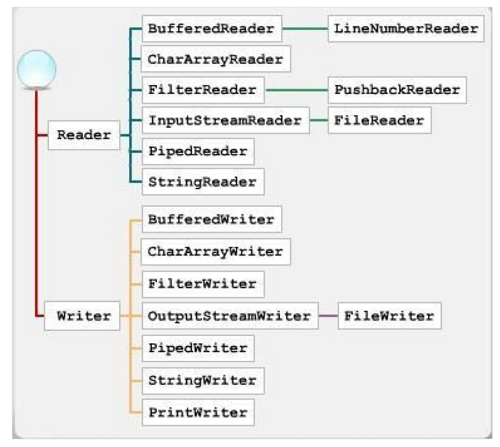

- [Инфо](#инфо)
- [Дополнительные заметки](#дополнительные-заметки)
  - [Пакеты в Java](#пакеты-в-java)
    - [import](#import)
    - [Компиляция кода, раскиданного по пакетам](#компиляция-кода-раскиданного-по-пакетам)
  - [`equals` и `hashCode`](#equals-и-hashcode)
  - [`Iterable<T>`, `Spliterator` и `Stream`](#iterablet-spliterator-и-stream)
  - [Параметризованное тестирование](#параметризованное-тестирование)
  - [`record`-классы](#record-классы)
  - [Ридеры (и немного райтеры)](#ридеры-и-немного-райтеры)
- [23.09.07 - лекция](#230907---лекция)
  - [Введение](#введение)
- [23.09.14 - Лекция](#230914---лекция)
- [23.09.21 - лекция](#230921---лекция)
  - [Примитивные типы данных](#примитивные-типы-данных)
    - [Классы примитивных типов](#классы-примитивных-типов)
  - [Ключевые слова на Java](#ключевые-слова-на-java)
- [23.09.28 - лекция](#230928---лекция)
  - [Принципы ООП](#принципы-ооп)
    - [Абстракция](#абстракция)
    - [Инкапсуляция](#инкапсуляция)
    - [Создание связей между классами](#создание-связей-между-классами)
      - [Наследование](#наследование)
  - [Параметризованные типы](#параметризованные-типы)
- [23.10.05 - лекция](#231005---лекция)
- [23.10.12 - лекция](#231012---лекция)
  - [Интерфейсы](#интерфейсы)
  - [Абстрактные классы](#абстрактные-классы)
  - [Как наследоваться](#как-наследоваться)
- [23.10.19 - лекция](#231019---лекция)
  - [Модификаторы полей класса](#модификаторы-полей-класса)
  - [Nested-классы (вложенные)](#nested-классы-вложенные)
    - [Анонимные классы](#анонимные-классы)
  - [Типизация](#типизация)
    - [Duck typing](#duck-typing)
  - [Полиморфизм](#полиморфизм)
    - [Ad hoc полиморфизм](#ad-hoc-полиморфизм)
    - [Параметрический полиморфизм](#параметрический-полиморфизм)
- [23.10.26 - лекция](#231026---лекция)
  - [Продолжаем про полиморфизм](#продолжаем-про-полиморфизм)
    - [Subtype полиморфизм](#subtype-полиморфизм)
  - [Лямбда-функции](#лямбда-функции)
- [23.11.02 - семинар](#231102---семинар)
  - [Строки](#строки)
  - [Коллекции](#коллекции)
- [23.11.09 - лекция](#231109---лекция)
  - [Исключения](#исключения)
- [23.11.14 - лекция](#231114---лекция)
- [23.11.23 - лекция](#231123---лекция)
  - [Stream API](#stream-api)
  - [Ввод-вывод](#ввод-вывод)


# Инфо
Лектор - Власов Александр Александрович / Шадрина Анастасия Александровна (иногда)

Семинаристка - Быкова Галина Павловна 

[Всё о практике](https://classroom.google.com/u/3/c/Njc3NDc0ODQ3OTFa/p/NjIwOTc0MTA4NDM5?pli=1)

**Для `build.gradle` в качестве DSL использовать `Groovy`**

# Дополнительные заметки
## Пакеты в Java
[Источник](https://habr.com/ru/articles/755654/)

Для использования множества классов с (возможно) пересекающимися именами в Java используются пространства имён, также называемые пакетами. 

Организуются пакеты весьма просто: имя пакета - адрес до файла после папки `src`, то есть файл по адресу `project/src/kozlov/kirill/main/Main.java` будет относиться к пакету `kozlov.kirill.main`. Для указания принадлежности файла к пакету необходимо в начале файла прописать `package kozlov.kirill.main;`. Если этого не указать, сущности из файла **попадут в безымянный пакет**, что крайне не рекомендуется для хоть сколько-нибудь серьёзных проектов.

```java
package kozlov.kirill.main;

public class Main() {
  public static void main(String argv[]) {
    // ...
  }
}
```

### import
К сущностям из безымянного проекта можно обращаться откуда угодно, что создаёт опасность коллизии имён. Для обращения к методу класса из пакета из примера выше мы прописываем в коде полный путь `kozlov.kirill.main.Main.main()`. 

Чтобы не писать каждый раз длинное имя пакета используются импорты:
```java
import kozlov.kirill.main.Main;

// ...

Main.main();
```

Импорт существует 3 типов:
- `import package.name.ClassName` - импорт класса, самый распространённый
- `import package.name.ClassName.staticMethod` - импорт статического метода
- `import package.name.*` - импорт пакета целиком. Используется редко, так как не спасает от конфликта имён и не показывает чётко, что конкретно из пакета мы используем

Импортировать другие файлы в файл того же пакета **НЕ НУЖНО**. Это делается автоматически

Также в каждый файл автоматически импортируется `java.lang.*`, где лежат фундаментальные классы (`String` и т.п.)

Для пакета `package.name`: `package.name` будет подпакетом `package`. `import package.*` **НЕ ИМПОРТИРУЕТ** `package.name`, а только файлы из самой папки `package`.

### Компиляция кода, раскиданного по пакетам
`javac` вызывается со следующими параметрами: `javac -d <destination_folder> <path/to/classes/in/package>/*.java` (*разумеется, вместо `*.java` можно указать конкретные имена классов*). Для подробной информации о компиляции можно добавить `-verbose`

Для компиляции множества файлов из папки `/src` можно прописать следующую команду: `javac -d out/ -sourcepath src/ <path/to/file/with/MainClass.java>`

Для запуска собранных `.class` файлов вызываем `java (-cp | -classpath <out_folder>) package.name.MainClass` - вместо пути до файла с `MainClass` указываем его пакетное расположение

## `equals` и `hashCode`
[Источник](https://javarush.com/groups/posts/1989-kontraktih-equals-i-hashcode-ili-kak-ono-vsje-tam)

Метод `equals` определён в классе `Object` и наследуется всеми классами. Его базовая реализация просто сравнивает ссылки на инстансы, что часто нас не удовлетворяет. Исправить это можно, переписав метод `equals`, используя декоратор `@Override`:
```java
public class Card {
  private int id;
  private String name;

  // ...

  @Override
  public boolean equals(Object obj) {
    if (this == obj) {
      return true; // Проверяем на равенство ссылок, чтобы удовлетворять рефлексивности
    }
    if (obj == null) {
      return false; // Если используются instanceof или getClass(), эта проверка не нужна
    }
    if (!(obj instanceof Card)) {
      return false; // instanceof вернёт true даже если Card - родительский для obj, чтобы получить конкретный класс, можно воспользоваться методом getClass()
    }
    if (!super.equals(o))
      return false; // Если в родительских классах есть переопределение
    Card otherCard = (Card) obj; // Приводим объект к нужному классу (за счёт проверок выше, тут мы уже уверены, что это возможно сделать)
    // Сравниваем все значимые поля. Примитивные типы сравниваются логическими операторами, ссылочные - их методом equals()
    return this.id == otherCard.id && this.name.equals(otherCard.name); 
  }
}
```

Вместе с `equals` **ВСЕГДА** необходимо переопределять метод `hashCode()`, так как он играет ключевую роль для построения `HashMap` с нашим классов в качестве ключей. Хэш-код для равных объектов (тех, что равны по переопределённому `equals`) должен быть одинаковым. Желательно, чтобы хэш-код для не равных объектов был разным (уменьшит число коллизий)

## `Iterable<T>`, `Spliterator` и `Stream`
Stream API позволяет нам удобно работать с итерируемыми объектами, то есть в первую очередь коллекциями. [Статья о методах](https://javarush.com/groups/posts/2203-stream-api)

Любая структура, реализующая интерфейс `Iterable<T>`, будет иметь дэфолтную реализацию сплиттератора, которую можно использовать для создания потока:
```java
var split = new BfsTreeCollection<>(root).spliterator();
var l = StreamSupport.stream(split, false).filter(x -> x < 5).toList();
System.out.println(l);
```

## Параметризованное тестирование
**Очень полезна при тестировании полиморфных объектов, наследующихся от общего предка**

*Может быть когда-нибудь сделаю саммари, а пока что пусть тут будет [ссылка на статью](https://habr.com/ru/articles/591007/)*

## `record`-классы
`record`-классы - синтаксический сахар для создания классов, все поля которого будут `final` (*то есть иммутабельных*). Прописываем в скобках после имени класса поля с типами. Автоматически будут сгенерированы конструктор для их установки, `equals` и `hashCode`, а также геттеры, но при необходимости можно переопределить этим методы полностью или частично (если речь о конструкторах)

Пример из [лабы 1.4.1](https://github.com/KozlovKV/OOP/tree/9684a368a6daa55b923fd1c1d9dcf87e2a1f52e2/task_1_4_1)
```java
package kozlov.kirill.creditBook;

import java.util.Objects;

/**
 * Mark record-class.
 *
 * @param value mark value between LOWEST_VALUE and HIGHEST_VALUE constants
 * @param semester semester of mark
 * @param subject study subject from Subject enum
 */
public record Mark(int value, int semester, Subject subject) {
    public static final int LOWEST_VALUE = 2;
    public static final int HIGHEST_VALUE = 5;

    public Mark{
        if (value > HIGHEST_VALUE) {
            value = HIGHEST_VALUE;
        } else {
            value = Math.max(value, LOWEST_VALUE);
        }
    }

    @ExcludeFromJacocoGeneratedReport
    @Override
    public String toString() {
        return subject.getSubjectName() + " in semester "
                + semester + ": " + value;
    }

    /**
     * Marks override comparator.
     * Mark's value is ignored because we cannot have to Marks with the same semester and subject
     * and different mark's values
     *
     * @param o the reference object with which to compare
     * @return true weather objects have equal semesters and subjects
     */
    @Override
    public boolean equals(Object o) {
        if (this == o) return true;
        if (o == null || getClass() != o.getClass()) return false;
        Mark mark = (Mark) o;
        return semester == mark.semester
                && subject.equals(mark.subject);
    }

    @Override
    public int hashCode() {
        return Objects.hash(semester, subject);
    }
}
```

[Мини-статья про `record`](https://metanit.com/java/tutorial/3.18.php)

## Ридеры (и немного райтеры)
Часть моего кода из [лабы 1_3_1](https://github.com/KozlovKV/OOP/blob/main/task_1_3_1), где используются потоки и ридеры:
```java
package kozlov.kirill.finders;

import java.io.BufferedReader;
import java.io.FileInputStream;
import java.io.IOException;
import java.io.InputStream;
import java.io.InputStreamReader;
import java.nio.ByteBuffer;
import java.nio.charset.StandardCharsets;
import java.util.LinkedList;

/**
 * Abstract string finder class.
 */
public abstract class StringFinder {
    protected final int capacity = 1048576; // 1 MB
    protected StringBuffer buffer = new StringBuffer();
    protected BufferedReader reader = null;
    protected String searchTarget = "";
    protected LinkedList<Long> targetsFoundPositions = new LinkedList<>();

    /**
     * Basic constructor.
     */
    public StringFinder() {}

    /**
     * Search string setter.
     *
     * @param searchTarget string for searching
     * @throws UnsupportedOperationException throws exception weather search target is empty
     */
    private void setSearchTarget(String searchTarget) throws UnsupportedOperationException {
        if (searchTarget.isEmpty()) {
            throw new UnsupportedOperationException("Empty string isn't allowed");
        }
        ByteBuffer utf8Buffer = StandardCharsets.UTF_8.encode(searchTarget);
        this.searchTarget = StandardCharsets.UTF_8.decode(utf8Buffer).toString();
    }

    /**
     * Opener file for reading.
     * Opens file from specified path in resources.
     * After that saves BufferedReader with encoding UTF-8 for it
     *
     * @param filename path to file for finding
     */
    private boolean openFileFromResources(String filename) {
        try {
            InputStream resourceInputStream =
                    getClass().getClassLoader().getResourceAsStream(filename);
            InputStreamReader inputStreamReader = new InputStreamReader(
                    resourceInputStream, StandardCharsets.UTF_8
            );
            this.reader = new BufferedReader(inputStreamReader, capacity);
            return true;
        } catch (Exception e) {
            System.err.println("File from resources wasn't opened\n" + e);
            return false;
        }
    }


    /**
     * Opener file for reading.
     * Opens file from specified path.
     * After that saves BufferedReader with encoding UTF-8 for it
     *
     * @param filename path to file for finding
     * @return true weather file was opened successfully
     */
    private boolean openFile(String filename) {
        try {
            FileInputStream fileInputStream = new FileInputStream(filename);
            InputStreamReader inputStreamReader = new InputStreamReader(
                fileInputStream, StandardCharsets.UTF_8
            );
            this.reader = new BufferedReader(inputStreamReader, capacity);
            return true;
        } catch (Exception e) {
            System.err.println("File wasn't opened\n" + e);
            return false;
        }
    }

    /**
     * File reader closer.
     */
    private void closeFile() {
        try {
            reader.close();
            reader = null;
        } catch (IOException e) {
            throw new RuntimeException(e);
        }
    }

    /**
     * Fragment reader.
     * Read chars from reader up to CAPACITY field's value
     *
     * @return read chars count or -1 when nothing was read
     */
    protected int readFragment() {
        char[] charBuffer = new char[capacity];
        int readCharsCount = 0;
        try {
            readCharsCount = reader.read(charBuffer);
            if (readCharsCount == -1) {
                return readCharsCount;
            }
        } catch (IOException e) {
            return -1;
        }
        if (buffer.length() > 0) {
            buffer.delete(0, buffer.length());
        }
        buffer.append(charBuffer, 0, readCharsCount);
        return readCharsCount;
    }

    /*

    ...

    */
}
```
В этом куске также используется концепция **ресурсов** - файлов, привязанных к конкретным классам и расположенным рядом с ними, что упрощает их перемещение в репозиториях. Чаще всего используются при тестировании. Подробнее читай [тут](https://mkyong.com/java/java-read-a-file-from-resources-folder/)

*Ну а теперь переходим к ридерам*

[Статья](https://javarush.com/groups/posts/1919-schitihvanie-s-klaviaturih--riderih)

Потоки делятся на входящие (`InputStream`) и исходящие (`OutputStream`), а также на символьные и байтовые.

Мы можем читать и писать напрямую из/в потоки, но это не очень удобно во многих задачах, а метод `read()` класса `InputStream` и вовсе читает байты, причём по одному (метод `OutputStream::write` может записывать много байтов за раз, но это всё ещё байты, байты - это боль)

`FileInputStream`, `FileOutputStream` - комментарии излишни

Ридер `InputStreamReader` будет отвечать за удобное чтение из потока. Его конструктор принимает в себя `InputStream` (или его потомков вроде `FileInputStream`). Ридер может преобразовывать байты в символы!

`BufferedReader`, что понятно из названия, обладает буфером, который во-первых, ускоряет чтение, а во-вторых, позволяет читать сразу несколько символов (по количеству, по строкам и т.п.)

*Существуют также буферизованные версии потоков, но их использование всё ещё менее оптимально в сравнении с ридерами/райтерами*



[Обзорная статья про ридеры и райтеры без базы о потоках](https://javarush.com/groups/posts/593-bufferedreader-i-bufferedwritter)

# 23.09.07 - лекция
## Введение
Языки общего назначения *барабанная дробь* универсальны. Доменно-специфичные используются для каких-то конкретных задач (например, SQL)

Парадигма программирования - совокупность принципов, методов и понятий, определяющих способ конструирования программ. Существует 5 основных парадигм:
1. Императивное программирование - память-состояние и изменяющие его операторы. Самая первая из парадигм, простая для понимания, но громоздкая
2. Структурное программирование - разделение на подпрограммы, основные конструкции: циклы и ветвления
3. Функциональное программирование - описываем конечную цель, а не последовательность действий для её достижения (*привет, Haskell!*). Лёгкое тестирование, отладка, оптимизация, проверка корректности, **НО** не все задачи выполнимы чистыми функциями
4. Логическое программирование - логический вывод на основании заданных парадигм
5. ООП - всё строится вокруг **объекта** (*см. ниже*)

Объект обладает тремя основными типами характеристик (*т.е. объект - нечто, что обладает:*):
1. Состояние - внутренние свойства объекта, определяющие, собственное, состояние объекта и влияющие на его поведение
2. Поведение - как объект взаимодействует с другими объектами
3. Идентификатор - уникален для объектов одного типа

Основные фишки Java - это garbage collector и virtual machine - обе они были и в ООП языках до Java, но ни один из них так не выстрелил

Разделение платформы Java:
- ME - micro-edition - для устройств с ограниченными ресурсами
- SE - standard edition - крепкий середнячок
- EE - enterprise edition - для жоских проектов в жоских конторах

Кроссплатформенность достигается как раз за счёт виртуальной машины

**JIT-компиляция** - динамическая умная компиляция - использует информация о часто повторяющихся участках кода, компилирует код во время его исполнения, что несколько ускорит работу

**AOT-компиляция** - компиляция как в C, то есть очень быстрая, но железозависимая

# 23.09.14 - Лекция
Одна из основных мотиваций для создания объектов - желание создавать грязные функции, имеющие взаимодействие с глобальными данными, но при этом нарезать глобальные данные на отдельные сегменты, сделав их, фактически, уже не глобальными.

*Что появилось раньше: класс или объект?*

**Класс** - способ группирования объектов, схожих по поведению и состоянию.

Часто встаёт вопрос о том, какая степень схожести поведения и состояний объектов является достаточной для включения их в один класс.

*Также объект и класс могут быть определены в обратном порядке, как происходит, например, в языке Java.*

В Java объект:
- Существует определённое время
- Для его создания мы должны знать, каким он должен быть
- Для создания необходимо задать начальное состояние, а после удаления освободить выделенные ресурсы

# 23.09.21 - лекция
## Примитивные типы данных
Примитивные типы отличаются от классов тем, что хранят непосредственно своё значение и при присваивании передаёт непосредственно его значение.

Вторая причина для существования примитивных типов - быстрая трансляция байт-кода при JIT-компиляции.

При этом беззнаковых типов в Java нет. Сделано это было для уменьшения количества примитивных типов и устранения некоторых ошибок, связанных с беззнаковым зацикливанием.

*Немного затирают про то, что такое UTF-кодировка и зачем она появилась*

**В Java все строки зафиксировано хранятся в `UTF-16`. Строка - НЕ примитивный тип.**

**Адресно арифметики в Java нет**

### Классы примитивных типов
Каждый примитивный тип имеет отображение в виде класса. В таком случае мы лишаемся преимуществ в виде быстрой компиляции и компактности, но зато получаем некоторые другие возможности (использовать методы, задавать типы generic-классам).

К счастью, писать везде методы приведения примитивных типов к объектам и наоборот не нужно - компилятор принимает неявное их приведение

## Ключевые слова на Java
- Имена примитивных типов
- Команды управления процессом исполнения (`for`, `if`, `while`, `return` и т.п. - один в один как в Си)
- Модификаторы доступа
  - `private`
  - `protected`
  - `public`
- Управление пакетами ([Что это вообще такое](#пакеты-в-java))
  - `package`
  - `import`
- Обработка исключений
- ООПшные команды (*интересно, почему модификаторы доступа выделили отдельно?..*)
  - `var` - выделим его отдельно, так как он позволяет задать тип переменной, явно его не указывая, если этот тип можно определить по выражению справа (*как в JS, только свободно определяется лишь в начале, потом, ясное дело, не изменен*)
  - `this`
  - `super`
- `enum`
- `void`
- Зарезервированы, но не используются, *лол* - `const`, `goto`
- Зарезервированные константы: `true`, `false`, `null`

# 23.09.28 - лекция
*Забавно, но иногда в методах классов можно опускать `this` - компилятор сам его подставит*

Оператор `new ClassName()` создаёт объект на хипе и возвращает ссылку, которая будет указывать на этот объект и храниться уже в стэке.

**Контракт класса** - будущее поведение объекта класса.

## Принципы ООП
Обязательны принципы для ООП:
 - Абстракция
 - Инкапсуляция
 - Наследование
 - Полиморфизм

Дополнительные принципы:
- Типизация
- Параллелизм
- Сохраняемость

### Абстракция
Абстракция выделяет существенные характеристики объекта и чётко определяет его концептуальные границы с точки зрения наблюдателя.

Наличие наблюдателя в этом определении очень важно, так как без него мы не сможем выделить ключевые для нас свойства

### Инкапсуляция
Процесс отделения друг от друга элементов объекта, которые определяют его устройство и поведение. Инкапсуляция служит для того, чтобы изолировать контрактные обязательства абстракции от их реализации.

Инкапсуляция не сводится только лишь к модификаторам прав доступа `private`, `public`, package-private, `protected` - ещё есть интерфейсы (`interface`) и абстрактные классы (`abstract`).

Подробнее о модификаторах прав доступа:
- `private` - доступно только внутри класса
- `public` - доступно извне
- `protected` - видимость в пакете и подклассах (см. [наследование](#наследование))
- package-private - задаётся по умолчанию - доступно везде в рамках пакета

В одном файле может быть **только один публичный класс**.

### Создание связей между классами
**Ассоциация** - любое отношение между объектами (*велик - владелец, препод - часы и т.п.*)

**Зависимость** - вроде, тут всё итак ясно

**Агрегация** - часть относится к целому (*велик - колесо: колесо отделимо от велика*)

**Композиция** - часть относится к целому и учитывает время жизни (*велик - рама: рама может жить только вместе с великом*)

#### Наследование
Наследование создают такую иерархию абстракций, в которой подклассы заимствуют строение и функциональность от одного или нескольких суперклассов.

**Иерархия** - упорядочение абстракций путём разложения их по уровням.

```java
class SubClass extends SuperClass {
  // your code here
}
```

**Привидение типа upcast** - приводим тип подкласса к его суперклассу. Тут всё безопасно и нормально. При вызове методов, существующих в суперклассе и переопределённых в подклассе, будет вызван переопределённый метод, так как мы просто поменяли тип ссылки.

**Приведение типа downcast** - приводим тип суперкласса к типу подкласса. Необходимо указывать тип явно. Опасно и часто вызывает `ClassCastException`.

**Все типы в Java наследуются от `java.util.Object`**

Про `equals` и `hashCode` писал [тут](#equals-и-hashcode)

**Альтернативное определение наследование (принцип подстановки Барбары Лисков)** - реализовывать наследование надо так, чтобы в случае подстановки подкласса на место суперкласс (upcast) контракты не нарушались.

**Ещё раз принцип, но более академично:**
- Функции, использующие базовый тип, должны иметь возможность использовать его подтипы, не зная об этом (то есть чтобы для них работал upcast приведение типа)
- Наследующий класс дополнять, а не замещать поведение базового класс

<hr>

Из всего этого можно заключить, что наследование - **очень сильная связь** - поэтому желательно прибегать к нему лишь в крайних случаях. **Рекомендуется использовать композицию**

## Параметризованные типы
Можно использовать поля типа `Object`, чтобы хранить в них любые ссылочные типы, но тогда мы никак не можем поставить ограничения на записываемые в поля данные, из-за чего лишаемся строгой типизации и можем словить Runtime Error при ошибочном downcast приведении типа.

Поэтому используется другой принцип. Мы указываем, что класс будет работать с одним и тем же произвольным типом `T` (*название не строгое, а просто каноническое*). Может быть несколько параметризованных типов

*Фан-факт:* на самом деле при компиляции все записи параметризованного типа заменяются на `Object`, то есть мы возвращаемся к первой версии, но обходим проблему незаметных при написании кода ошибок.

```java
// Добавлю экзампл, когда решу третью лабу
```

Можно задать границы типовых параметров (bounds). Верхняя граница задаётся за счёт записи `<T extends UpperClass>` - мы можем указать в качестве параметра только класс `UpperClass` или его подклассы. (После компиляции вместо `Object` будет подставляться `UpperClass`, то есть тем самым мы ограничим upcast)

**Generic-классы** - классы с параметрическими типами данных

# 23.10.05 - лекция
*Больше половины лекции дрючил нас на предмет того, внимательно ли мы слушали лекцию Иртегова вчершанюю*

*Вторую половину пересказывал лекцию Шадриной*

**Контракт включает в себя**:
- набор операций
- параметры операций и нго допустимые значения, интерпретация параметров
- допустимые возвращаемые значения и их интерпретация
- сообщения об ошибках
- предусловия
- постусловия
- инварианты
- побочные эффекты

Алгоритм спецификации:
1. Назвать абстракцию и описать, что она должна делать
2. Для каждой определённой операции написать её спецификацию по пунктам выше 

# 23.10.12 - лекция
## Интерфейсы
*Наверное тут было определение интерфейса или что-то подобное*

Интерфейсы определяют общее поведение объектов (контракт), которое обязательно должно быть.

```java
interface Animal {
  void eat();
  void sayHi();
}
```

Есть 2 способа реализации нескольких интерфейсов в одном объекте:
- После `implements` пишутся несколько интерфейсов.
- Интерфейс может расширять другой интерфейс при помощи `extends`, что корректнее всего называть расширением, а не наследованием.

Второй метод предпочтительнее, так как при первом может возникнуть конфликт контрактов.

Также мы можем создать массив интерфейсов за счёт того, что интерфейс не содержит никакого конструктора. (то же относится и к списку, то есть любой ссылочный тип, которому не нужно тут же инициализировать объекты заданного параметра)

В интерфейсе нельзя задать поля, но можно константы (`final`) или статические (`static`) атрибуты.

Очень часто реализации интерфейсов в разных классах очень похожи, из-за чего мы будем дублировать много кода.

## Абстрактные классы
Абстрактный класс представляет собой нечто среднее между классом и интерфейсом. У методов абстрактного класса также нет реализацией, поэтому мы не можем инициализировать объекты этого класса, однако в абстрактном классе можно задать поля и реализовать часть методов. Абстрактные методы обозначаются словом `abstract`:
```java
public abstract class Animal {
  int health = 100;

  void eat() {
    health += 5;
  }

  abstract void sayHi();
}
```

Очевидно, абстрактные классы могут наследоваться (`extends`), но не имплементироваться (`implements`).

В классах можно использовать **любые модификаторы доступа**, а не **только `public`, как в интерфейсах**.

## Как наследоваться
Если вам хочется сделать множественное наследование, вам не хочется его сделать

# 23.10.19 - лекция
## Модификаторы полей класса
- `final` - константа. Будучи однажды заданной, больше не может быть изменена. Относится к изменениям значений, то есть мы можем изменять содержимое ссылочного типа, но не ссылку на него
- `static` - поле становится полем класса, а не объекта. Для всех объектов и класса будет иметь одно и то же значение. Статические объекты могут иметь доступ только к статическим полям
  - СТАТИЧЕСКИЙ КОНСТРУКТОР вызывает единожды в момент загрузки класса и позволяет инициализировать статические поля класса. Записывается как `static { /*code*/ }`

## Nested-классы (вложенные)
Можно объявить класс внутри класса. Будет иметь возможность обращаться к полям внешнего класса, что порой оказывается ооочень удобно.

`static`-nested класс, что логично, будет иметь возможность работать только со статическим контекстом внешнего класса. Иногда **Nested-классами называют только статические**

Нестатические вложенные классы называют Inner-классами. Они подразделяются на:
- Простой Inner class
- Method-local
- Anonymous Inner class

Эти типы классов могут работать только в контексте объекта, то есть:
- Могут обращаться к полям внешнего класс с любом модификатором доступа
- К ним нельзя обратиться по имени внешнего класса (из статического контекста), только по имению объекта
- Нельзя обращаться к внутреннему Inner-классу из статического метода класс-обёртки (что вытекает из первого пункта)
- В Inner-классе не может быть статических методов

Пример простейшего использования:
```java
public class Bicycle {

   private String model;
   private int weight;

   public Bicycle(String model, int weight) {
       this.model = model;
       this.weight = weight;
   }

   public void start() {
       System.out.println("Поехали!");
   }

   public class HandleBar {

       public void right() {
           System.out.println("Руль вправо!");
       }

       public void left() {

           System.out.println("Руль влево!");
       }
   }

   public class Seat {

       public void up() {

           System.out.println("Сиденье поднято выше!");
       }

       public void down() {

           System.out.println("Сиденье опущено ниже!");
       }
   }
}

// ...

public class Main {

   public static void main(String[] args) {

       Bicycle peugeot = new Bicycle("Peugeot", 120);
       Bicycle.HandleBar handleBar = peugeot.new HandleBar();
       Bicycle.Seat seat = peugeot.new Seat();

       seat.up();
       peugeot.start();
       handleBar.left();
       handleBar.right();
   }
}
```

[Подробнее об Inner-классах](https://javarush.com/groups/posts/2181-vlozhennihe-vnutrennie-klassih)

### Анонимные классы
Используются, когда мы хотим использовать функционал класса лишь в одном месте:
```java
var value = new SuperClass() { // Если не указать SuperClass, будем наследоваться от Object
  // Code for class
}
```
Собственных конструкторов у анонимных классов нет, но они могут использовать конструкторы классов-родителей (а ещё мы можем, по идее, просто через замыкание работать с какими-то данными, **статические переменные и поля запрещены**). Подробнее об анонимных классах [тут](https://javarush.com/groups/posts/2193-anonimnihe-klassih)

Nested-интерфейсы тоже существуют, хотя и используются не часто. Позволяют обозначить, что для внешнего интерфейса обязательна также реализация внутреннего интерфейса.

## Типизация
В Java доступна как статическая, так и динамическая типизация.

Языки со слабой типизацией могут преобразовать дробные числа в целые неявно и т.п. Сильная типизация не позволяет так делать.

### Duck typing
Если что-то крякает и летает, оно является уткой. Говоря более формально, типы объектов определяются их поведением

## Полиморфизм
### Ad hoc полиморфизм
Заключается в перегрузке функций.

### Параметрический полиморфизм
Основывается на generic'ах.

# 23.10.26 - лекция
## Продолжаем про полиморфизм
### Subtype полиморфизм
Основан на наследовании от общего класса-родителя (*возможно абстрактного*) либо на реализации несколькими классами общего интерфейса

## Лямбда-функции
Лямбда-функция на самом деле - реализация одного метода `calculate` для соответствующего класса лямбда-функции (класс `Operation`, реализующий интерфейс `Operation`). В качестве синтаксического сахара добавлена следующая нотация:
```java
Operationable operation1 = (int x, int y) -> x + y;
Operationable operation2 = (int x, int y) -> x - y;
Operationable operation3 = (int x, int y) -> x * y;
// Само собой, можно не присваивать лямбда-класс какому-то объекту, а сразу передавать обработчики map, reduce и прочие функциональные штуки 
System.out.println(operation1.calculate(20, 10)); //30
System.out.println(operation2.calculate(20, 10)); //10
System.out.println(operation3.calculate(20, 10)); //200
```
Также лямбда-функции чем-то напоминают анонимные методы. В лямбда-функциях можно использовать замыкания.

# 23.11.02 - семинар
## Строки
**Строки иммутабельны**. Иммутабельность обеспечивает максимальную производительность и надёжность.

[Чуть-чуть подробнее про иммутабельность](https://habr.com/ru/companies/otus/articles/552630/)

*Дальше идёт описание разных базовых функций типа `indexOf`, `substring`, `equals`, `equalsIgnoringCase` и т.п., описывать которые здесь не вижу смысла - куда оптимальнее смотреть доки или исходники*

`char` - это примитивный односимвольный тип, который хранит символ из таблицы ASCII. Это существенное, так как строки используют `UTF`. Получается, если строка выведет кириллицу корректно, то вот считать значение символа из строки через `.charAt(index)` мы в таком случае не сможем. Вернее, сможем, но вывод символа экран будет некорректным. (*На самом деле, с точки зрения большинства задач вообще не страшно*)

## Коллекции
*Тыщи их* - существует очень много различных коллекций, реализующих определённые интерфейсы. Каждый тип коллекций хорош для определённых задач, а общие интерфейсы позволяют реализовать полиморфизм.

Не буду здесь описывать все классы, а просто оставлю диаграмму:


- Упорядоченные коллекции
  - `ArrayList` хранит значения в динамическом массиве
  - `LinkedList` позволяет быстро добавлять и удалять элементы
- Неупорядоченные коллекции (множества)
  - `HashSet` хэш-таблица
  - `TreeSet` бинарное дерево поиска

# 23.11.09 - лекция
## Исключения
**Исключение** ситуация, реакцию на которую мы не можем определить в данный момент. Следовательно, нам необходимо передать информацию об этой ситуации (ошибке) в другое место.

Для обработки различных исключительных ситуаций и их передачи удобно использовать конструкцию `try-catch`:
```java
readFile {
  try {
    // Блок, в котором будут ловиться исключения
    open the file;
    determine its size;
    allocate that much memory;
    read the file into memory;
    close the file;
  } catch (FileOpenFailed e) {
    // Обработка исключений по их типам. Можем также пробросить исключение выше, прописав throw new ExceptionType
    doSomething;
  } catch (SizeDeterminationFailed e) {
    doSomething;
  } catch (MemoryAllocationFailed e) {
    doSomething;
  } catch (ReadFailed e) {
    doSomething;
  } catch (FileCloseFailed e) {
    doSomething;
  } finally {
    // Исполняется независимо от возникновения или отсутствия исключений. Необходим для очистки каких-то данных и некоторых других специфических действий (закрытие файлов при завершении работы с ними)
  }
}
```

Если метод не отлавливает исключения, а только выбрасывает их, в объяснении после аргументов необходимо прописать `throws ExceptionType`

Пример с пробросом исключения вверх
```java
method1 {
  try {
    call method2;
  } catch (exception) {
    doErrorProcessing;
  }
}
method2 throws exception {
  call method3;
}
method3 throws exception {
  throw new  Exception(“Error”); 
}
```

Исключения делятся на **проверяемые** (checked) и **непроверяемые** (unchecked).

Все исключения реализуют интерфейс `Throwable`, от которого реализуются `Error` и `Exception`

Исключения-наследники типа `Error` и `Exception RuntimeException` относятся к непроверяемым и могут возникнуть в любом месте. Не требуют прописывать `throws` в методе и являются насколько критическими, что завершают программу почти всегда

Все исключения-наследники `Exception`, не считая `RuntimeException` относятся к проверяемым и могут быть обработаны в коде, поэтому должны быть указаны в методах, которые могут их выбросить. 

*На самом деле, `RuntimeException` тоже можно отловить, но это bad practice, поэтому стоит дважды задуматься, прежде чем его выбрасывать и МНОГО раз задуматься, прежде чем его ловить*

Иногда реакцией на исключение будет другое исключение, которое будет обозначено как причина возникновения нового. Это полезно для комплексных программ, где сломаться метод `A` может из-за методов `B`, `C` или `D`, но обрабатывая исключение от `A` мы ожидаем получить именно его исключения, а не одно из исключений вложенных методов.

Можно после ключевого слова указать определённые переменные в скобках. В таком случае они будут доступны только внутри `try`. Объекты в скобках должны реализовывать интерфейс `AutoClosable`

# 23.11.14 - лекция
*Ну... Я её проспал. И даже не уверен, что буду дописывать*

# 23.11.23 - лекция
## Stream API

Stream API - расширение для работы с контейнерами-коллекциями. У любого наследника интерфейса `Collection` будет метод `stream`

`ParallelStream` позволяет выполнять запрос Stream API в многопоточном режиме. Ответственность за корректность **ложится на вызывающего** (в частности, мы не должны пользоваться в них замыканиями, либо можем это делать, но отдавать себе отчёт в том, что мы пользуемся разделёнными данными). Сами же по себе методы Stream API потокобезопасны.

Метод `collect` позволяет преобразовать Stream обратно в коллекцию. Как аргумент метода обычно передаётся какой-то статический метод класса `Collectors` (реализуют интерфейс `Collector`)

```java
Collector<SourceType, AccumulatorType, ResultType> collector = Collector.of(
  initAccMethod,
  processElemMethod,
  joinAccsMethod,
  [lastProcessingMethod]
)
```
Указав здесь (либо реализовав через лямбда-выражения) 3 либо 4 метода, мы можем передавать этот коллектор в `collect`

Код без Stream API:
```java
StringBuilder b = new StringBuilder(); // метод_инициализации_аккумулятора
for(String s: strings) {
  b.append(s).append(" , "); // метод_обработки_каждого_элемента,
}
String joinBuilderOld = b.toString(); // метод_последней_обработки_аккумулятора
```
С использованием Stream API и коллекторов:
```java
String joinBuilder = strings.stream().collect(
  Collector.of(
      StringBuilder::new, // метод_инициализации_аккумулятора
      (b ,s) -> b.append(s).append(" , "), // метод_обработки_каждого_элемента,
      (b1, b2) -> b1.append(b2).append(" , "), // метод_соединения_двух_аккумуляторов
      StringBuilder::toString // метод_последней_обработки_аккумулятора
    )
  );
```

И ещё один пример:
```java
// Напишем свой аналог toList
Collector<String, List<String>, List<String>> toList = Collector.of(
  ArrayList::new, // метод инициализации аккумулятора
  List::add, // метод обработки каждого элемента
  (l1, l2) -> { l1.addAll(l2); return l1; } // метод соединения двух аккумуляторов при параллельном выполнении
);
// Используем его для получение списка строк без дубликатов из стрима
List<String> distinct1 = strings.stream().distinct().collect(toList);
```

Stream API может работать в ленивом режиме. Например, метод `iterate((initialValue, currentValue) -> nextValue)` даст нам бесконечную коллекцию с определённым правилом изменения элементов. Работать с таким стримом можно **ТОЛЬКО** как-то его ограничив (`limit(count)` и, возможно, ещё какие-то методы)

## Ввод-вывод
*Как классно было, когда ты молод, глуп и почти с самого начала тебя учат читать и писать в файлы/терминалы*

Самый базовый класс для работы с файлами - это `File`. При инициализации ему передаётся путь к файлу. Класс реализует множество методов (в основном - предикатов):
- `canRead()` / `canWrite()`
- `exist()`
- `getParent()`
- `isDirectory()`
- `isFile()`
- `lastModified()`
- `length()`
- *И многие другие - смотри [доки](https://docs.oracle.com/javase/8/docs/api/java/io/File.html)*