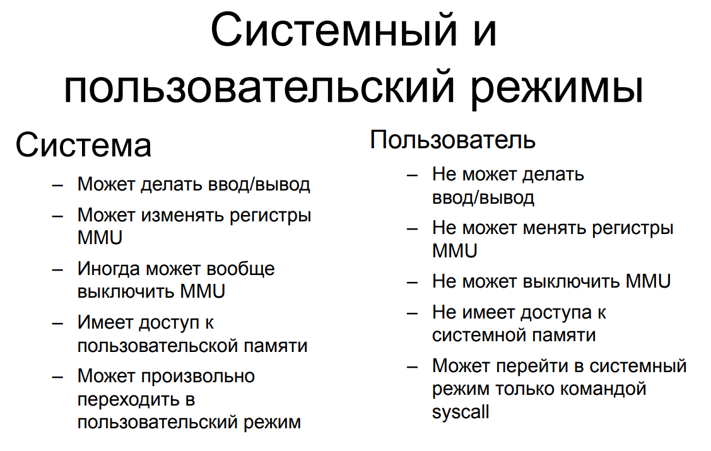
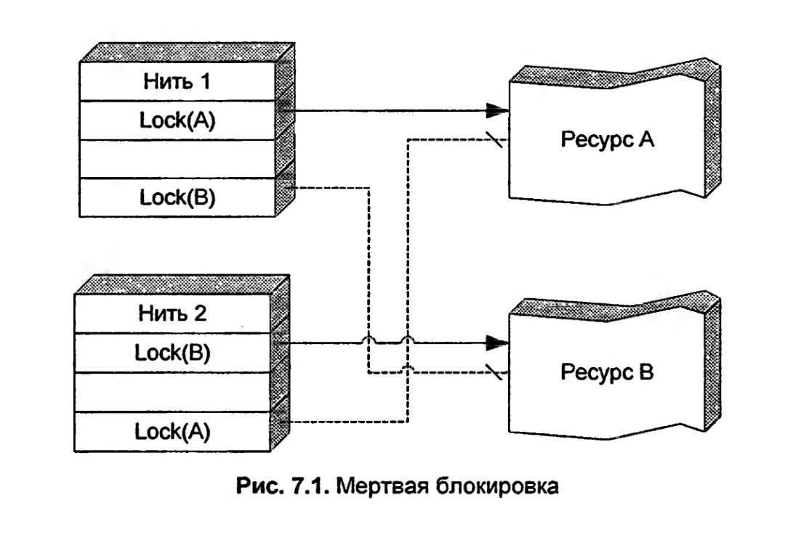
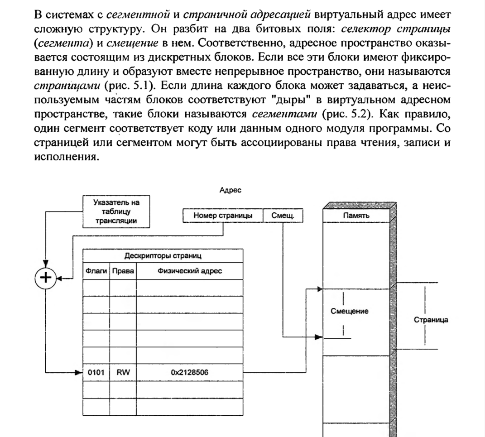
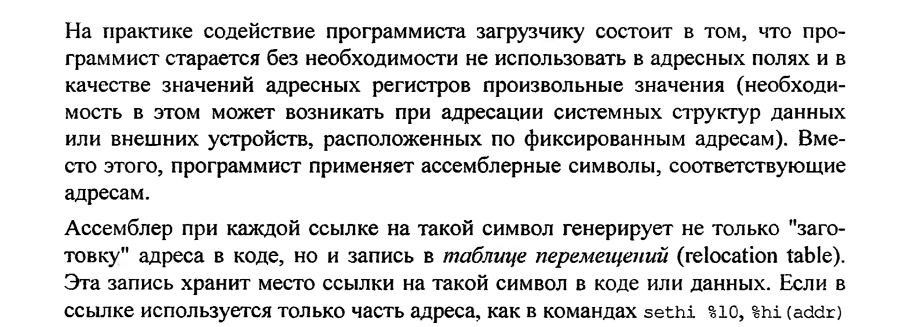

# Categorical questions

### Written by: [@AntonTsoy](https://github.com/AntonTsoy)

### Содержание:
- [Понятие файла и файловой системы. Что такое каталог?](#понятие-файла-и-файловой-системы-что-такое-каталог)
- [Определение задачи реального времени.](#определение-задачи-реального-времени)
- [Алгоритм библиотечных функций malloc/free языка C.](#алгоритм-библиотечных-функций-mallocfree-языка-c)
- [Что такое системный и пользовательский режимы процессора?](#что-такое-системный-и-пользовательский-режимы-процессора)
- [Что такое транзакция?](#что-такое-транзакция)
- [Что такое семафоры Дейкстры?](#что-такое-семафоры-дейкстры)
- [Что такое мертвая блокировка?](#что-такое-мертвая-блокировка)
- [Что такое контекст процесса?](#что-такое-контекст-процесса)
- [Что такое гармонически взаимодействующие последовательные процессы?](#что-такое-гармонически-взаимодействующие-последовательные-процессы)
- [Что такое селектор страницы (сегмента) в сегментных и страничных диспетчерах памяти?](#что-такое-селектор-страницы-сегмента-в-сегментных-и-страничных-диспетчерах-памяти)
- [Что такое дескриптор страницы (сегмента) в сегментных и страничных диспетчерах памяти?](#что-такое-дескриптор-страницы-сегмента-в-сегментных-и-страничных-диспетчерах-памяти)
- [Что такое абсолютный и относительный загрузчики?](#что-такое-абсолютный-и-относительный-загрузчики)
- [Что является элементом таблицы перемещений в относительном (перемещаемом) загрузочном модуле?](#что-является-элементом-таблицы-перемещений-в-относительном-перемещаемом-загрузочном-модуле)
- [Что такое позиционно-независимый код?](#что-такое-позиционно-независимый-код)
- [Что такое реентерабельная программа?](#что-такое-реентерабельная-программа)
- [Что такое критическая секция?](#что-такое-критическая-секция)
- [Кольца доступа и списки контроля доступа.](#кольца-доступа-и-списки-контроля-доступа)
- [Кооперативные многозадачные системы и вытесняющая (preemptive) многозадачность.](#кооперативные-многозадачные-системы-и-вытесняющая-preemptive-многозадачность)

# Понятие файла и файловой системы. Что такое каталог?

**Файл** - это совокупность данных, доступ к которой осуществляется по её имени. [Цитата из книги Иртегова страница 632]

> **Примечания**: [Книга Иртегова]
>
> 1) Таким образом файл противопоставляется другим объектам, доступ к которым осуществляется по их адресу (например записям внутри файла или блокам на диске).
>
> 2) ОС семейства Unix трактуют понятие файла более широко - там  `файлом называется любой объект, имеющий имя в файловой системе`. Однако файлы, не являющиеся совокупностями данных (каталоги, внешние устройства, псевдоустройства, именованные программные каналы, семафоры Xenix), часто называют не простыми файлами, а “специальными“

**Директория** (говоря по-русски ***каталог***) - таблица преобразования имен в адреса. [Книга Иртегова]

**Файловая система** - совокупность каталогов и других метаданных, т.е. системных структур данных, отслеживающих размещение файлов на диске и свободное дисковое пространство. [Книга Иртегова]

---
 

# Определение задачи реального времени.

**Задача реального времени** - 

* это когда система даёт приложениям гарантии относительно времени исполнения и требует от приложения выполнить за это время определённые задачи. [Конспект Кирилла]
* это когда за гарантированное время нужно обеспечить реакцию на внешнее событие. [Лекция Иртегова №5 (37:35)]
* задача, получающая управление в течение гарантированного времени после возникновения того или иного внешнего события. [Лекция Иртегова №9 (16:31)]

> `Комментарий от Иртегова к последнему определению`:
>
> Реальное время это когда система даёт приложениям какие-то гарантии относительно времени или на самом деле, если приложение, то оно не только должно получить управление, оно должно ещё что-то сделать за гарантированное время.

> **Примечание от Антона к последнему определению**:
>
> Такое же определение Иртегов давал в своей книге, только вместо понятия “задачи реального времени” он писал про “режим реального времени” на странице 16.

Системы **РАЗДЕЛЕННОГО ВРЕМЕНИ** максимизируют количество событий, обрабатываемых в единицу времени.

---
 

# Алгоритм библиотечных функций malloc/free языка C.

**`Книга Иртегова - пункт 4.2 “Алгоритмы динамического управления памятью“`**: 

`Реализация` *`malloc`* `в библиотеке GNU LibC до 2010 года`: GNU LibC — это реализация стандартной библиотеки языка C в рамках freeware-проекта GNU Not Unix. Реализация функций ***malloc/free*** этой библиотеки использует смешанную стратегию: блоки размером более 4096 байт выделяются ***`стратегией first fit`*** из двусвязного кольцевого списка с использованием циклического просмотра, а освобождаются с помощью метода, который похож на ***`алгоритм парных меток`*** (точнее использует отсортированные по адресу двунаправленные списки, в которые включены как свободные, так и занятые блоки). Все выделяемые таким образом блоки будут иметь размер, кратный 4096 байтам …  
Блоки меньшего размера объединяются в очереди с размерами, пропорциональными степеням двойки, как в описанном далее алгоритме близнецов. Элементы этих очередей называются фрагментами. <…> Под эти фрагменты будут выделены полные блоки в 4 Кбайта, и внутри них будет выделено по одному фрагменту. При последующих запросах на фрагменты такого же размера будут использоваться свободные фрагменты этих блоков. Пока хотя бы один фрагмент блока занят, весь блок считается занятым. Когда же освобождается последний фрагмент, блок возвращается в пул. [страница 230 - `обязательно читать`]

**Определение из критов прошлых курсов**:

Для маленьких (обычно <4Кб - стандартный размер страницы) выделяется память блоками размеров, кратным степеням двойки по алгоритму близнецов. Большие блоки выделяются стратегией first fit. Для освобождения используется алгоритм парных меток.

**Лекция №5 часть 2 (24:30)**:

В Solaris реализация malloc гибридная: Память представляет собой сбалансированное дерево. Если запрашиваемый кусок меньше корня этого дерева мы действуем по стратегии first fit (хватаем первый кусок памяти из левого поддерева). Если запрос памяти больше корня дерева, то действуем по стратегии best fit (идем в правое поддерево, т.е. в сторону бОльших кусков; первое, что мы найдем не меньше нашего запроса и будет лучший вариант)

**Иртегов на консультации**:

Стратегия first fit и алгоритм парных меток. (комментарий от Антона - лучше упомянуть, что такая реализация malloc-а была в GNU LibC до 2010 года)

---
 

# Что такое системный и пользовательский режимы процессора?

**Системный режим процессора -** 

* режим, в котором исполняемый код имеет полный доступ ко всему аппаратному обеспечению и может задействовать любую инструкцию, которую машина в состоянии выполнить. [Определение из критов прошлых курсов]
* является полномочием или, во всяком случае может применяться в качестве такового: обладание им позволяет выполнять операции, недопустимые в пользовательском режиме, и этот режим не может произвольно устанавливаться. [Книга Иртегова страница 783]

**Пользовательский режим процессора** - режим, в котором программам запрещено использование инструкций, управляющих машиной или осуществляющих операции ввода-вывода. [Определение из критов прошлых курсов]

**`Лекция №6 Виртуальная память`**:

---
 

# Что такое транзакция?

**Транзакция** - 

* группа операций модификации разделяемой структуры данных, которая происходит атомарно (неделимо), не прерываясь никакими другими операциями с той же структурой данных. [Книга Иртегова страница 379]
* попытка слияния изменённых разделённых данных, которая полностью откатится при возникновении конфликта. [Конспект Кирилла]
* группа операций модификации разделяемой структуры данных, которые либо исполняются вместе, либо не исполняются вовсе. [Определение из критов прошлых курсов - у Иртегова в книге говорится, что это более радикальное определение]

---
 

# Что такое семафоры Дейкстры?

**Семафор Дейкстры** представляет собой целочисленную переменную, с которой ассоциирована очередь ожидающих нитей. [Книга Иртегова страница 394]

---
 

# Что такое мертвая блокировка?

**Мертвая блокировка** - 

* **Deadlocks** - у нас 2 критических секции, которые мы используем одновременно, но при этом в одном месте вторая секция блокируется внутри блокировки первой, а другом месте - первая секция блокируется внутри блокировки второй. Получаем мёртвую блокировку и тоже своего рода race condition. [Конспект Кирилла]
* специфическая проблема, возникающая при использовании любых механизмов взаимоисключения для доступа к нескольким различным ресурсам. [Книга Иртегова страница 385]

> **Пояснения из книги Иртегова**:
>
> Рассмотрим две нити, каждая из которых работает с двумя различными ресурсами одновременно. Например, одна нить копирует данные со стриммера на кассету **Exabyte**, а другая - в обратном направлении. Доступ к стриммеру контролируется флаговой переменной ***flag1***, а к кассете **flag2** *(вместо флаговых переменных могут использоваться и более сложные средства взаимоисключения).*
>
> Первая нить сначала устанавливает **flag1**, затем **flag2**, вторая поступает наоборот. Поэтому, если вторя нить получит управление и защелкнет **flag2** в промежутке между соответствующими операциями первой нити, мы получим мертвую блокировку - первая нить никогда не освободит **flag1**, потому что стоит в очереди у переменной **flag2**, занятой второй нитью, которая стоит в очереди у **flag1**, занятой первой.

> Все остальные нити, пытающиеся получить доступ к стриммеру или кассете, также будут становиться в соответствующие очереди и ждать, пока администратор не снимет одну из “защелкнувшихся“ задач.
>
> Цикл взаимного ожидания может состоять и из большего количества нитей. Возможна также мертвая блокировка с участием только одной нити и одного ресурса: для этого достаточно попытаться захватить одну и ту же флаговую переменную два раза. **`Критерием блокировки является образование замкнутого цикла в графе ожидающих друг друга задач`**.

[Рекомендую прочитать в книге Иртегова про “проблему голодного философа”, страница 389. Это возможно будет более понятный пример]

---
 

# Что такое контекст процесса?

**Контекст процесса** (или *контекст нити)* - такой набор регистров процессора, что если их сохранить, а потом восстановить, то процесс не заметит переключения. [Лекция Иртегова №8 (1:25:00)]

---
 

# Что такое гармонически взаимодействующие последовательные процессы?

***`Определение из книги Иртегова`*** (страница 405):

Концепция **гармонически взаимодействующих последовательно потоков** состоит в следующем:

1. Каждый поток (нить) представляет собой независимый программный модуль, для которого создается иллюзия чисто последовательного исполнения.
2. Нити не имеют разделяемых данных.
3. Все обмены данными и вообще взаимодействие происходят с использованием специальных примитивов, которые одновременно выполняют и передачу данных, и синхронизацию.
4. Синхронизация, не сопровождающаяся передачей данных, просто лишена смысле - нити, не имеющие разделяемых структур данных, совершенно независимы и не имеют ни критических точек, ни нереентерабельных модулей.

> **`Примечания`**:
>
> 1) Третье требование является ключевым. Поток, модифицирующий (в данном случае - генерирующий) данные, исполняет примитив передачи данных тогда и только тогда, когда порожденные им данные уже целостны, или передает их такими блоками каждый из которых целостен сам по себе.
>
> 2) Важно подчеркнуть, что гармоническое взаимодействие не исключает критических секций из алгоритма. Оно лишь сосредотачивает критические секции и связанные с ними примитивы взаимоисключения внутри примитивов передачи данных.

`Определение из критов прошлых курсов`:

**Гармонически взаимодействующие последовательные процессы** - процессы, при взаимодействии между которыми глобальные переменные и разделяемая память не используются.

---
 

# Что такое селектор страницы (сегмента) в сегментных и страничных диспетчерах памяти?

Смещение - то, что будет добавляться к базовому регистру, т.е. адрес внутри сегмента. (младшие биты адреса) [Лекция Иртегова №6]

**Селектор страницы** - 

* индекс в таблице трансляции, определяет номер дескриптора страницы/сегмента. (Складывая его с указателем на таблицу трансляции, получаем адрес дескриптора данной страницы/сегмента) [Определение из критов прошлых курсов]
* битовое поле, характеризующее номер страницы. [Определение выведено из Книги Иртегова, страницы 282 (см. фрагмент ниже)]
* битовое поле, которое выбирает регистр, по которому будет делаться трансляция. (старшие биты адреса) [Лекция Иртегова №6]

---
 

# Что такое дескриптор страницы (сегмента) в сегментных и страничных диспетчерах памяти?

**Дескриптор страницы** - 

* элемент таблицы трансляции. Дескриптор содержит права доступа к странице, флаги, и физический адрес страницы/сегмента. В дескрипторе для сегментов хранится также их длина. [Лекция Иртегова №6 и №7]
* структура данных, содержащая флаги, права и физический адрес страницы. [Определение выведено из Книги Иртегова, страницы 282 (см. фрагмент из предыдущего крита)]

---
 

# Что такое абсолютный и относительный загрузчики?

Самый простой способ загрузки программы состоит в том, что мы всегда будем загружать её с одного и того же адреса. Загрузочный файл, используемый при таком способе, называется **`абсолютным загрузочным модулем`**. [Книга Иртегова страница 160]

**Относительный способ загрузки** состоит в том, что мы загружаем программу каждый раз с нового адреса. [Книга Иртегова страница 162]

> **`Примечание`**:
>
> При этом в момент компиляции и сборки мы не можем знать адреса, с которого будет происходить загрузка. Максимум, что мы можем определить в момент сборки, - это размещение объектов друг относительно друга.

---
 

# Что является элементом таблицы перемещений в относительном (перемещаемом) загрузочном модуле?

**`Определение выведено из Книги Иртегова`** [страница 165 (см фрагмент ниже)]:  
Содействие программиста загрузчику состоит в том, что программист применяет ассемблерные символы, соответствующие адресам. **`Запись в таблице перемещений`** хранит место ссылки на такой символ в коде или данных.

**Определение из критов прошлых курсов**:

**Элемент таблицы перемещений** - ссылка на ссылку на перемещаемый объект в коде или данных, т.е. смещение от начала модуля.

---
 

# Что такое позиционно-независимый код?

**Позиционно-независимый код** - код, в котором используется относительная адресация. Это, когда адрес получается сложением адресного поля команды и адреса самой этой команды - значения счетчика команд. [Книга Иртегова страница 168]

---
 

# Что такое реентерабельная программа?

Программный модуль, внутри которого нет критических секций, или который сам обеспечивает взаимное исключение для них, называется **реентерабельным** (или **реентерантным**). [Книга Иртегова страница 379, 380]

---
 

# Что такое критическая секция?

**Критическая секция** - кусок кода, который либо нарушает целостность разделяемых данных, либо, наоборот, полагается на эту целостность. [Лекция Иртегова №8]

---
 

# Кольца доступа и списки контроля доступа.

**Список контроля доступа** ассоциируется с объектом или группой объектов и представляет собой таблицу, строки которой соответствуют учетным записям пользователей, а столбцы - отдельными операциями, которые можно осуществить над объектом. [Книга Иртегова страница 772]

Каждый более привилегированный режим режим всегда имеет те же права, которые имеют менее привилегированные режимы, плюс, возможно, какие-то ещё. Такая организация доступа называется **`КОЛЬЦАМИ ЗАЩИТЫ`**. [Книга Иртегова страница 301]

---
 

# Кооперативные многозадачные системы и вытесняющая (preemptive) многозадачность.

**Принцип кооперативной многозадачности** - принцип переключения по инициативе активной нити. [Книга Иртегова страница 435]

Общим названием для всех методов переключения нитей по инициативе системы является термин **`вытесняющая (preemptive) многозадачность`**. [Книга Иртегова страница 437]

---
 

# Альтернативная версия критов (от 13-ой группы): [Dead-Seeds](https://github.com/dead-seeds/Course2/blob/main/Semester1/OperatingSystems/CRITS%20(23-24).md)