- [Инфо](#инфо)
- [КРИТЫ](#криты)
- [Доп. инфо](#доп-инфо)
  - [Надо понять](#надо-понять)
  - [Программа с неопределённым поведение](#программа-с-неопределённым-поведение)
  - [Вахалия - "Unix изнутри", Глава 2 - Ядро и процессы](#вахалия---unix-изнутри-глава-2---ядро-и-процессы)
    - [Режим, пространство и контекст](#режим-пространство-и-контекст)
  - [Вахалия - "Unix изнутри", глава 8 - Базовые элементы и интерфейс файловой системы](#вахалия---unix-изнутри-глава-8---базовые-элементы-и-интерфейс-файловой-системы)
    - [Механизм работы с символьными устройствами](#механизм-работы-с-символьными-устройствами)
    - [vnode/vfs](#vnodevfs)
    - [*пауза, стр. 366.* Монтирование ФС](#пауза-стр-366-монтирование-фс)
  - [Вахалия - "Unix изнутри", глава 16 - Ввод-вывод и драйверы устройств](#вахалия---unix-изнутри-глава-16---ввод-вывод-и-драйверы-устройств)
    - [Что такое драйвер и каково его место в системе?](#что-такое-драйвер-и-каково-его-место-в-системе)
    - [Реальные устройства](#реальные-устройства)
    - [Структура драйверов устройств](#структура-драйверов-устройств)
      - [Некоторые из функций драйверов](#некоторые-из-функций-драйверов)
    - [Подсистема ввода-вывода](#подсистема-ввода-вывода)
      - [`snode`](#snode)
    - [Клонирование устройств](#клонирование-устройств)
    - [Системный вызов `poll(2)`](#системный-вызов-poll2)
      - [Использование `poll(2)` для сокетов](#использование-poll2-для-сокетов)
    - [*Пропускаю секцию 16.6 "Ввод-вывод блочных устройств" из-за ненужности в данный момент*](#пропускаю-секцию-166-ввод-вывод-блочных-устройств-из-за-ненужности-в-данный-момент)
    - [Спецификация DDI/DKI](#спецификация-ddidki)
  - [Вахалия - "Unix изнутри", глава 17 - Подсистема STREAMS](#вахалия---unix-изнутри-глава-17---подсистема-streams)
    - [Сообщения](#сообщения)
    - [Очереди и очереди сообщений](#очереди-и-очереди-сообщений)
    - [Ввод-вывод потока](#ввод-вывод-потока)
      - [Головной интерфейс](#головной-интерфейс)
      - [Очереди модулей и работа с очередями сообщений](#очереди-модулей-и-работа-с-очередями-сообщений)
      - [Дополнительная приоретизация](#дополнительная-приоретизация)
      - [Оконечный драйвер](#оконечный-драйвер)
    - [*Пропускаю разделы 17.5,6,7,8 (начиная со стр. 799)*](#пропускаю-разделы-175678-начиная-со-стр-799)
    - [FIFO и каналы](#fifo-и-каналы)
      - [Небольшая выжимка из 6.2.2](#небольшая-выжимка-из-622)
      - [Файлы FIFO](#файлы-fifo)
      - [Неименованные каналы](#неименованные-каналы)
    - [Сетевые интерфейсы](#сетевые-интерфейсы)
      - [Интерфейс поставщиков транспорта](#интерфейс-поставщиков-транспорта)
      - [Интерфейс транспортного уровня](#интерфейс-транспортного-уровня)
      - [Сокеты](#сокеты)
  - [Некоторые функции и системные вызовы](#некоторые-функции-и-системные-вызовы)
  - [Распределение памяти, работа API malloc/free](#распределение-памяти-работа-api-mallocfree)
  - [`fork`, `exec`, `wait` - комментарии к 9-й лабе](#fork-exec-wait---комментарии-к-9-й-лабе)
  - [Драйверы, устройства, псевдоустройства, (псевдо)терминалы и сессии - комментарии к 16-й лабе](#драйверы-устройства-псевдоустройства-псевдотерминалы-и-сессии---комментарии-к-16-й-лабе)
  - [Сокеты, заметки к 30-й лабе](#сокеты-заметки-к-30-й-лабе)
- [23.09.04 - лекция (Введение. Системы семейства Unix)](#230904---лекция-введение-системы-семейства-unix)
  - [Как работать, что читать, *КАК ВЫЖИТЬ*???](#как-работать-что-читать-как-выжить)
    - [Номера секций для `man`](#номера-секций-для-man)
- [23.09.11 - лекция](#230911---лекция)
  - [Среда исполнения](#среда-исполнения)
    - [Ядро](#ядро)
    - [Наконец, определение процесса](#наконец-определение-процесса)
    - [Терминальная сессия](#терминальная-сессия)
    - [Атрибуты процесса](#атрибуты-процесса)
  - [Эффективные идентификаторы](#эффективные-идентификаторы)
- [23.09.18 - лекция](#230918---лекция)
  - [Атрибуты процесса (продолжение)](#атрибуты-процесса-продолжение)
    - [Пользователь](#пользователь)
    - [Пользовательский стэк](#пользовательский-стэк)
  - [Доступ к системным переменным (атрибутам системы)](#доступ-к-системным-переменным-атрибутам-системы)
  - [Пользовательский стэк (стэк процесса)](#пользовательский-стэк-стэк-процесса)
  - [Доступ к переменным среды](#доступ-к-переменным-среды)
    - [Конкретные переменные среды](#конкретные-переменные-среды)
    - [`TZ`](#tz)
    - [Изменение переменных среды](#изменение-переменных-среды)
  - [`setuid`](#setuid)
  - [Системные вызовы ввода/вывода](#системные-вызовы-вводавывода)
    - [Что такое файл?](#что-такое-файл)
- [23.09.25 - Лекция](#230925---лекция)
  - [Файловая система и где хранятся файлы](#файловая-система-и-где-хранятся-файлы)
    - [Основные папки в корне Линукс](#основные-папки-в-корне-линукс)
  - [Продолжаем про определение и основные свойства файла](#продолжаем-про-определение-и-основные-свойства-файла)
  - [Системный вызов `open(2)`, дескрипторы файлов, `file_t` и `vnode`](#системный-вызов-open2-дескрипторы-файлов-file_t-и-vnode)
    - [Как работает `open(2)`](#как-работает-open2)
  - [`close(2)`](#close2)
  - [`tmpfile`](#tmpfile)
  - [`read(2)`](#read2)
  - [`write(2)`](#write2)
  - [Стандартные потоки и их связь с дескрипторами](#стандартные-потоки-и-их-связь-с-дескрипторами)
- [23.10.02 - лекция](#231002---лекция)
  - [`fsync(2)`](#fsync2)
  - [`lseek(2)`](#lseek2)
  - [`dup(2)`](#dup2)
  - [`fcntl(2)`](#fcntl2)
    - [`struct flock`](#struct-flock)
  - [Тут у нас управление памятью](#тут-у-нас-управление-памятью)
    - [Веселуха с динамической памятью и попытки её решить](#веселуха-с-динамической-памятью-и-попытки-её-решить)
- [23.10.09 - лекция](#231009---лекция)
  - [Продолжение про выделение памяти](#продолжение-про-выделение-памяти)
    - [Слабовые аллокаторы](#слабовые-аллокаторы)
    - [Сборка мусора](#сборка-мусора)
      - [Генерационная сборка мусора](#генерационная-сборка-мусора)
  - [Виртуальная память](#виртуальная-память)
    - [Ещё раз про сравнение пользовательского и системного режима](#ещё-раз-про-сравнение-пользовательского-и-системного-режима)
    - [Чем плоха базовая адресация](#чем-плоха-базовая-адресация)
      - [КРИТ ПРО СЕЛЕКТОР И ДЕСКРИПТОР](#крит-про-селектор-и-дескриптор)
- [23.10.16 - лекция](#231016---лекция)
  - [Продолжаем про виртуальную память](#продолжаем-про-виртуальную-память)
    - [Дополнительные возможности MMU](#дополнительные-возможности-mmu)
      - [ЧЕМ ОТЛИЧАЮТСЯ ИСКЛЮЧЕНИЯ ОТ ПРЕРЫВАНИЙ](#чем-отличаются-исключения-от-прерываний)
    - [Дескриптор страницы `80386`](#дескриптор-страницы-80386)
    - [Многоуровневая трансляция в `x32` у Intel](#многоуровневая-трансляция-в-x32-у-intel)
    - [Многоуровневая трансляция в `x64` Intel](#многоуровневая-трансляция-в-x64-intel)
    - [ARM](#arm)
    - [Как проходит переключение процессов](#как-проходит-переключение-процессов)
    - [Page swapping - страничная подкачка](#page-swapping---страничная-подкачка)
      - [Поиск жертвы для новых страниц](#поиск-жертвы-для-новых-страниц)
  - [Возвращаемся к практической части](#возвращаемся-к-практической-части)
    - [`mmap`](#mmap)
    - [`munmap`](#munmap)
    - [`msync`](#msync)
- [23.10.23 - лекция](#231023---лекция)
  - [Параллелизм](#параллелизм)
    - [Практические проблемы параллельного программирования](#практические-проблемы-параллельного-программирования)
      - [КРИТ ПО КРИТИЧЕСКОЙ СЕКЦИИ](#крит-по-критической-секции)
        - [Подходы к решению проблемы критических секций](#подходы-к-решению-проблемы-критических-секций)
    - [Решение проблемы критических секций через блокировки](#решение-проблемы-критических-секций-через-блокировки)
      - [Проблемы методов блокировки](#проблемы-методов-блокировки)
    - [Блоикровка через гармоническое взаимодействие](#блоикровка-через-гармоническое-взаимодействие)
      - [Проблемы гармонического взаимодействия](#проблемы-гармонического-взаимодействия)
  - [Параллелизм на практике](#параллелизм-на-практике)
  - [КРИТ ПРО КОНТЕКСТ ПРОЦЕССА](#крит-про-контекст-процесса)
- [23.10.30 - лекция](#231030---лекция)
  - [Продолжение про практическую параллельность](#продолжение-про-практическую-параллельность)
  - [КРИТ ПРО РЕАЛЬНОЕ ВРЕМЯ](#крит-про-реальное-время)
    - [Кооперативная многозадачность](#кооперативная-многозадачность)
      - [Недостатки кооперативной многозадачности](#недостатки-кооперативной-многозадачности)
    - [Вытесняющая многозадачность](#вытесняющая-многозадачность)
      - [Преимущества вытесняющей многозадачности](#преимущества-вытесняющей-многозадачности)
      - [Недостатки вытесняющей многозадачности](#недостатки-вытесняющей-многозадачности)
  - [ПРОЦЕСС И НИТЬ](#процесс-и-нить)
  - [Приоритеты](#приоритеты)
  - [КРИТ ПРО РАЗДЕЛЁННОЕ ВРЕМЯ](#крит-про-разделённое-время)
    - [Реального времени](#реального-времени)
    - [Разделённое время](#разделённое-время)
    - [Справедливое планирование](#справедливое-планирование)
    - [Немного про cgroup](#немного-про-cgroup)
  - [Возвращаемся к практике - Лекци 3 - Захват файлов и записей](#возвращаемся-к-практике---лекци-3---захват-файлов-и-записей)
- [23.11.06 - лекция](#231106---лекция)
  - [Создание процессов и исполнение программ](#создание-процессов-и-исполнение-программ)
    - [Ещё одно определение процесса](#ещё-одно-определение-процесса)
    - [`fork(2)`](#fork2)
    - [`exec(2)`](#exec2)
    - [`exit(3)`](#exit3)
    - [`wait(2)`](#wait2)
      - [`wait()`](#wait)
      - [`waitid`](#waitid)
      - [`waitpid`](#waitpid)
    - [`atexit(3)`](#atexit3)
    - [`on_exit(3)`](#on_exit3)
    - [`_exit(2)`](#_exit2)
  - [Управление файлами](#управление-файлами)
    - [`access(2)`](#access2)
    - [`ulimit(2)`](#ulimit2)
    - [`umask(2)`](#umask2)
    - [`stat(2)`](#stat2)
    - [`getpwent(3C)`](#getpwent3c)
    - [`chmod(2)`](#chmod2)
    - [`chown(2)`](#chown2)
    - [`utime(2)`](#utime2)
    - [`truncate(3C)`](#truncate3c)
    - [`pathfind(3G)`](#pathfind3g)
- [23.11.13 - лекция](#231113---лекция)
  - [Управление директориями (каталогами / папками)](#управление-директориями-каталогами--папками)
  - [Системные вызовы для "изменения" каталогов](#системные-вызовы-для-изменения-каталогов)
  - [Системные вызовы для "чтения" каталогов](#системные-вызовы-для-чтения-каталогов)
  - [Ссылки](#ссылки)
    - [Жёсткая ссылка](#жёсткая-ссылка)
    - [Символическая ссылка](#символическая-ссылка)
    - [Системные вызовы для работы с ссылками](#системные-вызовы-для-работы-с-ссылками)
  - [Сигналы](#сигналы)
    - [Обработка сигналов](#обработка-сигналов)
- [23.11.20 - лекция](#231120---лекция)
  - [Продолжаем про сигналы](#продолжаем-про-сигналы)
    - [Генерация сигналов](#генерация-сигналов)
    - [`pause(2)`](#pause2)
    - [`setjmp(3)`](#setjmp3)
    - [`sleep(3C)`](#sleep3c)
    - [`sigsetops(3C)` - работа с маской сигналов процесса](#sigsetops3c---работа-с-маской-сигналов-процесса)
- [Примитив](#примитив)
  - [Программные каналы (pipe, пайпы, трубы)](#программные-каналы-pipe-пайпы-трубы)
  - [`pipe(2)`](#pipe2)
    - [Взаимодействие с программынми каналами через разные системные вызовы](#взаимодействие-с-программынми-каналами-через-разные-системные-вызовы)

# Инфо
Лектор - Иртегов Дмитрий Валентинович

Семинарист - Куталев Андрей Витальевич ([bitgrandmaster@yandex.ru](mailto:bitgrandmaster@yandex.ru))

[Более-менее актуальные лекции](http://parallels.nsu.ru/~fat/unixsvr4-new/trunk/)

[Как сдавать задачи](https://classroom.google.com/u/3/c/NTg5NDgxNTc4ODA4/m/NjIwNjE0NDU3ODY4/details)
- [Задачи](https://docs.google.com/document/d/1242C_65gJ_8HscvJ4RolW09KGS-jieYWwomrRTK_bn0/edit#heading=h.v7414bii3pa)

# КРИТЫ
- Понятие файла и файловой системы. Что такое каталог?
- Определение задачи реального времени.
  - **Реальное время** - это когда система даёт приложениям гарантии относительно времени исполнения и требует от приложения выполнить за это время определённые задачи
  - *[Подробнее](#крит-про-реальное-время)*
- Алгоритм работы библиотечных функций malloc/free языка C.
- Что такое системный и пользовательский режимы процессора?
- Что такое транзакция?
  - **Транзакция** - попытка слияния изменённых разделённых данных, которая полностью откатится при возникновении конфликта
  - *[Подробнее](#подходы-к-решению-проблемы-критических-секций)*
- Что такое семафоры Дийкстры?
  - *Откуда это вообще, блять?*
- Что такое мертвая блокировка?
  - **Deadlocks** - у нас 2 критических секции, которые мы используем одновременно, но при этом в одном месте вторая секция блокируется внутри блокировки первой, а другом месте - первая секция блокируется внутри блокировки второй. Получаем мёртвую блокировку и тоже своего рода race condition.
  - *[Подробнее](#проблемы-методов-блокировки)*
- Что такое контекст процесса?
  - **Контекст процесса (либо нити, в данном случае безразлично)** - такой набор регистров ЦП, что при его сохранении и восстановлении процесс не заметит прерывания. Хранятся значения регистров в памяти процесса.
  - *[Подробнее](#крит-про-контекст-процесса)*
- Что такое гармонически взаимодействующие последовательные процессы?
- Что такое селектор страницы (сегмента) в сегментных и страничных диспетчерах памяти?
- Что такое дескриптор страницы (сегмента) в сегментных и страничных диспетчерах памяти?
- Что такое абсолютный и относительный загрузчики?
- Что является элементом таблицы перемещений в относительном (перемещаемом) загрузочном модуле?
- Что такое позиционно-независимый код?
- Что такое реентерабельная программа?
- Что такое критическая секция?
  - **Критическая секция** - кусок кода либо время выполнения куска кода, который нарушает целостность разделяемых данных либо полагается на их целостность (при том, что эта структура может быть изменена где-то ещё).
  - *[Подробнее](#крит-по-критической-секции)*
- Кольца доступа и списки контроля доступа.
- Кооперативные многозадачные системы и вытесняющая (preemptive) многозадачность

# Доп. инфо
Вакхалия - "Unix изнутри"

## Надо понять
*Тут собраны вопросы, которые по той или иной причине не были отвечены при сдаче лаб, но, на мой взгляд, играют большую роль*

- Вахалия - Файлы (стр. 331)
- Иртегов - файлы (стр. 631)
- Что такое процесс? Какими атрибутами он обладает и где они хранятся?
- Как детально работает `mmap`? Где хранится листинг памяти? (*В ядре?*)
- Как блокируется исполнение процесса, когда запущен `wait`? (возможно не только в этом случае)

## Программа с неопределённым поведение
Программа, нарушающая стандарты языка.

## Вахалия - "Unix изнутри", Глава 2 - Ядро и процессы
**Процесс** - исполняемая программа + её регистры и другая доплнительная информация (контекст процесса) + память процесса (виртуальная память).

**Нить** - несколько параллельно выполняемых последовательностей инструкций в одном процессе. Реализуется за счёт наличия нескольких счётчиков команд (*не стоит рассматривать это определение отдельно от данных Иртеговым, как мне кажется*)

В многозадачной системе процессам создаётся иллюзия полного владения системой, хотя на самом деле система чётко контролирует доступ каждого процесса к своим ресурсам. Одним из главных ресурсов является процессорное время - время, которое процесс имеет доступ к CPU и в которое он на самом деле исполняется. Минимальное предоставляемое время называется **квантом** и обычно составляет 10 миллисекунд.

**Операционная система** - это достаточно философское понятие, которое можно описать разными способами, один из них, через его функциональность. В таком понимании, ОС - это программа (часто называемая **ядром**), которое управляет аппаратурой, создай, уничтожает процессы и управляет ими. Если рассматривать шире, то кроме ядра, ОС будет также включать основу функционирования основных программ и утилит, которые создают пригодную для работы среду. Само по себе ядро такой среды не даёт, оно является лишь программным интерфейсом системы, которого, тем не менее, будет достаточно для функционирования системы

Само по себе **ядро** - особая программа, работающая непосредственно с аппаратурой. Ядро хранится в файле на диске и загружается процедурой **начальной загрузки (bootstrapping)**, после чего само ядро инициализирует систему и устанавливает среду для исполнения процессов (все глобальные структуры и т.п.), затем запускает несколько начальных процессов, которые в дальнейшем будут порождать остальные процессы. Ядро будет находиться в памяти до момента завершения работы системы. Ядро обеспечивает свою функциональность 4-мя основными способами:
- API системных вызовов
- Отлавливание исключительных ситуаций
- Аппаратные прерывания
- Некоторые системные процессы, которые отвечают за базовые обширные системные задачи (управление активными процессами, пулом памяти и т.п.)

### Режим, пространство и контекст
Unix поддерживает по крайней мере 2 режиме выполнения: режим ядра и режим задачи (процесса) - существует это разделение ради безопасности. 

В **режиме ядра** исполняемый код имеет доступ абсолютно ко все данным и структурам системы, а также к регистрам и другим аппаратным элементам. Как понятно из названия исполняется в этом режиме код ядра.

**Режим задачи** - ограничивает доступ к ресурсам системы и к аппаратным интерфейсам. В первую очередь это выражается в концепции **виртуальной памяти**, которая ограничивает процессам доступ к физической памяти и другим структурам данных. Часть виртуальной памяти процесса отображается на определённые структуры ядра, которые связаны с этим процессом (называется это **пространством ядра**), другая - позволяет получать доступ к физической памяти.

Доступ к физической памяти происходит через **карты трансляции**, которые чаще всего реализуются через **таблицы страниц** (страница - выделенный и защищённый блок памяти фиксированного размера). Аппаратно доступ к физической памяти происходит через MMU, который в своих регистрах хранит информацию о картах трансляции процесса, выполняющегося в данный момент (**текущего**). Доступны эти регистры для изменения лишь в режиме ядра.

Процесс не может получить прямой доступ даже к отображённому на его память **пространству ядра (системное пространство)** - сделать это можно только через системные вызовы, которые осуществляют **переключение режимов**. Два самых важных объекта ядра, отображённых в процесс - это **user area** и **kernel stack**.

**User area** содержит важную для ядра информацию о процессе (его дескрипторы, IDшники всех возможных видов, а также состояния регистров процесса, пока он не является текущим)

**Kernel stack** используется системными вызовами по причине того, что один и тот же код ядра может исполняться одновременно (*не в один квант, ясное дело*) несколькими процессами. В этом стэке будут храниться данные, используемые ядром в рамках вызова из данного процесса. Если к **user area** пользователь иногда имеет доступ на чтение, то к этой области у процесса зачастую нет никакого доступа.

**Контекст процесса** - при выполнении в этом контексте код может модифицировать адресное пространство процесса. Ядро в этом контексте имеет доступ к user-area и kernel-stack процесса, а также может блокировать его выполнение. Для ядра этот контекст применятся в связанных с процессом операциях, то есть системных вызова.

**Системный контекст (контекст прерываний)** предназначен для выполнения глобальных задач, в которых изменение состояния отдельных процессов не предполагается (*но и строго не запрещено, как я понял*)

**НЕ ПУТАТЬ КОНТЕКСТЫ И РЕЖИМЫ!** Самый простой пример: системные вызовы выполняются в режиме ядра, НО в контексте процесса. Подробнее смотри на схемке:
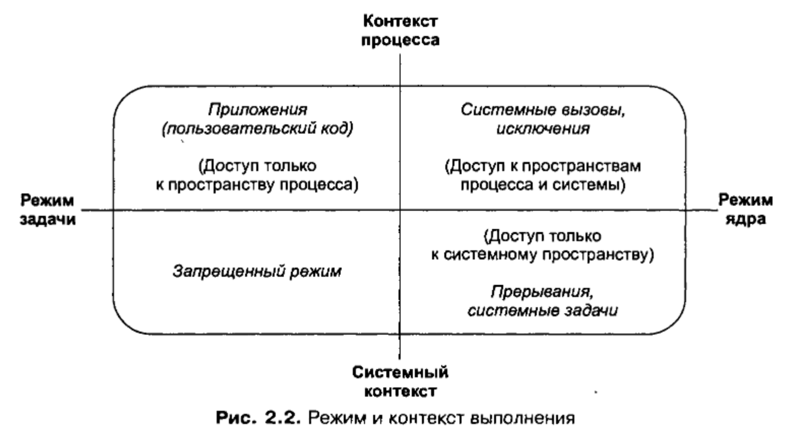

## Вахалия - "Unix изнутри", глава 8 - Базовые элементы и интерфейс файловой системы
### Механизм работы с символьными устройствами
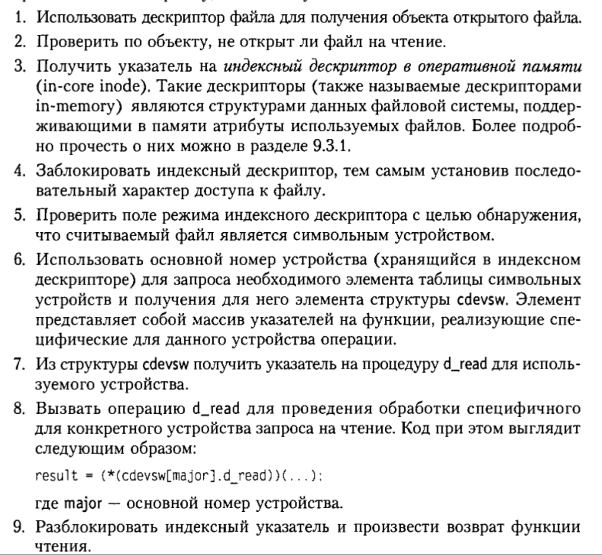

### vnode/vfs
`vnode` расшифровывается как Virtual node и не является тем же самым, что и `inode` (index node). Виртуальная нода - абстрактный "класс" (в той степени, в какой это понятие вообще применимо к языку C), который определяет базовые поля и функции, которые должны быть в какой-либо форме у элементов любой файловой системы. Индексная нода - уже конкретная реализация для регулярных файлов в файловых системах `s5fs` и `ufs` - в других системах структура может быть иной (`rnodes` у NFS).

В `vnode` и `vfs` есть 2 основных закрытых поля: ссылки на данные (`*_data`) и функции (`*_ops`) - их конкретная реализация зависит от файловой системы

В `vnode` зачастую `v_data` напрямую встраивается в структуру `vnode` (*то есть абстрактную часть структуры переписывают для каждой ФС*)

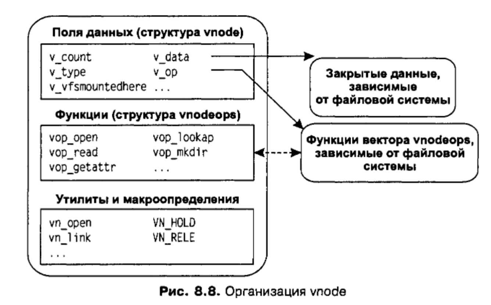
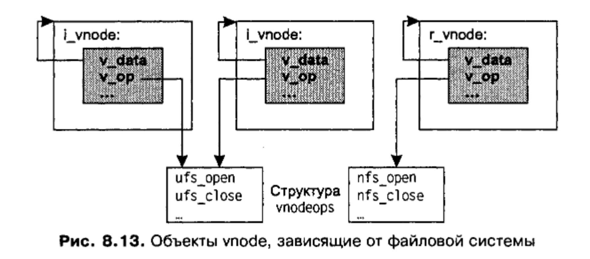

*Код структуры `vnode` смотри [ниже](#системный-вызов-open2-дескрипторы-файлов-file_t-и-vnode)*

`vfs` - virtual file system - также абстракция, стандартизирующая различные файловые системы и позволяющая монтировать их в единое дерево и использовать бесшовно

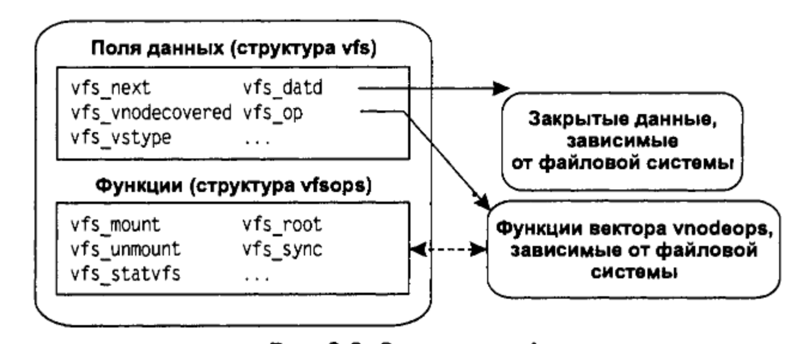

Не буду приводить здесь весь список парадигм `vfs`, отмечу лишь, что они должны быть stateless (не хранить результат работы в глобальных переменных, а записывать его по конкретным указателям или возвращать через `return`), уметь пользоваться в мягком режиме (не отбирая) ресурсами ОС и поддерживать серверную реализацию

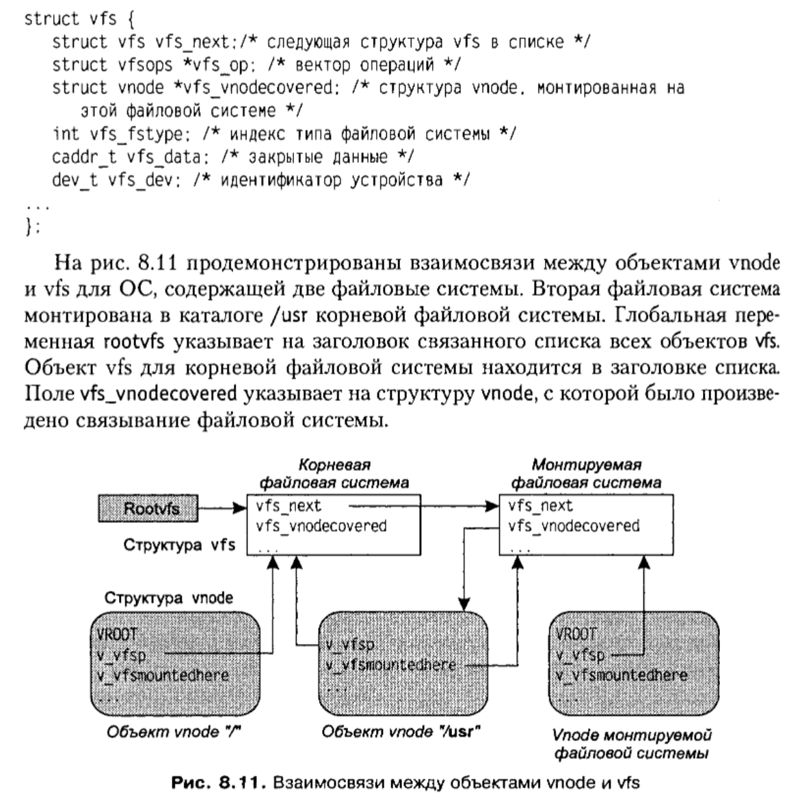

В отличие от `vnode` в реализации `vfs` редко хардкодится `vfs_data`:

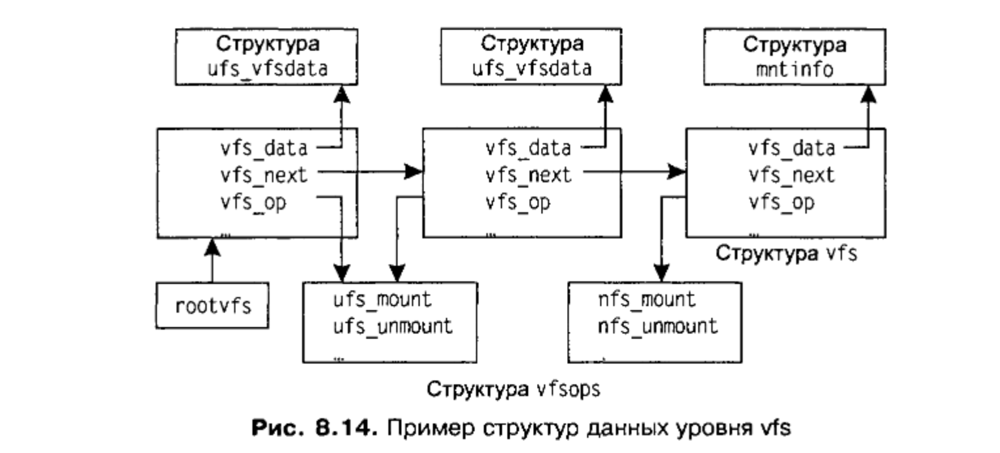

### *пауза, стр. 366.* Монтирование ФС

## Вахалия - "Unix изнутри", глава 16 - Ввод-вывод и драйверы устройств
### Что такое драйвер и каково его место в системе?
Драйвера - это простой интерфейс, связывающий периферийные устройства с ядром системы. Благодаря этому разработчики могут не задумываться о технических деталях каждого конкретного устройства.

Драйверы - обособленная часть ядра, представляющая собой структуры данных и функции, которые могут обращаться к одному или нескольким устройством (и никакая другая часть ядра этого делать не может). Драйверы не взаимодействуют между собой. Остальные компоненты ядра могут обращаться к драйверам только через определённые интерфейсы.

Прикладные процессы обращаются к драйверам через системные вызовы ядра, в этих системных вызовах используется подсистема ввода-вывода, которая уже взаимодействует с интерфейсом драйверов, через который получает доступ к конкретным внешним устройствам. Такая реализация позволяет одинаково работать как с регулярными файлами, так и с символьными устройствами.

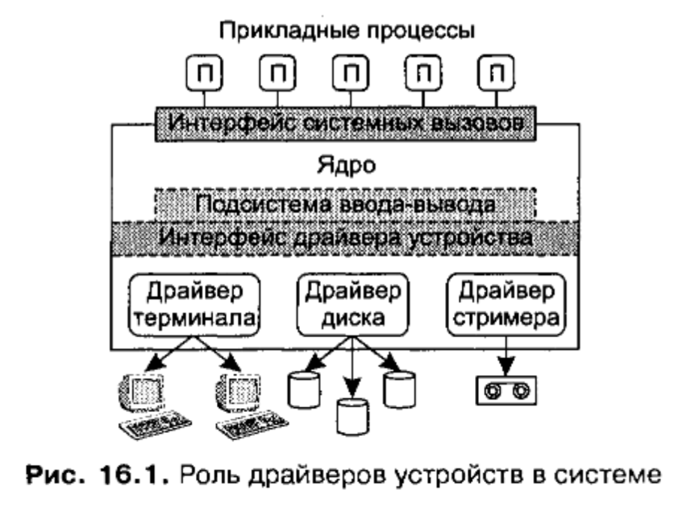

Подсистема ввода-вывода является высокоуровневой абстракцией и отвечает за буферизацию, управление доступом и раздачу имён драйверам. И только уже конкретный драйвер из интерфейса драйверов устройств может связываться, собственно с внешним миром.

Кроме запросов к устройству, драйвер, очевидно, отвечает и за обратную связь: передаёт данные от устройства, а также сообщения об ошибках. Как правило устройство передаёт данные с генерацией прерывания. Обработчик прерывания устройства также предоставляется драйвером.

### Реальные устройства
На самом деле устройства зачастую состоят из контроллера и, собственно, физического устройства, которое связывается с шиной компьютера через контроллер. К контроллеру может подключено несколько устройств (чаще всего однотипных). Контроллер обладает регистрами контроля и состояния (CSR). Контролирующие регистры доступны для записи в них значений, которые вызвают определённую реакцию в устройстве, регистры состояния - на чтения. Часто за функции контроля и возврата состояния отвечают одни и те же регистры => они доступны и на чтение, и на запись

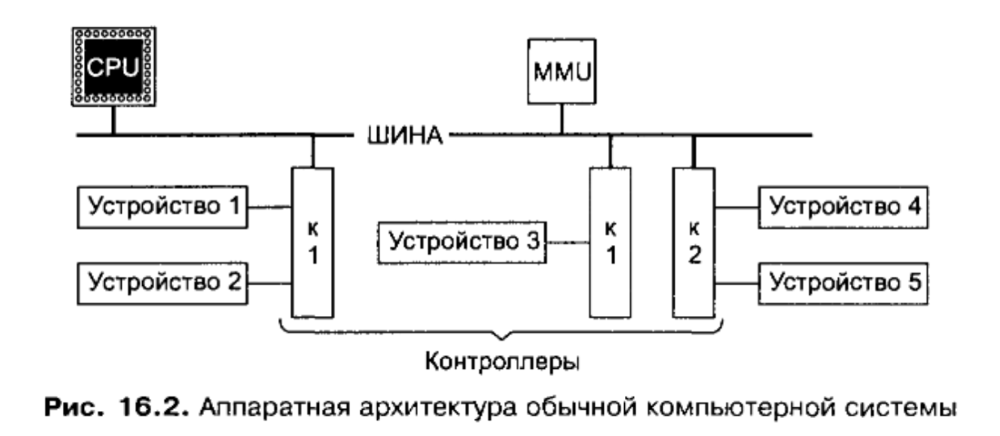

**Пространство ввода-вывода** - набор всех регистров контроллеров и фреймов для устройств, отображаемых в память.

Пространство ввода-вывода может быть как обособленной, так и частью основной памяти компьютера.

Контроллеры могут передавать данные двумя методами:
- Программируемый ввод-вывод (PIO) - данные от контроллера передаются побайтово процессору. Когда контроллер готов передавать или принимать данные, генерируется прерывание. Используется в медленных устройствах вроде терминалов
- Прямой доступ к памяти (DMA) - контроллеру передаются выделенные для него адреса памяти и другая информация для записи туда. Когда данные были записаны в память, процессору отправляется прерывание. Используется для устройств, работающих с большими массивами данных (диски, видеокарты)
  - Прямой доступ к виртуальной памяти (DVMA) - контроллеры обращаются к памяти через MMU, благодаря чему могут обмениваться данными даже между собой, не процессор

Приоритет прерывания устройство - число от 0 (низший приоритет) до 6, 7, 15 либо 31 (зависит от системы и аппаратной части), благодаря которому система решает, необходимо ли обработать прерывание сейчас (если приоритет прерывания выше приоритета системы) либо отложить обработку. При обработке прерывания системе присваивается его приоритет. У прикладных процессов и ядра приоритет 0

### Структура драйверов устройств
Устройства (а точнее их драйверы) в UNIX делятся на символьные и блочные:
- Блочные работают с блоками обычно размера `512*2^i | i >= 0` байт. Блоки хранятся либо в определённых участках памяти либо в буферном кэше. Доступ производится через структуру `buf` (в случае с обычной памятью ячейки `buf` будут хранить указатели на неё)
- Символьные устройства - передают набор байтов произвольного объёма. Не поддерживают произвольный доступ или поиск. Могут передавать данные побайтово или поддерживать внутреннюю буферизацию

STREAMS - дополнительный тип драйверов, который наследуется от символьных устройств и представляет более функциональный интерфейс для работы в первую очередь с сетевыми устройствами.

**Псевдоустройства** - к ним привязаны драйверы, не управляющие физическим устройством, а дающие другие полезные интерфейсы (`mem`, `null`, `zero`)

Ядро обращается к драйверу в 4 случаях:
- Первоначальная настройка при запуске системы - синхронно, работает в системном контексте
- Ввод-вывод - синхронно, работает в контексте вызвавшего системный вызов процесса
- Управление устройством - синхронно, работает в контексте вызвавшего системный вызов процесса
- Обработка прерываний, полученных от устройства - асинхронно, работает в системном контексте

**Переключатели устройств** - структуры, хранящие определённые для данного устройства точки входа (функции). Для блочных устройств структура `bdevsw`, а для символьных - `cdevsw`. Для обеих этих структур в системе определён глобальный массив. 

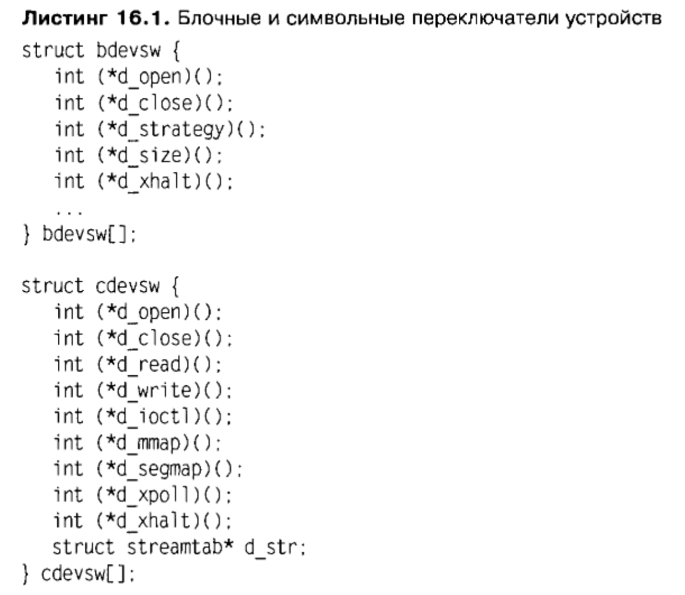

Не все переключатели устройств реализуют все точки входа. Если функции не существует, её указатель приравнивается к `nodev()`, которая завершается с кодом ошибки `ENODEV`. Если функция ничего не делает, но может быть вызвана, ей присваивается `nulldev()`

Поле `struct streamtab* d_str` содержит указатель на структуру устройств STREAMS, если это символьное устройство является таковым.

Каждый файл в своей индексной структуре имеет **основной номер устройства** - индекс в массиве переключателей устройств на тот драйвер, который отвечает за работу этого устройства.

#### Некоторые из функций драйверов
`d_strategy()` - общая точка входа для запросов ввода-вывода. Работает асинхронно и может помещать запросы в очередь

`d_ioctl()` - управляющий запрос к символьному устройству. Является обёрткой для множества разных команд. Команда определяется аргументом-номером `cmd`, дополнительные аргументы `arg`

`d_segmap()`, `d_mmap()` - первый отвечает за отображение символьного устройства в память процесса, если для него был вызван `mmap()`. Второй проверяет корректность указанного смещения в виртуальной памяти, если `d_segmap() == NULL`

`d_xpoll()` - опрашивает устройство на предмет определённого события

`d_xhalt()` - завершает работу устройства, управляемого драйвером

Точки входа для инициализации драйверов и обработки прерываний как правило не указываются в переключателях устройств, а записываются в файле конфигурации вместе с приоритетом прерывания, индексом его вектора и некоторыми другими данными.

В UNIX SVR4 есть 2 функции инициализации - `init` и `start`. Они хранятся в глобальных массивах `io_init[]`, `io_start[]`. `init` вызывается до инициализации ядра, `start` - после

### Подсистема ввода-вывода
Идентификация и обращение к устройствам осуществляется через несколько разных пространства имён:
- Аппаратное пространство - номер контроллера + номер устройства в нём
- Пользовательское - имя файла
- "Типовое" (*нет точного название*)

В поля типового пространства имён входят:
- Тип (символьное или блочное)
- Старший номер - индекс в массиве переключателей устройств
- Младший номер - конкретный экземпляр устройства (обычно эти 2 поля кодируются в число и потом разбираются на старший и младший номер побитово. В старой версии юникс было число 16 = 8 + 8, а SVR4 - 32 = 14 + 18)
- Дополнительные поля в SVR4
  - Внешний номер устройства - показывают видимое пользователю представление устройства (`i_rdev` - сейчас принимает значения, указывающие на тип устройства)
  - Внутренний номер - индекс в таблице переключателей (*несколько загадочно его существование при наличии старшего номера. Возможно дело в том, что внешний/внутренний и старший/младший номер комбинируются попарно, но это тоже странно*)

Файл-устройство - файл, ассоциированный с устройством (более корректно сказать, что это файл, ассоциированный с драйвером устройства - тогда мы включим в определение сразу и файлы псевдоустройств)

Теперь заявляется, что в индексном файле устройства (`inode`) поле `di_mode` содержит тип устройства, а `di_rdev` - его старший и младший номера (*это несколько противоречит последним пунктам из списка, хотя может речь тут об общем варианте для UNIX*). В остальном индексный файл похож на индексный файл обычного регулярного файла - права доступа и прочие параметры

#### `snode`
Для корректной работы поля `v_op` в структуре `vnode` парадигмы [`vnode`/`vfs`](#vnodevfs) для драйверов устройств используется особая ФС - `specfs` - обращение к файлам в ней подменяет базовые операции из `v_op` (которые были бы там, так как каталог устройств `/dev` находится в ФС `ufs`) на точки входа соответствующего переключателя устройств. Обращение к `specfs` происходит благодаря полям `di_mode` и `di_rdev`. На самом деле точки входа устройства определены в теневой структуре `snode` (shadow node), которая сопоставлена в таблице `vnode` соответствующего файла (а с точки зрения организации структур `snode` является обёрткой над `vnode`, т.е. в дальнейшем мы будем обращаться к файлу-устройству через `vnode`, хотя фактически обращение будет идти через функции `snode`, которая определяет особое поведение как раз по полям `di_mode` и `di_rdev`)


На самом деле `snode` разделяется на две части: общую - одну на устройство и частный `snode` для каждого файла-устройства, в котором будут ссылки `v_op` на операции, зависящие от конкретного файла. Таким образом при первом открытии драйвера будут созданы `common snode` и `snode`, а при последующих - только `snode`

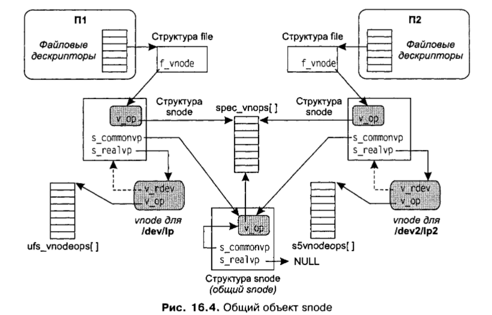

### Клонирование устройств
Когда пользователь хочет создать копию файла устройства для работы с устройством, ему безразличен выделенный младший номер. Поиск младшего номера в этом случае поручается системе, а пользователю достаточно открыть устройство нужного типа с младшим номером для клонирования (при обращении к этому номеру нам будет создан файл-устройство с другим свободным младшим номером).

В более продвинутых методах (например для устройств STREAMS) определены особые драйверы копирования: в они содержат старший номер устройства для копирования как свой младший номер. Таким образом, для каждого типа устройств у нас будет свой драйвер копирования, а выбор свободного младшего номера копируемого устройства будет делегирован `d_open` этого устройства

### Системный вызов `poll(2)`
Если мы хотим работать сразу со множеством устройств, похожего типа (например дескрипторы файлов-устройств для интернет протокола, которые обрабатывает сервер), то использовать для каждого `read` сразу крайне неудобно, так как этот системный вызов будет блокировать процесс либо отрабатывать впустую. Вместо этого используется системный вызов `int poll(struct pollfd *fds, nfds_t nfds, int timeout)`, который ожидает события на любом дескрипторе из массива `fds` длиной `nfds` `timeout` миллисекунд.
```c
struct pollfd {
    int   fd;         /* file descriptor */
    short events;     // Битовая маска ожидаемых событий
    short revents;    // Битовая маска реально произошедших событий. 0, если никаких событий не было
};
```
`timeout`:
- `0` - вызов завершится мгновенно (быстрый опрос дескрипторов)
- `-1` или `INFTIM` - заблокировать вызов, пока не произойдёт ожидаемое событие хотя бы на одном из дескрипторов

Значения в масках `events` и `revents`:
- `POLLIN` - можно прочесть данные с дескриптора без блокировки
- `POLLOUT` - данные могут быть записаны без блокировки
- `POLLERR` - в устройстве или дескрипторе произошла ошибка
- `POLLHUP` - разрыв связи
- *другие события смотри в `man poll`*

Возвращает функция `poll` число произошедших ожидаемых событий либо `0` при истечении `timeout`, либо `-1` при ошибке.

*Зачастую `poll(2)` используется для символьных и STREAMS устройств, хотя поддерживает любые устройства. У символьных внутри этого вызова задействуется `d_xpoll()`, у STREAMS - `strpoll()`*

Проходя по дескрипторам опрашиваемых устройств, если ещё ни одно устройство, включая текущее, не вернуло запрашиваемое событие, системный вызов будет создавать структуры `pollhead` для каждого дескриптора, к которой будут прикрепляться структуры `polldat`, указывающие на заблокированный процесс и на другие его структуры `polldat` (также дам хранится ожидаемое событие). Это позволит в дальнейшем драйверу при возникновении события на устройстве быстро разбудить все заблокированные им процессы и передать им нужные данные (выполнившие своё предназначения `polldat` будут удалены из очереди в `pollhead`).

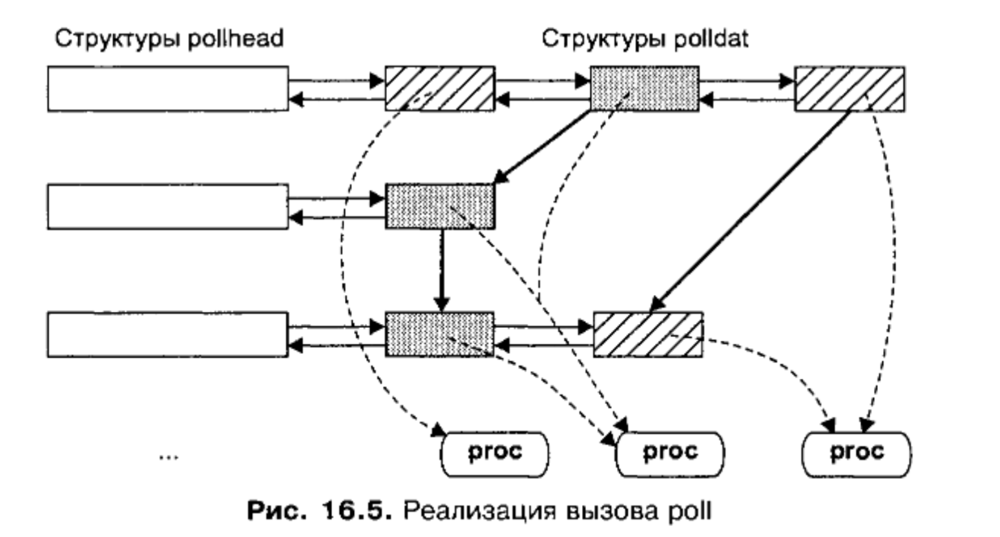

Достаточно похожим внутренним мехазнизмом и предназначением обладает системный вызов `select(2)`. `int select(int nfds, fd_set *readfds, fd_set *writefds, fd_set *exceptfds, struct timeval *timeout)`:
- `nfds` - набиольший номер дескриптора + 1
- указатели типа `fd_set*` описывают дескрипторы, для которых мы ожидаем готовности на чтение, запись или возврат ошибки соответственно. Меняются `fd_set`ы через фукнции:
  - `void FD_CLR(int fd, fd_set *set);`
  - `int  FD_ISSET(int fd, fd_set *set);`
  - `void FD_SET(int fd, fd_set *set);`
  - `void FD_ZERO(fd_set *set);`
- `timeout` - указатель на структуру `struct timeval*`:
```c
struct timeval {
    long    tv_sec;         /* seconds */
    long    tv_usec;        /* microseconds */
};
```

Вызовы `poll` и `select` имеют дополнтиельные версии `ppoll` и `pselect`, которые могут завершиться либо при получении события от устройства, либо при получении указанного в `const sigset_t *sigmask` сигнала

#### Использование `poll(2)` для сокетов
Тут будет просто [сслыка на документацию IBM](https://www.ibm.com/docs/en/i/7.1?topic=designs-using-poll-instead-select)

### *Пропускаю секцию 16.6 "Ввод-вывод блочных устройств" из-за ненужности в данный момент*

### Спецификация DDI/DKI
Спецификация **Device-Driver Interface / Driver-Kernel Interface** стандартизирует правила взаимодействия драйверов с ядром так, чтобы они могли корректно сосуществовать между собой и с другими компонентами ядра. В спецификации содержит исчерпывающее описание структур данных драйвера, его точек входа в ядре, необходимых данных от ядра и используемых из него точек входа, а также необходимых для работы драйвера дефайнов.

Начиная с SVR4 в спецификацию были добавлены улучшения, обеспечивающие или требующие поддержку многопроцессорности и динамической загрузки драйверов загрузчиком времени исполнения.

## Вахалия - "Unix изнутри", глава 17 - Подсистема STREAMS
Подсистема STREAMS предоставляет разработчикам драйверов удобный модульный интерфейс, который позволяет реализовывать сложную обработку данных с символьных устройств (буферизацию, приоретизацию данных, служебные символы и др.)

**Поток (stream)** - полнодуплексный канал вычислений и обмена данными между драйвером в области ядра и процессом в прикладной области. **STREAMS** - набор системных вызовов, процедур и ресурсов для работы с потоками.

Поток полностью располагается в ядре и состоит из головного интерфейса (stream head), оконечного драйвера (driver end) и расположенных между ними модулей (которых может и не быть) - все эти части имеют 2 очереди сообщений: write queue и read queue. Любой модуль может передавать данные вниз по очереди записи, вверх по очереди чтения и между очередями чтения и записи внутри себя. Stream head связана с процессом в прикладной области через системные вызовы, driver end связан непосредственно с устройством (либо псевдоустройством, которое также может представлять из себя поток).

Такое устройство позволяет легко создать драйверы для разных нужд, просто по разному комбинируя модули

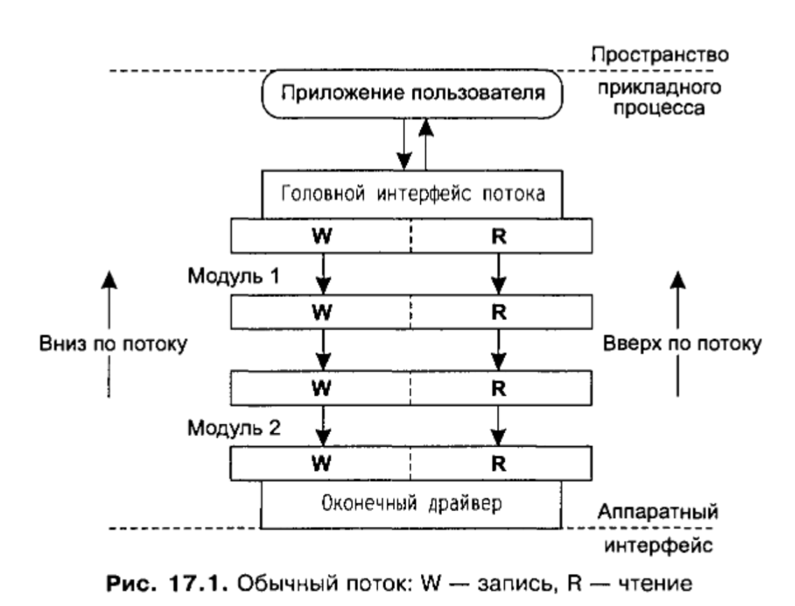
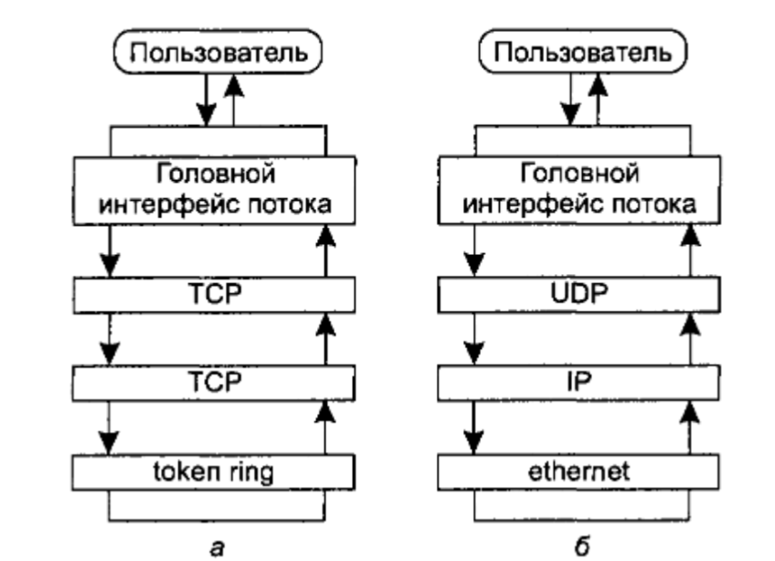

Модули потока могут быть мультиплексными по входу, выходу либо двунаправленными, то есть иметь быть связанными с несколькими модулями выше, ниже или и там, и там соответственно. Это позволяет не создавать отдельные похожие каналы, а создать один *супер*-канал для реализации похожих интерфейсов

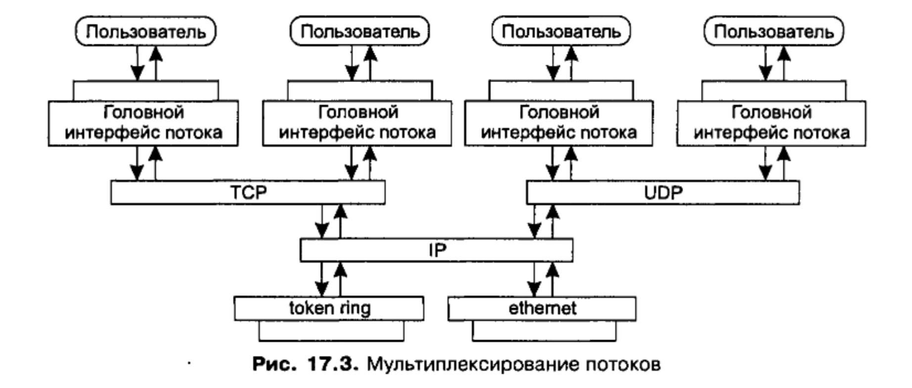

### Сообщения
**Сообщения** - единтсвенный метод коммуникации между модулями STREAMS. Содержат как сами данные, так и управляющую информацию

Сообщение состоит из трёх основных структур:
- `mblk_t msgb` - основная информация о сообщении
  - `b_next` / `b_prev` - ссылки на очередь (то есть такие же структуры `msgb`)
  - `b_cont` - продолжение этого сообщения
  - `b_rptr` - начало активной части буфера. Сдвигается при чтении из него (то есть буфер одноразовый)
  - `b_wptr` - конец активной части буфера (сдвигается не дальше `db_lim` вызовом `allocb()`)
  - `datab` - указатель на структуру `datab`
- `dblk_t datab` - структура информации о буфере
  - `db_base` - начало буфера
  - `db_lim` - конец буфера
- Собственно, самого буфера


*О других полях речь пойдёт дальше*

Такая организация сообщений очень удобна для подсоединения новых блоков в начало и конец, что позволят, например, разным уровням протоклов связей навешивать на сообщение важную для последующих уровней информацию

`datab.db_ref` - счётчик ссылок, позволяющий использовать одну и ту же `datab` несколькими `msgb`
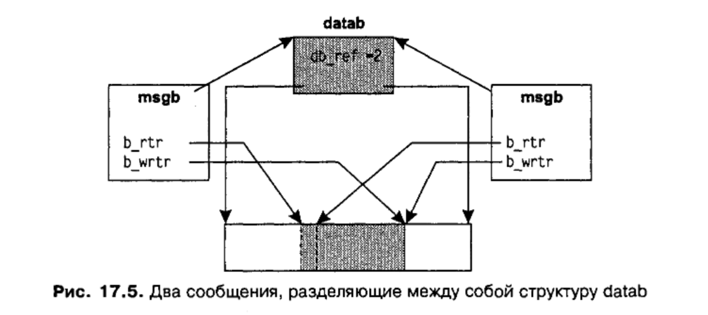

`datab.db_type` определяет тип сообщения (или цепочки сообщений). Делятся на обычные и высокоприоритетные

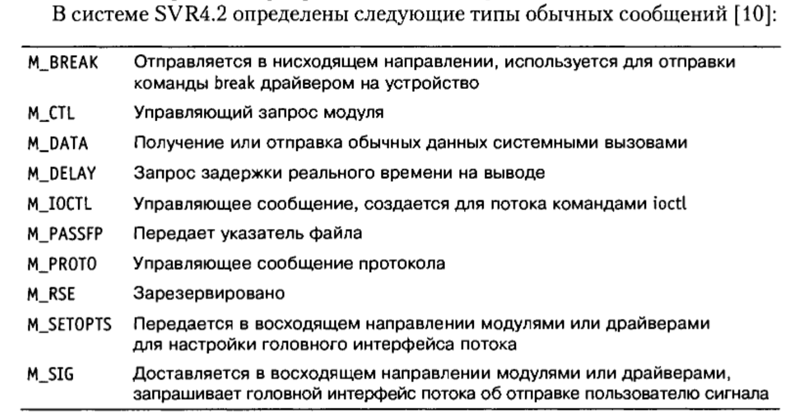
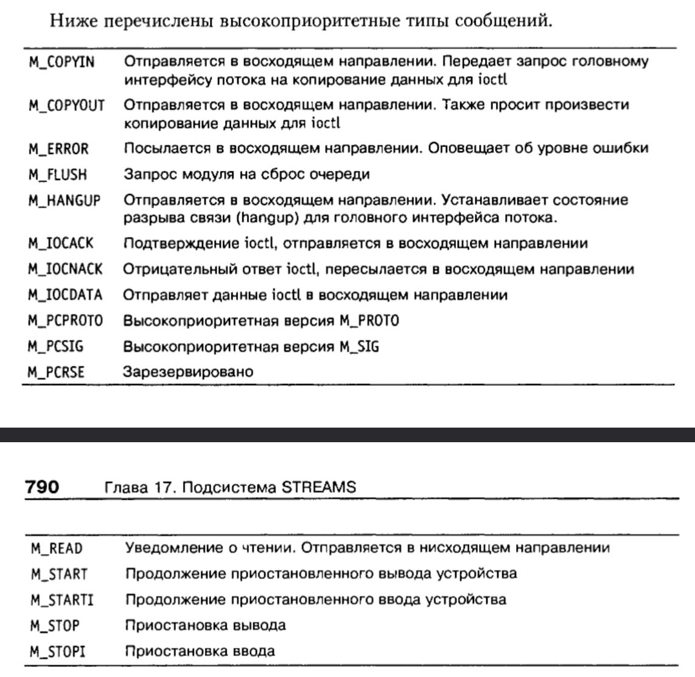

### Очереди и очереди сообщений
Модуль состоит из двух структур **очередей** с определёнными полями, каждая очередь харнит в себе **очередь сообщений**, содержимое элементов которых было описано выше. (в данном случае **очередь** означает именно особые структуры модуля, а вот **очередь сообщений** - это самое простое понимание очреди как структуры данных)

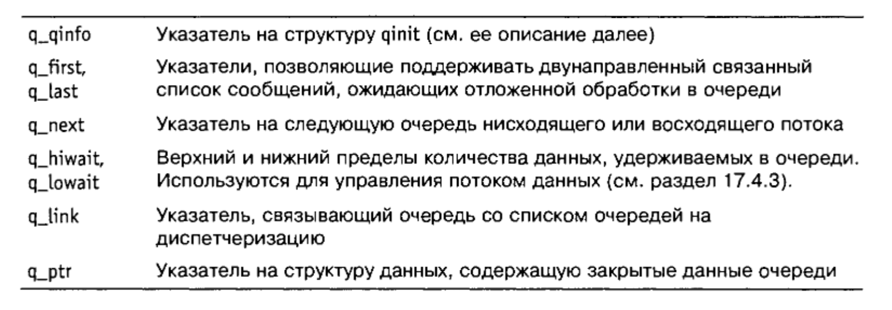

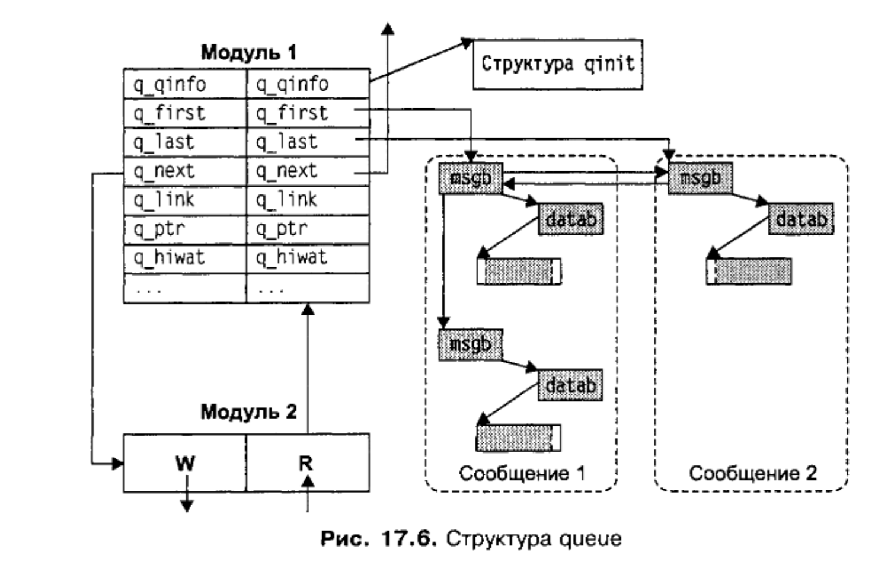

Структура `qinit` содержит базовые операции очереди (из них `service` не обязательная)

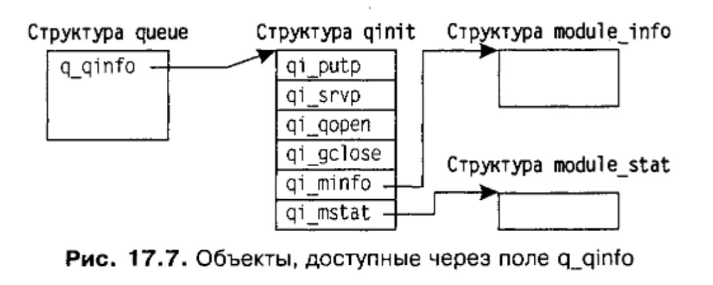

### Ввод-вывод потока
#### Головной интерфейс
Прикладной процесс отправляет данные в поток через системные вызовы `write` либо `putmsg` головного интерфейса и принимает данные через `read` либо `getmsg`. **Это единтсвенные блокирующие вызовы, связанные с потоками**. 

`read`/`write` предназначены для чтения простых байтовых сообщений (хотя `read` и может интерпретировать управляющие сообщения как простой текст), тогда как `putmsg` и `getmsg` позволяют отправлять/получать управляющие и текстовые сообщения

#### Очереди модулей и работа с очередями сообщений
Очереди модулей передают данные следующему модулю через вызов `putnext`, который внутри себя вызвает процедуру `put` для очереди модуля по указателю `q_next`. Напрямую с `put` других модулей текущий модуль не работает, но, очевидно, может работать со своим `put` (например, для отправки сообщения в очередь-соседа другого направления)

Если `put` не может отправить данные в следующую очередь, они будут помещены в текущую очередь, а позже процедура `service` попытается их обработать корректным образом. При таком сценарии `put` вызовет `putq`, который пометит очередь флагом `QENAB` и поставит глобальный флаг `qrunflag`. Помеченные `QENAB` очереди будут обрабатываться через `service` при вызове процедуры `runqueues` ядром при попытке ввода-вывода или возврате в прикладной режим. Такая организация диспетчеризации.

**Модуль может не поддерживать внутреннюю очередь сообщений.**
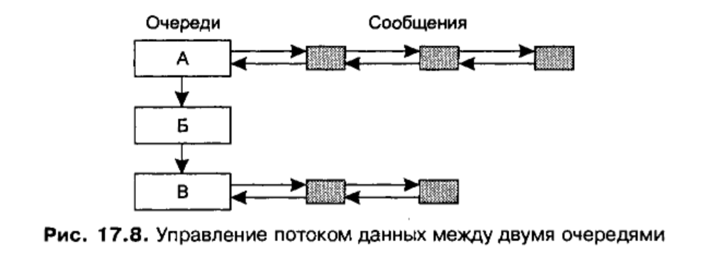
Для модулей без внутренней очереди не будет процедур `putq` и `service` (и тех, что с ними связаны). Очереди сообщений могут быть полностью заполнены, в таком случае сообщение не должно быть отправлено даже в модуль без очереди сообщений, если ниже него стоит блок. Для корректной работы такого сценария используется операция `canput` внутри `putq`, которая идёт в обратном направлении направлению очередей и проверяет возможность передачии сообщений. Таким образом, если будет заблокирована очередь сообщений модуля В, то и модуль Б без очереди вернёт `false` для процедуры `canput` очереди А, в таком случае А поместит сообщение обратно в свою очередь при помощи процедуры `putbq` и пометит очередь ожидающей диспетчеризации

#### Дополнительная приоретизация
Кроме деления на обычные и высокоприоритетные сообщения в посистеме STREAMS реализованы также **уровни приоритетов** (priority bans), которые позволяют обрабатывать обычные сообщения в определённом порядке. Уровень приоритета задаётся от `0` до `255`. Для каждого уровня в структуре очереди создаётся особая структура очереди сообщения `qband`. Таким образом, полная приоретизация выглядит так: `service` внутри себя вызывает `getq`, который:
- Обабатывает высокоприоритетные сообщения
- Обрабатывает сообщения из очередей сообщений `qband` в порядке убывания их приоритета

#### Оконечный драйвер
Также является модулем, но с несколькими отличиями:
- Должен поддерживать обработку прерываний от устройства
- Зачастую не имеет очереди сообщений и уничтожает сообщения, которые не может отправить на устройство (сохранность данных полностью ложится на прикладной процесс или вышестоящие модули как сделано, например, в протоколе TCP, где модули не удаляют сообщения из своих очередй, пока не получат подвтерждения его получения ниже)

### *Пропускаю разделы 17.5,6,7,8 (начиная со стр. 799)*

### FIFO и каналы
#### Небольшая выжимка из 6.2.2
**Программные каналы (pipe)** - однонаправленный неструктурированный поток данных, фиксированного максимально размера, работающий по принципу FIFO.

На входе и выходе канала может быть несколько процессов, при этом мы никак не можем управлять тем, какой процесс прочтёт данные из канала. Данные в канале никак не разделяются на блоки.

Программные каналы создаются системны вызовом `pipe` и выдают 2 дескриптора для работы с ними (один на запись, другой - на чтение). Дескрипторы будут наследоваться процессами-потомками, которые и будут общаться через канал.

<hr>

*Возвращаемся к главе 17*

#### Файлы FIFO
Файлы FIFO - реализация каналов в SVR4 как файлов. Создаются системным вызовом `mknod` и позволяют удобнее получать доступ к каналу, что, однако, понижает безопасность и по понятным причинам требует больше ресурсов. Все FIFO файлы создаются в рамках особой ФС `fifofs`, которая обеспечивает операции для работы с pipe, оборачивая `vnode` в `fifonode` очень похожим на `snode` образом. При первом вызове `open` для файла FIFO будет создан канал STREAMS с очень простой организацией модулей (идём вниз по очередям записи и тут же вверх по очередям чтения)

#### Неименованные каналы
В SVR4 также реализуются через подсистему STREAMS. Оба дескриптора ДВУНАПРАВЛЕННЫЕ, при этом фактически создаётся 2 структуры `file_t` и 2 `fifonode` с перекрёстной связью - запись по первому дескриптору направит данные для чтения по второму и наоборот.

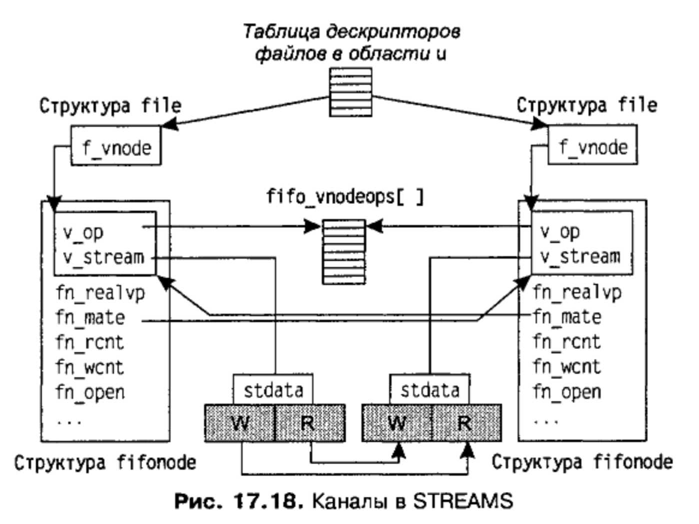

Такая реализация может быть *"удобна"* для привязывания дескрипторов к произвольным файлам через функции библиотеки C `stropts.h` `fattach` (отвязывания через `detach`), что позволит получить доступ к этому каналу другим процессам (*звучит немного безумно, ведь мы можем привязать дескриптор ВООБЩЕ К ЛЮБОМУ ФАЙЛУ, на который у нас есть право записи. Вариант с использованием `mknod` выглядит куда безопаснее, но у этой версии есть, пожалуй, одно преимущество - можно привязать лишь дескриптор на чтение или запись... Вроде бы*)

### Сетевые интерфейсы
#### Интерфейс поставщиков транспорта
**Интерфейс поставщиков транспорта (TPI)** - сетевой модуль (как TCP) четвёртого (транспортного) уровня сетевой модели OSI, который реализует связь между поставщиком транспорта и его пользователем. TPI не обладает простым программным интерфейсом, но обладает высокой независимостью и универсальностью. Через модули его потока могут передаваться управляющие сообщения и пакеты с данными

#### Интерфейс транспортного уровня
**Интерфейс транспортного уровня (Transport layer interface - TLI)** - процедурный интерфейс для открытия и использования сетевых соединений. Позволяет реализовывать клиент-серверное взаимодействие с установкой соединения или без него.

Последовательность работы для варианта с установкой соединения такова:
- Свервер:
  - `t_open` создаёт транспортную точку
  - `t_bind` подключает точку к порту
  - `t_listen` ожидание до момента, пока клиент не запросит соединение
- Клиент (как правило на другой машине):
  - `t_open`, `t_bind` работают похоже
  - `t_connect` посылает запрос на соединение с сервером и ждёт
- Сервер принимает запрос и посылает подтверждение установки соединения через `t_accept`
- Клиент выходит из `t_connect`
- Теперь клиент и сервер могут общаться между собой при помощи блокирующих вызовов `t_snd` и `t_rcv`

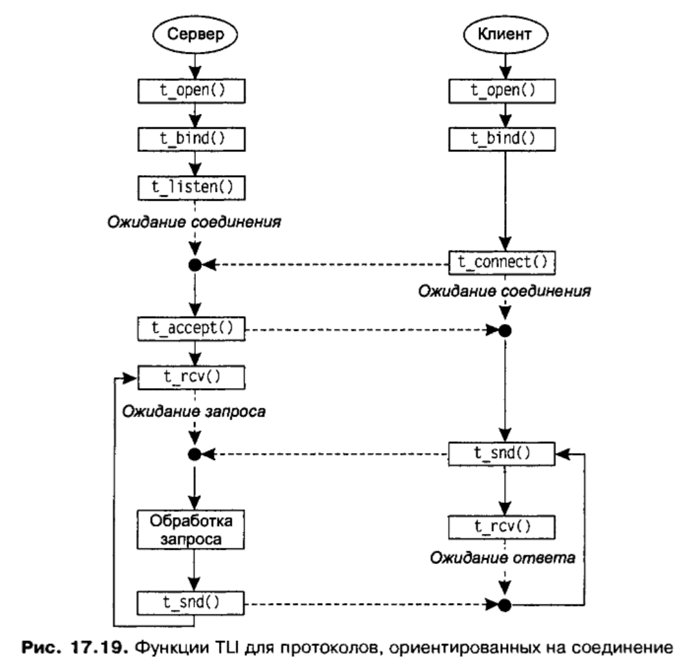

Вариант без установления соединения работает достаточно похоже, но без `t_listen`, `t_connect` и `t_accept`, а для обмена данными используются блокирующие вызовы `t_sndudata` и `t_rcvudata`

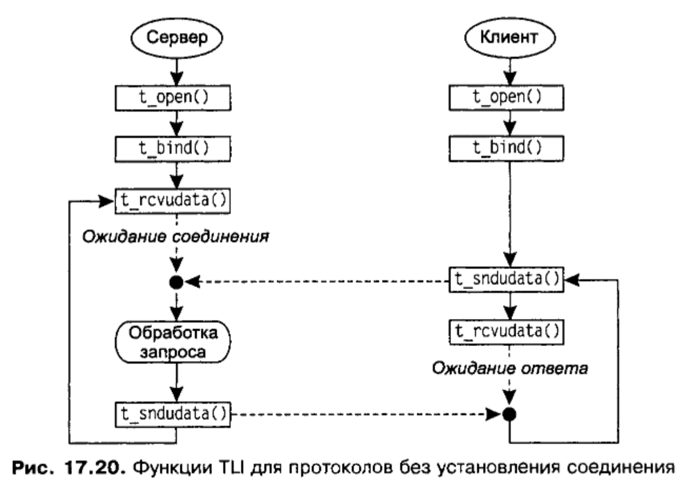

#### Сокеты
**Сокет** - конечная точка соединения, представленная в виде абстрактного объекта, который может быть использован процессом для отправки и получения сообщения (*определение из [пометок к лабе](#сокеты-заметки-к-30-й-лабе) мне нравится больше*)

По принципу работы сокеты очень похожи на TLI - между функциями можно поставить почти полное соответствие
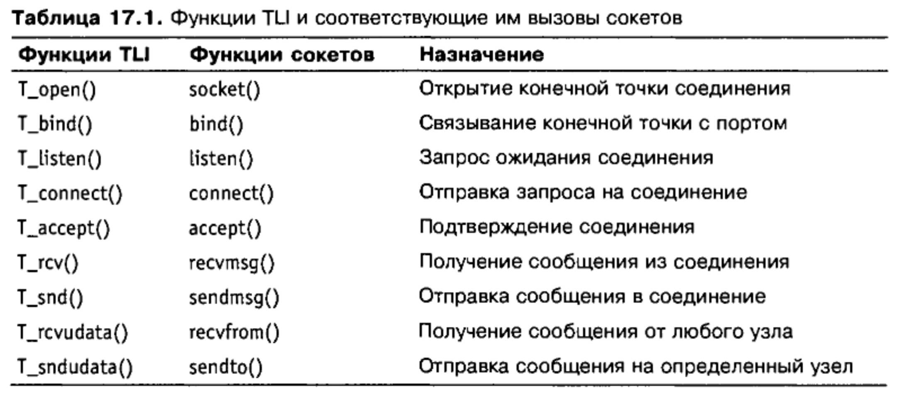
*Нигде тут об этом не сказано, но из мана и на практике могу утверждать, что `listen` для сокетов не блокирующий - им мы просто помечаем, что данный дескриптор будет относиться к серверному сокету. За подробностями ещё раз [отсылаю к лабе 30](#сокеты-заметки-к-30-й-лабе)*

В SVR4 сокеты реализуются при помощи библиотеки `socklib` и модуля подсистемы STREAMS `sockmod`. Библиотека отвечает за вызов системных вызовов и работу с принятыми/отправленным сообщениями потока. Модуль `sockmod` встраивается прямо под оголовных интерфейс и взаимодействует с транспортным протоколом.

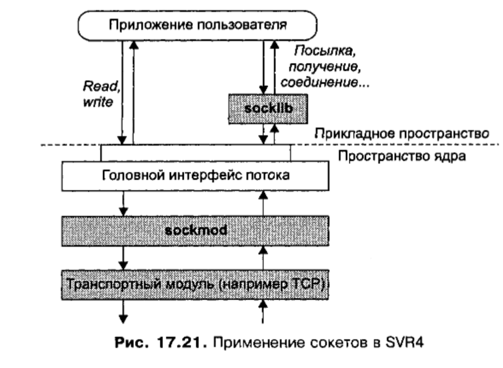

Модуль `sockmod` будет отвечать за сохранение адреса получателя со стороны сокета-клиента, благодаря чему после вызова `connect` мы в дальнейшем сможем обращаться к серверу через клиентский сокет, просто вызывая `read`/`write` и др.

При этом на стороне сервера будут сохраняться множество адресов, что позволит серверу запоминать подключённых клиентов и взаимодействовать со всеми ими, хотя [код для этого станет несколько сложнее](#использование-poll2-для-сокетов)

## Некоторые функции и системные вызовы
После функции будет стоять `2`, если это системный вызов, и `3C`, если это C-библиотека
- `perror()` - `3C` - будет часто использоваться, и очень удобна для вывода ошибок в `stderr`
- `time()` - `2` - возвращает время в секундах с начала **ЭПОХИ (1 января 1970, 00:00:00 UTC)**

## Распределение памяти, работа API malloc/free
[Статья с базовыми принципами](https://habr.com/ru/companies/ruvds/articles/740466/):
- `malloc` выделяет указанное количество байт в виртуальной памяти и возвращает указатель на начало выделенной области либо `NULL`, если память не была выделена
- Чтобы `free` мог очищать отдельные блоки памяти, он должен знать их стртовый адрес и размер блока
- Если освобождаются несколько лежащих рядом блоков, они объединяются в одной общее свободное пространство. Этот метод называется `coalescing`
- Возникает проблема фрагментации памяти: если мы выделяем маленькие куски памяти, а потом избавляемся лишь от части из них, мы получим область памяти, в которой возможно много свободных ячеек, но идут они не последовательно, а значит не могут быть использованы
  - **Решение: избыточное выделение памяти** - выделять память блоками, допустим, по 4 байта. Тогда при очистке у нас будет куда больше свободной памяти. **Проблема:** если мы много раз выделяем малые объёмы памяти, то с точки зрения программы занятой будут считаться многие ячейки, которые на самом деле свободны
    - **Решение:** использовать разные участки памяти для выделения памяти разного размера. Например, выделить 25% для малых участков (меньше 4 байт), а остальную - для больших
- `boundary tag allocator` - для каждого участка памяти используются дополнительные ячейке:
  - `address` - здесь записан размер блока памяти (`size`)
  - `status` - флаг, указывающий, занят этот блок или нет
  - `address + 2 + size` - конец блока памяти, также хранит `size`. Это необходимо для реализации `coalescing`

## `fork`, `exec`, `wait` - комментарии к 9-й лабе
*Переписать в человеческий вид*
```
fork(2)
  pid_t fork(void) - создаёт процесс-потомок копированием текущего процесса. 
    Наследует открытые дескрипторы и некоторые другие ограничения (uid, sid, pgid, gid)
    Наследуется всё адресное пространство. При этом используется парадигма copy-on-write, 
      то есть копирование памяти производится только перед первой попыткой записи (кроме сегментов, выделенных с флагом MAP_SHARED)
    В процессе-родителе возвращает PID созданного потомка, в потомке - 0

exec(3) - функции этого вида заменяют образ процесса на новый (переписывает TEXT, DATA, BSS и STACK), запуская тем самым какую-то другую программу.
  Из такого механизма запуска также следует то, что исполнение кода исходного процесса не продолжится после завершения вызванного exec
  все функции записываются как `exec(l/lp/le/v/vp/vpe)`. Первым аргументом всегда идёт путь до исполняемого файла, далее идут различия в зависимости от суффиксов
    - за аргументы, передаваемые вызываемому файлу, отвечают флаги:
      - l - аргументы идут через запятую (первый аргумент - имя исполняемого файла, последний - (char*)NULL)
      - v - аргументы передаются как указатель на char** (принцип тот же, что при передаче аргументов в main)
      - e - после аргументов передаются переменные окружения через char** envp (execve(char* path, char** args, char** envp))
    - p - вместо пути до исполняемого файла можно указывать его имя. Тогда файл будет искаться в директориях из PATH. Если имя начинается с "/", значит указывается путь и PATH будет игнорироваться
  
  Все описанные выше функции являются обёрткой над системным вызовом execve(2):
  int execve(char* filename, char** args, char** envp) - из описанных суффиксов значение аргументов должно быть ясно

wait(2) - системные вызовы из этой группы используются для того, чтобы в процессе-родителе дождаться изменения состояния процесса-потомка
  Возможные изменения: ребёнок прекратился, был остановлен или продолжен сигналом
  pid_t waitpid(pid_t pid, int* status, int options) - останавливает исполнения до момента изменения состояния потомка с ID pid.
    Возвращает pid_t процесса-потомка, который изменил своё состояние
    Значения pid:
      < -1 - любой процесс-потомок из PGID = |pid|
      -1 - любой потомок
      0 - любой потомок с таким же PGID, что и у текущего процесса
      > 0 - процесс с PID = pid
    options - побитовый набор флагов (то есть собираются через побитовое ИЛИ):
      WNOHANG - продолжится исполнение, если ни один процесс не завершился. При успешном исполнении вернёт 0
      WUNTRACED - ребёнок остановился (но не отслеживается через ptrace(2))
      WCONTINUED - ребёнок продолжил исполнение (получил сигнал SIGCONT)
    В аргумент int* status, если он не равен NULL, записывается состояние ребёнка, которое можно проверить макросами из wstat(2)

  pid_t wait(int* status) - останавливает исполнение до момента, пока любой из потомков процесса не завершится.
    Эквивалентное waitpid(-1, &status, 0)

  waitid() - более новый системный вызов, дающий больше контроля. Не очень актуален для наших задач.

  Выполнять wait в какой-либо из форм КРАЙНЕ ЖЕЛАТЕЛЬНО, так как иначе будут возникать процессы-зомби (см. блок про exit(2))

wstat(2) - (сейчас находится в разделе wait(2)) - набор макросов для проверки статуса, записанного в int status функций wait(2):
  WIFEXITED(status) - true, если процесс завершился нормально (через exit() либо return в main())
    WEXITSTATUS(status) - ТОЛЬКО ЕСЛИ WIFEXITED(status) - возвращает статус возврата, который хранится в 8 младших битах status
  WIFSIGNALED(status) - true, если процесс прекратился сигналом
    WIFSIGNALED(status) - ТОЛЬКО ЕСЛИ WIFSIGNALED(status)-  возвращает номер сигнала
    WCOREDUMP(status) - ТОЛЬКО ЕСЛИ WIFSIGNALED(status) - true, если ребёнок создал core-файл
  WIFSTOPPED(status) - true, если процесс был остановлен сигналом (возможно при опции WUNTRACED или ребёнок отслеживается через ptrace)
    WSTOPSIG(status) - ТОЛЬКО ЕСЛИ WIFSTOPPED(status), возвращает номер сигнала
  WIFCONTINUED(status) - true, если ребёнок продолжил исполнение после получения сигнала SIGCONT

ptrace(2) - *не очень относится к делу, но есть её упоминания

exit(3) 
void exit(int status) - вызывает завершение программы и возвращает код завершения status & 0377 родителю
  Все потоки ввода-вывода флашатся, все временные файлы удаляются.
  После завершения процесса, некоторая информация о нём остаётся в ядре (PID, статус заврешения, информация об использованных ресурсах), чтобы её мог получить родитель через wait(2).
  До момента вызова wait в родителе процесс будет в статусе зомби
    Если родитель сам завершился, то ребёнок будет прикреплён к процессу init, который вызовет wait для УбИйСтВа ЗоМбИ!!!

  atexit(3)

  on_exit(3) - ...

_exit(2)

Сигналы
  Сигнал - число, сообщающее о внешнем событии или ошибке. Посылаются от процесса к процессу или от ядра к процессу.
  Получающий процесс обрабатывает сигнал по одному из сценариев:
  - SIG_DFL - реакция по умолчанию
  - SIG_IGN - игнорирует сигнал
  - адрес функции - указанная функция перехватит сигнал
```

## Драйверы, устройства, псевдоустройства, (псевдо)терминалы и сессии - комментарии к 16-й лабе
```
/*
Понятие файла в UNIX распространяется на все сущности, поддерживающие ввод-вывод, в т.ч. каталоги символических ссылок, аппаратные устройства, псевдоустройства и элементы коммуникаций (каналы и сокеты).

Устройство представимо из двух основных частей: контроллер и механическая штука, связанная с контроллером, которая и является устройством.
Контроллер связан с шиной и может либо взаимодействовать напрямую с памятью через MMU, либо взаимодействовать с процессором.
  Порт - аппаратный интерфейс ввода-вывода.
  Драйвер устройства - программный интерфейс доступа к порту. Драйвер содержит аппаратно-зависимые функции ядра для работы с портами.
  Файл-устройство - файл, за реализацию операций ввода-вывода для которого отвечает драйвер устройства. Благодаря этому даже с очень разными устройствами процессы могут взаимодействовать через стандартный интерфейс ввода-вывод (write(2), read(2) и др.)
  Псевдоустройство - виртуальный объект, обслуживаемый специальным драйвером, поддерживаемым все те же интерфейсы, что и обычный.

Устройства подразделяются на символьные и блочные.
  Символьные устройства должны реализовывать базовые функции из структуры struct cdevsw: open, close, read, write и, возможно, другие.
    Структура struct cdevsw хранится в виде глобального массива cdevsw[], который называется переключателем символьных устройств. 
    Каждое устройство имеет в нём свой уникальный индекс (основной номер устройства) на структуру, содержащую реализованные для этого устройства функции.
    Основной номер устройства хранится в inode символьного устройства.

Что такое терминал и псевдо-терминал? 
  Терминал - устройство ввода-вывода для работы с текстовой информацией. 
  Классические терминалы были представлены телетайпом или клавиатурой и видеотерминалом.
  
  Псевдотерминал, как следует из определения устройства, имитирует поведение обычного терминала. 
    Используется для удалённого подключения по ssh и другим протоколам, а также для терминальных сессий.
    Состоит псевдотерминал из двух псевдоустройств: ведущего /dev/pts/XX и ведомого /dev/pty/XX - подаваемые в ведущий терминал данные будут считываться ведомым и наоборот.
    Вводимые с клавиатуры символы идут из ведомого устройства в ведущее, а затем в стандартный поток ввода (дескриптор 0).
    Получаемые в потоки вывода и ошибок (дескрипторы 1 и 2) ведущего устройства считываются в ведомом и отображаются в окне псевдотерминала.
    
  open(2) открывает файл терминала также, как любой регулярный файл.
    /dev/term/XX - хранит физические терминалы
    /dev/pty/XX - хранит псевдотерминалы (причём их ведомую часть)
    /dev/tty - управляющий терминал текущей сессии

  ioctl(2) - позволяет отправлять непечатные команды, конфигурировать порты и управлять функциями терминальной дисциплины. Не стандартизирован, поэтому куда предпочтительнее использовать termios(3C) 

  isatty(3F) - проверяет, относится ли переданный дескриптор к терминалу. Если вернул ненулевое значение, значит это так

  read(2) - считывает текстовые данные из файла-терминала также, как и из регулярного. Может считать не всю строку либо получить меньше байт, чем запрашивал
    В обычном случае данные при чтении из терминала уничтожаются, то есть повторно они быть прочитанными не могут

  write(2) - записывает буфер в терминал

  poll(2) и select(2) используются для работы сразу с несколькими устройствами, работа с которыми может привести к блокировке

  close(2) закрывает дескриптор терминала

  lseek(2) и mmap(2) не поддерживаются терминалами

  libcurses(3LIB) - бибилиотека для генерации кодов расширения терминала.
    Может с одной стороны, создавать коды расширения для выполнения различных функций, с другой - интерпретировать коды расширения, посылаемые терминалом и переводить их в независимые от конкретной моедли терминала символы
    Тип терминала определён переменной среды TERM.
    Тип сопоставлется с записями в базе данных-катлоге /usr/share/lib/terminfo/. 
      Там хранятся таблицы для всех известных терминалов. В таблицах указаны команды и соответствующие им коды расширения.
    При необходимости libcurses может провести некоторую оптимизацию: 
      Если запрашиваемая команда поддерживается треминалом, библиотека просто вернёт эту команду
      Если команда не поддерживается, библиотека сгенерирует последовательность поддерживаемых команд, приводящую к тому же результату

  В терминале есть 2 очереди ввода и одна вывода.
    Вводимые с клавиатуры символы помещаются в "сырую" очередь. При включённой функции эха направляются в очередь вывода.
    Программы читают строки из канонической очереди ввода. Туда помещаются символы из сырой очереди после ввода переноса строки. 
    Помещаемая в каноническую очередь строка также подвергается дополнительной обработке.
    Каноническая преобработка поддерживает забой и стирание.
    - Забой (ASCII BS / ASCII DEL) - код расширения удалится вместе с идущим перед ним символом (то есть в сыром вводе у нас останется и сам символ, и код расширения)
    - Стирание KILL сотрёт всю текущую строку перед собой


termios(3C) - универсальный интерфейс для управления терминальными устройствами. Соответствует POSIX

Структура struct termios содержит поля с флагами, отвечающими за различные параметры терминала:
struct termios {
  tcflag_t c_iflag;      // input modes - управление предобработкой ввода
  tcflag_t c_oflag;      // output modes - управление системной постобработкой вывода
  tcflag_t c_cflag;      // control modes - параметры, отвечавшие за настройку порта RS232 для конкретного терминала. В псевдотерминалах почти ни на что не влияют
  tcflag_t c_lflag;      // local modes - управление разбиением потока на строки, здесь можно отключить канонический ввод
  cc_t     c_cc[NCCS];   // special characters - коды расширения
}

tcflag_t - битовая маски

Флагов существует огромное множество, для подробного описания целесообразнее смотреть man termios и выбирать флаги под конкретные цели.
Заслуживающим внимание является настройка параметров терминала для работы с иными устройствами ввода-вывода через порт RS232:
- Отключить канонический ввод
- Включить обмен восьмибитными данными в обе стороны
- Запретить отображение символов (CR в NL и т.п.) и управление потоком (IXANY и т.п.)
- Выключить эхо
- Устранить значения всех спецсимволов

tcgetattr(int terminalDescriptor, termios_p structPointer)
  записывает по указателю structPointer данные структуры struct termios терминала по переданному дескриптору

tcsetattr(int terminalDescriptor, int when_set, termios_p structPointer)
  сохраняет параметры структуры struct termios по указателю termios_p в терминал по переданному дескриптору. 
  При этом меняться будет не структура file_t, а, собственно, сама vnode, поэтому при экстренном завершении программы терминал может остаться в изменённом состоянии. Починить его можно пытаться командой stty(1)
  when_set указывает, в какой момент необходимо сохранить параметры:
    TCSANOW - немедленно
    TCSADRAIN - когда были переданы все направленные на вывод данные. Следует использовать при изменении флагов c_oflag
    TCSAFLUSH - когда были переданы все направленные на вывод данные и были обработаны все полученные на ввод данные.

Отличия терминалов и псевдотерминалов
  Терминал - электронное печатное устройство.
  Псевдотерминал - псевдоустройство терминала (см. определения выше)

Что такое сессия?
  Сессия - объединение процессов. Лидер сессии - процесс, который создал сессию вызовом setsid. 
  Все последующие создаваемые процессом-лидером процессы будут относиться к той же сессии.
  Чтобы дать пользователю возможность управлять процессами в сессии. Ей назначается управляющий терминал

Как терминалы связаны с процессами?
  Управляющий терминал сессии может запускать процессы, которые будут принадлежать к этой сессии. 
  Для каждой запущенной с управляющего сессией терминала команды создаётся своя группа процессов (jobs - "задания")
  У каждой группы есть лидер - процесс, ID которого совпадает с ID группы
  Далее терминал может с ними работать: отправлять сигналы, перемещать группу на первый план (fg(1)) и переводить в фоновый режим (bg(1)).
    Сигналы получает именно группа первого плана. 
    Если процесс из фоновой группы будет пытаться читать данные с терминала и выводить что-то в него, то он получит сигналы SIGTTIN либбо SIGTTOUT и будет остановлен. 
      В терминал выведется сообщение об остановке, продолжить выполнение процесса можно будет назначением его группы основной
  Если запустить команду с & в конце, её группа сразу создастся как фоновая
  Если во время исполнения процесс основной группы нажать Ctr+Z, группа получит сигнал SIGTSTP, будет переведена в фоновый режим и остановлена
    Командной fg можно снова сделать группу основной. Командой bg такая замороженная группа будет продолжена в фоне.
  Для bg и fg указываются идентификаторы заданий, которые обычно равны их порядковым номерам создания в сессии. 
    Перед номером задания нужно указывать %
    Если в команду kill вместо ID процесса передать идентификатор задания, сигнал завершения будет послан всем процессам в группе задания

Первый запущенный в сессии терминал без флага NOCTTY станет управляющим терминалом сессии.

Если у сессии нет управляющего терминала, её процесс будет называться демоном. Большинство системных и сетевых сервисов - демоны.
  Иногда демонами также называют процессы, управляющие терминальными портами, хотя эти процессы имеют управляющие терминалы.

Создание новой сессии происходит, если процесс НЕ ЛИДЕР сессии вызовет setsid(2).
  В этом случае его ID сессии и ID группы станут равны его собственному ID, то есть процесс отвяжется от своей прошлой сессии.
  Необходимо это в первую очередь для того, чтобы не зависеть от сигналов управляющего терминала и его команд управления заданиями.
  Другая цель создания сессии - назначение нового управляющего терминала

getsid(2) - getsid(pid_t pid) возвращает ID сессии процесса с ID pid. Если pid == 0, вернёт ID сессии процесса, вызвавшего getsid()
  
Далее смотри про сессии, терминалы и группы процессов в лекции 8 со стр. 29
*/
```

## Сокеты, заметки к 30-й лабе
```
/*
Что такое сокет?
Сокет - специальное псевдоустройство подсистемы STREAMS, используемое для связи между процессами на одной машине или на разных.
  Являются улучшенной версией труб (pipe), которые также позволяют передавать данные между процессами, но обладают рядом недостатков:
    - позволяют передавать данные лишь локально и между двумя процессами (тогда как сокеты позволяют общаться множеству процессов с одним, хранящим серверный сокет (listen(2)))
    - Однонаправленные, тогда как сокеты двунаправленные


Вахалия - 17.10

ПРИ КОМПИЛЯЦИИ НАДО ЗАГРУЖАТЬ ДОПОЛНИТЕЛЬНУЮ БИБЛИОТЕКУ socket:
  gcc -Wall -lsocket file.c

socket(2) - создаёт точку связи и возвращает его дескриптор
  int socket(int domain, int type, int protocol)
  domain:
    AF_UNIX / AF_LOCAL - Unix domain socket
      Unix Domain Socket позволяет связываться процессам через сокет в рамках одной системы. 
      Права доступа к сокетам будут определяться простыми правами доступа файлов
    AF_INET - IPv4
    AF_INET6 - IPv6
  type:
    SOCK_STREAM - двунаправленный сокет для передачи потока байтов
    SOCK_DGRAM - сокеты для передачи пакетов (датаграмм)
  Подробнее о доменах, типах и протоколах смотри man -s 2 socket

bind(2) - привязывает имя сокета с его дескриптором
  int bind(int sockfd, const struct sockaddr *addr, socklen_t addrlen);
  struct sockaddr {
      sa_family_t sa_family; // domain
      char        sa_data[14]; // socket name
  }; - общая версия структуры
  struct sockaddr_un {
      sa_family_t sun_family;               // AF_UNIX
      char        sun_path[UNIX_PATH_MAX];  // pathname
  }; - версия для работы с доменом AF_UNIX

listen(2)
  int listen(int sockfd, int backlog);
  Помечает сокет по дескриптору sockfd как пассивный, то есть сокет, который будет принимать входящие подключения через accept(2)
    Иначе говоря, регистрирует сокет как серверный
  backlog показывает максимальную длину очереди ожидаемых подключений от клиентов
  Перед использованием listen должны быть вызваны socket(2) для создания сокета и bind(2) для возможности обращаться к сокету извне

accept(2)
  int accept(int sockfd, struct sockaddr *addr, socklen_t *addrlen);
  Принимает первый в очереди запрос на соединение с сокетом sockfd и возвращает дескриптор на новый сокет, который не будет в состоянии прослушивания и будет связан с обрабатываемым клиентом
  Если передать указатели вторым и третьим аргументами, они будут заполнены данными созданного сокета-клиента
  Если очередь запросов пуста и сокет не отмечен как неблокирующий, процесс будет заблокирован, пока не появится запрос к сокету. Если сокет неблокирующий, то accept завершится с ошибкой EAGAIN или EWOULDBLOCK
  Вместо ожидания в блоке можно использовать select(2) или poll(2), которые сообщат о появлении запроса в очереди

connect(2)
  int connect(int sockfd, const struct sockaddr *addr, socklen_t addrlen);
  Соединяет дескриптор сокета sockfd с адресом, определённым в структуре addr

send(2)
  *Тут не используется, но имеет смысл изучить*

recv(2)
  *Тут не используется, но имеет смысл изучить*

read/write и другие базовые IO операции для сокетов работают через драйвера

как работает atexit()? В частности, как он работает, если в конце функции у нас return, а не exit?
*/
```

# 23.09.04 - лекция (Введение. Системы семейства Unix)
Unix не доминирующий, но пережил уже 2,5 поколения.

Различные системы семейства Unix:
- Android
- Linux
- WinDriver / Intel VxWorks - система реального времени для интернета вещей
- IBM AIX
- HP UX
- MacOS, IOS
- Sun microsystems / Oracle Solaris

Unix-системы различаются: 
- по лицензированию (free & open source / commerce)
- методам применения (серверы, рабочие станции, мобильные устройства и устройства умного дома)
- Аппаратная архитектура (x86/x64, ARM, MIPS, PowerPC, PA/RISC)
- Архитектура ядра (монолитное ядро, потоки, микроядро Unix SVR4, Multiple personality microkernel)

К общим особенностям семейства Unix относят:
- API - общий стандарт интерфейса ядра и системных библиотек, код совместим с точностью до перекомпиляции
- Стандартный командный язык
  - Командные процессоры sh (bash, ksh) и утилиты
  - Часть стандарта POSIX
  - Может быть недоступен (на Андроид, IOS и др.)
- Стандартный API, сетевой интерфейс и интерфейс графической оболочки

Стандарт POSIX сделает вас гига-чадом в мире программирования, включает в себя множество API, которые будут рассмотрены позже

*Кулстори: Linux появился, когда компания-владелец Unix сделала его платным, при этом Линукс не заимствовал никакого кода из Unix (а точнее, `AT&T Unics`), но повторял многий его функционал*

Unix система включает в себя:
1. Ядро
   1. Само ядро (планировщик, диспетчер системных вызовов, менеджер памяти)
   2. Драйверы устройств
   3. Дополнительные модули (например, драйверы файловых систем и интернет-протоколов)
2. Вторичный загрузчик для дополнительных системных процессов
3. Userland (код, исполняющийся с пользовательскими привилегиями)
4. Инсталлятор и система управления пакетами

## Как работать, что читать, *КАК ВЫЖИТЬ*???
Одна из лучший книг - **Хевилэнд, Грей, Салам. "Системное программирование в UNIX"**

**Читайте доки!!!** Есть они в трёх видах:
- команда `man <имя>` - выводить справку прямо в терминал
- Документация от oracle

### Номера секций для `man`
- `1` - команда shell
- `1M` - команда shell, доступная администратору
- `2` - системные вызовы
- `3C` - стандартная библиотека C

# 23.09.11 - лекция
## Среда исполнения
Процессу можно дать несколько определений:
- Функциональное определение - песочница для запуска программ с ограниченными привилегиями

Каждый процесс имеет своё виртуальное адресное пространство.

Unix-системы используют защиту памяти, что почти похоже на виртуальную память.

Защита памяти реализована следующим образом:

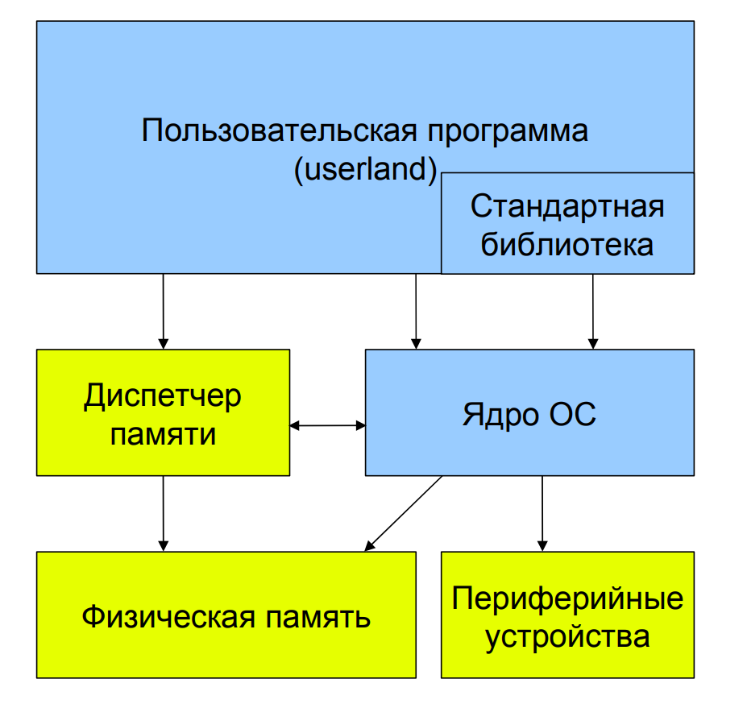

Единственный способ попасть вовне среды исполнения - использование системных вызовов - типы прерывания, которые передают управление фрагменту кода с системными правами доступа.

**Не любая среда может пользоваться системными вызовами**

`malloc` может содержать в себе системный вызов, если на куче кончится память и понадобится её увеличить.

Код стандартной библиотеки исполняется из образа в памяти процесса. Также в памяти процесса лежат и другие используемые процессом библиотеки

**Библиотека** - кусок кода, привязываемый к программе статически (при компиляции, привязка называется **линкова**) или динамически (при исполнении. `dlopen`).

Функция в языке в Си, в отличие от простого куска кода, следует соглашению о вызове функций Си.

**`ABI`** - application binary interface - соглашение о вызовах.

### Ядро
Ядро - **все компоненты, работающие в системном режиме (определение Иртегова).** Код в привилегированной области памяти, исполняемый с повышенными привилегиями.

Выполняется командой `syscall`/`sysenter` (что и является системным вызовах), но в Unix имеют особые обёртки, которые выглядят как обычные функции.

Ядро управляет виртуальной памятью, внешними устройствами и всеми процессами.

Таким образом полная схема защиты памяти будет выглядеть так:

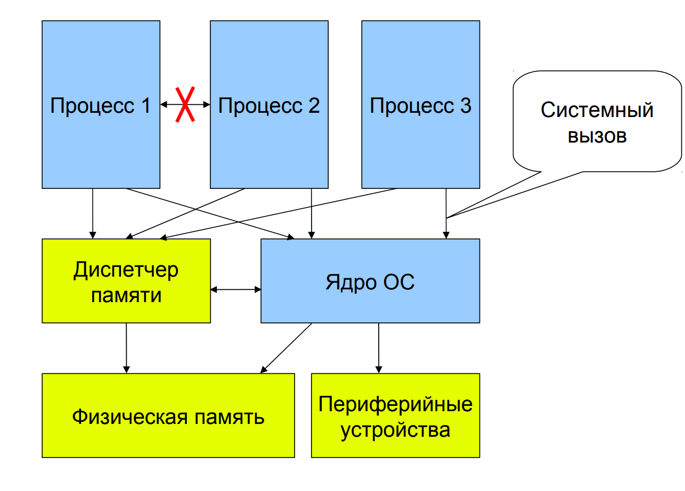

Благодаря этому мы можем добавлять различные атрибуты процессам и не сильно беспокоиться о безопасности.

### Наконец, определение процесса
Процесс - объект операционной системы, т.е. структура данных в ядре, с которой связаны некоторые атрибуты, часть из них видна процессу, часть могут быть изменены только ядром, а часть неизменны на протяжение всего времени жизни процесса.

Процесс - исполняющаяся программа вместе с необходимым окружением (сегменты данных и стэка, user area и др.)

Образ процесса - виртуальное адресное пространство процесса во время исполнения.

Когда мы запускаем программу, на самом деле мы сначала создаём процесс, а уже в рамках него запускаем программу.

Каждый процесс имеет свой уникальный (в один момент времени) `pid`.

Основные структуры процесса (отображённые на память файлы):
- `TEXT` - код программы
- `DATA` - инициализированные статические данные
- `BSS` - неинициализированные статические данные - район памяти, забитый нулями, его нет в бинарнике, там только указан его размер. Смысл этого раздела в наше время почти полностью утрачен.
- `STACK` - хранит нестатические локальные переменные
- `HEAP` - здесь обитаем `malloc`
- Динамические сегменты - из них состоят динамические библиотеки
- User Area (дескриптор процесса в ядре) - фактически, отображение процесса в ядро. Был в старых Unix-системах, сейчас в основном отсутствует из-за многопоточности.
  - Стэк процесса в ядре
  - Дескрипторы открытых файлов
  - Атрибуты процесса

Виртуальная память процесса в архитектуре `Intel x86`:
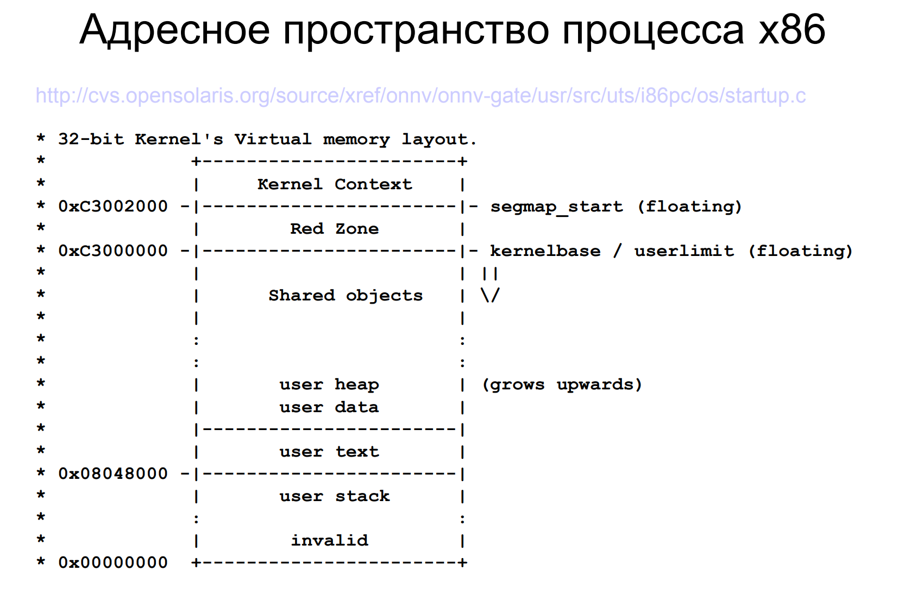

Виртуальная память процессах на `Intel x64`:
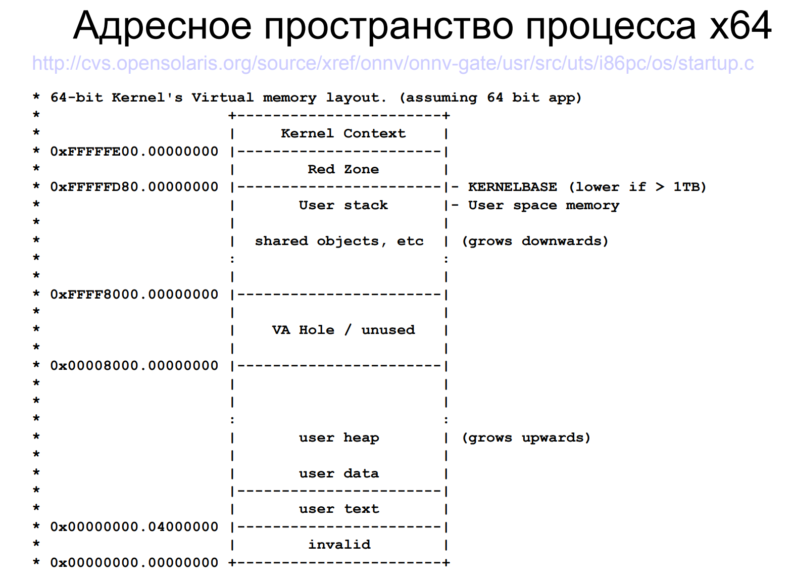

*Разрыв в середине пространства вызван тем, что на текущий момент для адресации используется только `48` бит из 64-х*

Все процессы кроме `init` имеют родителя. `init` имеет `pid = 1`, запускается при старте системы ядром и запускает все остальные процессы.

### Терминальная сессия
Физически терминалы обслуживаются демоном `ttymon` (раньше был `getty`)

Виртуальные терминалы (сессии) создаются динамически различными сервисами. Например, для сессий терминала `ssh` создателем будет демон `sshd` 

При входе пользователя создаёт сессия с ID, который равен ID процесса-создателя, проводится авторизация, устанавливается ID пользователя и запускается шелл, шелл берётся из учётной записи пользователя (обычно хранится в `/etc/passwd`)

Шеллы с управлением заданиями создают на каждую команду группу процессов.

### Атрибуты процесса
Атрибуты процесса хранятся в пользовательской области в ядре и в пользовательском стэке.

В ядре:
- Процесс
  - ID
  - родитель
  - группа
  - терминал (его может не быть)
  - сессия
  - ограничения (открытые файлы, время процессора, то есть `rlimit`ы)
- Пользователь
  - Идентификатор (реальный/эффективный)
  - Группа (реальный/эффективны)
- Файловая система
  - Открытые файлы
  - Текущая директория
  - Корневая директория (`setroot`)
  - Ограничения (`umask`, `ulimit`)
- Обработка сигналов

В пользовательском стэке хранятся параметры командной строки и переменные среды.

Переменные среды процесса хранятся в памяти процесса 

## Эффективные идентификаторы
Эффективные идентификаторы позволяют пользователю или группе быть представителями других пользователей и групп.

# 23.09.18 - лекция
## Атрибуты процесса (продолжение)
Часть атрибутов процесса находится в ядре. Их можно изменять системными вызовами.

Можно поменять группу процесса, но нельзя поменять ID процесса.

Если процесс потерял родителя (тот завершился раньше самого процесса), то родителем станет процесс `init`

Терминал меняется вместе с сессией.

Ограничения можно только понизить.

### Пользователь
Пользователь - это число.

**НЕ ПУТАТЬ ГРУППЫ ПОЛЬЗОВАТЕЛЕЙ И ГРУППЫ ПРОЦЕССОВ!** По умолчанию процесс принадлежит к тем же группам, что и пользователь.

### Пользовательский стэк
В Си-функцию `main` передаются 3 аргумента: `int argc`, `char** argv`, `char** envp`.

`argc` - вспомогательный и содержит количество аргументов командной строки

`argv` - массив строк, представляющих собой аргументы, передаваемые в команду при её вызове

`envp` - `environment` - переменные среды = аргумент процесса. Хранит массив строк формата `name=value`. Заканчивается `NULL`

## Доступ к системным переменным (атрибутам системы)
Относится к библиотеке `unistd.h`

`sysconf` - смотрит значение системных переменных
- `LINE_MAX` - максимальная длина строки ввода

`pathconf` - посмотреть параметры файловой системы (например, длину имени файла,)

**ЛУЧШЕ ИСПОЛЬЗОВАТЬ ИМЕННО ЭТИХ ФУНКЦИИ ВМЕСТО ЛИМИТОВ ИЗ `limits.h`**

## Пользовательский стэк (стэк процесса)
Кроме переменных среды и позиционных аргументов в пользовательском стэке хранится также стэковый кадр и ограничен защитной областью, которая препятствует бесконечному разрастанию стэка.

**Стэковый кадр** - область памяти в пользовательском стэке, куда сохраняются параметры функции (хотя и не всегда и не все), адрес возврата, сохранённые регистры, локальные переменные, а также дополнительно в C указатели на обработчики исключений и деструкторы локальных переменных.

## Доступ к переменным среды
Можно получить третьим аргументов (говорилось выше), через внешнюю переменную `extern char** environ` (в начальный момент времени совпадает с переменными среды родителя), либо через функции `getenv`, `putenv`.

### Конкретные переменные среды
`PATH` - переменная среды, хранящая каталоги через `,`. В этих каталогах будут искаться исполняемые файлы (*фан-факт - в Винде пути разделяются `:`*).

`TERM` - тип терминала, используется экранными редакторами и другими программами

`HOME` - домашний каталог

`USER` - имя пользователя (**НЕ ПУТАТЬ С `UID`!**)

`SHELL`

`LOGIN`

### `TZ`
**Ядро живёт по Гринвичу**

Если переменная среды `TZ` не установлена, то часовой пояс берётся из файла `/etc/localtime`.

Существует несколько форматов часового пояса:
- `Asia/Novisibirsk` - указывает на файл в `/usr/share/zoneinfo` - бинарнике, в котором хранится вся информация о часовом поясе. 
- В Solaris:
  - `/etc/TIMEZONE` - имя часового пояса
  - `/etc/LOCALTIME` - смещение часового пояса
- Стандартные названия имён (например, `PST8PDT`)
- `<Любые 3 буквы>-<сдвиг>`

Если мы хотим не менять переменную среды, у родителя, а только у нового процесса, то можно написать значение переменной среды, а после в той же строке вызвать команду.

### Изменение переменных среды
Для изменения переменных среды можно просто обратиться к неё через `$`, также для работы с переменной рекомендуется её экспортировать

Если при изменении переменных среды в C-программе через `putenv`, `setenv` нам начинает не хватать места на стэке, будет автоматически вызван `malloc`, а переменная переменные среды переместятся на стэк. Именно поэтому рекомендуется использовать эти функции, а не `char** envp`.

Если вдруг мы хотим поменять переменную среды для нашего терминала, можно использовать функцию `source`, если мы хотим поменять переменную среды для каждой нашей терминальной сессии, то мы можем отредактировать `.bashrc`

## `setuid`
Доступ к ресурсам основывается на эффективных ID пользователя и группы (по ним проверяются права доступа)

Реальный ID ставится при входе пользователя в систему. В этот момент чаще всего эффективный ID приравнивается реальному.

При запуске программы с битом `setuid` её эффективный идентификатор приравнивается к реальному идентификатору хозяина файла.

Пароли в Linux хранятся в `/etc/shadow`. При этом возникает вопрос, как защитить этот файл от произвольного доступа, но дать доступ пользователю через утилиту `passwd`. **Ответ:** `passwd` запускается с битом `setuid`. *Фан-факт:* если рут запустит `passwd`, то он сможет поменять любой пароль.

У `sudo` под капотом тоже содержится `setuid` бит.

**НЕ ПУТАТЬ `setuid`-бит с системным вызовом `setuid` - он позволяет менять эффективный ID процесса, устанавливая его идентичным реальному ID**

Также есть системный вызов `setgid` - работает аналогично `setuid`, но для группы

## Системные вызовы ввода/вывода
### Что такое файл?
**Файл** - последовательность байтов с адресацией с точностью до байта

**Файл** - именованная совокупность данных (*из книги Иртегова*)(*на самом деле это в первую очередь справедливо для регулярных файлов*)

Метка конца файла не входит в данные файла.

Файл - это универсальный интерфейс с внешними устройствами. Таким образом, даже устройства для ввода-вывода звука будут иметь своё представление в виде файла.

**Определение из словаря POSIX:** файл - объект, который можно читать и писать.

**Всё есть файл (*ну... кроме процессов, хотя... см. дальше*)**

**Папка `proc`** содержит информацию о процессах, в частности, там можно увидеть всё адресное пространство процесса.

# 23.09.25 - Лекция
## Файловая система и где хранятся файлы
Доступ к постоянной памяти производится по секторам. Обычно они составляют 512 байт.

**Файловая система** - структура данных на внешнем носителе. На самом деле этим определением могут называться 3 разных, пусть и связанных сущности:
- **Формат данных**, описывающие размещение данных
- **Программа - модуль ядра**, позволяющий работать с файловой системой
- **Экземпляр файловой системы** на конкретном носителе

Файловая система сравнима с архивом. Ключевое различие в возможности изменения размера файлов.

### Основные папки в корне Линукс
- `/bin` - бинарные файлы
- `/boot` - файлы при загрузке
- `/dev` - файлы устройств и псевдоустройств (в т.ч. диски)
- `/etc` - общесистемные конфиги
  - `/opt` - 
- `/home` - каталоги пользователей
- `/lib` - основные библиотеки, необходимые для работы программ из `/bin`, `/sbin` (**либы - неисполняемые системные файлы**)
- `/media` - временные носители (флэшки, диски и т.п.)
- `/mnt` - временно монтируемые файловые системы
- `/opt` - дополнительное ПО
- `/proc` - виртуальная файловая система, представляющая состояние ядра ОС и запущенных процессов в виде файлов
- `/root` - домашний каталог рута
- `/run` - информация о системе с момента запуска, pidы, сокеты и т.п.
- `/sbin` - бинарники для администрирования
- `/srv` - данные для предоставляемой системой сервисов
- `/sys` - информация о драйверах, устройствах и некоторых свойствах ядра
- `/tmp` - временные файлы
- `/usr`
- `/var` - хранит изменяемые файлы (файлы регистрации, временные почтовые файлы)

## Продолжаем про определение и основные свойства файла
Формат файлов системе по большей части безразличен, исключение - бинарные исполняемые файлы

С точки зрения приложений существует 2 типа файлов: текстовые и бинарные.

Файлы хранятся в ядре и реализуют интерфейс чтения/записи.

**Файл-каталог** - файл, содержащий информацию о своих файлах и каталогах потомках

На самом деле в один и тот же каталог можно прийти от нескольких родителей

## Системный вызов `open(2)`, дескрипторы файлов, `file_t` и `vnode`
`open(char* pathname, int flags, [mode_t mode])` - `2` - Открывает файл по указанному пути и с указанными флагами, в случае успеха возвращает индекс, указывающий на элемент массива в user area - указатель на дескриптор файла.

`char* pathname` - путевое имя, содержащее имена каталогов через прямой слэш. Могут быть относительными и абсолютными. Абсолютный путь начинается с `/`, относительный путь - с другого символа, относительные пути строятся от текущей директории - переменной среды `PWD`, которая есть у каждого процесса

**Дескриптор** - число, относящееся к описанию файла, хранящемуся в ядре (в user area). Описание содержит отступ и флаги:
- `O_RDONLY`
- `O_WRONLY`
- `O_RDWR`
- `O_APPEND` - как `O_WRONLY`, но указатель помещается в конец файла
- `O_CREAT` - создаёт файл, если он не существует (**может создать только регулярный файл**). При этом флаге необходимо указывать права доступа (`mode_t mode`)
- `O_TRUNC` - стирает содержимое файла
- `O_EXCL` - используется вместе с `O_CREAT` и вернёт ошибку, если файл уже существует
- `O_SYNC` - заставляет `write(2)` ожидать окончания физической записи на диск (по-умолчанию данные записываются сначала в оперативную память)
- `O_NDELAY`, `O_NONBLOACK` - открытие специального байт-ориентированного файла или именованного программного канала часто вызывает блокировку. Любой из этих флагов предотвратит блокировку `open(2)`

*За каждый флаг отвечают определённые биты в аргументе `int flags`, поэтому для их комбинации надо использовать побитовое ИЛИ (`|`)*

Опциональный параметр `mode_t mode` указывает права доступа к создаваемому файлу.

**В случае неудачи** `open(2)` вернёт `-1`

### Как работает `open(2)`
1. Файл ищется в иерархии директорий для получения `inode` (**файловая запись**, она у файла одна)
2. Проверяются права доступа
3. В таблице дескрипторов размещается новый дескриптор
4. Проверяется системная структура файлов и, если необходимо, размещается новое поле
5. Если необходимо, размещается новая структура информации о файле `file_t`
6. Соединяется с подходящим драйвером устройства:
   - Создать структуру `vnode` (в ufs, основной файловой системе Linux - это `inode`)
   - Записать в поля этой структуры указатели на функции драйвера
7. Возвращается дескриптор

Структура информации о файле (`file_t`) хранится в ядре и создаётся каждый раз при вызове `open(2)`, тогда как `vnode` будет один на все структуры `file_t` одного файла

Структура `file_t`:
```c
typedef struct file {
  kmutex_t f_tlock; /* short term lock */
  ushort_t f_flag;
  ushort_t f_flag2; /* extra flags (FSEARCH, FEXEC) */
  struct vnode *f_vnode; /* pointer to vnode structure */
  offset_t f_offset; /* read/write character pointer */
  struct cred *f_cred; /* credentials of user who opened it */
  struct f_audit_data *f_audit_data; /* file audit data */
  int f_count; /* reference count */
  struct filock *f_filock; /* ptr to single lock_descriptor_t */
} file_t;
```

[Структура `vnode`](https://github.com/illumos/illumos-gate/blob/master/usr/src/uts/common/sys/vnode.h):
```c
typedef struct vnode {
	kmutex_t	v_lock;		/* protects vnode fields */
	uint_t		v_flag;		/* vnode flags (see below) */
	uint_t		v_count;	/* reference count */
	void		*v_data;	/* private data for fs */
	struct vfs	*v_vfsp;	/* ptr to containing VFS */
	struct stdata	*v_stream;	/* associated stream */
	enum vtype	v_type;		/* vnode type */
	dev_t		v_rdev;		/* device (VCHR, VBLK) */

	/* PRIVATE FIELDS BELOW - DO NOT USE */

	struct vfs	*v_vfsmountedhere; /* ptr to vfs mounted here */
	struct vnodeops	*v_op;		/* vnode operations */
	struct page	*v_pages;	/* vnode pages list */
	struct filock	*v_filocks;	/* ptr to filock list */
	struct shrlocklist *v_shrlocks;	/* ptr to shrlock list */
	krwlock_t	v_nbllock;	/* sync for NBMAND locks */
	kcondvar_t	v_cv;		/* synchronize locking */
	void		*v_locality;	/* hook for locality info */
	struct fem_head	*v_femhead;	/* fs monitoring */
	char		*v_path;	/* cached path */
	hrtime_t	v_path_stamp;	/* timestamp for cached path */
	uint_t		v_rdcnt;	/* open for read count  (VREG only) */
	uint_t		v_wrcnt;	/* open for write count (VREG only) */
	u_longlong_t	v_mmap_read;	/* mmap read count */
	u_longlong_t	v_mmap_write;	/* mmap write count */
	void		*v_mpssdata;	/* info for large page mappings */
	void		*v_fopdata;	/* list of file ops event watches */
	kmutex_t	v_vsd_lock;	/* protects v_vsd field */
	struct vsd_node *v_vsd;		/* vnode specific data */
	struct vnode	*v_xattrdir;	/* unnamed extended attr dir (GFS) */
	uint_t		v_count_dnlc;	/* dnlc reference count */
} vnode_t;
```

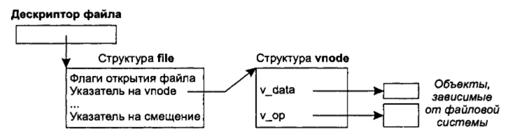

**На самом деле дескриптором корректнее называть структуру `file_t`, а не индекс в user_area, его называют "ручкой"** (*А на самом деле херня полная такой нэйминг: число **дескриптор**, `file_t` - **объект открытого файла**, `vnode` - **абстракция для описания файла как объекта ОС***)

Подробнее про файловые системы, `vnode` и прочее читай [ТУТ](#вахалия---unix-изнутри-глава-8---базовые-элементы-и-интерфейс-файловой-системы).

*Фан-факт:* права доступа проверяются только в момент открытия файла

## `close(2)`
`close(int fd)` - освобождает индекс, указывающий на дескриптор `file_t`. Если это последний дескриптор на `file_t`, то эта структура также удаляется. Если удалена последняя структура `file_t`, то будет удалена структура `vnode`, но лишь через некоторое время. Именно удаление (*а чаще даже очистка и назначение другому объекту*) структуры `vnode` **является удалением файла**. Даже если мы удалим файл из каталога, он может продолжить существовать, пока счётчик ссылок на него в `vnode` > 0, пусть доступа из каталога к нему уже не будет.

## `tmpfile`
Механизм подсчёта ссылок также позволяет создавать временные файлы. После создания на них будет всего одна ссылка, которая пропадёт после закрытия, а значит файл не появится в рабочем каталоге и не будет доступен никому более.

## `read(2)`
`ssize_t read(int fd, void* buf, size_t count)` - пытается прочитать из дескриптора файла до `count` байтов и записать их в буфер по адресу `void* buf`. Возвращает количество считанных байтов либо `-1` при ошибке (**запись нуля байт не является ошибкой**)

## `write(2)`
`ssize_t write(int fd, void* buf, size_t count)` - записывает в файл по дескриптору `fd` `count` байт из буфера по адресу `void* buf`. Возвращает количество записанных байт либо `-1` при ошибке

## Стандартные потоки и их связь с дескрипторами
- `0` - `stdin`
- `1` - `stdout`
- `2` - `stderr`

# 23.10.02 - лекция
## `fsync(2)`
Любая программа может писать данные гораздо быстрее, чем это происходит на внешних накопителях, поэтому зачастую данные пишутся в системный буфер, а далее, параллельно дальнейшим операциям производится запись в память

```c
#include <unistd.h>

int fsync(int fd);
```

Ожидает записи данных из буфера в постоянную память. Удобнее, чем использовать флаг `O_SYNC` в `open(2)`, так как мы можем отдельно решать, в какие моменты нам важно, что данные были записаны, а в какие мы оставляем запись из буфера в постоянную память на усмотрение системы.

Возвращает `0` в случае успеха и `-1` с записью кода ошибки в `errno` при неудаче

## `lseek(2)`
```c
#include <sys/types.h>
#include <unistd.h>

off_t lseek(int fd, off_t offset, int whence);
```
Сдвигает указатель в файле по заданному дескриптору. В случае успеха возвращает расстояние в байтах от начала файла и `-1` с записью кода ошибки в `errno` при неудаче.

`whence` определяет, откуда будет происходить сдвиг курсора:
- `SEEK_CUR` - от текущей позиции курсора
- `SEEK_SET` - от начала файла
- `SEKK_END` - от конца файла

При сдвиге назад от начала будет оставаться нулевая позиция.

При сдвиге дальше конца мы можем читать данные и будем получать `\0`. Если же мы попытаемся записать данные туда, то получим разреженный файл - между блоками с данными будет пространство с нулями, под которое не выделяется память на диске.

Интересный пример применения разреженных файлов есть в некоторы торрент трекеров, которые сразу создают файл нужной длину и потом, скачивая отдельные куски, складывают их сразу в нужные места (*другие наращивают файл постепенно*)

Обычно разреженные файлы НЕ ТЕКСТОВЫЕ

## `dup(2)`
```c
#include <unistd.h>

int dup(int fd);
```
Возвращает новый дескриптор, относящийся к тому же `file_t`. Ищет свободную ручку с нуля. `dup2()` ищет с указанного индекса

## `fcntl(2)`
```c
#include <sys/types.h>
#include <fcntl.h>
#include <unistd.h>

int fcntl(int fd, int cmd, /* arg */);
```
Представляет собой сборник из команд, которым не захотели выделять отдельные системные вызовы. Возвращаемое значение в случае успеха зависит от `cmd`, как и следующие за `cmd` аргументы

Флаги без `args`:
- `F_GETFD` - получить состояние флага закрытия-по-`exec`
- `F_GETFL` - Получить флаги `NDELAY`, `NONBLOCK`, `SYNCH`, `APPEND`

Флаги с `int arg`:
- `F_DUPFD`
- `F_SETFD`
- `F_SETFL`

### `struct flock`
```c
typedef struct flock
{
  short l_type;
  short l_whence;
  /* SEEK_SET, SEEK_CUR, SEEK_END */
  off_t l_start;
  off_t l_len;
  /* len == 0 means until end of file */
  long l_sysid;
  pid_t l_pid;
  long pad[4]; /* reserve area */
} flock_t; 
```
Флаги с для `fcntl` с `struct flock *arg`:
- `F_FREESP` - освободить физический носитель.
  - Если идём от конца файла, то укоротит место для файла
  - Если указать пространство внутри файла, то мы создадим в нём дырку
- *добавить*

## Тут у нас управление памятью
**Статическое управление памятью**
- Требуемое количество памяти известно в момент сборки программы
- Достаточно проверить, есть ли требуемая память в момент загрузки
- Размечается процессором
- Достаточно помнить границу между занятой и свободной памятью

**Динамическое управление памятью**
- Память может запрашиваться и освбождаться во время исполнения программы
- Необходимо поддерживать список свободных областей памяти (называется **пул** либо **куча**)
- Стэковые кадры в C/C++ являются простейшим примером динамической памяти (*так как пременные существют лишь до тех пор, пока исполняется функция*)
- Стэковое (**LIFO**) управление памятью при загрузке программ

### Веселуха с динамической памятью и попытки её решить
В связи с выделением непрерывного блока памяти с началом по строго указанному указателю мы получаем проблему **внешней фрагментации** - между выделенными блоками будут пустые пространства произвольного размера, которых по отдельности будет не хватать для выделения нового блока, хотя в сумме памяти хватило бы.

Одно из решений - выделять кусок памяти кратной какому-то конкретному числу длины под любой запрос памяти. Проблема - **внутренняя фрагментация** - даже под небольшой объём данных мы выделим большой блок, из-за чего много пространства будет простаивать.

Зачастую создаётся определённая структура с информацией о свободных блоках.

Стратегии поиска свободных блоков:
- Best fit - требует просмотра всего пула либо сортировки, увеличивает фрагментацию и уменьшает средний размер отбрасываемого "хвоста"
- First fit - находим первый подходящий блок (*используется чаще всего, для реализации часто используется кольцевой список*)
- Worst fit - требует сортировки блоков, заключается в отрезании от самого большого блока нужное количество памяти (*реазлиуется вместе с maxHeap - именно поэтому кучу называют кучей, хотя сам по себе worst fit в чистом виде уже и не используется*)

Про склеивание свободных блоков и алгоритм парных меток можно прочитать [выше](#распределение-памяти-работа-api-mallocfree)

Существует множество и других стратегий `malloc`, которые оптимизированы под конкретные и в разной степени специфичные задачи:
- Для компьютеров, предназначенных для сложных математических расчётов
- Для компьютеров разделённого времени (выполняющих множество задач параллельно, принимающих пользовательские сигналы)
- Для систем реального времени (автопилот машины и т.п.)

**Алгоритм близнецов (best fit)** подходит как раз для систем реального времени, так как выделяет память за фиксированное время. Заключается в создании блоков размером в степени двойки. Деление памяти делается по принципу бинарного дерева. Проходим вниз дерева до тех пор, пока не будет найден минимально подходящий блок. Объединиться свободные блоки могут только если они относятся к одному и тому же родителю.

# 23.10.09 - лекция
## Продолжение про выделение памяти
### Слабовые аллокаторы
Slab - плита, лист, пластина

Испльзуется, если нам нужно много блоков одинакового размера (особенно, если они не кратны степеням двойки)

В ядре создаётся объект кэша, в котором указывается, какого размера блоки мы хотим выделять. Затем берётся большой кусок памяти и режется на фрагменты указанного нами размера.

Кэши связываются списком.

В кэше хранятся указатели на занятые слабы, частично свободные и полностью свободные.

Слабы не лишены проблемы дефрагментации, но её нельзя назвать ни внешней, ни внутренней.

*Дальшей идёт допматериал про попытки решения проблемы этой дефрагментации*

### Сборка мусора
Чтобы не было проблем с каскадной порчей данных и утечек памяти, необходимо эту память корректно освобождать за счёт одной из стратегий сборки мусора.

Существует 2 основных стратегии:
- Подсчёт ссылок (уходящий последним гасит свет)
- Рекурсивный просмотр ссылок (mark and sweep).
  - В момент работыы стратегии необходимо остановить всю деятельность, которая может привести к уничтожению или созданию ссылок и объектов
  - Рекурсивно движемся по все указателям, помечая объекты, как живые
  - Все непомеченные объекты будут удалены. Перед следующим запуском сборщика необходимо снять метки
  - Достаточно прожорлива по производительности и потребляемой памяти.

Стратегия mark and sweep обладает рядом недостаков, для которых предложены различные решения:
- Высокое потрбления памяти
- Блокирование исполнения программ
  - Решается неблокирующим сборщиком

**Копирующий сборщик**. Создаём 2 области в помечченные живыми объектами перемещаем в новый объект. Ведущие из области мусора ссылки *игнорируются (?)*.

#### Генерационная сборка мусора
Улучшенной версией будет **генерационная сборка мусора**. Делается в 2 прохода через большую и малую сборку мусора *по не самым пока что понятным мне правилам*:


Генерационный сборщик основан на предположении, что старые объекты редко ссылаются на новые, поэтому при малых сборках старые объекты вообще не трогаются, однако так бывает не всегда. **Remembering set** - набор ссылок из старых объектов на новые.

**Garbage First (G1)** - вместо поколений разбивает кучу на области одинакового размера и использует remembering set для отслеживания ссылок между областями и оценивания количества живых объектов в каждой из областей. Выбрав регион с максимальным количеством мусора и без ведущих туда ссылок, проводит неблокирующую сборку

*Остановился на 35-м слайде презентации про память и сказал, что дальше идти смысла нет сейчас*

## Виртуальная память
Linux и Windows используют **аппаратную защиту памяти** или, что похоже, но не совсем то же самое, **виртуальную память**.

**MMU** - Memory management Unit - стоит на пути от процессора к памяти и "что-то делает с адресами запрашиваемых ичеек". В отличие от, например, переключателя банок памяти для CdM-8, MMU не обязательно отобразит отправленный процессором адрес в какой-то адрес в памяти - вместо этого он может выкинуть исключение.

Процесс не знает, где он лежит в реальной памяти, а лишь может обращаться к ячейкам в рамках определённого лимита.

Если процесс запросит доступ к ячейке выше лимита, то MMU выбросит исключение, если ячейка будет меньше лимита, то MMU добавит к запрашиваемому адресу начало его области в реальной памяти (`BASE`). `BASE` и `LIMIT` передаются процессором в регистры MMU

**Запомните!!!** Системный вызов переводит исполнение кода в режим ядра.

В том числе, в режиме ядра можно осуществлять ввод-вывод и менять регистры MMU. А значит, ядро может перемещать реальное расположение процесса в памяти.

### Ещё раз про сравнение пользовательского и системного режима
Система:
- Может делать ввод-вывод
- Может менять регистры MMU
- Иногда может вообще выключить MMU
- Имеет доступ к пользовательской памяти
- Может произвольно переходить в пользовательский режим

Пользователь:
- Первые 3 пункта с отрицанием
- Не имеет доступ к памяти ядра
- Может перейти в системный режим только командной `syscall`

### Чем плоха базовая адресация
Главная проблема базовой адресации (записанного ранее алгоритма работы MMU) - необходимость выдавать процессу непрерывную область памяти. Это приводит к всё той же проблеме фрагментации.

Решением проблемы стало разделение области памяти на отдельные фрагменты => в MMU хранится множество пар `BASE`-`LIMIT`. (*Всопминаем разделение памяти процесса и преисполняемся*). Сегментация определяется архитектурой процессора.

#### КРИТ ПРО СЕЛЕКТОР И ДЕСКРИПТОР
Соответственное, теперь запрос от процессора делится на 2 части: селектор и смещение. Селектор определяет регистр в MMU. Кодируются одни числом, что логично.

Также к описанию каждого сегмента добавились права: чтение, запись или и то, и то.

Чтобы не ограничиваться количеством регистров MMU, выделили в памяти область под таблицы трансляции. В них также хранятся селекторы, права доступа, базовый адрес и размер области. Теперь MMU Достаточно хранить адрес таблицы трансляции - всё это в целом называется дескриптором

<hr>

Наиболеее часто используемый сейчас вариант: страничные таблицы трансляции без указания размера блоков с фиксированной небольшой длиной (на 32-битных системах это около 4 КБ. Такой вариант позволяет разметить 2^20, что примерно миллион областей).

# 23.10.16 - лекция
## Продолжаем про виртуальную память


TLB - кэш таблицы трансляции. Если мы обращаемся к близко лежащим слекторам из таблицы трансляции, итоговое получение реального адреса будет работать значительно быстрее быстрее. Проблема в том, что при обращении к далеко лежащим областям либо при вызове нового процесса (Intel), кэщ сбрасывается.

### Дополнительные возможности MMU
- Защита чтения/записи
- Защита от исполнения
- Бит супервизора
- Бит присутствия
- Исключения
  - Ошибка защиты памяти
  - Страничный отказ

#### ЧЕМ ОТЛИЧАЮТСЯ ИСКЛЮЧЕНИЯ ОТ ПРЕРЫВАНИЙ
Аппаратные прерывания обрабатываются между исполнением команд, исключения возникают прямо внутри команды, то есть при получении исключения будет откат до исполнения этой команды

<hr>

### Дескриптор страницы `80386`


- Грязная - сюда когда-то писали
- Использовалась - использовалась в любом режиме после последнего сброса (`accessed`)
- Бит присутствия - если бит нулевой, то при обращении к странице будет сгенерировано исключение страничного отказа

### Многоуровневая трансляция в `x32` у Intel


Каждая запись каталога - 4 Мб. Если каталог полностью пуст, то он весь целиком маркируется битом отсутствия - и всё.

Если хотя бы часть страниц каталога используется, этот метод ускорения работы не сработает.

С какого-то Пентиума появилась возможность выделения гигантских страниц - таблица катологов ведёт сразу к страницам, а не к каталогам, то есть мы отключаем последний этап трансляции

### Многоуровневая трансляция в `x64` Intel


### ARM
ARM-архитектура позволяет кроме страниц выделять также и сегменты, то есть указывать им конкретный размер

<hr>

Существуют также диспетчеры памяти без таблицы трансляции. Они используют просто очень большой TLB

### Как проходит переключение процессов
Одна таблица трансляции (x86, x64, VAX):
- Сбрасываем регистр процесса в `MMU` `CR3` и сбрасываем `TLB`
- В адресном пространстве каждого процесса должна быть хотя бы часть кода ядра с битом супервизора

Переключение таблицы трансляции (SPARC, PowerPC):
- Достаточно переключить котекст (номер таблицы)
- Записи TLB должны помнить номер таблицы, зато TLB при этом не надо сбрасывать
- Ядро может находиться в отдельном адресном пространстве

Пример переключения таблиц трансляции (PowerPC 601)


### Page swapping - страничная подкачка
За счёт механики исключений со сбрасыванием команды, вызвавшей исключение, мы можем найти страницу памяти, предоставить её процессу и, бросив исключение, уже без проблем выполнить команду, вызвавшую это самое исключение ранее.

На самом деле при запуске исполняемого файла мы не загружаем его целиком в память, а лишь маркируем файл. Части файла загружаются на страницы лишь при необходимости, хотя в своей работе все процессы думают, что исполняемый файл бал записан в память целиком.

Идеально эта схема работает, когда исходные данные не изменялись => мы можем загрузить данные на страницу из того же файла. Если мы изменили загруженные на страницу данные, она становится грязной => её необходимо где-то временно хранить.

#### Поиск жертвы для новых страниц
Система пытается отобрать страницы редко исльзуемых процессов.

Редкость определяется грубым эвристическим алгоритмом, например clock algorithm.
- Страницы объединяются в кольцевую очередь.
- При необходимости берётся берётся страница и проверятеся её бит `accessed` (либо же `clock`-бит)
- Если бита нет, значит мы нашли жертву, если есть, то мы его снимаем и идём к следующей странице

Если страница грязная, она сохранится в своп-файл. Разделяемые модфицированные страницы сохранятся в тот файл, из которого отображены.

## Возвращаемся к практической части
### `mmap`
`mmap(caddr_t addr, size_t len, int prot, int flags, int fd, off_t off)`:
- `addr` - желаемый адрес начала области. Самое страшное, что при наложении на уже отображённую страницу, всё сработает корректно
- `len` - сколько байт файла отобразить на страницу
- `prot` - флаги прав выделенных страниц памяти
  - `PROT_READ`
  - `PROT_WRITE`
  - `PROT_EXEC`
- flags - в отличие от битовых флагов, эти флаги являются взаимоисключающими:
  - `MAP_SHARED` - данные на странице могут быть изменены и попадут в файл, но незивестно, когда. Отображённый на память файл с этим флагом может быть использован как общая память для нескольких процессов.
  - `MAP_PRIVATE` - изменения файла будут оставаться в памяти либо попадать в swap-раздел, но не попадут в файл
  - `MAP_ANON` - не надо указывать дескриптор и сдвиг. Выделяет область памяти, заполненную нулями. На самом деле, под капотом, мы по сути открываем `/dev/null` с флагом `MAP_PRIVATE`
  - `MAP_STACK` - точно не специфицирован, но в целом заключается в том, что система сможет понять, что выделенная область будет расти вниз

После исполнения `mmap` в ядре будет создан **сегмент**, хранящий адрес в виртуальной памяти и связанный с ним источник подкачки. При попытке прочитать файл, ядро найдёт подходящий сегмент и закачает его в память. (*уточнить про разницу понятия как страктуры ядра и как части в виртуальной памяти*)

На самом деле все сегменты в памяти процесса выделяются `mmap`.

Посмотреть сегменты процесса можно командой `pmap <pid>`

### `munmap`
`munmap(caddr_t addr, size_t len)` - убирает отображение, причём делает это влоб: может убрать лишь конец отображение, может лишь начало, может конец одного и начало другого, может кусочек изнутри сегмента.

После отображения файла на память рекомендуется также убрать это отображение, иначе файл не сможет считаться по-настоящему закрытым.

### `msync`
`msync(caddr_t addr, int, int fd, int flags)` - синхронизирует данные между файлом и сегментом
Флаги (также несовместные):
- `MS_ASYNC` - немедленно вернуться, как только были слпанированы операции (попросить систему работать побыстрее)
- `MS_SYNC` - вернутся только когда завершатся все операции записи
- `MS_INVALIDATE` - помечает страницы памяти как недействительные. После этого любое обращение к их адресам вызвает чтение с диска.

# 23.10.23 - лекция
## Параллелизм
С параллелизмом мы сталкиваемся в первую очередь в сетевом взаимодействии, в распределённых системах (СКВ, базы данных, бизнес-приложения), многомашинные кластеры, многоядерные процессоры, ориентированные на ввод-вывод приложения (которые будут часто "ждать")

Последовательную программу можно представить конечным автоматом.

Параллельную программу так представить нельзя, равно как и комбинацию нескольких конечных автоматов с разной тактовой частотой.

### Практические проблемы параллельного программирования
**Race conditions (ошибки соревнования, "гонки")**:
- Разные наложения параллельно работающих сопрограмм будут давать разный результат
- Если некоторые из результатов получились ошибочными, то мы и получили ошибку соревнования (важно, что именно некоторые результаты, потому что при ошибке при всех вариантов наложения это будет уже не race condition)
- Очень болезненно отлавливать такую ошибку тестированием

*Пример - покупка одного и того же билета несколькими пользователями*

Источником такой ошибки зачастую являются совместные данные, используемые в параллельно работающих участках кода.

**Целостность** или **согласованность** данных - неформализуемое понятие, которое включает в себя требования предметной области (сходится дебит и кредит, общая сила действия равняется сумме приложенных сил) и требования алгоритмов обработки:
- Записи должны иметь уникальный ID
- Строки должны заканчиваться нулями
- Массив должен быть отсортирован
- Дерево должно быть сбалансировано

**Нить** - то, что выполняется параллельно, но для чего создаётся иллюзия последовательного управления.

#### КРИТ ПО КРИТИЧЕСКОЙ СЕКЦИИ
**Критическая секция** - кусок кода либо время выполнения куска кода, который нарушает целостность разделяемых данных либо полагается на их целостность (при том, что эта структура может быть измнена где-то ещё).

Критические секции - шаг к решению race condition - так как распознав критические секций, мы выделяем и безопасные

Если вы не думаете о критических секциях, ваша программа вся будет одной критической секцией (хотя бы часть данных всё время не целостна)

##### Подходы к решению проблемы критических секций
- Выделение критических секций и блокировки
  - Используется в Java и самый популярный
- Отказ от изменяемых разделяемых данных
  - Использование иммутабельных данных (Функциональные языки (Haskell!!!), Java Streams, Python tuples)
  - Гармонической взаимодействие (трубы, сокеты)
- Copy-modify-merge - делает копию разделяемых структур по методу copy-on-write, а потом пытался провести слияние
  - Заставить человека решить конфликт вручную (системы контроля версий)
  - Транзакции - откат при конфликте (БД)
- Lockless-программирование - писать программы так, чтобы либо не полагаться на целостность разделяемых данных, либо не нарушать её. Очень странный метод, сложный для понимания и поддержания

<hr>

Внедрение многопоточности делает разработку дороже в 3-5 раз, но при этом навык этот крайне востребован

### Решение проблемы критических секций через блокировки
Самый простой вариант:
- Добавляем флаг, который будет `true`, когда кто-то находится в критической секции.
- Если мы сами заходим в критическую секцию, что логично, мы устанвливаем истину во флаг, когда выходим из секции ставим `false`
```c
whilte(flag) {} // Ожидаем, пока флаг не станет ложью
flag = 1;
// Критическая секция
flag = 0;
```
*В лекции строчку с установкой флага и циклом надо поменять местами (сейчас смотрю и несколько не понимаю, почему нам надо менять строчки местами)*

Проблем такого простого подхода в том, что `flag` сам по себе является разделяемым значением, то есть мы получили ещё одну небольшую критическую секцию

**Алгоритм Деккера** - использовать несколько флагов. Одна нить должна устанавливать флаг работы своей, а проверять флаг работы другой. Нормально работает для синохронизации двух нитей, если их будет больше, то использование алгоритма становится очень трудоёмким. Дполнительное требование - записывать флаги строго в память, чтобы нити могли их читать.

**Lock prefix** - позволяет команде, идущей после него, монопольно работать с памятью. Лежит в основе метода **CAS (Compare and Set)**, позволяющего релизовать синхронизацию.

В архитектуре `x86` основывается на команде `xchg reg, mem` (от слова eXCHange), которая меняет местами значения между регистром и ячейкой памяти:
```
spin:
  mov eax, 1
  xchg eax, flag
  tst eax
  jnz spin
```
*Как я понял, суть в том, что, пока мы получаем из флага единицу, мы будет в цикле. При этом мы также каждый раз сохраняем там единицу, чтобы, если мы выйдем из цикла, в памяти было показно, что критическая секция занята. Выход из цикла возможен только если где-то в другом месте записали в ячейку по адресу `flag` ноль*

`ARM`: 
- `ldrex r1, [r0]` - читает значение из адреса в `r0` и пишет его в `r1`, затем "взводит монитор" (*ставит блокировку? Если та, то эта штука будет аналогичная коду выше*)
- `strex r2, r1, [r0]` - пытается записать значение из `r1` в защищённую монитором ячейку памяти
  - Если значение по адресу `r0` не менялось с момента `ldrex`, успешно производит запись
  - Если менялось (то есть возник конфликт), запись не произойдёт, а в `r2` запишется `1`
  - Монитор будет сброшен при любом исходе (*да, судя по всему так странно называется блокировка*)

Похожие инструкции будет в любом процессоре для многопроцессорной/многоядерной работы.

**CAS (Compare and Set)** позволяют реализовывать спинлоки `while(CAS(flag, 1)) {}` используется в ядрах ОС и позволяет реализовать более сложные атомарные операции. `CAS(flag, value)` вернёт значение из ячейки по адресу `flag`, устноавив при этом в ячейку значение `value`. При заходе в критическую секцию будут устноавлена единичка. Для выхода из секции будет достаточно поставить 0. Спинлок не очень хорош на практике, так как попавшие в него ядра будут работать в холостую.

**Примитив** - переменная непрозрачного типа, над которой определён некоторый набор опреаций.
- Допустимо использовать определённые для примитива операции, мимо них работать с объектом примитива не стоит, иначе, для примитивов синхронизации в частности, мы можем получить ошибку соревнования
- Сравним с объектом с инкапсуляцией, но понятие примтива появилось задолго до ООП

Простейшие примитивы позволяют создать более сложные примитивы синхронизации.

Из-за холостых циклов, спинлоки могут использоваться на практике только для очень коротких критических секций. В остальных случаях вместо них используют более сложные примитивы синхронизации: например, объединение в один атомарный блок проверку ячейки памяти и засыпание (*как я понял, засыпание не является блокировкой, а чем является, Иртегов сказал, что пока уточнять не будет*)

#### Проблемы методов блокировки
- Deadlocks - у нас 2 критических секции, которые мы используем одновременно, но при этом в одном месте вторая секция блокируется внутри блокировки первой, а другом месте - первая секция блокируется внутри блокировки второй. Получаем мёртвую блокировку и тоже своего рода race condition. 
  - Зачастую принято писать документы с описанием необходимости порядка блокировок.
  - Можно возвращать оишбку при возникновении цикла, но сделать это на многих из примитивов сложно. Вдобавок, мы не особо можем выйти из дэдлока, так как совместные данные были изменены
  - Транзацкионный захват - старый метод, нарушает инкапсуляцию и требует знать обо всех блокировках
- Голодание - при использовании упорядоченного захвата или группового мы получаем ситуацию с простаиванием
  - Для больших критических секций мы получим долгое простаивание
  - Рекомендуется избегать глубоко вложенных блокировок, что бывает сложно на практике
  - При большой КС также возможна ситуация, когда лишь малая часть блокировок включена, но мы всё равно продолжим простаивать
  - В блокировках чтения-записи, блокировка на запись может ждать дольше
- Ошибочное определение границ критической секции. Если мы закроем критическую секцию раньше её реального конца, получим ошибку соревнования

### Блоикровка через гармоническое взаимодействие
Вместо примитивов синхронизации тут используются примтивы синхронизованной передачи данных (очередь FIFO с сигнализацией на появление в ней данных и ограничением объёма).
- Разделяемых данных при этом подходе нет
- Критические секции полностью спрятаны в функциях примитива
- Передача несогласованных данных легко ловится тестированием
- **Таким образом, мы получаем многие преимущества параллелизма, не сталкиваясь с его главными проблемами**

Некоторые примитивы гармонического взаимодействия:
- **Труба** - кольцевой буфер с определённым для него операциями `read(2)`/`write(2)`. `read()` блокируется, если труба пуста, `write()` заблокируется при полном заполнении трубы.
- Сокет
- Очередь сообщений
  - VMS mailbox
- Transputer link - что-то вроде небуферизованной трубы
- Channels - примтив языка `Go`

#### Проблемы гармонического взаимодействия
- Работа с копиями данных
  - Требуется доплонительная память
  - Время на копирование
  - Данные могут быть не актуальны
- Нет произвольного доступа к данным
- Нет разделяемых данных, а они могут нам понадобиться

Развитием идеи гармонического взаимодействия стала мысль о передаче не просто данные, а запросы, команды или целые программы.

## Параллелизм на практике
**Нить** - то, для чего создаётся иллюзия последовательного выполнения

**Нить** - минимальная единица планирование (*Иртегов назвал дурацким, так как надо определить планирование*)

В первую очередь оптимально реализовывать параллелизм в случаях, когда в программе есть ввод-вывод. Например, ппроцессор получает запрос от сервера, обрабатывает его и запрашивает данные с диска, форматирует полученные данные и отправляет обратно по сетевому интерфейсу. В моменты, пока процессор ждёт запроса или ответа от диска, он мог бы заниматься чем-то более полезным.


*Когда речь идёт об одноядерной ситуации, нити и процессу могут перемешиваться по понятиям, но в целом нить далеко не всегда относится к процессу, а у процесса может быть несколлько нитей.*

Операции чтения и записи блокирующие, поэтому во время блокировки процессор может заниматься чем-то другим. При это когда блокировка снимется, программа продолжит исполняться дальше, будто бы этой блокировки и не было (*вот она и иллюзия последовательности*).

При блокировке процесса, как и при прерывании, необходимо сохранить контекст процесса

## КРИТ ПРО КОНТЕКСТ ПРОЦЕССА
**Контекст процесса (либо нити, в данном случае безразлично)** - такой набор регистров ЦП, что при его сохранении и восстановлении процесс не заметит прерывания. Хранятся значения регистров в памяти процесса.

Похоже на сохранение регистров при прерывании, однако прерывание может произойти только между командами, то есть сохранять надо не все регистры. При этом засыпание процесса происходит в момент вызова команды.

# 23.10.30 - лекция
## Продолжение про практическую параллельность
Контекс именно процесса должен также включать состояние диспетчера памяти, нити в рамках одного процесса могут не сохранять состояние менеджера

Нити могут быть в одном из следующих состояний:
- Ready (либо Runnable) - нить готова к исполнению, но не исполняется в данный момент
- Running - непосредественное исполнение нити
- Blocked (на самом деле их два, но мы обсуждаем только одно из них) - нить не исполняется и чего-то ждёт


Переход между состояниями осуществляет планировщик, при этом сам планировщик не является нитью и должен использовать более простые примитивы синхронизации.

## КРИТ ПРО РЕАЛЬНОЕ ВРЕМЯ
**Реальное время** - это когда система даёт приложениям гарантии относительно времени исполнения и требует от приложения выполнить за это время определённые задачи

<hr>

### Кооперативная многозадачность
Процессы будут переключаться только по блокирующим вызовам. Можно также использовать вызов переключения без блокировки (`pthread_yield` в Linux и `shed_yield` в Solaris)

Главным преимуществом будет детерминизм и то, что ошибка тестирования будет ловиться тестированием.

#### Недостатки кооперативной многозадачности
- Детерминизм можно реализовать только на однопроцессорной машине
- Приходится переписывать однопроцессорные программы, добавляя в них `yield`

### Вытесняющая многозадачность
Основная идея - позволить системе переключать задачи по своей инициативе

Чтобы ОС могла переключать задачи, ей необходимо передать управление. Это делается при помощи прерываний:
- Прерывания таймера раз в какое-то время передаёт управление системе и та, если процесс ничего не делал до срабатывания таймера, переведёт в выполнение другой процесс (таймслайс)
- Используя прерывания от других устройств, можно передавать управление проснувшейся задаче

#### Преимущества вытесняющей многозадачности
- Понятно, что делать с плохо себя ведущими программами (мы просто отберём у них процессор)
- Разработчики вынуждены защищать критические секции, поэтому программы для вытесняющих ОС могут работать на многопроцессорных системах без модификации
- Таймслайс - удобная концепция для вычислительных задач
- Программы для однозадачных ОС множно запускать почти без переделок

#### Недостатки вытесняющей многозадачности
- Прерывания прилетают асинхронно
- Необходимы блокировки для защиты критических секций
- Программы для кооперативных ОС необходимо пределывать
- Индетерминизм - ошибки плохо ловятся тестированием

## ПРОЦЕСС И НИТЬ
**ПРОЦЕСС** - объект ОС, обладающий виртуальным адресным пространством и контекстом безопасности

**НИТЬ** - принадлежащий процессу объект исполнения

На самом деле у нитей ядра нет процессов, а у процессов-зомби нет нитей

Нитей может исполнеться не больше, чем ядер у ЦП (а на самом деле, чем потоков гипертрединга)

## Приоритеты
Возникает вопрос: если у нас несколько нитей в состоянии Ready, как нам выбрать подходящую для перевода в Running?

Самое простое решение - создать банальную очередь, в который будут добавляться все Ready-процессы

Более сложным, но рабочим решением является **приоретизация**, цели которой несколько отличаются от видов системы

## КРИТ ПРО РАЗДЕЛЁННОЕ ВРЕМЯ
**Разделённое время** - оптимизированное среднее время реакции на внешнее событие. *Это определние, по словам Иртегова, не найти ни в одной книге, однако оно 

### Реального времени
- Обычно используют фиксированные приоритеты
- Расписываются требования к времени реакции для всех задач
- Задачам с меньшим временем даём меньший приоритет
- При подсчёте гарантий времени для низкоприоритетных задач нужно учитывать не только задержки в системе, но и гарантии времени для всех более приоритетных задач

### Разделённое время
- Обычно используются динамические приоритеты
- Задачам, которые реагируют на внешние события (чего-то ждут), повышают приоритет
- Задачам, которые занимают ЦП, но не реагируют (сложные вычисления), приоритет понижают
- В классическом планировщике Линукс, если процесс снимается с исполнения по таймеру, ему начисляют штраф (временно понижают приоритет), если процесс сам заблокировался и освободил процессор, с него снимут штраф

Достаточно простая система, но долгое время работала очень хорошо, однако с вэб-технологиями работала эта схема уже недостаточно гибко и хорошо. В первую очередь по той причне, что на одном и том же сервере, при наличии нескольких виртуальных системах, приоретизация может отдавать больше времени сильно нагружающим процессам, тогда как другие системы будут страдать.

### Справедливое планирование
Решением описанной выше проблемы стало справедливое планирование. Как уже понятно, используется на компьютерах коллективного пользователя (разделяемый хостинг или облачная инфраструктура)

- Вводится понятие периода справедливости (например, 1 секунда)
- Процессы делятся на группы (cgroup)
- Каждой группе выделяется доля времени в периоде справедливости
- Планируем только процессы тех групп, которые ещё не израсходовали свою квоту в этом периоде
- Если таких групп нет, можно планировать любые готовые процессы (то есть переходим к стретегии планировщика разделённого времени)

Недостаток у справедливого планирования, по сути, один - для выделения квот тратится не константное время, оно будет зависеть от количества процессов и групп.

### Немного про cgroup
cgroup имеют 3 основных квоты:
- На дисковое пространство
- На ОЗУ
- На процессорное время

## Возвращаемся к практике - Лекци 3 - Захват файлов и записей
Здесь мы изучим некоторые высокоуровневые методы синхронизации

Разделяемый файл - файл, который используется в нескольких местах. Его использование создаёт критическую секцию, которую классическими методами блокировок мы защитить не сможем.

Решить эту проблему может блокировка участков файлов. 

Захват записи на чтение (разделяемый доступ) - мы гарантируем, что никто не будет в это время писать в файл

Захват записи по изменению (эксклюзивный доступ) - гарантируем, что никто не будет читать или писать

Также все захваты подразделяются ещё на 2 типа:
- advisory lock (рекомендательный) - захват записи проверяется только перед попыткой устноавки захвата. Фактически не защищате файл, а только сигнализирует о блокировке, но фактически не мешает нам нарушить блокировку
- mandatory lock (принудительный) - захват записи проверяется перед выполнением операций ввод/вывода. Записывается в `inode`, при этом в NFS вообще нет похожего атрибута

# 23.11.06 - лекция
## Создание процессов и исполнение программ
### Ещё одно определение процесса
**Процесс** представляет собой исполняющуюся программу вместе с необходимым окружением

**Образ процесса** - виртуальное адресное пространства в определённый момент времени

**ПРОГРАММА - НЕ ПРОЦЕСС**

### `fork(2)`
`fork()` - создаёт новый процесс. 

Память для нового процесса создаётся по методу **copy-on-write**: изначально процесс-потомок работает с тем же образом, но при попытке изменения данных адресное пространство копируется. На самом деле копируются только участки памяти с флагом PRIVATE, SHARED останутся общими.

Дочерний процесс наследует все дескрипторы родителя, uid, euid, pgid, sid.

Не неаследуются нити исполнения, pid, ppid, и захваченные участки файлов.


*На самом деле TEXT также имеет флаг PRIVATE, однако из-за того, что он не модифицируется, он становится разделяемым*

**Отладчики могут модифицировать код программы при исполнении**

Из такого метода копирования следует, что при исполнении `fork` в потомке продолжит исполняться код родителя (**с того же места!**)

### `exec(2)`
Запускает указанный бинарник. Список аргументов для любой версии **ВСЕГДА** должен начинаться с имени файла, а заканчиваться нулём.

Если мы не передаём новое окружение, то программе будет передано окружение родителя.

`execvpe` и `execlpe` не определены, потому что не ясно, из какого окружения надо брать пути `PATH`.

Фактически, `exec` заменяет образ процесса:
- зачастую не затрагивает user area
- наследует открытие дескрипторы файлов, кроме тех, для которых мы это явно запретили, поставив `CLOEXEC`
- Наследует захваченные участки файлов
- euid/egid будут наследоваться, если исполняемый файл не setuid/setgid

Нити **НЕ НАСЛЕДУЮТСЯ**
*Дописать, что ещё не наследуется*


### `exit(3)`
`exit(int status)` - завершает программу, выполнив перед этим подготовительные этапы

Также процесс может завершиться по **сигналу** - штуке, используемой для сообщений между процессами. Процессы ловят сигналы и должны их обработать. Если сигнал не был обработан, то процесс завершится с передачей особого кода возврата. Сигналы отправляются ядром. Существуют также сигналы остановки процесса (`SIGSTP` - **НЕ ЗАВЕРШЕНИЯ**) и продолжения (`SIGCONT`)

### `wait(2)`
#### `wait()`
`pid_t wait(int* status)` - возвращает ID завершившегося процесса-потомка либо код ошибки. 

По указателю `status` записывается статус завершившегося процесса, в котором закодирован полученный потомком сигнал (младший байт) и код возврата (старший байт). 

Если никакой процесс не завершился, то ожидающий процесс заблокируется пока не потомок не завршится либо ожидающий процесс не получит сигнал (тогда `wait` вернёт код ошибки).

*Проверить потом точное определение*
**Зомби процесс** - процесс, который уже завершился, но ещё не отправил никому свой код возврата. Такой процесс будет занимать ячейку в таблице pid'ов, поэтому при накоплении зомби мы потеряем возможность создавать новые процессы.

**Для избавления от зомби необходимо использовать `wait`** (*хотя на самом деле не отловленные родителем зомби будут после завершения родителя прикреплены к `init`, который вызовет для них `wait`*)

`wait` выполнится при завершении любого из потомков, что бывает не всегда удобно.

#### `waitid`
`pid_t waitid(idtype_t idtype, id_t id, siginfo_t *infop, int options)` - позволяет выбрать сразу несколько вариантов ожидания одного или нескольких процессов в зависимости от значения `idtype` - определяет, какие процессы му будем ожидать, от этого поля зависит, что указывать в поле `id`:
- `P_PID` - по ID процесса
- `P_GID` - по ID группы
- `P_ALL` - любого потомка, `id` игнорируется

`options` - побитовый набор флагов (то есть собираются через побитовое ИЛИ), указывающих, какое событие мы ожидаем:
- `WEXITED` - завершение
- `WSTOPPED`
- `WCONTINUED`
- `WNOWAIT` - не убивает зомби
- `WNOHANG` - продолжится исполнение, если ни один процесс не завершился. При успешном исполнении вернёт 0

`infop` - указатель на структуру, куда запишутся данные процесса при успешном исполнении вызова. Содержит поля:
- `si_pid`
- `si_uid` - реальный ID пользователя процесса
- `si_signo` - сигнал. Всегда равен `SIGCHLD`
- `si_status` - статус процесса. Может содержать код возврата либо сигнал
- `si_code` - определяет, что произошло с процессом (по нему можно понять, что содержится в `si_status`)
  - `CLD_EXITED` - нормальное завершение процесса
  - `CLD_KILLED` - убит сигналом
  - `CLD_DUMPED` - убит сигналом и создал core-файл
  - `CLD_STOPPED`
  - `CLD_CONTINUED`
  - `CLD_TRAPPED` - отслеживаемый процесс попал в "ловушку"

#### `waitpid`
`pid_t waitpid(pid_t pid, int* status, int options)` - ожидает потомка или группу потомков в зависимости от значений `pid`
`pid`:
  - `< -1` - любой процесс-потомок из PGID = |pid|
  - `-1` - любой потомок
  - `0` - любой потомок с таким же PGID, что и у текущего процесса
  - `> 0` - процесс с PID = pid

`options` - побитовый набор флагов:
- `WNOHANG` - продолжится исполнение, если ни один процесс не завершился. При успешном исполнении вернёт 0
- `WUNTRACED` - ребёнок остановился (но не отслеживается через ptrace(2))
- `WCONTINUED` - ребёнок продолжил исполнение (получил сигнал SIGCONT)
- `WNOWAIT` - не убивает зомби

В аргумент `int* status`, если он не равен `NULL`, записывается состояние ребёнка, которое можно проверить макросами из `wstat(2)`

Некоторые другие подробности про описанные выше вызовы смотри [тут](#fork-exec-wait---комментарии-к-9-й-лабе)

### `atexit(3)`
`int atexti(void (*func)(void))`
Позволяет зарегистрировать функции, которую будут вызваны при нормальном заврешнии процесса (после `exit()` либо возврата кода из функции `main()`) и до завершения процесса

### `on_exit(3)`
`int on_exit(void (*function)(int , void *), void *arg)` - работает похожим образом, но в регистрируемую функцию предаётся код возврата и дополнтиельные аргументы, которые указываются по указателю вторым аргументом при регистрации функции

### `_exit(2)`
`void _exit(int status)` приводит к завершению процесса без вызова зарегистрированных функций

<hr>

**НЕЗАВИСИМО ОТ СПОСОБА ЗАВЕРШЕНИЯ ПРОЦЕССА** (в т.ч. и посредством сигнала) в ядре будет исполнена особая функция-уборщик, которая проведёт целый ряд действий:
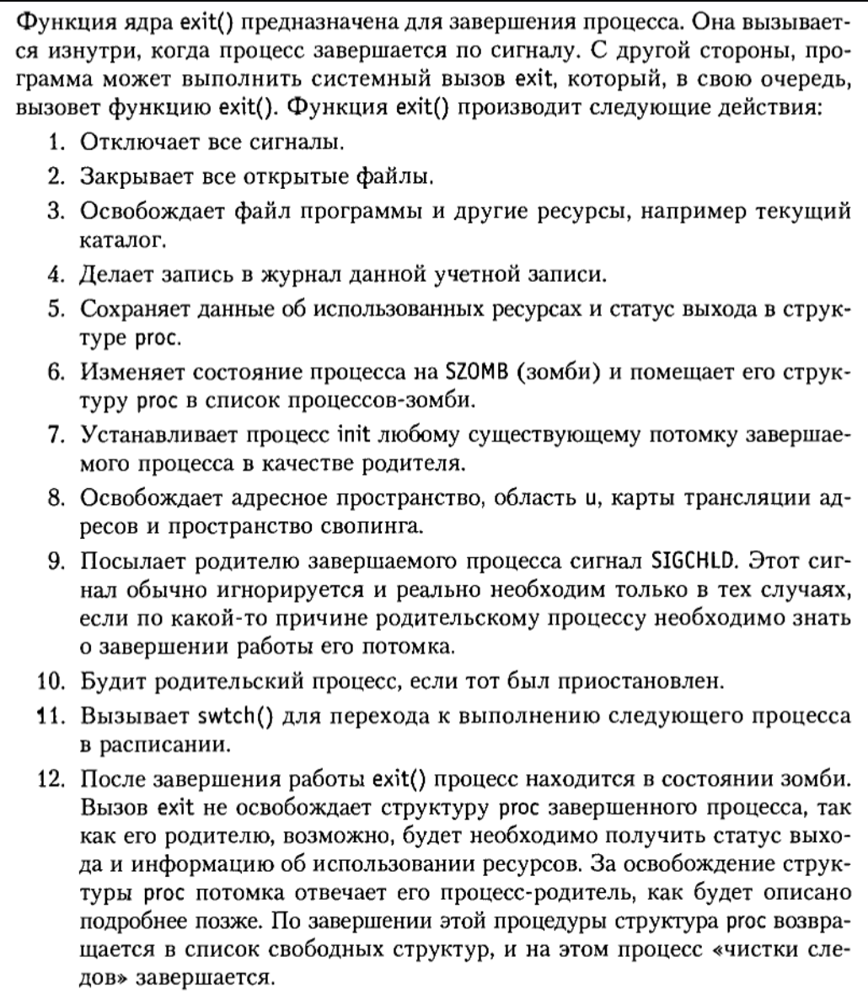

## Управление файлами
### `access(2)`
`int access(const char* path, int amode)` - проверяет, доступе ли по реальному ID вызывающего процесс файл по указанному пути в указанном режиме:
- `R_OK` - чтение
- `W_OK` - запись
- `X_OK` - исполнение (поиск)
- `F_OK` - существование

### `ulimit(2)`
`long ulimit(int cmd, [newLimit])` - архаичная версия для изменения лимитов (сейчас используются `getrlimit` и `setrlimit`)

Параметр `cmd`:
- `UL_GETFSIZE` - ограничение на размер файла в единицах по 512 байт
- `UL_GETFSIZE` - изменяет лимит на размер файла
- `UL_GMEMLIM` (`3` - не реализована в Линуксе) - возвращает ограничение на максимальное значение границы выделяемой памяти
- `UL_GDESLIM` (в актуальных версиях Линукса нет имени, просто значение `4`) - возвращает устанвливаемое при конфигурации системы ограничение на кол-во открытых файлов

### `umask(2)`
`mode_t umask(mode_t cmask)` - изменение маску прав создания в user area

При создании файла через `open(2)` или `creat(2)` права доступа будут определены как `access = mode & ^cmask`

Параметр user area `cmask` будет наследоваться потомками.

Обычно `cmask` принимает значения `0022` (права не более `rwxr-xr-x`) либо `027` (права не более `rwxr-x---`)

### `stat(2)`
Позволяет посмотреть атрибуты файла, не открывая его

`int stat(const char* path, const stat *buf)` - возвращает `0` при успехе и `-1` иначе и записывает атрибуты в особую структуру:
```c
struct stat {
  dev_t st_dev; // Флаг файла-устройства
  ino_t st_ino; // Индекс inode
  mode_t st_mode; // Права доступа, но не та же маска, что обычно
  nlink_t st_nlink; 
  uid_t st_uid;
  gid_t st_gid;
  dev_t st_rdev; // флаг драйвера файловой системы
  off_t st_size;
  timestruc_t st_atim, st_mtim, st_ctim; // Время доступа, модификации и создания (на самом деле время последнего измененения атрибутов). Создание и модификация хранятся с точностью до миллисекунд, доступа - до шести часов (и обновиться он может не чаще чем раз в такой же период)
};
#define st_atime st_atim.tv_sec;
#define st_mtime st_mtim.tv_sec;
```
Старшие 4 бита `mode_t` кодируют тип файла:
```c
#define S_IFMT 0xF000 /* type of file */
#define S_IFIFO 0x1000 /* fifo */
#define S_IFCHR 0x2000 /* character special */
#define S_IFDIR 0x4000 /* directory */
#define S_IFBLK 0x6000 /* block special */
#define S_IFREG 0x8000 /* regular */
#define S_IFLNK 0xA000 /* symbolic link */
#define S_IFNAM 0x5000 /* XENIX special named file */
#define S_IFSOCK 0xC000 /* socket */
#define S_IFDOOR 0xD000 /* Solaris door */
#define S_IFPORT 0xE000 /* Solaris event port */
```
*Последующие 12 бит кодируются по классике* 

- `lstat(const char* path, const stat *buf)` - версия для получения атрибутов ссылки
- `fstat(int fd, const stat *buf)` - то же, что и `stat`, но по дескриптору

**Псевдоустройства** - говорят, что они устройства, имеют драйвера, но не имеют за собой реального устройства

### `getpwent(3C)`
Позволяет получить доступ к базе данных пользователей `/etc/passwd`
- `struct passwd* getpwent()` - возвращает последовательнно все записи (новую при каждом вызове)
- `struct passwd* getpwuid(uid_t uid)` - возвращает запись пользователя по ID
- `struct passwd* getpwnam(const char* name)` - возвращает запись пользователя по имени
- `struct passwd* fgetpwent(FILE *f)` - возвращает запись пользователя-владельца файла
- `void setpwent()` - вернуться к началу базы данных пользователей
- `void endpwent()` - освободить используемые для доступа к `/etc/passwd` ресурсы
```c
struct passwd {
  char *pw_name;
  char *pw_passwd;
  uid_t pw_uid;
  gid_t pw_gid;
  char *pw_age;
  char *pw_comment;
  char *pw_gecos;
  char *pw_dir;
  char *pw_shell;
};
```

`getgrent(3C)` работает аналогичным образом, но для групп (`struct group`)

**Эти функции не гарантируют возврат нового указателя. Более того, зачастую они перезаписывают данные по тому же указателю**

### `chmod(2)`
`int chmod(const char* path, mode_t mode)` и `int fchmod(int fildes, mode_t mode)` меняют младшие 12 бит прав доступа (не могут поменять тип, что логично) для файла по его пути или дескриптору

**Не зависит от `cmask`**

### `chown(2)`
`int chown(const char* path, uid_t owner, gid_t group_owner)` - меняет владельца файла по указанному пути и/или его группу

- `int lchown(const char* path, uid_t owner, gid_t group_owner)` - версия для ссылок
- `int fchown(int fd, uid_t owner, gid_t group_owner)` - по дескриптору


### `utime(2)`
`int utime(const char* path, const struct utimbuf *times)` - меняет время модификации файла. Владелец может менять время на произвольное, другой пользователь с правами доступа на запись может передать нулевой нулевой указатель и установить тем самым время изменения как текущее

### `truncate(3C)`
Очистка файла
- `int truncate(char *path, off_t length)`
- `int ftruncate(int fildes, off_t length)`

### `pathfind(3G)`
**Для загрузки надо догрузить `gen` (флаг `-lgen`)**

`char *pathfind(const char *path, const char *name, const char *mode)` - ищет среди путей, записанных в аргументе `path` через двоеточие (как в переменной среды `PATH`) файл с именем `name` и возвращает указатель на тот путь, по которому файл был найден. 

`mode` - строка атрибутов файла, среди которых можно указать: 
- его права (`"rwx"`)
- тип 
  - `"f"` - обычный файл
  - `"b"` - блочное устройство
  - `"c"` - символьное устройство
  - `"d"` - каталог
  - `"p"` - FIFO (труба)
- особые биты
  - `"u"` - setuid
  - `"g"` - setguid
  - `"k"` - sticky-бит
- `"s"` - файл не пустой

# 23.11.13 - лекция
## Управление директориями (каталогами / папками)
**Директория** - логическая единица, позволяющая структурировать файлы. В UNIX представлена файлом спциального типа. В некоторых системах иерархия файловой системы целиком хранится в единственном файле.

Содержит записи всех содержащихся внутри файлов в виде структур:
```c
struct dirent {
  ino_t          d_ino;       /* inode number */
  off_t          d_off;       /* not an offset; see NOTES */
  unsigned short d_reclen;    /* length of this record */
  unsigned char  d_type;      /* type of file; not supported
                                by all filesystem types */
  char           d_name[256]; /* filename (полное имя может превышать размер массива, то есть для его корректного чтения нам может понадобиться больше памяти) */
};
```

Каталоги в чём-то похожи на кучу malloc'а, то есть при удалении файлов из них мы оставим пустое место, а значит на размер сдвигов полагаться нельзя

Права для каталогов:
- `r` - право на просмотр файлов в каталоге
- `w` - право на добавление и удаление файлов (**без проверки владения**)
  - `sticky`-бит - запрещает удаление файлов и подкаталогов без права записи НА НИХ САМИХ (*либо для не владельцев - тут до конца не понял*)
- `x` - право на исполнение внутренних файлов и перехода в каталог
  - *Забавно, но мы можем исполнять файлы в папках только с флагом `x` даже при том, что мы не можем просмотреть файлы в папке*

## Системные вызовы для "изменения" каталогов
- `chdir(const char* path)` - изменяет каталог на тот, в который ведёт `path`
  - `fchdir(int fd)` - то же самое, но по дескриптору
- `mkdir(const char* path, int mode)` - создать папку с указанными правами доступа (к ним также применится cmask)
- `rmdir(const char* path)` - удаление пустой папки
- `mkdirp(conts char *path, int mode)` - рекурсивно создаёт все ппапки до нижней в пути `path`, если этих папок не существует
- `rmdirp(char *path, char *path1)` - удаляет последний каталог в цепочке, если он пустой. Далее будет двигаться от конца к началу, удаляя пустые папки. В случае невозможности удаления, вернёт оставшийся путь в `path1`

*На саом деле в Linux нет орперации для удаления директорий. Для этого используется системный вызов `unlink`. Она удаляет дескриптор открытого файла, если дескрипторов не осталосЮ стрктура открытого файла будет удалена, если нет больше ссылок на `inode`*

## Системные вызовы для "чтения" каталогов
- `DIR* opendir(const char *filename)` - возвращает структуру каталога, с который мы будем работать далее
- `struct dirent *readdir(DIR *dirp)` - возвращает записи содержимого в папке аналогичным образом с `getpwent`
  - `int readdir_r(DIR *dirp, struct dirent *entry, struct dirent **result)` - версия, лишённая недостатков, унаследованных от `getpwent` (указатель на какой-то внешний буфер). Записывает следующую запись в каталоге по указателю `entry` (*для которого память должны выделить мы*) и копирует его в `*result` (*если записи в каталоге закончились, запишет `NULL`*)
- `int closedir(DIR *dirp)` - закрывает структуру каталога. При исползовании `readdir` мы не можем гарантировать, что обанружим новые записи или узнаем об удалении записей. Для чтения актуального списка записей рекомендуется закрыть папку и открыть её снова

## Ссылки
### Жёсткая ссылка
**Жёсткая ссылка** - файл, относящийся к той же `inode`, что и другой файл (фактически, нельзя сказать, какой из нескольких файлов является ссылкой, а какой - оригиналом)
- НЕЛЬЗЯ СОЗДАВАТЬ ЖЁСТКИЕ ССЫЛКИ НА КАТАЛОГИ
- Жёсткая ссылка может быть в рамках лишь одной ФС

`link(2)` - `int link(const char *oldpath, const char *newpath)` - создаёт жёсткую ссылку

### Символическая ссылка
**Символическая ссылка** - файл специального типа (с новым `inode`), указывающий в своём блоке данных имя файла, с которым эта ссылка связана. 
- Из такого определения следует, что `inode` изначального файла не изменит счётчик ссылок, а сама ссылка может в какой-то момент вести в никуда
- **Лишена описанных выше недостатков жёсткой ссылки**, то есть можно создавать симлинки на каталоги и направлять ссылку на объект в другой ФС
- Права доступа символической ссылки всегда `0777` (*то есть доступна кому угодно, а уже реальные права будут определяться по файлу, на который ссылка ведёт*)

### Системные вызовы для работы с ссылками
Операции, работающие с симлинками и с тем, что по ним лежит:


- `int symlink(const char *target, const char *linkpath)` - создаёт символическую ссылку
- `int readlink(const char* path, void* buf, size_t buf_sz)` - вернёт в буфер путь символической ссылки
- `unlink(const char* path)` - удаляет файл по пути (именно по этому пути, то есть если у нас есть другие ссылки на файл, его `inode` сохранится)
  - выходит, корректнее даже сказать, что мы удаляем этой командой жёсткую ссылку
  - не удаляет директории, смотри для них вызовы выше
  - `remove(const char* path)` - обёртка для виндовозов
- `rename(const char* old, const char* new)` - переименование файла
- `char *dirname(char *path)` - парсит путь до папки с файлом по пути `path`
- `char *basename(char *path)` - парсит имя файла из пути `path`
```
path       dirname   basename
/usr/lib   /usr      lib
/usr/      /         usr
usr        .         usr
/          /         /
.          .         .
..         .         ..
```
**Обе эти функции будут возвращать просто указатели на элменты той же самой строки**

## Сигналы
**Сигнал** - программная абстракция события, которую можно послать от одного процесса другому, причём по умолчанию сигнал должен быть принудительно обработан (зачастую получение сигнала приведёт к аварийному завершиню процесса). Могут быть посланы одними процессами другим или ядром процессам.

*Фан-факт:* деление на ноль в ядре вызывает его смерть.

Сигнал всегда проходит через ядро.

Также процесс может назначить свои особые обработчики для получаемых сигналов. В таких случаях уже не будет происходить аварийного прерывания


*Фан-факт 2:* модем не просто так пиликали! Они передавали по телефонным каналам двоичные сигналы такими звуками

*Фан-факт 3:* демоны (системные процессы), так как не имеют управляющего терминала, при получении `SIGHUP`, должны перечитать конфигурацию

*Фан-факт 4:* самый быстрый стрелок на диком западе - это `SIGKILL`, или, как его ещё называют - Номер `9`. Его нельзя перехватить, от нельзя убежать и защититься, он убьёт вас и вашу семью (*но ходят слухи, что ~~особо хитрые~~ процессы в особом состоянии, могут избежать и его*)

*Фан-факт 5:* будильник убивает не только морально, но и физически (если его не обработать)

*Фан-факт 6:* `SIGPWR` не столь абсурден, как может показаться. Раньше при сбое питания комьютер мог ещё несколько секунд проработать на конденсаторах, поэтому ядро посылало эту предсмертную агонию всем процессам, чтобы те морально подготовились (сохранили всё, что необходимо и т.п.)

Виртуальный будильник, в отличие от обычного, будет "тикать" только пока выполняется процесс. Таймер профилирования "тикает", пока исполняется процесс или вызванные им системные вызовы.

Раньше сигналов было 31, сейчас их 63, но все старше 31-го зарезервированы для пользователя

Для написания совместимой программы **НАДО ИСПОЛЬЗОВАТЬ СИМВОЛИЧЕСКИЕ ИМЕНА**

### Обработка сигналов
**СИСТЕМА НЕ ГАРАНТИРУЕТ, ЧТО СИГНАЛЫ БУДУТ ДОСТАВЛЕНЫ ТУТ ЖЕ**, т.к. не работающий в данный момент процесс не может обработать сигнал. 

Обработка сигнала произойдёт либо в момент перехода процесса из состояния `runnable` в `running` либо при возврате в пользовательский режим (процесс мог быть в режиме ядра, например, в ситемном вызове) либо при возврате аппаратного исключения. При этом, если процесс находится в состоянии блокировки системным вызовом (например, чтения), то при получении сигнала системный вызов прекратится с ошибкой `EINTER`.

У каждого процесса есть масаа `pending` - тех сигналов, которые были отправлены процессу, но ещё не обработаны.

- `SIG_DFL` - реакция по умолчанию (обычно аварийное завершение)
- `SIG_IGN` - жёсткий игнор
- адрес функции-перехватчика
- `SIG_HOLD` - удержание сигнала. Применимо только с `sigset`. Подробности смотри далее

```c
#include <signal.h>
typedef void (*handler_t)(int)

handler_t signal (int sig, handler_t handler); 
/*
Назначает новый обработчик handler для сигнала sig и возвращает прошлый обработчик этого сигнала
Когда начнётся обработка сигнала, обработчик будет сброшен на SIG_DFL, то есть обработка одноразовая
Мы можем внутри обработчика сигнала снова установить обработчик, но у нас неизбежно будет небольшое окно, в которое сигнал будет обработан действием по умолчанию
*/

handler_t sigset (int sig, handler_t handler); 
/*
При успехе возвращает SIG_HOLD, если сигнал заблокирован либо предудщий обработчик. При неудаче - -1
Во время обработки сигнала устанавливает обработчиком этого сигнала SIG_HOLD, то есть повторные такие же сигналы будут удерживаться до момента завершения обработки, после чего будут обработаны процессом
Удерживаемые сигналы будут храниться в маске сигналов процесса
Не может переназначить обработчики для SIGKILL и SIGSTOP
*Пока что так себе понятен принцип SIG_HOLD'а. Надо будет ещё почитать и освоить на практике*
*/

int sighold(int sig); // sigset(sig, SIG_HOLD)

int sigrelse(int sig); // Если сигнал был в SIG_HOLD, обработчик переназначится на прошлый

int sigignore(int sig); // sigset(sig, SIG_IGN)
```

# 23.11.20 - лекция
## Продолжаем про сигналы
Сигналы делятся на **синхронные** и **асинхронные**.

**Синхронные** сигналы прожодаются самим процессом: либо ошибкой в нём, либо осознанно им отправляются самому себе

**Асинхронные** сигналы прилетают процессу извне, при этом сигнал не будет обрабатываться в отдельной нити, а прервёт работу той нити, которая его получила

Во время обработки сигнала мы почти что неизбежно попадём в критическую секцию, если в обработчике мы вызовем работающие с разделяемыми данными функции, мы рискуем получить дэдлок. Другой пример - порча буфера в `FILE*` в функциях библиотеки `stdio.h`

**Async signal safe** - функции, безопасные для вызова в сигналах. В первую очередь это чистые функции.

Кроме того, в обработчиках сигналов нельзя использовать незащищённые критические секции

**Самое простое решение для избегания проблемы с критическими секциями в сигналах - не писать сложные обработчики сигналов**

### Генерация сигналов
От процесса:
- `kill(2)` - `kill(pid_t pid, int sig)` - несмотря на название, позволяет посылать произвольный сигнал, а не только `SIGKILL`
  - `pid_t pid` - отрицательный указывает на группу процессов, положительный - на конкретный процесс
  - Можно посылать только процессам, реальный ID которых равен эффективному ID отправляющего сигнал
  - *Ещё раз напомнил про то, что сигнал вовсе не факт, что будет обработан тут же*
- `sigsend(2)` - `int sigsend(idtype_t idtype, id_t id, int sig)` - более сложный системный вызов, позволяющий специфицировать ID процессов-получателей (*конкретные символические значения смотри в мане*)
  - 
  - *`sigsend` и `kill` шлют ненадёжные сигналы, которые будут потеряны, если не были обработаны*
- `alarm(2)` - `unsigned alarm(unsigned sec)` - самый примитивный вызов для будильника
  - Нет никакого ID будильника => при последующих вызовах будильник перезаписывается
  - Для сброса надо прописать `alarm(0)`
Из ядра:
- От клавиатуры
- От ошибок программирования

### `pause(2)`
Чистый блокирующийся системный вызов. Кроме блокировки ничего не делает и не сможет сам по себе выйти из блокировки.

Единственный путь освободиться - получить сигнал, причём не с обработчиком `SIG_HOLD` и `SIG_IGN`

**Нельзя реализовать `sleep` через `pause` и `alarm`, так как мы можем потерять таймер, если по какой-то причине система не могла отправить сигнал по истечении таймера**

### `setjmp(3)`
`int setjmp(jmp_buf env)` - сохраняет состояние стэка

`void longjmp(jmp_buf env, int val)` - позволяет вернуться из одной функции в другую при условии, что мы сохранили состояние стэка, то есть мы можем прыгнуть к месту вызова `setjmp`. `setjmp` вернёт ноль, если встречает в выполняемой последовательности кодов и значение `val`, если вызов `longjmp` привёл к переходу к месту вызова (**если мы укажем как `val` ноль, то `setjmp` всё равно вернёт единицу**)

Механизмы, похожие на эти функции, используются при реализации примитивов синхронизации

### `sleep(3C)`
`unsigned sleep(unsigned seconds)` - безопасно для многопоточности и не влияет на обработку сигналов. Возвращает оставшееся время

### `sigsetops(3C)` - работа с маской сигналов процесса
Позволяет работать с множеством сигналов формата `sigset_t`:
- `sigemptyset(sigset_t * set)`
- `sigfillset(sigset_t * set)`
- `sigaddset(sigset_t * set, int signo)`
- `sigdelset(sigset_t * set, int signo)`
- `sigismember(sigset_t * set, int signo)`

Применение `sigset_t`:
- `int sigpending(sigset_t * set)` - позволяет узнать, какие сигналы в данный момент ждут обработки (**работает именно над маской `pending`**)
- `int sigprocmask(int how, sigset_t *set, sigset_t *oset)` - позволяет разными методами изменить маску сигналов. Старая маска всегда записывается в `oset` (если он не `NULL`)
  - `how` - определяет поведение системного вызова:
    - `SIG_BLOCK` - добавить биты, указанные в `set`
    - `SIG_UNBLOCK` - убрать биты, указанные в `set`
    - `SIG_SETMASK` - установить биты из `set`
  - Указание `NULL` аргументом `set` привёдт к игнорированию `how`, тогда мы просто получим текущую маску
- *`sigaction` будет позже*

*Пока что чувствуются пробелы в понимании обработки сигналов. В частности, я так и не понял, являются ли маска `pending` и маска сигналов процесса одной и той же маской или нет. Надо будет прочитать у Вахалии либо в седьмой секции мана*

*А теперь он решил оставить лекцию о терминальном ввод-выводе на самостоятельное изучение... Кааайф*

# Примитив
**Примтив** - непрозрачный тип, с которым можно работать определёнными операциями

## Программные каналы (pipe, пайпы, трубы)
*Как "прикольно" слушать об этом через день после прочтения главы Вахалии об этом буквально вчера...*

**Труба (по назначению)** - примитив межпроцессного взаимодействия

**Труба (по реализации)** - псевдоустройство, представляющее собой кольцевой буфер, расположенный в оперативной памяти ядра.

**Псевдоустройство** - объект ядра, который можно читать и писать (самое куцое определение)

## `pipe(2)`
`int pipe(int fildes[2])` - создаёт программный канал и записывает его дескрипторы в переданный массив. В стандарте UNIX первый дескриптор на чтение, а второй - на запись. В Solaris оба дескриптора двунаправленные и позволяют читать и писать перекрёстно

### Взаимодействие с программынми каналами через разные системные вызовы
- `open` - не нужен
- `close` - используется, когда работа с трубой закончена. Если мы закрыли дескриптор на запись, другой конец при чтении получит `EOF`, при попытке записи 
- `read` - читает до заданного количества байт из трубы, блокируется, если труда пустая. Если читать будут сразу несколько процессов, то кому какие байты достанутся, совершенно неясно
- `write` - пишет в трубу до заданного кол-ва байт и блокируется, если не может провести запись
- `lseek` и `mmap` - не допустимы
- `dup` - используется для перенаправления ввода-вывода в канал