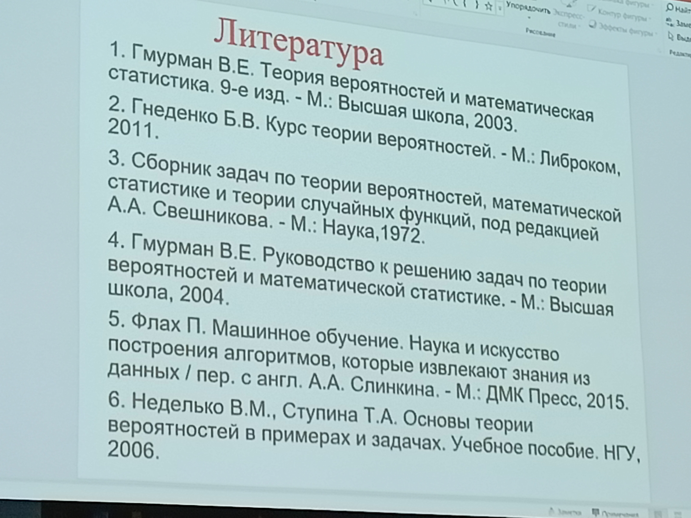

- [Инфо](#инфо)
- [23.09.04 - лекция](#230904---лекция)
  - [Основные понятия](#основные-понятия)
- [23.09.08 - семинар](#230908---семинар)
- [23.09.11 - лекция](#230911---лекция)
- [23.09.15 - семинар](#230915---семинар)
- [23.09.18 - лекция](#230918---лекция)
  - [Геометрическая вероятность](#геометрическая-вероятность)
  - [Колмогоровские аксиомы тервера](#колмогоровские-аксиомы-тервера)
  - [Условная вероятность](#условная-вероятность)
- [23.09.25 - лекция](#230925---лекция)
  - [Полная группа событий](#полная-группа-событий)
  - [Формула Байеса](#формула-байеса)
  - [Испытание Бернулли](#испытание-бернулли)
  - [Формула Пуассона](#формула-пуассона)
- [23.09.29 - семинар](#230929---семинар)
- [23.10.02 - лекция](#231002---лекция)

# Инфо
Препод - Рогозинский Сергей Валентинович

Семинарист - Насибулов Егор Андреевич

[Какой-то Классрум от 19-ГО, МАТЬ ЕГО, ГОДА](https://classroom.google.com/u/3/c/MTQ0Mzk0OTQyMjg5?pli=1)

# 23.09.04 - лекция
*Спустя 12 минут жоской преамбулы ни о чём, перешли к содержанию, которое тоже особо не нужно*

*Преамбула продолжается... Соответственно*

*Ещё 4 минуты прошло и... Вроде бы начали*

*Нет, не начали*

*Загадка от Жака-Фреско: какова вероятность начала лекции?* **$10^{-42}$**

*Для примера с автобусами не хватает [Вахтанга](https://www.youtube.com/shorts/9gy5TdhxlHU)*

*А у меня ведь правда есть таро...*

*Мораль кулстори: если контора требует от вас аспирантуры, вам не нужна такая контора... Тем временем позади 37 минут*

*Пожалуйста, не говори про используемые книги! Не надо!.. Это самое... Ну... Мы их читать не будем, соответственно. Минус половина пары*

*Столкнёмся с этими вещами?.. С ракетами что ли? А, супер, ладно - только теоретически. Хм... А оценивать шансы РФ в СВО будем?..*

*"Взорвалась при Рогозине, при Путине причём" - хмммм. На что он намекает???*

**Вроде как из книг лучшая у Юденко...**

*А, лол. Тут в списке нет Юденко*

## Основные понятия
**Тервер** - раздел математики, изучающий математические модели случайных явлений, наблюдаемых при массовых повторениях испытаний

Тервер нужен для чёткой оценки вероятности событий и её сравнения

**Модель** - объект, отражающий важные для исследования свойства реального объекта

**Событие** - что-то, что происходит:
- Детерминированные - при определённых условиях мы получим ожидаемый результат
- Вероятностные - любой исход события не гарантирован

**Случайный эксперимент** - эксперимент, результат (исход) которого нельзя предсказать однозначно. Тервер изучает случайные эксперименты, удовлетворяющие условиям:
1. Эксперимент можно повторить в одинаковых условиях достаточно много раз
2. Исход A с увеличением количества повторений стремится к некоторому устойчивому числу относительно общего количества повторений эксперимента - то есть обладает **статистической устойчивостью**

**Случайность** - философское понятие. *Расходимся*

Изучение тервера бустили страховой бизнес, демография, статистика.

*Начинать военную спецоперацию против галлов **НЕ СТОИТ***

# 23.09.08 - семинар
Элементарный исход - взаимоисключающие простые исходы (то есть несовместные), которые при этом не могут быть разделены на более мелкие события. ОБъединение всех элементарных исходов даёт нам всё пространство исходов.

Вероятность события A - $P(A)$ - доля исходов, соответствующих событию A от общего числа исходов

Для независимых событий $P(AB) = P(A) * P(B)$.

$A|B$ - наступление события $A$ после события $B$
- $P(A|B) = \frac{P(AB)}{P(B)}$ - условная вероятность
- $P(B|A) = \frac{p(BA)}{P(A)}$ ($P(AB) = P(BA)$, чего нельзя сказать об $P(A|B)$ и $P(B|A)$)

Вероятность того, что произойдёт одно из событий $A,B$: $P(A + B) = P(A) + P(B) - P(AB)$

Элементарная комбинаторика:
- Перестановки $P_n = n!$
- Размещения $A_n^k = \frac{n!}{(n-k)!}$ - комбинация длиной k из множества длины n. Важен порядок
- Сочетания $C_n^k = \frac{a_n^k}{P_k} = \frac{n!}{k!(n-k)!}$

# 23.09.11 - лекция
Множество (пространство) элементарных событий обозначается $\Omega$

Говорят, что событие $A \subset \Omega$ произошло, если произошло хотя бы одно элементарное событие $\omega \in A$

**Классификация событий:**
- Достоверное событие - обязательно происходит при повторении опыта. $\Omega$ - достоверное
- Невозможное событие - никогда не происходит при повторении опыта. обозначается $\emptyset$
- Случайное событие

Событие $A$ **включено** в $B$: $\hArr \forall \omega \in A : \omega \in B$

Если $A \subset B \rArr A$ **влечёт** $B$

Событие $A, B$ **равны** $\hArr A \subset B$ и $B \subset A$

Умножение (пересечение), сложение (объединение) и вычитание событий происходит также, как в алгебре множеств и обозначается аналогично (*это, кстати, и для многих записей выше справедливо*)

**Несовместные события** - такие $A, B$, что $AB = \emptyset$

Вероятность определяется множеством разных методов:
- Субъективно
- Логически
- Частотно - частота появления данного исхода в длинной серии
- Классическое определение - соотношение благоприятных исходов к общему числу исходов
- Геометрическое - определение для континуального пространства элементарных событий
- Для общего случая 

# 23.09.15 - семинар
**Независимые события** - вероятность одного события не зависит от вероятности другого.

Вероятность происшествия двух независимых событий $P(AB) = P(A) * P(B)$

Но на самом деле определение множества независимых событий таково: множество событий $A = {a_1, ..., a_n}$ - независимое $\hArr \forall {a_{n1}, ..., a_{nk}} \subset A : P(a_{n1}, ..., a_{nk}) = P(a_{n1}) * ... * P(a_{nk})$

Если нужно выбрать из `n` `k` вариантов и `l` из `m`, то мы получаем формулу для комбинаций:
$$
\frac{C_n^k C_m^l}{C_{n+m}^{k+l}}
$$
**Важно!** Речь тут не о простом суммировании индексов. Фишка в том, что в знаменателе перестановки из общей мощности множество по мощности общей выборки. Это важно потому, что для некоторых подсчётов могут появиться дополнительные перестановки (например, количество способов выбора масти)

# 23.09.18 - лекция
## Геометрическая вероятность
**Геометрическая вероятность** заключается в бросании некой материальной точки в область $\Omega$. Вероятность попадания в область $A \subset \Omega$ обозначается $P(A) = \mu(A) / \mu(\Omega)$, где $\mu$ - мера области события. Условия организации пространства $\Omega$ позволяют утверждать, что выбор любой точки в нём **равновозможен**

## Колмогоровские аксиомы тервера
В качестве события должны рассматриваться только такие подмножества множества $\Omega$, операции над которыми приводят снова к событиям (*то есть область событий замкнута*)

Алгеброй $F$ называется **непустой класс подмножеств множества $\Omega$**, которые удовлетворяют условиям:
1. $\Omega \in F$
2. $A \in F \rArr \overline{A} \in F$
3. $A_1, ..., A_n \in F \rArr \cup_1^n A_i \in F$

Из этого определения мы можем вывести вероятностное пространство $<\Omega, S, P>$, где $\Omega$ - множество элементарных событий, $S$ - $\sigma$-алгебра, $P$ - функция, сопоставляющая каждому событию $A \in S$ число, называемое его вероятностью:
1. $0 \le P(A)$
2. $P(\Omega) = 1$
3. Для попарно непересекающихся $A_i, A_j$: $P(\cup_1_{\infty} A_i) = \sum_1^{\infty} P(A_i)$

## Условная вероятность
**О.** Вероятность события $A$ при условии, что произошло событие $B$: $P(A|B) = \frac{P(AB)}{P(B)}$

Универсальная формула для вероятности происшествия нескольких событий $P(AB) = P(A)P(B|A) = P(B)P(A|B)$

Таким же образом задаётся формула для произвольного количества событий: $P(A_1, A_2, A_3, ...) = P(A_1)P(A_2|A_1)P(A_3|A_1A_2)...$

**Независимые события** - события, вероятность которых никак не зависит друг от друга. Для них $P(A|B) = P(A)$ и наоборот. $\rArr P(AB) = P(A)P(B)$

# 23.09.25 - лекция
## Полная группа событий
**Полная группа событий** - группа попарно несовместных событий, то есть выполняются условия:
1. $\forall i,j : H_iH_j = \emptyset$
2. $\sum H_i = \Omega$

Если ${H_i}$ - полная группа и нам известны вероятности $P(H_i)$ и $P(A|H_i)$, то вероятность интересующего нас события $A$ будет $P(A) = \sum_{i=0}^n P(H_i)P(A|H_i)$

## Формула Байеса
Предположим у нас имеется полная группа ${H_i}$, каждое H в данном случае называется **гипотезой**, а $P(H_i)$ - его **априорная вероятность**. Если нам известные априорные вероятности и условные вероятности $P(A|H_i)$, то формула **апостериорной вероятности** $P(H_i|A) = \frac{P(H_i)P(A|H_i)}{P(A)}$. 

*Апостериорной обычно называется оценка пост-фактум. "Если произошло событие $A$, то какаова вероятность, что ему предшествовало именно событие $H_i$"* 

## Испытание Бернулли
**Схемой Бернулли** - эксперимент, удовлетворяющий условиям:
1. Эксперимент имеет 2 исхода ($A,\overline{A}$)
2. Эксперимент повторяется $n$ раз. При этом результат любого из экспериментов не должен влиять на любой другой
3. Вероятность двух исходов при каждом повторении исходного эксперимента одна и та же

Возьмём событие $p$ и $\overline{p} = q$

Будем считать за $P(n,m)$ - вероятность того, что при $n$ испытаниях некоторое событие произошло $m$ раз.

**Формула Бернулли:**
$$
P(n,m) = C_n^m p^m q^{n - m}
$$

*Пример:* частица пролетает мимо 6 счётчиков, каждый счётчик регистрирует частицу с вероятностью $0.8$. Частица считается обнаруженной (событие $A$), если она была замечена хотя бы двумя счётчиками. Найти вероятность события $A$.

- $p = 0.8$
- $q = 0.2$

Возьмём обратное событие $\overline{A} = A_0 + A_1$ - ни один датчик не сработал либо сработал только 1. Теперь применим формулу Бернулли 
$$
P(\overline{A}) = P(A_0) + P(A_1) = P(6, 0) + P(6, 1) = C_6^0q^6 + C_6^1pq^5 = (0.2)^6 + 6*0.8*(0.2)^5 = ... = 0.0016 \newline
\rArr P(A) = 1 - P(\overline{A}) = 0.9984
$$

События в эксперименте Бернулли при разных $m$ **несовместны** $\rArr$ вероятность происшествия события при $n$ испытаниях от $m_1$ до $m_2$ раз = сумме их вероятностей для формулы Бернулли.

Формулу Бернулли очень больно использовать при большом количестве испытаний

## Формула Пуассона
Применяется в тех случаях, когда при **большом** количестве испытаний $n$ мала вероятность успеха:
$$
\lambda = np_n \newline
P(n, m) = C_n^m p^n q^{n-m} \rarr \frac{\lambda^m}{m!}e^{-\lambda}
$$
*Считается через формулу Бернулли и второй замечательный предел*

# 23.09.29 - семинар
**Геометрическая вероятность**

# 23.10.02 - лекция
*Угрожает отправить в армейку прогульщиков*