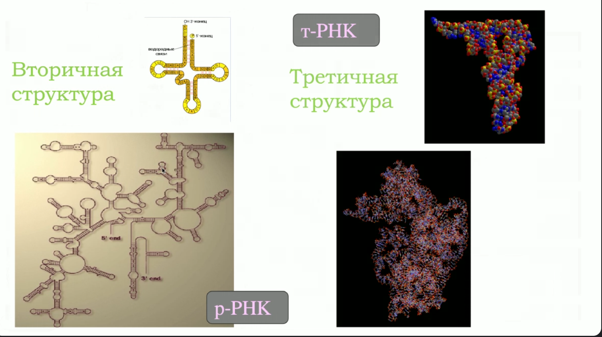

# Инфо
[Гугл-мит нашего года (25-го)](https://meet.google.com/xbx-prsh-rfs)

Юрий Викторович Вяткин - [vyatkin@gmail.com](mailto:vyatkin@gmail.com)

Пары будут не каждую неделю, чаще всего будет одна пара, а не две

В ТГ-канале будут выкладываться ДЗ
- Сдать надо все ДЗ
- Среднее за ДЗ станет **автоматом** (*как я понял, даже 3 можно залутать*)
- Главное условие - сдать все ДЗ
- ДЗ - ключевая часть курса (даже важнее лекций)
- Отсылать ДЗ на почту с указанием ФИО

# 25.02.24
Бионформатика - междисциплинарная наука, занимающаяся методами и инструментами для обработки биологических данных. Включает в себя CS, статистику, математику и инижнерию.

# 25.03.10
## Белки
*Ну короче, есть клетки, есть с ядрами и без, клетки состоят много из чего, но главная штука там - белки (ну и про нуклеины забывать не будем)*

**Полимеры** - макромолекулы, состоящие из одинаковых или сходных структурных единиц - **мономеров**

Нерегулярные полиморы состоят из различных мономеров, поэтому их можно использовать для хранения информации

Белки - нерегулярные полимеры, мономерами которых являются аминокислоты, которых всего 20 штук

Аминокислота - аминогруппа + карбоксильная группа + основная углеродная цепочка, к которой цепляется радикал (именно по радикалам и отлчиаются аминокислоты)

**Домены** - функциональные белки, из которых строятся новые белки. Каждый домен выполняет свою определённую функцию - это будут структуры третичного (*вроде бы*) уровня, а уже домены могут образовывать структуры четвертичного уровня

*Зачем нам вот это всё было?* Зная структуру белков, мы можем её менять, меняя её, мы можем менять их поведение. В частности, это делают лекартсва, то есть с помощью компьютеров, можно быстрее и эффективнее проектировать лекарства

# 25.03.17
## Нуклеиновые кислоты
Предназначены для хранения информации:
- РНК - рибонуклеиновая кислота - одноцепочечная молекула
- ДНК - дизоксирибонуклеиновая кислота - двуцепочечная (почти всегда) спираль

Состоят из фосфорного нуклеотида и азотистого основания

Азотистые основания: А, Г, Т, Ц или У:
- В РНК Ц меняется на У
- Обладают свойством **комплиментраности**, то есть обязательно крепятся друг к другу
  - А + Т
  - Г + Ц

Нуклеотиды могут стыковаться друг с другом, образуя слова из азотистых остатков

**Антипараллельность** - цепочка нуклеотидов может расти только в одну сторону:
- Законченая сторона - 3'
- Расширяемая сторона - 5'

Если ДНК предназнчены в подавляющем большинстве случаев для хранения информации, то вот РНК многофункциональны - они могут быть:
- 5% - информационные (матричные) - считывают информацию из ДНК
- 10% - транспортные - переносят аминокислоты к месту синтеза белков
- 85% - рибосомальные - осуществляют синтез белков

т- и р-РНК имеют сложную многомерную структуру:

Общая цель РНК - передать информацию от ДНК к белку

**Центральная догма** молекулярной биологии:
- ДНК могут:
  - Передавать информцию в РНК (**транаскриптция**)
  - Самореплицироваться
- РНК могут создавать белки (**трансялция**)
- ДРУГИЕ ДЕЙСТВИЯ У НОРМАЛЬНЫХ КЛЕТОК НЕВОЗМОЖНЫ
  - Вирусные РНК могут самореплицироваться и передавать информацию в ДНК (обратная транскрипция)

### Репликация
Принципы репликации:
- Полуконсервативность
- Прерывистость - репликация идёт кусками параллельно
- Унимодальность (*или что-то ещё, хз...*) - движемся от 3' к 5'

Ферменты и белки репликации:
- *Компоненты описать не успел*

Собрание этих фирментов и клеток называется молекулярной машиной **реплисома**

